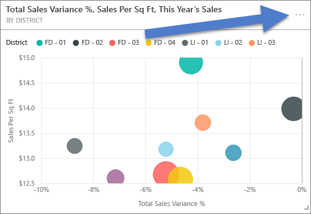
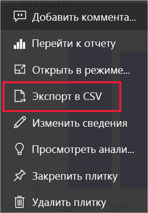
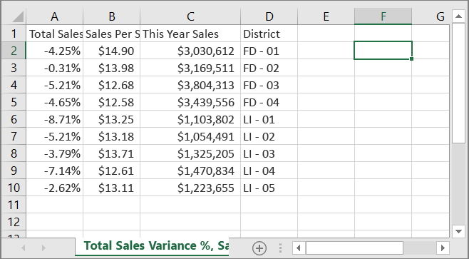
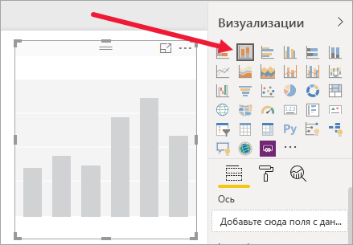
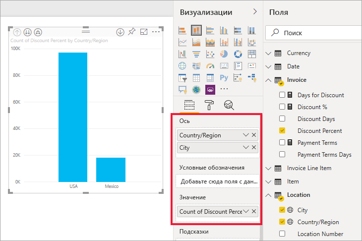
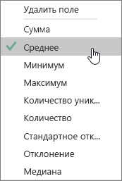
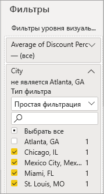
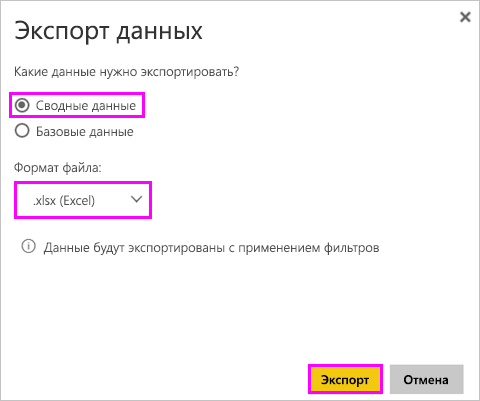
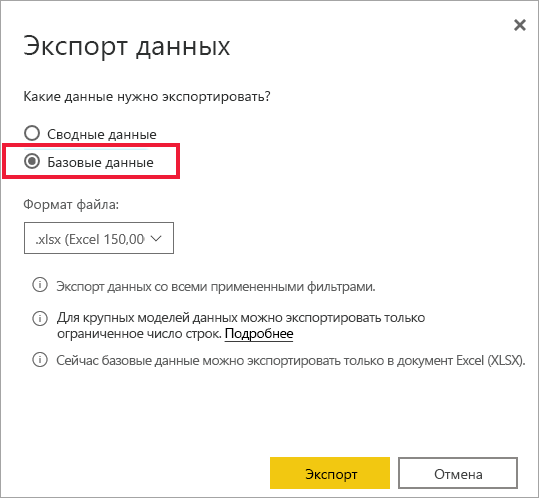
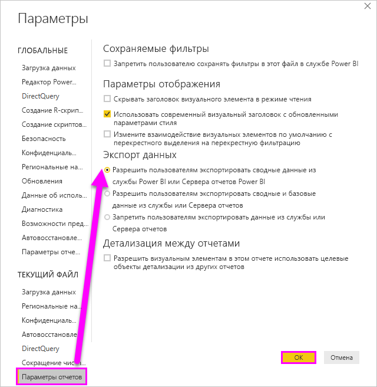

# Экспорт данных, использованных для создания визуализации

> [!IMPORTANT]
> Не все данные могут быть просмотрены или экспортированы всеми пользователями. Существуют меры предосторожности, которые создатели и администраторы отчетов используют при создании панелей мониторинга и отчетов. Некоторые данные ограничены, скрыты или конфиденциальны и не могут быть просмотрены или экспортированы без специальных разрешений. 

## Кто может экспортировать данные

Если у вас есть разрешения на доступ к данным, можно просмотреть и экспортировать данные, которые Power BI использует для создания визуализации. Часто данные бывают конфиденциальными или доступны только конкретным пользователям. В таких случаях вы не сможете просматривать или экспортировать эти данные. Дополнительные сведения см. в разделе **Ограничения и рекомендации** в конце этого документа. 

## Просмотр и экспорт данных

Чтобы просмотреть данные, которые Power BI использует для создания визуализации, [откройте их в Power BI](service-reports-show-data.md). Вы также можете экспортировать данные в Excel в виде файла *XLSX* или *CSV*. Для экспорта данных требуется лицензия Pro или Премиум и права на редактирование набора данных и отчета. <!--If you have access to the dashboard or report but the data is classified as *highly confidential*, Power BI will not allow you to export the data.-->

Просмотрите видео, в котором показан экспорт данных из визуализации в отчете и сохранение их в файл *XLSX* с последующим просмотром в Excel. Затем сделайте то же самое, выполнив пошаговые инструкции, приведенные под видео. Обратите внимание, что в этом видео используется более старая версия Power BI.

<iframe width="560" height="315" src="https://www.youtube.com/embed/KjheMTGjDXw" frameborder="0" allowfullscreen></iframe>

## Экспорт данных из панели мониторинга Power BI

1. Выберите "Дополнительные действия" (...) в правом верхнем углу визуализации.

    

1. Выберите параметр **Экспорт в CSV**.

    

1. Power BI экспортирует данные в файл *CSV*. Если выполнить фильтрацию визуализации, экспорт CSV также будет отфильтрован. 

1. Браузер предложит сохранить файл.  Откройте сохраненный файл *CSV* в Excel.

    

## Экспорт данных из отчета

Для начала откройте [отчет по примеру анализа закупок](../create-reports/sample-procurement.md) в службе Power BI в представлении редактирования. Добавьте новую пустую страницу отчета. Затем выполните следующие действия, чтобы добавить агрегирование, иерархию и фильтры уровня визуализации.

### Создание гистограммы с накоплением

1. Создайте **гистограмму с накоплением**.

    

1. В области **Поля** выберите **Location > City** (Расположение > Город), **Location > Country/Region** (Расположение > Страна/регион) и **Invoice > Discount Percent** (Счет > Процент скидки).  Возможно, нужно будет переместить **Discount Percent** (Процент скидки) в область **Значение**.

    

1. Измените тип агрегации для **процента скидки** с **количества** на **среднее значение**. В области **Значение** щелкните стрелку справа от параметра **Discount Percent** (Процент скидки) (он может называться **Count of Discount Percent** (Число процента скидки)) и выберите значение **Average** (Среднее значение).

    

1. Добавьте фильтр к параметру **City** (Город), выберите все города, а затем удалите город **Атланта**.

    

   
1. Детализация на один уровень вниз в иерархии. Включите детализацию и выберите детализацию до уровня **City** (Город). 

    

Теперь можно попробовать оба варианта для экспорта данных.

### Экспорт ***сводных*** данных
Выберите вариант **Сводные данные**, если вы хотите экспортировать данные, которые отображаются в этом визуальном элементе.  Этот тип экспорта отображает только данные (столбцы и меры), которые вы выбрали для создания визуального элемента.  Если визуальный элемент содержит статистическое выражение, будут экспортированы объединенные данные. Например, если в гистограмме отображается четыре столбца, вы получите четыре строки данных Excel. Сводные данные доступны в службе Power BI в файлах *XLSX* и *CSV* и в Power BI Desktop в виде CSV-файла.

1. Щелкните многоточие в правом верхнем углу визуализации. Выберите пункт **Экспорт данных**.

    

    В службе Power BI визуализация имеет агрегат (вы изменили параметр **Число** на *среднее*), поэтому у вас есть два варианта:

    - **Сводные данные**;

    - **Базовые данные**.

    Дополнительные сведения о статистических выражениях см. в статье [Статистические выражения в Power BI](../create-reports/service-aggregates.md).

    > [!NOTE]
    > В Power BI Desktop вы можете экспортировать только сводные данные в виде CSV-файла. 
    
    
1. В области **Экспорт данных** установите переключатель **Сводные данные** или выберите *XLSX* или *CSV*, а затем нажмите кнопку **Экспорт**. Power BI экспортирует данные.

    

1. При выборе элемента **Экспорт** браузер предложит сохранить файл. Откройте сохраненный файл в программе Excel.

    

    В этом примере в экспортированных данных Excel отображается итоговая сумма для каждого города. Так как мы исключили Атланту, этого города нет в результатах. В первой строке электронной таблицы отображаются фильтры, которые служба Power BI использовала при извлечении данных.
    
    - Экспортируются все данные, используемые иерархией, а не только данные, используемые для текущего уровня детализации визуального элемента. Например, мы выполняли детализацию по уровню City, но наш экспорт включает также данные о стране.  

    - Экспортированные данные агрегированы. Мы получаем итог, по одной строке для каждого города.

    - Так как мы применили фильтры к визуализации, экспортированные данные будут экспортированы с учетом фильтров. Обратите внимание, что первая строка отображает **Примененные фильтры: город — не Атланта, штат Джорджия**. 

### Экспорт ***базовых*** данных

Выберите этот вариант, если вы хотите просмотреть данные в визуальном элементе ***и*** дополнительные данные из набора данных (дополнительные сведения см. в диаграмме ниже). Если визуализация содержит статистическое выражение, при выборе варианта **Базовые данные** статистическое выражение удаляется. В этом примере в экспортированных данных Excel отображается по одной строке для каждой строки "Город" в наборе данных и процент скидки для одной записи. Power BI выполняет сведение данных, но не агрегирование.  

Когда вы нажмете кнопку **Экспорт**, Power BI экспортирует данные в файл *XLSX* и браузер предложит сохранить этот файл. Откройте сохраненный файл в программе Excel.

1. Щелкните многоточие в правом верхнем углу визуализации. Выберите пункт **Экспорт данных**.

    

    В службе Power BI визуализация имеет агрегат (вы изменили параметр **Число** на **среднее**), поэтому у вас есть два варианта:

    - **Сводные данные**;

    - **Базовые данные**.

    Дополнительные сведения о статистических выражениях см. в статье [Статистические выражения в Power BI](../create-reports/service-aggregates.md).

    > [!NOTE]
    > В Power BI Desktop вы можете экспортировать только сводные данные. 
    
    
1. В разделе **Экспорт данных** выберите **Базовые данные**, а затем выберите **Экспорт**. Power BI экспортирует данные.

    

1. При выборе элемента **Экспорт** браузер предложит сохранить файл. Откройте сохраненный файл в программе Excel.

    
    
    - На этом снимке экрана показана только небольшая часть файла Excel. Он содержит более 100 000 строк.  
    
    - Экспортируются все данные, используемые иерархией, а не только данные, используемые для текущего уровня детализации визуального элемента. Например, мы выполняли детализацию по уровню City, но наш экспорт включает также данные о стране.  

    - Так как мы применили фильтры к визуализации, экспортированные данные будут экспортированы с учетом фильтров. Обратите внимание, что первая строка отображает **Примененные фильтры: город — не Атланта, штат Джорджия**. 

## Защита конфиденциальных данных

В наборе данных может быть содержимое, которое не должно отображаться для всех пользователей. Если не соблюдать осторожность, в результате экспорта базовых данных пользователи смогут увидеть все подробные данные для этого визуального элемента — каждый столбец и каждую строку данных. 

Существует несколько стратегий Power BI, которые администраторы и создатели должны использовать для защиты конфиденциальных данных. 

- Создатели [решают, какие *параметры экспорта*](#set-the-export-options) доступны пользователям.  

- Администраторы Power BI могут отключить экспорт данных для своей организации. 

- Владельцы наборов данных могут устанавливать безопасность на уровне строк (RLS). RLS предоставляет пользователям доступ только для чтения. Но если вы настроили рабочую область приложения и дали ее участникам разрешения на изменение, то роли RLS не будут применяться к этим участникам. Дополнительные сведения см. в разделе [Безопасность на уровне строк](../admin/service-admin-rls.md).

- Создатели отчетов могут скрывать столбцы, чтобы они не отображались в списке **Поля**. Дополнительные сведения см. в разделе [Свойства наборов данных](../developer/automation/api-dataset-properties.md)

- Администраторы Power BI могут добавлять [метки конфиденциальности](../admin/service-security-data-protection-overview.md) к панелям мониторинга, отчетам, наборам данных и потокам данных. Затем они могут применять параметры защиты, такие как шифрование или водяные знаки, при экспорте данных. 

- Администраторы Power BI могут использовать [Microsoft Cloud App Security](../admin/service-security-data-protection-overview.md), чтобы отслеживать доступ пользователей и осуществляемые ими действия, выполнять анализ рисков в реальном времени, а также задавать элементы управления для меток. Например, организации могут использовать Microsoft Cloud App Security для настройки политики, запрещающей пользователям скачивать конфиденциальные данные из Power BI на неуправляемые устройства. 

## Сведения об экспорте базовых данных

Данные, отображаемые при выборе варианта **Базовые данные**, могут различаться. Для понимания этих сведений может потребоваться помощь администратора или ИТ-отдела. 

>

| Визуальный элемент содержит | Что вы видите при экспорте  |
|---------------- | ---------------------------|
| Статистические выражения | *Первое* статистическое выражение и нескрытые данные из всей таблицы для этого статистического выражения |
| Статистические выражения | Связанные данные — если визуальный элемент использует данные из других таблиц данных, которые *связаны* с таблицей данных, содержащей статистическое выражение (если это связь типа \*: 1 или 1:1) |
| Меры* | Все меры в визуальном элементе *и* все меры из любой таблицы данных, содержащей меру, используемую в визуальном элементе |
| Меры* | Все нескрытые данные из таблиц, содержащих эту меру (если это связь типа \*: 1 или 1:1) |
| Меры* | Все данные из всех таблиц, связанных с таблицей, содержащей меры с помощью цепочки \*: 1 из 1:1 |
| Только меры | Все нескрытые столбцы из всех связанных таблиц (для расширения меры) |
| Только меры | Сводные данные для всех повторяющихся строк для мер модели |

\* В Power BI Desktop или в службе Power BI в представлении отчетов *мера* отображается в списке **Поля** со значком калькулятора . Меры можно создавать в Power BI Desktop.

### Настройка параметров экспорта

Конструкторы отчетов Power BI управляют типами параметров экспорта данных, которые доступны для пользователей. Доступные варианты:

- Разрешить пользователям экспортировать сводные данные из службы Power BI или Сервера отчетов Power BI

- Разрешить пользователям экспортировать сводные и базовые данные из службы или Сервера отчетов

- Запретить пользователям экспортировать данные из службы или Сервера отчетов

    > [!IMPORTANT]
    > Мы рекомендуем конструкторам отчетов вернуться к старым отчетам и вручную сбросить параметр экспорта при необходимости.

Чтобы настроить эти параметры, сделайте следующее:

1. Запустите Power BI Desktop.

1. В левом верхнем углу выберите **Файл** > **Параметры и настройки** > **Параметры**.

1. В разделе **ТЕКУЩИЙ ФАЙЛ** выберите **Параметры отчета**.

    

1. Выберите нужный вариант в разделе **Экспорт данных**.

Этот параметр также можно обновить в службе Power BI.

Учтите, что конфликтующие параметры портала администрирования Power BI переопределяют параметры отчета для экспорта данных.

## Рекомендации и ограничения
Эти ограничения и рекомендации применяются к Power BI Desktop и службе Power BI, включая Power BI Pro и Premium.

- Чтобы экспортировать данные из визуального элемента, вам нужно иметь [разрешение на сборку для базового набора данных](https://docs.microsoft.com/power-bi/service-datasets-build-permissions).

-  Максимальное число строк, которые **Power BI Desktop** и **служба Power BI** могут экспортировать из **отчета режима импорта** в файл *CSV*, составляет 30 000.

- Максимальное число строк, которые приложения могут экспортировать из **отчета режима импорта** в файл *XLSX*, составляет 150 000.

- Экспорт с использованием *базовых данных* не будет выполняться, если:

  - используется более ранняя версия, чем версия 2016;

  - для таблиц в модели нет уникального ключа;
    
  -  администратор или конструктор отчетов отключил эту функцию.

- Экспорт с использованием *базовых данных* не будет работать, если вы включите параметр *Показать элементы без данных*.для визуализации, которую экспортирует Power BI.

- При использовании DirectQuery максимальный объем данных, который Power BI может экспортировать, составляет 16 МБ несжатых данных. Непреднамеренным результатом может быть то, что вы экспортируете меньше, чем максимальное количество строк (150 000). Это вероятно, если:

    - существует много столбцов;

    - существуют данные, которые сложно сжать;

    - существуют другие факторы, из-за которых увеличивается размер файла и уменьшается количество строк, которые Power BI может экспортировать.

- Если визуализация использует данные из нескольких таблиц данных и для этих таблиц в модели данных не существует связей, Power BI экспортирует только данные для первой таблицы.

- Визуальные элементы Power BI и визуальные элементы R пока не поддерживаются.

- В Power BI вы можете переименовать поле (столбец), дважды щелкнув его и введя новое имя. Power BI рассматривает новое имя как *псевдоним*. В отчете Power BI в итоге могут оказаться повторяющиеся имена полей, однако в Excel они запрещены. Поэтому когда Power BI экспортирует данные в Excel, псевдонимы заменяются исходными именами полей (столбцов).  

- Если в файле *CSV* содержатся знаки Юникода, то текст в Excel может отображаться неправильно. Примерами знаков Юникода являются символы валют и иностранные слова. Вы можете открыть файл в Блокноте, чтобы знаки Юникода отобразились правильно. Если вы хотите открыть файл в Excel, необходимо импортировать файл *CSV*. Чтобы импортировать файл в Excel, сделайте следующее:

  1. Откройте Excel.

  1. Перейдите на вкладку **Данные**.
  
  1. Выберите **Получение внешних данных** > **Из текста**.
  
  1. Перейдите к локальной папке, где хранится файл, и выберите файл *CSV*.

- При экспорте в *.csv* некоторые символы будут экранированы с **'** в начале.

- Администраторы Power BI могут отключить экспорт данных.

Появились дополнительные вопросы? [Попробуйте задать вопрос в сообществе Power BI.](https://community.powerbi.com/)
