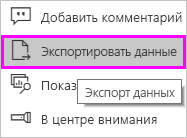
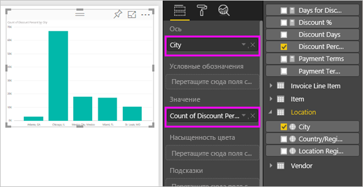
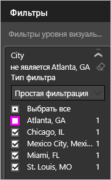
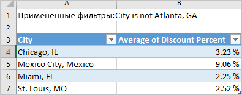
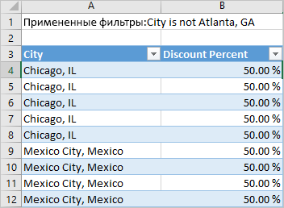

# Экспорт данных из визуализаций
Чтобы просмотреть данные, которые используются для создания визуализации, [откройте их в Power BI](service-reports-show-data.md) или экспортируйте в Excel в виде файла XLSX или CSV. Для экспорта данных требуется лицензия Pro или Premium и права на редактирование набора данных и отчета. 

Просмотрите видео, в котором показан экспорт данных из визуализации в отчете и сохранение их в файл XLSX с последующим просмотром в Excel. Затем сделайте то же самое, выполнив пошаговые инструкции, приведенные под видео.

<iframe width="560" height="315" src="https://www.youtube.com/embed/KjheMTGjDXw" frameborder="0" allowfullscreen></iframe>

## Экспорт из визуализации на панели мониторинга Power BI
1. Щелкните многоточие в правом верхнем углу визуализации.

    
2. Выберите значок  **Экспорт данных** .

    
3. Данные экспортируются в файл CSV. Если визуальный элемент фильтруется, то скачанные данные также будут отфильтрованы.    
4. Браузер предложит сохранить файл.  Откройте сохраненный файл CSV в программе Excel.

    

## Экспорт из визуализации в отчете
Для начала откройте [отчет по примеру анализа закупок](../sample-procurement.md) в представлении редактирования. Добавьте новую пустую страницу отчета. Затем выполните следующие действия, чтобы добавить агрегирование и фильтры уровня визуализации.

1. Создайте гистограмму.  В области "Поля" выберите **Location > City** (Расположение > Город) и **Invoice > Discount Percent** (Счет > Процент скидки).  Возможно, нужно будет переместить **Процент скидки** в область "Значение". 

    
2. Измените тип агрегации для **процента скидки** с **количества** на **среднее значение**. В области значений щелкните стрелку справа от параметра **Discount Percent** (Процент скидки) (он может называться **Count of Discount Percent** (Число процента скидки)) и выберите значение **Average** (Среднее значение).

    
3. Добавьте фильтр для **города**, чтобы удалить **Атланту**.

   

   Теперь можно попробовать оба варианта для экспорта данных. 

4. Щелкните многоточие в правом верхнем углу визуализации. Выберите  **Экспорт данных**.

   
5. В веб-клиенте Power BI, если в визуализации есть статистическое выражение (например, если значение **количества** заменено на *среднее значение*, *сумму* или *минимальное значение*), вам доступно два варианта: **сводные данные** и **базовые данные**. В Power BI Desktop вам доступен только вариант **Сводные данные**. Дополнительные сведения о статистических выражениях см. в статье [Статистические выражения в Power BI](../service-aggregates.md).
    
6. Выберите **Сводные данные** > **Экспорт**, а затем выберите формат (XLSX или CSV). Power BI экспортирует данные.  Если к визуализации применялись фильтры, данные будут экспортированы с учетом фильтров. При выборе элемента **Экспорт** браузер предложит сохранить файл. Откройте сохраненный файл в программе Excel.

   **Сводные данные**: выберите этот вариант, если вы хотите экспортировать данные, которые отображаются в этом визуальном элементе.  Этот тип экспорта отображает только данные (столбцы и меры), которые вы выбрали для создания визуального элемента.  Если визуальный элемент содержит статистическое выражение, будут экспортированы объединенные данные. Например, если в гистограмме отображается 4 столбца, вы получите 4 строки данных. Сводные данные можно получить в формате XLSX и CSV.

   В этом примере в экспортированных данных Excel отображается итоговая сумма для каждого города. Так как мы отфильтровали Атланту, этого города нет в результатах.  В первой строке электронной таблицы отображаются фильтры, использованные при извлечении данных из Power BI.

   
7. Теперь выберите **Базовые данные** > **Экспорт** и выберите формат XLSX. Power BI экспортирует данные. Если к визуализации применялись фильтры, экспортированные данные будут экспортированы с учетом фильтров. При выборе элемента **Экспорт** браузер предложит сохранить файл. Откройте сохраненный файл в программе Excel.

   >[!WARNING]
   >Экспорт базовых данных позволяет пользователям видеть все подробные сведения, включая каждый столбец в данных. Администраторы службы Power BI могут отключить этот параметр для своей организации. Если вы являетесь владельцем набора данных, определите собственные столбцы как скрытые, чтобы они не отображались в списке полей на рабочем столе или в службе Power BI.

   **Базовые данные**: выберите этот вариант, если вы хотите просмотреть данные в визуальном элементе ***и*** дополнительные данные из модели (дополнительные сведения см. в диаграмме ниже).  Если визуализация содержит статистическое выражение, при выборе варианта *Базовые данные* статистическое выражение удаляется. После нажатия кнопки **Экспортировать** данные экспортируются в файл XLSX и браузер предлагает сохранить этот файл. Откройте сохраненный файл в программе Excel.

   В этом примере в экспортированных данных Excel отображается по одной строке для каждой строки "Город" в наборе данных и процент скидки для одной записи. Другими словами, данные преобразованы в плоскую структуру без суммирования. В первой строке электронной таблицы отображаются фильтры, использованные при извлечении данных из Power BI.  

   

## Сведения об экспорте базовых данных
Данные, отображаемые при выборе варианта **Базовые данные**, могут различаться. Для понимания этих сведений может потребоваться помощь администратора или ИТ-отдела. В Power BI Desktop или в службе в представлении отчетов *мера* отображается в списке полей со значком калькулятора . Меры создаются в Power BI Desktop, а не в службе Power BI.

| Визуальный элемент содержит |                                                                              Что вы видите при экспорте                                                                              |
|-----------------|-------------------------------------------------------------------------------------------------------------------------------------------------------------------------------------|
|   Статистические выражения    |                                                 *Первое* статистическое выражение и нескрытые данные из всей таблицы для этого статистического выражения                                                  |
|   Статистические выражения    | Связанные данные — если визуальный элемент использует данные из других таблиц данных, которые *\*\*связаны*\* с таблицей данных, содержащей статистическое выражение (если это связь типа \*: 1 или 1:1) |
|    Меры     |                                      Все меры в визуальном элементе *и* все меры из любой таблицы данных, содержащей меру, используемую в визуальном элементе                                      |
|    Меры     |                                       Все нескрытые данные из таблиц, содержащих эту меру (если это связь типа \*: 1 или 1:1)                                       |
|    Меры     |                                      Все данные из всех таблиц, связанных с таблицей, содержащей меры с помощью цепочки \*: 1 из 1:1                                      |
|  Только меры  |                                                   Все нескрытые столбцы из всех связанных таблиц (для расширения меры)                                                   |
|  Только меры  |                                                             Сводные данные для всех повторяющихся строк для мер модели.                                                              |

### Настройка параметров экспорта
Конструкторы отчетов Power BI управляют типами параметров экспорта данных, которые доступны для пользователей. Доступные варианты:
- Разрешение экспортировать только сводные данные (это значение по умолчанию для новых отчетов) 
- Разрешение экспортировать сводные и базовые данные (значение по умолчанию до октября 2018 г.) 
- Запрет экспортировать любые данные.  

    > [!IMPORTANT]
    > Мы рекомендуем конструкторам отчетов вернуться к старым отчетам и вручную сбросить параметр экспорта при необходимости.

1. Настроить эти параметры можно в Power BI Desktop.

2. В левом верхнем углу выберите **Файл** > **Параметры и настройки** > **Параметры**. 

3. В разделе **Текущий файл** выберите **Параметры отчета**.

    

4. Выберите нужный вариант в разделе **Экспорт данных**.

Этот параметр также можно обновить в службе Power BI.  

Учтите, что конфликтующие параметры портала администрирования Power BI переопределяют параметры отчета для экспорта данных. 

## Рекомендации и ограничения
* Максимальное число строк, которые можно экспортировать из **Power BI Desktop** и **службы Power BI** в CSV-файл, — 30 000.
* Максимальное количество строк, которое можно экспортировать в XLSX-файл, — 150 000.
* Экспорт с помощью *базовых данных* не будет работать, если источником данных является динамическое соединение Analysis Services версии старше 2016 и если для таблиц в модели не существует уникального ключа.  
* Экспорт с помощью *базовых данных* не будет работать, если для экспортируемой визуализации используется параметр *Показать элементы без данных*.
* При использовании DirectQuery максимальный объем данных, который можно экспортировать, составляет 16 МБ. Это может привести к экспорту меньшего числа строк, чем максимальное, особенно если таблица содержит много столбцов либо данные, трудно поддающиеся сжатию, или есть другие факторы, увеличивающие размер файла и уменьшающие число экспортируемых строк.
* Если визуальный элемент использует данные из нескольких таблиц данных и для этих таблиц в модели данных не существует связей, экспортируются только данные для первой таблицы. 
* Пользовательские визуальные элементы и визуальные элементы R пока не поддерживаются.
* Экспорт данных недоступен для пользователей за пределами вашей организации, которые используют предоставленную им панель мониторинга. 
* В Power BI поле (столбец) можно переименовать, дважды щелкнув его и введя новое имя.  Новое имя называется *псевдонимом*. В отчете Power BI в итоге могут оказаться повторяющиеся имена полей, однако в Excel они запрещены.  Поэтому при экспорте данных в Excel псевдонимы заменяются исходными именами полей (столбцов).  
* Если в CSV-файле содержится знак Юникода, то текст в Excel может отображаться неправильно. Но при этом в блокноте все будет работать нормально. Примерами знаков Юникода являются символы валют и иностранные слова. Решением этой проблемы является импорт CSV-файла в Excel вместо открытия его напрямую. Для этого выполните следующие действия.

  1. Откройте Excel
  2. На вкладке **Данные** выберите **Получить внешние данные** > **Из текста**.
* Администраторы Power BI имеют возможность отключить экспорт данных.

Появились дополнительные вопросы? [Попробуйте задать вопрос в сообществе Power BI.](http://community.powerbi.com/)

