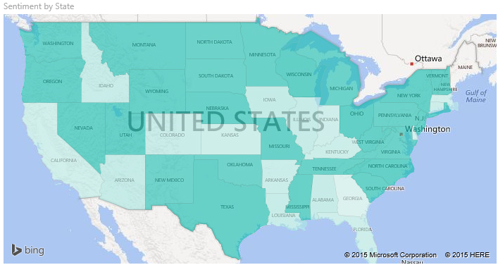
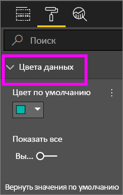
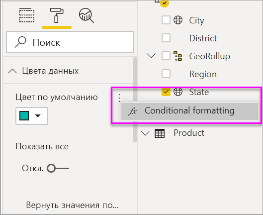
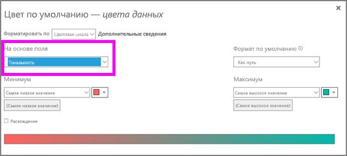
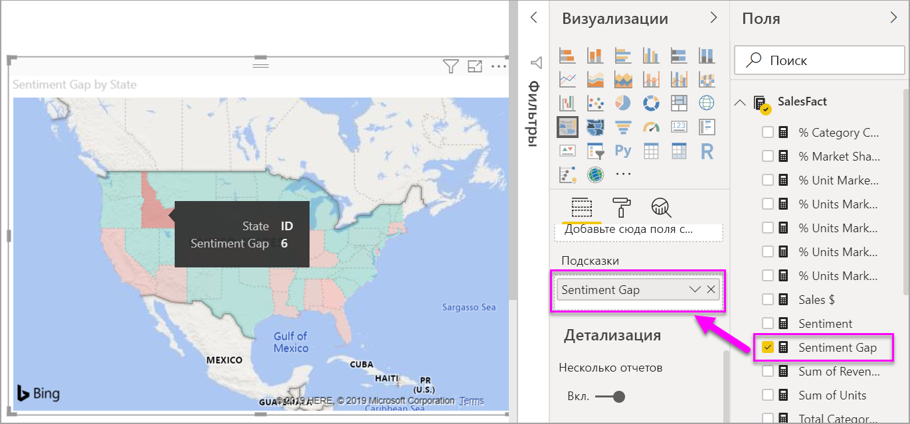
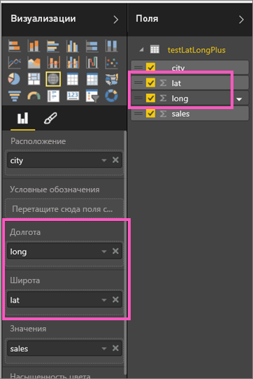

# Картограммы (хороплеты) в Power BI

[!INCLUDE [power-bi-visuals-desktop-banner](../includes/power-bi-visuals-desktop-banner.md)]

Картограмма с помощью заливки, оттенков или шаблонов показывает, как изменяется исследуемое значение по географическим регионам.  Картограмма позволяет быстро отобразить относительные различия с помощью заливки, которая изменяется от светлой (меньше, встречается с меньшей частотой) до темной (больше, встречается с большей частотой).    

## Какие данные отправляются в Bing
Power BI интегрируется с Bing для предоставления картографических координат по умолчанию (этот процесс называется геокодированием). При создании визуализации карты в службе Power BI или Power BI Desktop данные в контейнерах **Расположение**, **Широта** и **Долгота**, используемых для создания визуального элемента, отправляются в Bing.

Вам или администратору может потребоваться обновить брандмауэр, чтобы разрешить доступ к URL-адресам, которые Bing использует для геокодирования.  Ниже приведены эти URL-адреса:
- https://dev.virtualearth.net/REST/V1/Locations    
- https://platform.bing.com/geo/spatial/v1/public/Geodata    
- https://www.bing.com/api/maps/mapcontrol

Дополнительные сведения о данных, отправляемых в Bing, а также подсказки по геокодированию см. в статье [Советы и рекомендации для визуализаций карт Power BI](power-bi-map-tips-and-tricks.md).

## Когда следует использовать картограмму
Картограмма отлично подходит:

* для отображения на карте количественной информации;
* для отображения пространственных шаблонов и связей;
* для стандартизированных данных;
* при работе с социально-экономическими данными;
* когда некоторые регионы особо важны;
* для получения представления о географическом распределении величины.

### Предварительные требования
В этом руководстве используется пример PBIX-файла с примером [Анализ розничной торговли](http://download.microsoft.com/download/9/7/6/9767913A-29DB-40CF-8944-9AC2BC940C53/Sales%20and%20Marketing%20Sample%20PBIX.pbix).
1. В верхнем левом разделе меню выберите **Файл** > **Открыть**.
   
2. Найдите свою копию PBIX-файла с примером **Анализ розничной торговли**.

1. Откройте PBIX-файл с примером **Анализ розничной торговли** в представлении отчета .

1. Выбрать  чтобы создать новую страницу.

## Создание базовой картограммы
В этом видео Ким создает простую карту и преобразовывает ее в картограмму.
   > [!NOTE]
   > В этом видео показано использование более старой версии Power BI Desktop.
   > 
   > 

<iframe width="560" height="315" src="https://www.youtube.com/embed/ajTPGNpthcg" frameborder="0" allowfullscreen></iframe>

### Создание картограммы
1. На панели "Поля" выберите поле **Geo** (Геообъект) и \>**Состояние**.    

   
2. [Преобразуйте диаграмму](power-bi-report-change-visualization-type.md) в картограмму. Обратите внимание, что теперь поле **State** находится в разделе **Расположение**. Для создания картограммы служба "Карты Bing" использует поле в разделе **Расположение**.  Расположениями могут быть: страны, округа, области, города, почтовые индексы и т. д. Служба "Карты Bing" предоставляет фигуры заполнения карт для работы с расположениями по всему миру. Без допустимых данных в разделе "Расположение" Power BI не может создать картограмму.  

   
3. Выполните фильтрацию карты, чтобы отображалась только континентальная часть США.

   а.  Слева от области визуализаций найдите область **Фильтры**. Разверните эту область, если она свернута.

   б.  Наведите указатель мыши на значение **State** (Штат) и выберите значок развертывания.  
   

   в.  Установите флажок рядом с **Все** и снимите флажок рядом с **AK**(Аляска).

   
4. Откройте панель форматирования, щелкнув значок валика, и выберите **Цвета данных**.

    

5. Щелкните три вертикальные точки и выберите **Условное форматирование**.

    

6. Воспользуйтесь экраном **"Цвет по умолчанию" — "Цвета данных"** , чтобы определить, какие оттенки будут применяться к картограмме. Вы можете выбрать, какое поле станет основой для оттенка и как необходимо применить оттенок. В этом примере мы используем поле **SalesFact** > **Sentiment** и установим для самого низкого значения тональности красный цвет, а для самого высокого — зеленый. Значения между максимальным и минимальным будут иметь оттенки красного и зеленого цветов. На рисунке в нижней части экрана показан диапазон цветов, которые будут использоваться. 

    

7. Для картограммы используется зеленый и красный цвет заливки: красный представляет слабо-позитивное настроение, а темно-зеленый — крайне позитивное.  Для отображения дополнительных сведений перетащите поле в раздел "Подсказки".  Здесь добавлено значение **Sentiment gap** (Разница тональности) и выделен штат Айдахо (код штата — ID). Вы видите, что эта разница невелика и равна 6.
   

10. [Сохраните отчет](../service-report-save.md).

Power BI дает вам широкие возможности настройки внешнего вида картограммы. Поэкспериментируйте с элементами управления цветом данных, чтобы получить желаемый результат. 

## Выделение и перекрестная фильтрация
Сведения об использовании области "Фильтры" см. в разделе [Добавление фильтра в отчет](../power-bi-report-add-filter.md).

При выделении определенного места на картограмме выполняется фильтрация других визуализаций на странице отчета и наоборот.

1. Чтобы продолжить, сначала сохраните этот отчет, выбрав **Файл > Сохранить**. 

2. Скопируйте картограмму с помощью клавиш CTRL+C.

3. Чтобы открыть страницу отчета тональности, выберите вкладку **Тональности** в нижней части отчета холста.

    

4. Перемещайте и изменяйте размеры визуализаций на странице, чтобы освободить место, затем с помощью клавиш CTRL+V вставьте картограмму из предыдущего отчета. (См. следующие изображения.)

   

5. Выберите штат на картограмме.  Это приведет к перекрестному выделению и перекрестной фильтрации других визуализаций на странице. Например, если выбрать **Texas**, вы увидите, что значение тональности — 75, а Техас находится в центральном округе № 23.   
   
2. Выберите точку данных на графике Тональности в компании VanArsdel по месяцам. Это отфильтрует картограмму, чтобы показать данные о тональностях для VanArsdel, а не их конкуренцию.  
   

## Рекомендации и устранение неполадок
Данные карты могут быть неоднозначными.  Например, город с названием Париж есть во Франции и в Техасе. Географические данные, вероятно, хранятся в отдельных столбцах — столбец для названий городов, столбец для названий штатов или областей и т. д., — поэтому служба "Карты Bing" не может определить, о каком Париже идет речь. Если набор данных содержит сведения о широте и долготе, в Power BI можно воспользоваться специальными полями, которые помогают сделать данные карты однозначными. Просто перетащите поле, содержащее сведения о широте, в область "Визуализации" \> "Широта".  Сделайте то же самое для сведений о долготе.    

При наличии разрешений для изменения набора данных в Power BI Desktop просмотрите это видео, чтобы понять, как устранить неоднозначность карты.

<iframe width="560" height="315" src="https://www.youtube.com/embed/Co2z9b-s_yM" frameborder="0" allowfullscreen></iframe>

Если доступа к сведениям о широте и долготе нет, но есть доступ на редактирование для набора данных, [выполните эти действия для обновления набора данных](https://support.office.com/article/Maps-in-Power-View-8A9B2AF3-A055-4131-A327-85CC835271F7).

Дополнительные сведения о визуализации карт см. в разделе [Tips and tricks for map visualizations](../power-bi-map-tips-and-tricks.md).

## Дальнейшие действия

[Сопоставление фигур](desktop-shape-map.md)

[Типы визуализаций в Power BI](power-bi-visualization-types-for-reports-and-q-and-a.md)