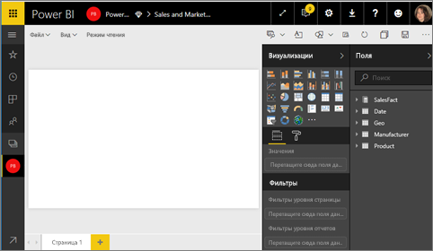
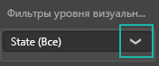
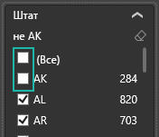
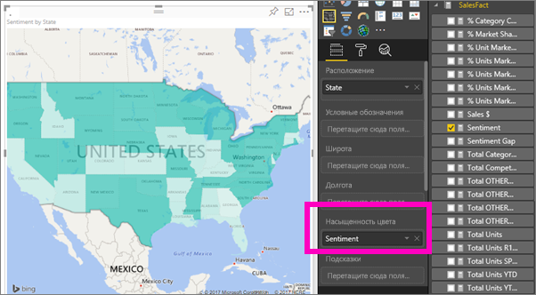

# Картограммы (хороплеты) в Power BI
Картограмма с помощью заливки, оттенков или шаблонов показывает, как изменяется исследуемое значение по географическим регионам.  Картограмма позволяет быстро отобразить относительные различия с помощью заливки, которая изменяется от светлой (меньше, встречается с меньшей частотой) до темной (больше, встречается с большей частотой).    

## Какие данные отправляются в Bing
Power BI интегрируется с Bing для предоставления картографических координат по умолчанию (этот процесс называется геокодированием). При создании визуализации карты в службе Power BI или Power BI Desktop данные в контейнерах **Расположение**, **Широта** и **Долгота**, используемых для создания визуального элемента, отправляются в Bing.

Вам или администратору может потребоваться обновить брандмауэр, чтобы разрешить доступ к URL-адресам, которые Bing использует для геокодирования.  Ниже приведены эти URL-адреса:
    * https://dev.virtualearth.net/REST/V1/Locations
    * https://platform.bing.com/geo/spatial/v1/public/Geodata
    * https://www.bing.com/api/maps/mapcontrol

Дополнительные сведения о данных, отправляемых в Bing, а также подсказки по геокодированию см. в статье [Советы и рекомендации для визуализаций карт Power BI](power-bi-map-tips-and-tricks.md).

## Когда следует использовать картограмму
Картограмма отлично подходит:

* для отображения на карте количественной информации;
* для отображения пространственных шаблонов и связей;
* для стандартизированных данных;
* при работе с социально-экономическими данными;
* когда некоторые регионы особо важны;
* для получения представления о географическом распределении величины.

### Предварительные требования
- Служба Power BI или Power BI Desktop
- Продажи и маркетинг — пример

Для работы в этом руководстве используется служба Power BI, а не Power BI Desktop.

## Создание базовой картограммы
В этом видео Ким создает простую карту и преобразовывает ее в картограмму.

<iframe width="560" height="315" src="https://www.youtube.com/embed/ajTPGNpthcg" frameborder="0" allowfullscreen></iframe>

1. Для создания собственной картограммы [скачайте пример "Продажи и маркетинг"](../sample-datasets.md), выполнив вход в Power BI и выбрав **Получение данных \> Примеры \> Sales and Marketing (Продажи и маркетинг) \> Подключиться**.
2. Когда появится сообщение об успешном выполнении, щелкните **Просмотреть набор данных**.

   
3. В Power BI откроется пустой холст отчета в [режиме редактирования](../service-interact-with-a-report-in-editing-view.md).

    
4. На панели "Поля" выберите поле **Geo** (Геообъект) и **Состояние**.    

   
5. [Преобразуйте диаграмму](power-bi-report-change-visualization-type.md) в картограмму. Обратите внимание, что теперь поле **State** находится в разделе **Расположение**. Для создания картограммы служба "Карты Bing" использует поле в разделе **Расположение**.  Расположениями могут быть: страны, округа, области, города, почтовые индексы и т. д. Служба "Карты Bing" предоставляет фигуры заполнения карт для работы с расположениями по всему миру. Без допустимых данных в разделе "Расположение" Power BI не может создать картограмму.  

   
6. Выполните фильтрацию карты, чтобы отображалась только континентальная часть США.

   а.  В нижней части области визуализаций найдите область **Фильтры** .

   б.  Наведите указатель мыши на значение **State** (Штат) и щелкните значок развертывания.  
   

   в.  Установите флажок рядом с **Все** и снимите флажок рядом с **AK**(Аляска).

   
7. Выберите **SalesFact** \> **Sentiment** (Тональность), чтобы добавить этот элемент в область **Насыщенность цвета**. Поле в области **Насыщенность цвета** управляет заливкой карты.  
   
8. Для картограммы используется зеленый цвет заливки: светло-зеленый представляет слабо-позитивное настроение, а темно-зеленый — крайне позитивное.  На рисунке выделен штат Вайоминг (WY). Видно, что настроение потребителей в нем очень хорошее — 74.  
   
9. [Сохраните отчет](../service-report-save.md).

## Выделение и перекрестная фильтрация
Сведения об использовании области "Фильтры" см. в разделе [Добавление фильтра в отчет](../power-bi-report-add-filter.md).

При выделении определенного места на картограмме выполняется фильтрация других визуализаций на странице отчета, и наоборот.

Чтобы продолжить, скопируйте и вставьте картограмму на страницу **мнений** в отчете *Продажи и маркетинг*.

1. Выберите штат на картограмме.  Это приведет к выделению других визуализаций на странице. Например, при выборе штата **Техас** будет показано, что настроение в нем 74, Техас входит в центральный округ\# №23 и что основная часть продаж приходится на сегменты Moderation (Умеренность) и Convenience (Удобство).   
   
2. На графике попробуйте переключиться между **Нет** и **Да**. На картограмме будут показано настроение потребителей для продукции VanArsdel и конкурента VanArsdel.  
   

## Рекомендации и устранение неполадок
Данные карты могут быть неоднозначными.  Например, город с названием Париж есть во Франции и в Техасе. Географические данные, вероятно, хранятся в отдельных столбцах — столбец для названий городов, столбец для названий штатов или областей и т. д., — поэтому служба "Карты Bing" не может определить, о каком Париже идет речь. Если набор данных содержит сведения о широте и долготе, в Power BI можно воспользоваться специальными полями, которые помогают сделать данные карты однозначными. Просто перетащите поле, содержащее сведения о широте, в область "Визуализации" \> "Широта".  Сделайте то же самое для сведений о долготе.  

При наличии разрешений для изменения набора данных в Power BI Desktop просмотрите это видео, чтобы понять, как устранить неоднозначность карты.

<iframe width="560" height="315" src="https://www.youtube.com/embed/Co2z9b-s_yM" frameborder="0" allowfullscreen></iframe>

Если сведений о широте и долготе нет, [выполните эти действия для обновления набора данных](https://support.office.com/article/Maps-in-Power-View-8A9B2AF3-A055-4131-A327-85CC835271F7).

Дополнительные сведения о визуализации карт см. в разделе [Tips and tricks for map visualizations](power-bi-map-tips-and-tricks.md).

## Дальнейшие действия
[Плитки панели мониторинга в Power BI](../service-dashboard-tiles.md)    
 [Добавление визуализации в отчет](power-bi-report-add-visualizations-i.md)  
 [Типы визуализаций в Power BI](power-bi-visualization-types-for-reports-and-q-and-a.md)    
 [Изменение типа визуализации в отчете Power BI](power-bi-report-change-visualization-type.md)      
Появились дополнительные вопросы? [Ответы на них см. в сообществе Power BI.](http://community.powerbi.com/)
