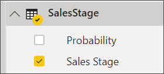
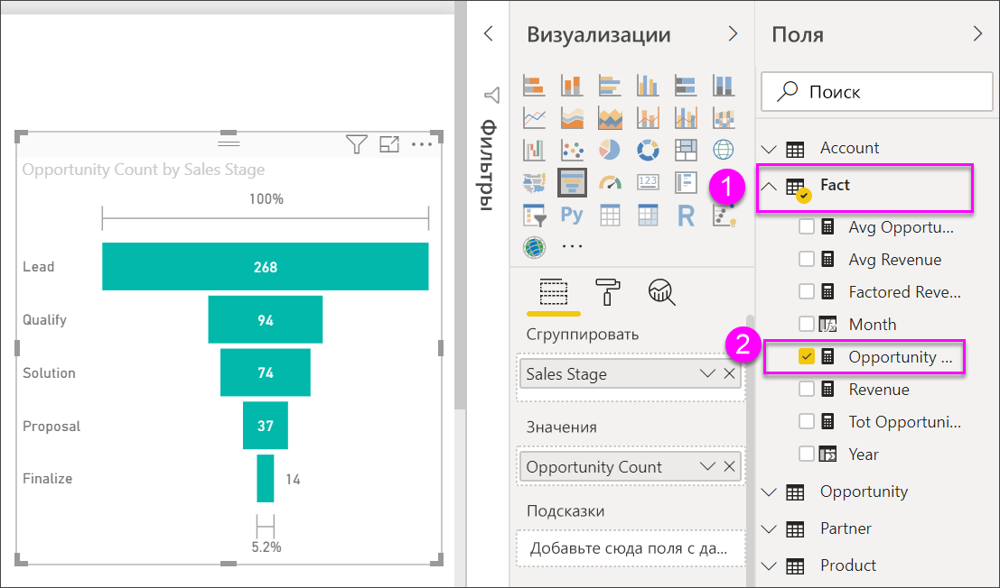

# Воронкообразные диаграммы

[!INCLUDE [power-bi-visuals-desktop-banner](../includes/power-bi-visuals-desktop-banner.md)]

Воронкообразная диаграмма позволяет визуализировать линейный процесс, который имеет последовательные связанные этапы. Например, воронка продаж, которая позволяет отследить перемещение клиентов по этапам: "Интерес" \> "Соответствующий интерес" \> "Потенциальный клиент" \> "Контракт" \> "Закрыто".  Форма воронки визуально передает состояние отслеживаемого процесса.

Каждый этап воронки представляет долю от общего количества. Таким образом, в большинстве случаев воронкообразная диаграмма имеет форму воронки: первый этап самый большой, а каждый следующий этап меньше предыдущего.  Грушевидная воронка также удобна: она позволяет определить проблему в процессе.  Но, как правило, первый этап, этап "вхождения", является самым крупным.

## Сферы применения воронкообразных диаграмм
Воронкообразная диаграмма отлично подходит:

* когда данные последовательны и проходят по крайней мере четыре этапа;
* когда ожидается, что число "элементов" на первом этапе превышает число на последнем этапе;
* для вычисления потенциальных показателей (доход, продажи, сделки и пр.) по этапам;
* для вычисления и отслеживания показателей эффективности и удержания;
* для выявления узких мест в линейном процессе;
* для отслеживания рабочего процесса корзины;
* для отслеживания хода выполнения и успешности рекламных и маркетинговых кампаний с переходами по рекламным ссылкам.

## Работа с воронкообразными диаграммами
Воронкообразные диаграммы:

* можно сортировать;
* поддерживают несколько диаграмм;
* могут быть объектами выделения и перекрестной фильтрации для других визуализаций на той же странице отчета;
* могут использоваться для выделения и перекрестной фильтрации других визуализаций на той же странице отчета.
   > [!NOTE]
   > Посмотрите это видео, чтобы увидеть, как Уилл создает воронкообразную диаграмму на основе примера "Продажи и маркетинг". Затем попробуйте сделать это самостоятельно, используя PBIX-файл примера анализа возможностей и выполняя действия из видео.
   > 
   > 
## Необходимое условие

В этом руководстве используется пример PBIX-файла с примером [Анализ возможностей](http://download.microsoft.com/download/9/1/5/915ABCFA-7125-4D85-A7BD-05645BD95BD8/Opportunity%20Analysis%20Sample%20PBIX.pbix
).

1. В верхнем левом разделе меню выберите **Файл** > **Открыть**.
   
2. Найдите свою копию PBIX-файла с примером **Анализ возможностей**.

1. Откройте PBIX-файл с примером **Анализ возможностей** в представлении отчета .

1. Выбрать  чтобы создать новую страницу.

## Создание простой воронкообразной диаграммы
Посмотрите это видео, чтобы увидеть, как Уилл создает воронкообразную диаграмму на основе примера "Продажи и маркетинг".

<iframe width="560" height="315" src="https://www.youtube.com/embed/qKRZPBnaUXM" frameborder="0" allow="autoplay; encrypted-media" allowfullscreen></iframe>

Создайте собственную воронкообразную диаграмму, показывающую количество возможных сделок на этапах продаж.

1. Начните с пустой страницы отчета и выберите поле **Этап продажи**\>**Этап продажи**.
   
    

1. Выберите значок воронки  чтобы преобразовать гистограмму в воронкообразную диаграмму.

2. В области **Поля** выберите пункты **Факт** \> **Число возможностей**.
   
    
4. При наведении указателя мыши на столбец отображается много ценных сведений:
   
   * имя этапа;
   * текущее число возможных сделок на этом этапе;
   * общий показатель эффективности (доля от интереса); 
   * поэтапное значение (интенсивность отбрасывания), которое представляет собой долю от предыдущего этапа (в данном случае этап предложения/этап решения).
     
     

6. [Сохраните отчет](../service-report-save.md).

## Выделение и перекрестная фильтрация
Сведения об использовании области "Фильтры" см. в разделе [Добавление фильтра в отчет](../power-bi-report-add-filter.md).

Вы можете выделить столбец в воронкообразной диаграмме для перекрестной фильтрации других визуализаций на странице отчета (и наоборот). Добавьте на страницу отчета еще несколько визуальных элементов с воронкообразной диаграммой.

1. На воронкообразной диаграмме выберите столбец **Proposal** (Предложение). Это приведет к перекрестному выделению других визуализаций на странице. Используйте клавишу CTRL, чтобы выбрать сразу несколько элементов.
   
   
2. Сведения о том, как настроить параметры перекрестного выделения и фильтрации визуальных элементов, см. в статье [Взаимодействие визуальных элементов в Power BI](../service-reports-visual-interactions.md).

## Дальнейшие действия

[Датчики в Power BI](power-bi-visualization-radial-gauge-charts.md)

[Типы визуализаций в Power BI](power-bi-visualization-types-for-reports-and-q-and-a.md)
