# Создание визуализации ключевых факторов влияния

[!INCLUDE [power-bi-visuals-desktop-banner](../includes/power-bi-visuals-desktop-banner.md)]

Визуализация ключевых факторов влияния поможет понять, какие факторы влияют на метрики, которые вас интересуют. Она анализирует данные, ранжирует факторы, которые важны, и отображает их в виде ключевых факторов влияния. Например, вы хотите понять, что влияет на текучку среди сотрудников. Одним из факторов может быть длина контракта, другим может быть возраст сотрудников. 
 
## Когда следует использовать ключевые факторы влияния? 
Визуализация ключевых факторов влияния отлично подходит, чтобы: 
- увидеть, какие факторы влияют на анализируемую метрику;
- сравнить относительную важность этих факторов. Например, оказывают ли краткосрочные контракты большее влияние на текучку,нежели долгосрочные? 

## Возможности визуализации ключевых факторов влияния

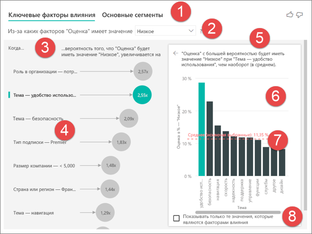

1. **Вкладки**: выберите вкладку, чтобы переключаться между представлениями. Среди **ключевых факторов влияния** будут перечислены факторы, активнее всего участвующие в формировании выбранного значения метрики. **Основные сегменты** больше всего влияют на выбранное значение метрики. *Сегмент* состоит из сочетания значений. Например, сегментом могут быть потребители в западном регионе, которые остаются нашими пользователями по крайней мере 20 лет. 

2. **Раскрывающийся список**: значение рассматриваемой метрики. В этом примере рассмотрим метрику **Оценка**. Выбрано значение **Низкое**.

3. **Пересмотр**: помогает интерпретировать визуальный элемент в области слева.

4. **Область слева**: левая панель содержит один визуальный элемент. В этом случае слева показан список самых важных ключевых факторов влияния.

5. **Пересмотр**: помогает интерпретировать визуальный элемент в области справа.

6. **Область справа**: правая панель содержит один визуальный элемент. В этом случае гистограмма отображает все значения для ключевого фактора влияния **Тема**, выбранного на панели слева. Определенное значение для показателя **удобства использования** в левой области выделено зеленым цветом. Все остальные значения для **темы** выделены черным цветом.

7. **Линия среднего значения**: вычисляется среднее значение для всех возможных значений **темы**, за исключением **удобства использования** (которое является выбранным ключевым фактором влияния). Поэтому вычисление применяется ко всем значениям, выделенным черным цветом. Это указывает, какой процент других **тем** имел низкую оценку. В данном случае низкую оценку имело 11,35 % тем (показано пунктирной линией).

8. **Флажок**: визуальный элемент в правой области отфильтровывается так, что отображаются только те значения, которые являются факторами влияния для этого поля. В этом примере визуальный элемент фильтруется по удобству использования, безопасности и навигации.

## Анализ категориальной метрики
 
Просмотрите это видео, чтобы научиться создавать визуализацию для ключевых факторов влияния с категориальной метрикой. После этого выполните указанные ниже действия, чтобы создать ее. 

   > [!NOTE]
   > В этом видео показано использование более старой версии Power BI Desktop.
   > 
   > 
<iframe width="560" height="315" src="https://www.youtube.com/embed/fDb5zZ3xmxU" frameborder="0" allow="accelerometer; autoplay; encrypted-media; gyroscope; picture-in-picture" allowfullscreen></iframe>

Ваш менеджер по продуктам хочет, чтобы вы определили факторы, заставляющие пользователей оставлять отрицательные отзывы о вашей облачной службе. Откройте [PBIX-файл с примером отзывов пользователей](https://github.com/microsoft/powerbi-desktop-samples/tree/master/Monthly%20Desktop%20Blog%20Samples/2019/customerfeedback.pbix) в Power BI Desktop. Вы также можете скачать [файл Excel с отзывами пользователей службы Power BI или Power BI Desktop](https://github.com/microsoft/powerbi-desktop-samples/tree/master/Monthly%20Desktop%20Blog%20Samples/2019/customerfeedback.xlsx). Выберите любую из ссылок, а затем на открывшейся странице GitHub выберите **Скачать**.

> [!NOTE]
> Набор данных основан на следующей работе: [Moro et al., 2014] S. Moro, P. Cortez, and P. Rita. "A Data-Driven Approach to Predict the Success of Bank Telemarketing". *Decision Support Systems*, Elsevier, 62:22-31, June 2014. 

1. Откройте отчет и выберите значок **Ключевые факторы влияния**. 

    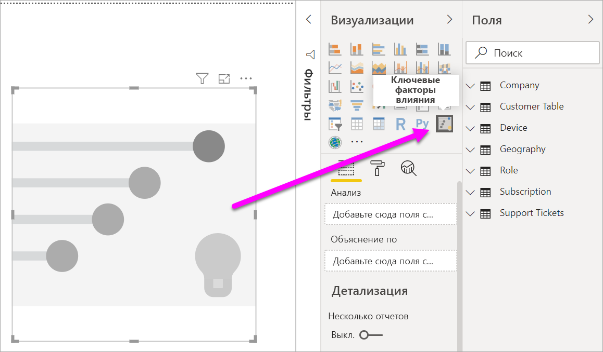

2. Переместите метрику, которую необходимо изучить, в поле **Анализ**. Чтобы узнать, почему пользователи дают службе низкие оценки, выберите пункты **Таблица пользователей** > **Оценка**.

3. Переместите поля, которые, как вы считаете, могут повлиять на **Оценку**, в поле **Объяснение по**. Можно переместить любое количество полей. В данном случае начните со следующих:
    - Страна или регион 
    - Роль в организации 
    - Тип подписки 
    - Размер компании 
    - Тема
    
4. Оставьте поле **Развернуть по** пустым. Оно используется только при анализе меры или обобщенного поля. 

5. Чтобы сконцентрироваться на отрицательных оценках, выберите значение **Низкое** в раскрывающемся списке **Что вызывает у "Оценка" значение**.  

    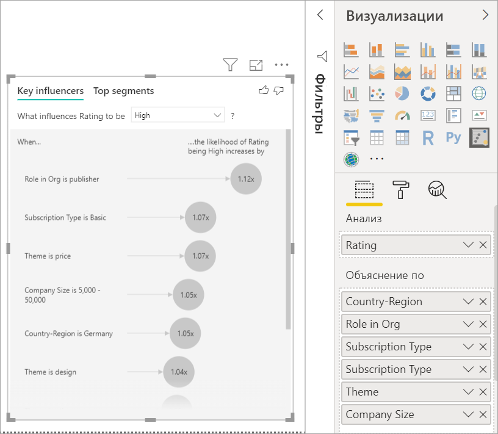

Анализ поля выполняется на уровне таблицы. В данном случае это метрика **Оценка**. Эта метрика определяется на уровне пользователя. У каждого пользователя есть либо высокая оценка, либо низкая. Все пояснительные факторы должны быть определены на уровне пользователя, чтобы визуализация могла их использовать. 

В предыдущем примере все пояснительные факторы имеют связь "один к одному" или "многие к одному" с метрикой. В этом случае каждому клиенту назначается одна тема для оценки. Аналогичным образом пользователи находятся в одной стране, имеют один тип членства и одну роль в своей организации. Пояснительные факторы уже являются атрибутами пользователя, а преобразования не требуются. Визуальный элемент можно сразу использовать без них. 

Позже в этом руководстве вы рассмотрите более сложные примеры, где есть связь "один ко многим". В таком случае столбцы должны сначала пройти агрегацию на уровне пользователя перед выполнением анализа. 

Меры и агрегаты, используемые как пояснительные факторы, также вычисляются на уровне таблицы метрики **Анализ**. Некоторые примеры приведены далее в этой статье. 

## Интерпретация категориальных ключевых факторов влияния 
Давайте рассмотрим ключевые факторы влияния для низкой оценки. 

### Ведущий фактор, влияющий на вероятность низкой оценки

У клиента из данного примера могут быть три роли: потребитель, администратор и издатель. Потребитель является ведущим фактором, оказывающим влияние на низкую оценку. 

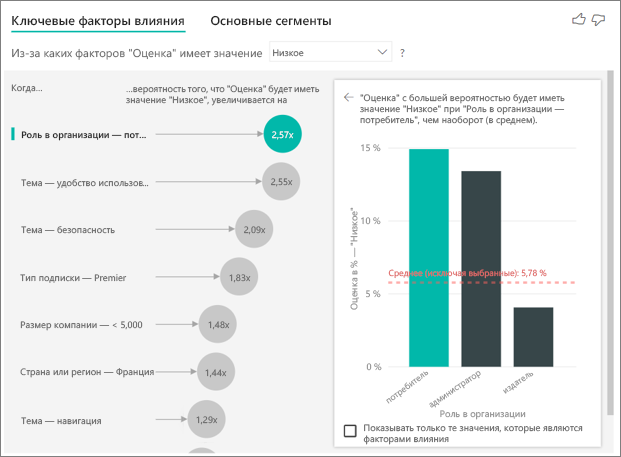

Точнее говоря, ваши потребители в 2,57 раза более склонны назначить вашей службе отрицательную оценку. На диаграмме ключевых факторов влияния пункт **Роль в организации — потребитель** указан первым в списке в левой части. При выборе пункта **Роль в организации — потребитель** Power BI показывает дополнительные сведения на панели справа. Отображается сравнительное влияние каждой роли на вероятность низкой оценки.
  
- 14,93 % потребителей дают низкую оценку. 
- В среднем все остальные роли дают низкую оценку в 5,78 % случаев.
- Потребители в 2,57 раза более склонны дать низкую оценку по сравнению со всеми остальными ролями. Это можно определить путем разделения зеленой полосы красной пунктирной линией. 

### Второй по значимости фактор, влияющий на вероятность низкой оценки

Визуализация ключевых факторов влияния позволяет сравнить и ранжировать факторы с множеством разнообразных переменных. Второй фактор влияния не имеет ничего общего с **ролью в организации**. Выберите второй фактор влияния в списке, а именно **Тема — удобство использования**. 

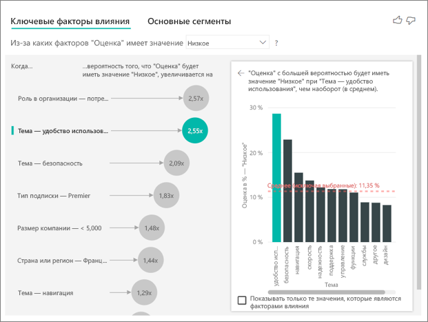

Вторым по важности фактором является тема отзыва пользователя. Пользователи, которые оставляют отзывы про удобство использования продукта, в 2,55 раза более склонны дать низкую оценку по сравнению с пользователями, которые оставляют отзывы на другие темы, такие как надежность, дизайн или скорость. 

На визуализациях среднее значение, показанное красной пунктирной линией, изменилось с 5,78 на 11,34 %. Среднее значение является динамическим, так как оно основано на среднем арифметическом всех значений. Для первого фактора влияния из среднего была исключена роль пользователя. Для второго фактора из него исключена тема "Удобство использования". 
 
Установите флажок **Показывать только те значения, которые являются факторами влияния**, чтобы фильтровать только по значимым показателям. В данном случае это роли, которые активнее всего назначают низкую оценку. Двенадцать тем сокращаются до четырех, которые Power BI определяет как причину низкой оценки. 

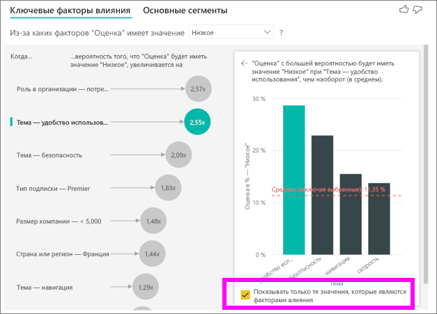

## Взаимодействие с другими визуальными элементами 
 
Каждый раз при щелчке среза, фильтра или других визуальных элементов на холсте визуализация ключевых факторов влияния повторно выполняет анализ новой порции данных. Например, вы можете перетащить **Размер компании** в отчет и использовать его в качестве среза. Он позволяет узнать, как ключевые факторы влияния для ваших корпоративных пользователей отличаются от общей совокупности. В подобных предприятиях работает более 50 000 сотрудников.
 
Если выбрать **> 50 000**, повторно запускается анализ, и можно увидеть, что основные факторы изменились. Для крупных корпоративных пользователей самым влиятельным фактором низкой оценки будет тема, связанная с безопасностью. Вы можете продолжать исследование, чтобы узнать о наличии конкретных факторов безопасности, волнующих ваших крупных пользователей. 

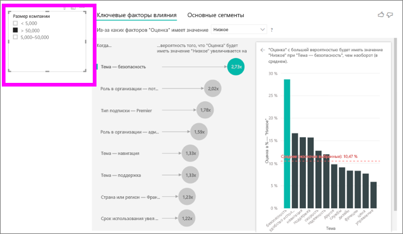

## Интерпретация непрерывных ключевых факторов влияния 
 
Пока что вы использовали визуальный элемент для оценки того, как различные поля категорий могут повлиять на низкие оценки. Можно также использовать непрерывные факторы (такие как возраст, высота, цена) в поле **Объяснение по**. Давайте посмотрим, что произойдет, если мы переместим **срок использования** из пользовательской таблицы в раздел **Объяснение по**. Этот срок указывает, как долго пользователь использует службу. 
 
По мере роста срока использования увеличивается вероятность получения низкой оценки. Эта тенденция предполагает, что наши долгосрочные пользователи более склонны дать отрицательную оценку. Эти сведения представляют интерес, и в дальнейшем их стоит изучить подробнее. 
 
Визуализация показывает, что увеличение срока на 13,44 месяца в среднем увеличивает вероятность низкой оценки в 1,23 раза. В этом случае 13,44 месяца — это среднеквадратичное отклонение срока использования. Поэтому ваше открытие состоит в том, как увеличение срока использования на стандартное отклонение влияет на вероятность получения низкой оценки. 
 
Точечная диаграмма в области справа отображает средний процент низкой оценки для каждого значения срока. На ней наклон выделен с помощью линии тренда.

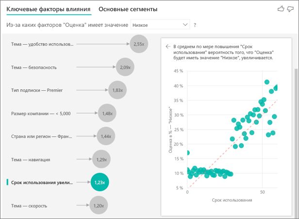

## Группирование непрерывных ключевых факторов влияния

В некоторых случаях вы можете обнаружить, что непрерывные факторы были автоматически превращены в категориальные. Это обусловлено пониманием того, что связь между переменными нелинейна, и поэтому невозможно описать ее в виде простого увеличения или уменьшения (как мы сделали в примере выше).

Мы проводим тесты корреляции, чтобы определить, насколько линейным является фактор влияния относительно целевого объекта. Если целевой объект является непрерывным, мы выполняем тесты корреляции Пирсона, а если категориальным — то тесты точечно-бисериальной корреляции. Если мы обнаруживаем, что связь недостаточно линейна, то проводим контролируемое группирование и создаем не более 5 групп. Чтобы определить, какие группы наиболее значимы, мы используем метод контролируемого группирования, который рассматривает связь между объяснительным фактором и анализируемым целевым объектом.

## Интерпретация мер и агрегатов как ключевых факторов влияния 
 
Вы можете использовать меры и агрегаты в качестве пояснительных факторов в ходе своего анализа. Например, может потребоваться узнать, какое влияние оказывает число запросов в службу поддержки или средний срок жизни открытого запроса на оценку, которую вы получаете. 
 
В этом случае вам требуется определить, влияет ли количество запросов в службу поддержки на оценку пользователя. Теперь вы используете **идентификатор запроса в службу поддержки** из таблицы службы поддержки. Так как пользователь может отправить несколько запросов в службу поддержки, нужно агрегировать идентификатор на уровне пользователя. Это важно, поскольку мы запускаем анализ на уровне пользователя, а значит, все факторы должны быть определены на этом уровне детализации. 
 
Давайте рассмотрим число идентификаторов. Каждая строка пользователя содержит количество запросов в службу поддержки, связанных с ним. В этом случае с ростом количества обращений вероятность низкой оценки увеличивается в 5,51 раза. Правая визуализация показывает среднее количество запросов в службу поддержки для различных значений **оценки**, вычисляемых на уровне пользователя. 

## Интерпретация результатов: Основные сегменты 
 
Можно использовать вкладку **Ключевые факторы влияния**, чтобы оценить каждый фактор в отдельности. Вы также можете использовать вкладку **Основные сегменты**, чтобы узнать, как сочетание факторов влияет на анализируемую метрику. 
 
Основные сегменты изначально содержат обзор всех сегментов, обнаруженных Power BI. В следующем примере показано, что найдено шесть сегментов. Эти сегменты ранжируются по проценту низких оценок. У сегмента 1, например, 74,3 % оценок — низкие. Чем больше пузырек, тем выше доля низких оценок. Размер пузырька означает, сколько пользователей в сегменте. 

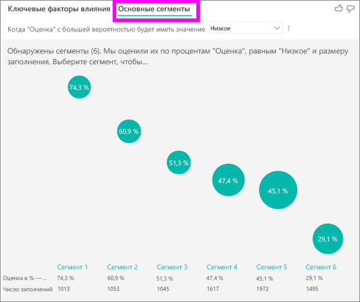

Выбор пузырьков открывает детали сегмента. Если для примера выбрать сегмент 1, вы обнаружите, что он состоит из относительно стабильных пользователей. Они работают с нами более 29 месяцев и отправили больше четырех запросов в службу поддержки. Наконец, они не являются издателями (поэтому они либо потребители, либо администраторы). 
 
В этой группе 74,3 % пользователей дали низкую оценку. Средний пользователь дает низкую оценку в 11,7 % случаев, поэтому этот сегмент имеет гораздо большую долю низких оценок. Их на 63 % больше. Сегмент 1 также содержит 2,2 % от общего объема данных, поэтому он представляет значимую долю популяции. 

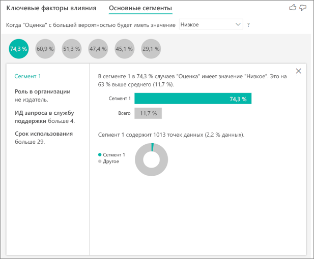

## Добавление счетчиков

Иногда фактор влияния может иметь большое значение, но представлять очень мало данных. Например, **Тема** — **удобство использования** является вторым по значимости фактором влияния для низких оценок. Однако на удобство использования могли пожаловаться всего лишь несколько клиентов. С помощью счетчиков можно выделить факторы влияния, на которых следует сосредоточиться.

Счетчики можно включить на **карточке анализа** в области форматирования.

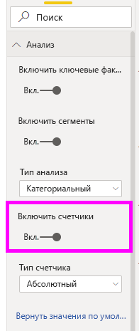

После включения счетчиков вокруг пузырька каждого фактора влияния появится кольцо, которое представляет приблизительный процент данных, содержащихся в факторе влияния. Чем большую часть пузырька охватывает кольцо, тем больше данных содержит фактор влияния. Как видно из рисунка, **Тема** — **удобство использования** содержит очень небольшую часть данных.

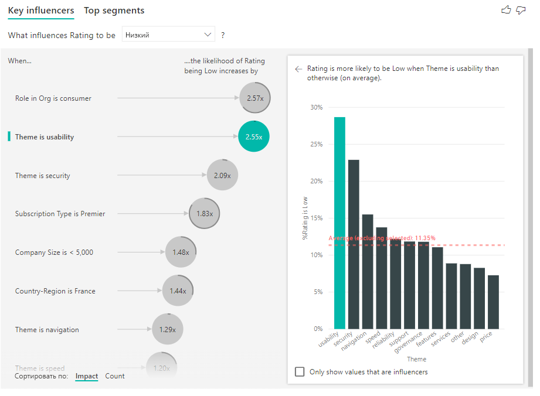

Вы также можете использовать переключатель "Сортировать по" в левом нижнем углу визуального элемента, чтобы отсортировать пузырьки в первую очередь по количеству, а не по влиянию. **Тип подписки** — **Premier** — главный фактор влияния по счетчику.

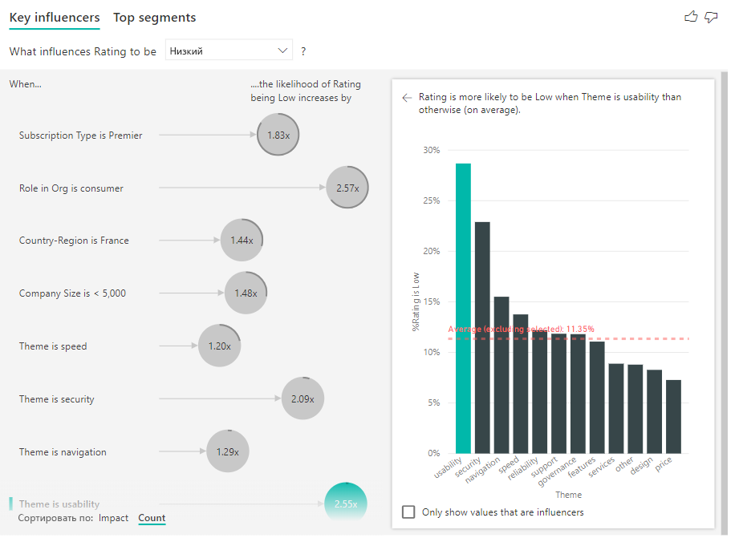

Наличие полного кольца вокруг пузырька означает, что фактор влияния содержит 100 % данных. В раскрывающемся списке **Тип счетчика** на **карточке анализа** в области форматирования можно выбрать счетчики относительно максимального фактора влияния. В результате фактор влияния с наибольшим количеством данных будет представлен полным кольцом, а все остальные счетчики будут заданы относительно него.

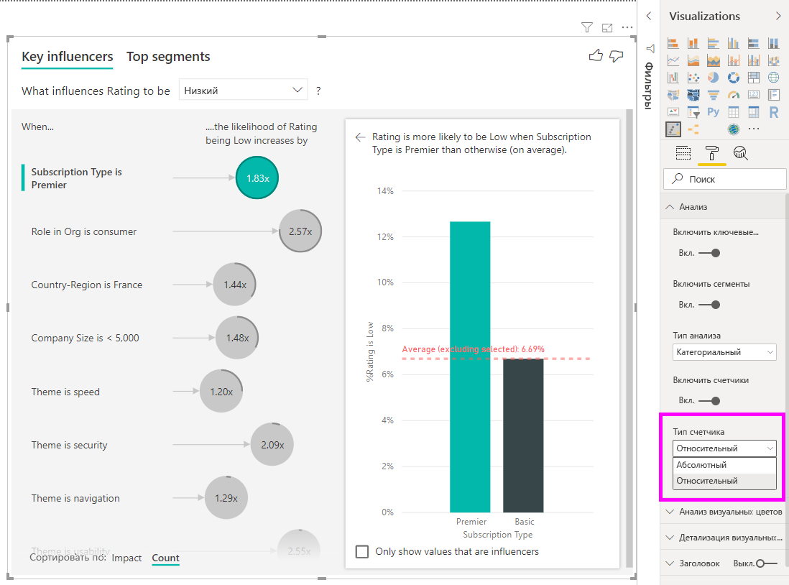

## Анализ числовой метрики

При перемещении необобщенного числового поля в поле **Анализ** вы можете выбрать способ обработки этого сценария. Поведение визуального элемента можно изменить, перейдя в **область форматирования** и переключившись между типами анализа **Категориальный** и **Непрерывный**.

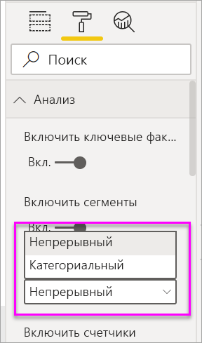

**Категориальный** тип анализа работает описанным выше образом. Например, если бы вы просматривали оценки опроса в диапазоне от 1 до 10, то могли бы задать вопрос "Что вызывает у оценок опроса значение 1?".

**Непрерывный** тип анализа изменяет вопрос на непрерывной. В приведенном выше примере наш новый вопрос имел бы вид "Что влияет на увеличение/уменьшение оценок опроса?".

Это различие очень удобно в случаях, когда в анализируемом вами поле имеется слишком много уникальных значений. В приведенном ниже примере мы рассматриваем стоимость домов. Нет особого смысла спрашивать "Что вызывает у стоимости дома значение 156 214?", так как это очень конкретный вопрос, и данных, скорее всего, будет недостаточно для определения шаблона.

Вместо этого можно спросить "Что вызывает рост стоимости дома?", что позволяет нам рассматривать стоимость домов в виде диапазона, а не отдельных значений.

## Интерпретация результатов: Ключевые факторы влияния 

В этом сценарии мы рассматриваем вопрос "Что вызывает рост стоимости дома?". Мы изучаем ряд пояснительных факторов, способных повлиять на стоимость дома, таких как **Year Built** (год постройки дома), **KitchenQual** (качество кухни) и **YearRemodAdd** (год реконструкции дома). 

В следующем примере мы рассматриваем наиболее влиятельный фактор — качество кухни, которое здесь является превосходным ("Excellent"). Результаты очень похожи на те, которые мы видели при анализе категориальных метрик, но имеют несколько важных отличий:

- Гистограмма справа показывает средние значения, а не проценты. По ней видно соотношение средней стоимости дома с превосходной кухней (зеленая полоса) и без нее (пунктирная линия).
- Значение в пузырьке также представляет собой разницу между красной пунктирной линией и зеленой полосой, но оно выражается в виде числа (158,49 тыс. долл. США), а не соотношения (1,93x). В среднем дома с превосходной кухней почти на 160 тыс. долл. США дороже домов без такой кухни.

В примере ниже мы рассматриваем влияние непрерывного фактора (год реконструкции дома) на стоимость дома. Анализ непрерывных факторов влияния для категориальных метрик имеет следующие отличия:

-   Точечная диаграмма в области справа отображает среднюю стоимость дома для каждого отдельного значения года реконструкции. 
-   Значение в пузырьке показывает, на сколько увеличивается средняя стоимость дома (в данном случае 2,87 тыс. долл. США), когда год реконструкции увеличивается на его стандартное отклонение (в данном случае 20 лет).

Наконец, в случае с мерами мы рассматриваем средний год постройки дома. Этот анализ выглядит следующим образом:

-   Точечная диаграмма в области справа отображает среднюю стоимость дома для каждого отдельного значения в таблице.
-   Значение в пузырьке показывает, на сколько увеличивается средняя стоимость дома (в данном случае 1,35 тыс. долл. США), когда средний год увеличивается на его стандартное отклонение (в данном случае 30 лет).

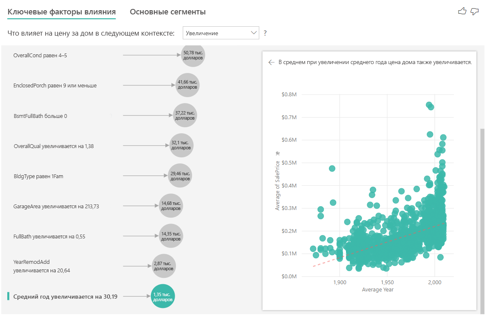

## Интерпретация результатов: Основные сегменты

Основные сегменты для числовых целевых целей показывают группы, где стоимость дома в среднем выше, чем в общем по набору данных. Например, ниже видно, что **сегмент 1** состоит из домов, где **GarageCars** (число машин, в умещающихся в гараж) больше 2 и используется вальмовый (Hip) тип крыши **RoofStyle**. Дома с такими характеристиками имеют среднюю стоимость в 355 тыс. долл. США, тогда как общее среднее значение по всем данным составляет 180 тыс. долл. США.

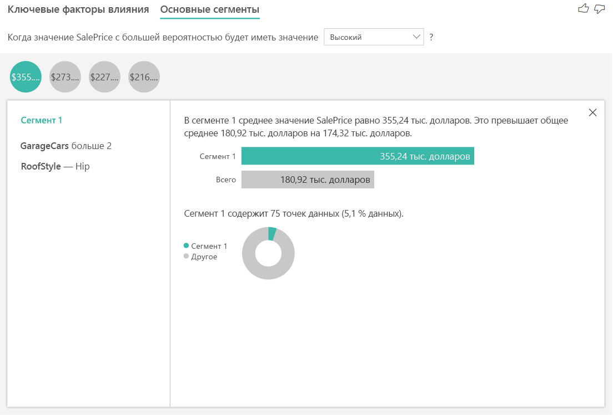

## Анализ метрики, являющейся мерой или обобщенным столбцом

В случае меры или обобщенного столбца по умолчанию применяется **непрерывный анализ**, описанный [выше](https://docs.microsoft.com/power-bi/visuals/power-bi-visualization-influencers#analyze-a-metric-that-is-numeric). Это поведение изменить невозможно. Основным различием между анализом меры или обобщенного столбца и необобщенного числового столбца является уровень, на котором выполняется анализ.

В случае с необобщенными столбцами анализ всегда выполняется на уровне таблицы. В приведенном выше примере мы анализировали метрику **Стоимость дома**, чтобы увидеть, что влияет на увеличение или уменьшение стоимости дома. Этот анализ автоматически выполняется на уровне таблицы. Наша таблица содержит уникальный идентификатор для каждого дома, поэтому анализ производится на уровне дома.

В случае со столбцами мер и обобщенных столбцов определить, на каком уровне их следует анализировать, не так просто. Если **стоимость** обобщается как **среднее значение**, следует решить, на каком уровне следует вычислить среднюю стоимость дома. Необходимо ли получить среднюю стоимость дома на уровне окрестностей? Или, возможно, на уровне региона?

Меры и обобщенные столбцы автоматически анализируются на уровне используемых полей **Объяснение по**. Предположим, что имеются три интересующих нас поля **Объяснение по**: **Качество кухни**, **Тип здания** и **Кондиционирование воздуха**. **Средняя стоимость дома** будет рассчитываться для каждого уникального сочетания этих трех полей. Часто бывает полезно переключиться в режим таблицы, чтобы увидеть, как выглядят анализируемые данные.

Этот анализ является очень обобщенным, поэтому модели регрессии будет сложно найти закономерности в данных для обучения. Чтобы получить лучшие результаты, следует выполнить анализ на более подробном уровне. Если бы мы хотели проанализировать стоимость дома на уровне дома, нам потребовалось бы явно добавить поле **Идентификатор** в анализ. Тем не менее мы не хотим, чтобы идентификатор дома рассматривался как фактор влияния. Информация о том, что стоимость дома увеличивается по мере увеличения значения идентификатора, является бесполезной. Именно в такой ситуации пригодится параметр **Расширение по**. С помощью параметра **Развернуть по** можно добавлять поля, которые должны использоваться для настройки уровня анализа без привлечения новых факторов влияния.

Рассмотрим, как выглядит визуализация после добавления поля **Идентификатор** в раздел **Развернуть по**. После определения уровня, на котором будет оцениваться мера, интерпретация факторов влияния осуществляется так же, как и для [необобщенных числовых столбцов](https://docs.microsoft.com/power-bi/visuals/power-bi-visualization-influencers#analyze-a-metric-that-is-numeric).

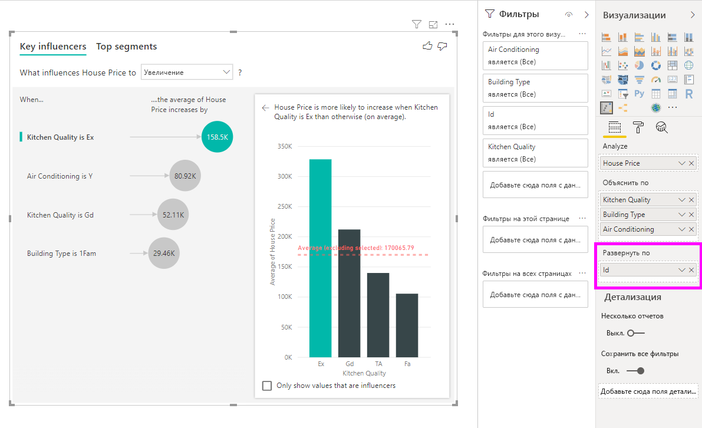

Если вы хотите узнать больше о том, как анализировать меры с помощью визуализации ключевых факторов влияния, просмотрите следующее видео:

<iframe width="1167" height="631" src="https://www.youtube.com/embed/2X1cW8oPtc8" frameborder="0" allow="accelerometer; autoplay; encrypted-media; gyroscope; picture-in-picture" allowfullscreen></iframe>

## Рекомендации и устранение неполадок 
 
**Каковы ограничения для визуального элемента?** 
 
Ключевые факторы влияния имеют некоторые ограничения:

- DirectQuery не поддерживается.
- Динамическое подключение к Azure Analysis Services и SQL Server Analysis Services не поддерживается.
- Публикация в Интернете не поддерживается.
- Требуется .NET Framework 4.6 или более поздней версии.

**Я вижу ошибку, которая гласит, что факторы влияния или сегменты не обнаружены. Почему так происходит?** 

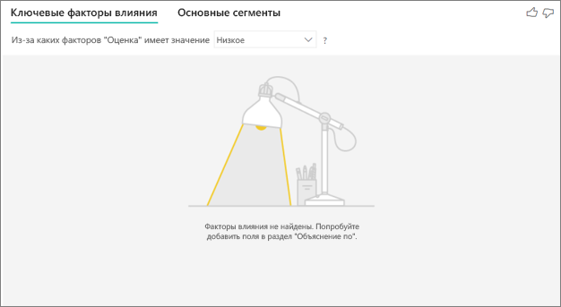

Эта ошибка возникает, когда вы включили поля в раздел **Объяснение по**, но факторы влияния не обнаружены. 
- Вы включили анализируемую метрику и в раздел **Анализ**, и в раздел **Объяснить по**. Удалите ее из раздела **Объяснить по**. 
- Пояснительные поля имеют слишком большое число категорий с небольшим числом наблюдений. Это затрудняет визуализацию, не позволяя определить, какие факторы являются факторами влияния. Трудно сделать обобщения на основе небольшого количества наблюдений. При анализе числового поля вам может потребоваться переключиться с **категориального анализа** на **непрерывный** в **области форматирования** на карте **Анализ**.
- Ваши пояснительные факторы содержат достаточное количество наблюдений для обобщения, но визуализация не позволяет найти значимые корреляции.
 
**Я вижу ошибку, которая гласит, что по анализируемой метрике недостаточно данных для анализа. Почему так происходит?** 

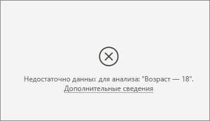

Визуализация работает, проверяя закономерности в данных для одной группы по сравнению с другими группами. Например, она ищет число пользователей, которые дали низкие оценки, и сравнивает его с числом пользователей, которые дали высокие оценки. Если данные в модели содержат лишь несколько наблюдений, трудно выявить закономерности. Если в визуализации недостаточно данных для поиска значимых факторов влияния, она указывает, что необходимы дополнительные данные для анализа. 

Рекомендуется иметь по меньшей мере 100 наблюдений для выбранного состояния. В данном случае состояние соответствует уходящим пользователям. Кроме того, нужно по меньшей мере 10 наблюдений для состояний, которые вы используете для сравнения. В данном случае состояние для сравнения соответствует пользователям, которые не уходят.

При анализе числового поля вам может потребоваться переключиться с **категориального анализа** на **непрерывный** в **области форматирования** на карте **Анализ**.

**Если анализ не является обобщенным, он всегда выполняется на уровне строк родительской таблицы. Изменить этот уровень с помощью полей "Развернуть по" невозможно. Почему так происходит?**

Анализ числового или категориального столбца всегда выполняется на уровне таблицы. Например, если вы анализируете стоимость домов и таблица содержит столбец идентификаторов, анализ будет автоматически выполняться на уровне идентификаторов домов. 

При анализе меры или обобщенного столбца необходимо явно указать уровень, на котором он должен выполняться. С помощью параметра **Развернуть по** можно изменять уровень анализа мер и обобщенных столбцов, не добавляя новые факторы влияния. Если **стоимость дома** определена как мера, в параметр **Развернуть по** можно добавить столбец идентификаторов домов, чтобы изменить уровень анализа.

**Я вижу ошибку, которая гласит, что поле в *Объяснение по* не связано однозначно с таблицей анализируемой метрики. Почему так происходит?**
 
Анализ поля выполняется на уровне таблицы. Например, при анализе отзывов пользователей службы возможно наличие таблицы, которая сообщает, дал пользователь высокую оценку или низкую. В этом случае анализ выполняется на уровне пользовательской таблицы. 

Если есть связанная таблица, которая определена на более детальном уровне, чем таблица, содержащая метрику, вы получите эту ошибку. Приведем пример: 
 
- Вы анализируете, почему пользователи дают низкие оценки службе.
- Вы хотите понять, влияют ли устройства, на которых пользователи пользуются вашей службой, на оценку.
- Пользователь может использовать службу несколькими разными способами.
- В приведенном ниже примере пользователь 10000000 применяет для взаимодействия со службой планшет и браузер.

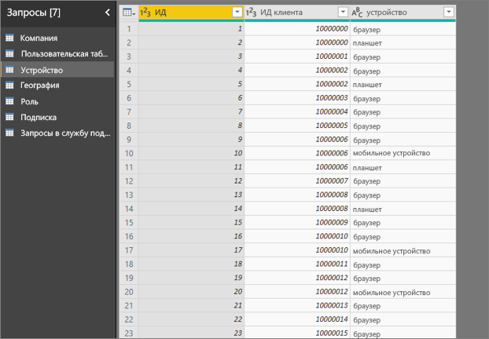

При попытке использовать столбец устройства как пояснительный фактор появляется следующая ошибка: 

Эта ошибка возникает, так как устройство не определено на уровне пользователя. Один пользователь может использовать службу на нескольких устройствах. Чтобы визуализация могла найти шаблоны, устройство должно быть атрибутом пользователя. Существует несколько решений в зависимости от вашего понимания бизнеса: 
 
- Вы можете изменить способ формирования сводных данных по устройствам. Например, можно подсчитать их, если количество устройств способно влиять на оценку пользователя. 
- Можно воспользоваться сводкой по столбцу устройств, чтобы увидеть, как использование службы на конкретном устройстве влияет на оценку пользователя.
 
В этом примере данные были сведены для создания столбцов для браузеров, мобильных устройств и планшетов (обязательно удалите и создайте заново свои связи в представлении моделирования после сведения своих данных). Теперь их можно использовать в поле **Объяснение по**. Все устройства оказываются факторами влияния, и браузер оказывает наибольшее влияние на оценку пользователя.

Говоря точнее, пользователи, не применяющие браузер для работы со службой, в 3,79 раза более склонны дать низкую оценку. В списке ниже видно, что в случае мобильных устройств верно обратное. Пользователи, которые пользуются мобильным приложением, чаще дают низкие оценки. 

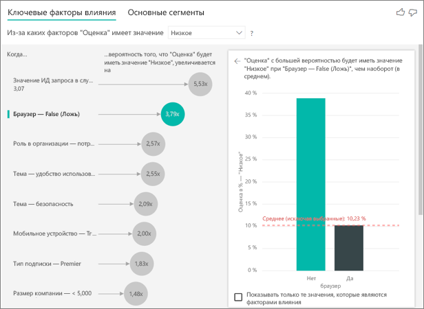

**Я вижу предупреждение о том, что в мой анализ не включены меры. Почему так происходит?** 

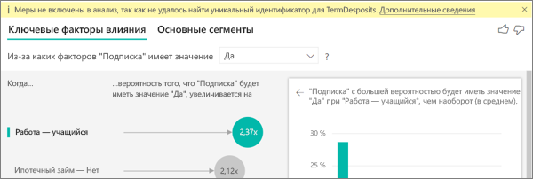

Анализ поля выполняется на уровне таблицы. При анализе оттока клиентов возможно наличие таблицы, которая сообщает, ушел пользователь или нет. В этом случае анализ выполняется на уровне пользовательской таблицы.
 
Меры и агрегаты по умолчанию анализируются на уровне таблицы. Если бы существовала мера средних ежемесячных расходов, она бы анализировалась на уровне пользовательской таблицы. 

Если в пользовательской таблице отсутствует уникальный идентификатор, вы не можете оценить меру и она пропускается в ходе анализа. Чтобы избежать этого, убедитесь, что таблица с метрикой имеет уникальный идентификатор. В данном случае это пользовательская таблица, а уникальный идентификатор — это идентификатор пользователя. Кроме того, можно легко добавить столбец индекса с помощью Power Query.
 
**Я вижу предупреждение о том, что анализируемая метрика имеет более 10 уникальных значений и что это может повлиять на качество анализа. Почему так происходит?** 

ИИ визуализации может анализировать категориальные и числовые поля. В случае с категориальными полями примером может быть отток ("Да" или "Нет") и удовлетворенность клиентов ("Высокая", "Средняя" или "Низкая"). Увеличение числа категорий анализа означает, что у нас уменьшается количество наблюдений на одну категорию. Это мешает визуализации искать шаблоны в данных. 

При анализе числовых полей вы можете обрабатывать числовые поля как текст, в этом случае анализ будет выполняться так же, как и для категориальных данных (**категориальный анализ**). Если у вас есть множество отдельных значений, мы рекомендуем переключиться на **непрерывный анализ**, что позволяет определять шаблоны на основе увеличения или уменьшения чисел вместо рассмотрения их в качестве отдельных значений. Вы можете переключиться с **категориального анализа** на **непрерывный** в **области форматирования** на карте **Анализ**.

Чтобы найти более надежные факторы влияния, мы рекомендуем группировать похожие значения. Например, если у вас есть метрика по цене, вполне вероятно, вы получите более точные результаты, объединив цены в сегменты "Высокий", "Средний", "Низкий", чем при использовании отдельных цен. 

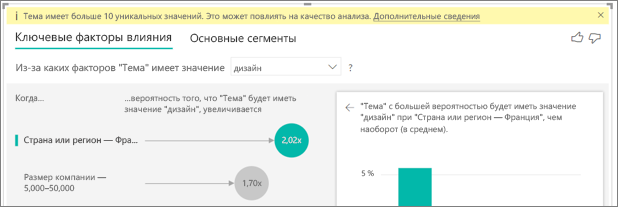

**В данных есть факторы, похожие на ключевые факторы влияния, но они не выявляются. Почему это происходит?**

В следующем примере пользователи, которые являются потребителями, дают низкие оценки (14,93 % оценок). На роль администратора также приходится большая часть низких оценок (13,42 %), но она не считается фактором влияния. 

Причина в том, что визуализация также учитывает количество точек данных при поиске факторов влияния. В примере ниже имеется более 29 000 потребителей и в 10 раз меньше администраторов (около 2900). Только 390 из них дали низкую оценку. Визуализации не хватает данных, чтобы определить, действительно ли существует шаблон для оценок администраторов или это просто случайность. 

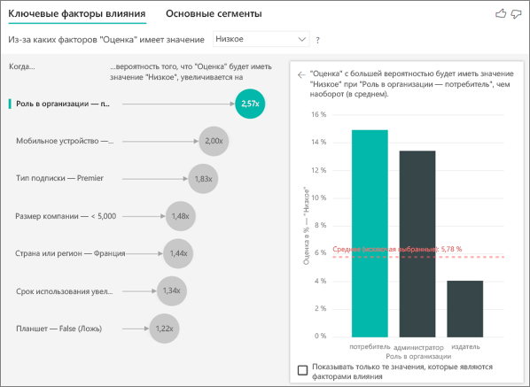

**Каковы ограничения точек данных для ключевых факторов влияния?**
Анализ выполняется по выборке 10 000 точек данных. На одной стороне отображаются все обнаруженные факторы влияния. Гистограммы и точечные диаграммы на другой стороне ограничены стратегиями выборки для этих основных визуальных элементов.

**Как выводятся ключевые факторы влияния для категориального анализа?**

В своей внутренней работе ИИ визуализации рассчитывает ключевые факторы влияния при помощи логистической регрессии в [ML.NET](https://dotnet.microsoft.com/apps/machinelearning-ai/ml-dotnet). Логистическая регрессия — это статистическая модель, которая сравнивает различные группы друг с другом. 

Если вы хотите узнать, в чем причина низких оценок, логистическая регрессия рассматривает, как пользователи, которые дали низкую оценку, отличаются от тех, кто дал высокую оценку. Если у вас есть несколько категорий, таких как высокая, нейтральная и низкая оценки, вы рассматриваете, как пользователи, которые дали низкую оценку, отличаются от пользователей, которые не дали ее. Как в этом случае пользователи, которые дали низкую оценку, отличаются от тех, кто дал высокую или нейтральную оценку? 
 
Логистическая регрессия ведет поиск закономерностей в данных, ища, как пользователи, которые дали низкую оценку, могут отличаться от тех, кто дал высокую оценку. Она может обнаружить, например, что у пользователей, отправивших больше запросов в службу поддержки, выше процент низких оценок, чем у тех, кто не отправлял или почти не отправлял запросы.
 
Логистическая регрессия также учитывает количество точек данных. Если, например, пользователи, которые играют роль администратора, дают заметно более негативные оценки, но таких пользователей немного, их наличие не считается важным фактором. Причина в том, что для выявления шаблона недостаточно точек данных. Статистический тест (тест Вальда) используется, чтобы определить, считать ли фактор фактором влияния. Визуализация использует пороговое значение 0,05. 

**Как выводятся ключевые факторы влияния для численного анализа?**

В своей внутренней работе ИИ визуализации рассчитывает ключевые факторы влияния при помощи линейной регрессии в [ML.NET](https://dotnet.microsoft.com/apps/machinelearning-ai/ml-dotnet). Линейная регрессия является статистической моделью, которая рассматривает, как результат анализируемого поля меняется в зависимости от ваших пояснительных факторов.

Например, если вы анализируете стоимость домов, линейная регрессия будет рассматривать, как наличие превосходной кухни будет влиять на стоимость дома. Стоят ли в общем случае дома с превосходной кухней больше или меньше домов без нее?

Линейная регрессия также учитывает число точек данных. Например, если дома с теннисными кортами стоят дороже, но число таких домой очень невелико, этот фактор не считается значимым. Причина в том, что для выявления шаблона недостаточно точек данных. Статистический тест (тест Вальда) используется, чтобы определить, считать ли фактор фактором влияния. Визуализация использует пороговое значение 0,05. 

**Как рассчитываются сегменты?**

В своей внутренней работе ИИ визуализации выполняет поиск интересных подгрупп в дереве принятия решений с помощью [ML.NET](https://dotnet.microsoft.com/apps/machinelearning-ai/ml-dotnet). Цель дерева принятия решений — найти подгруппу точек данных с относительно высоким уровнем метрики, которая нам нужна. Это могут быть пользователи с низкой оценкой или дорогие дома.

Дерево принятия решений рассматривает каждый пояснительный фактор и пытается понять, какой фактор дает оптимальное *разделение*. Например, если отфильтровать данные для включения только крупных корпоративных пользователей, позволит ли это разделить пользователей, которые дали нам высокую оценку или низкую? Или, возможно, лучше отфильтровать данные, включив только тех пользователей, которые добавили комментарий о безопасности? 

Когда дерево принятия решений выполняет разделение, оно рассматривает подгруппу данных и пытается определить, каким будет следующее наилучшее разделение для этих данных. В данном случае к подгруппе относятся пользователи, которые добавили комментарий о безопасности. После каждого разделения оно также учитывает, есть ли в этой группе достаточное количество точек данных для обеспечения ее репрезентативности, чтобы определить шаблон, или это просто аномалия в данных, а не реальный сегмент. Другой применяемый статистический тест — проверка на статистическую значимость условия разделения по значению p 0,05. 

После построения дерева принятия решений оно принимает все разделения, например комментарии по безопасности, крупные предприятия, и создает фильтры Power BI. Сочетание фильтров будет упаковано в виде сегмента в визуализации. 
 
**Почему определенные факторы становятся факторами влияния или перестают быть ими, когда я перемещаю дополнительные поля в раздел *Объяснение по*?**

Визуализация оценивает все пояснительные факторы вместе. Фактор может быть фактором влияния сам по себе, но в сочетании с другими факторами — нет. Представьте, что вы анализируете, в чем причина роста стоимости домов, используя число спален и площадь дома как пояснительные факторы:

- Сами по себе дополнительные спальни могут быть фактором влияния на рост цены дома.
- Включение размера дома в анализ означает, что теперь мы видим, что происходит с числом спален при фиксированном размере дома.
- Если площадь дома зафиксирована на уровне 140 кв. м, маловероятно, что постоянное увеличение числа спален существенно повысит стоимость дома. 
- Число спален становится не так важно, если мы принимаем во внимание площадь. 

## Дальнейшие действия
- [Комбинированная диаграмма в Power BI](power-bi-visualization-combo-chart.md)
- [Типы визуализаций в Power BI](power-bi-visualization-types-for-reports-and-q-and-a.md)
