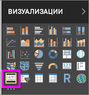
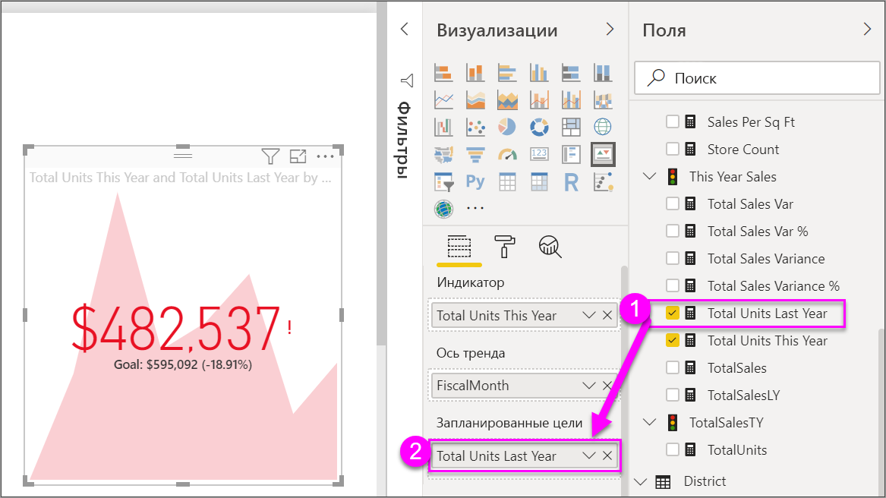

# Визуальные элементы КПЭ
Ключевое показатель эффективности (КПЭ) — наглядный индикатор, который позволяет оценить достижение определенной измеримой цели. Дополнительные сведения о ключевых показателях эффективности см. в сети [Microsoft Developer Network](https://msdn.microsoft.com/library/hh272050).

Если вы не зарегистрированы в Power BI, перед началом работы [пройдите бесплатную регистрацию](https://app.powerbi.com/signupredirect?pbi_source=web).

## Предварительные требования
* [Power BI Desktop (предоставляется бесплатно).](https://powerbi.microsoft.com/get-started/)
* [PBIX-файл с примером анализа розничной торговли.](http://download.microsoft.com/download/9/6/D/96DDC2FF-2568-491D-AAFA-AFDD6F763AE3/Retail%20Analysis%20Sample%20PBIX.pbix)

## В каких случаях следует использовать КПЭ
КПЭ отлично подходят для следующих задач:

* оценка хода выполнения (по каким показателям вы опережаете график или отстаете от него);
* определение расстояния до цели (насколько далеко вы от поставленной цели или опережаете график).   

## Требования КПЭ
Ключевой показатель эффективности связан с определенной мерой и помогает определить текущее значение и состояние показателя в сравнении с заданной целью. Таким образом, для использования визуального элемента КПЭ необходима *базовая* мера, которая возвращает значение, *целевая* мера или значение, а также *порог* или *цель*.

В настоящее время набор данных КПЭ должен содержать значения целей для КПЭ. Если это не так, можно создать их, добавив лист Excel с целями в модель данных или PBIX-файл.

## Как создать КПЭ
Откройте [PBIX-файл с примером анализа розничной торговли](http://download.microsoft.com/download/9/6/D/96DDC2FF-2568-491D-AAFA-AFDD6F763AE3/Retail%20Analysis%20Sample%20PBIX.pbix) в Power BI Desktop. Мы создадим КПЭ, который помогает оценить достижение целевого объема продаж.

В следующем видео Уилл создает метрические визуализации: датчики, карты и КПЭ.

<iframe width="560" height="315" src="https://www.youtube.com/embed/xmja6EpqaO0?list=PL1N57mwBHtN0JFoKSR0n-tBkUJHeMP2cP" frameborder="0" allowfullscreen></iframe>

1. Откройте отчет в представлении отчета и выберите желтую вкладку, чтобы добавить новую страницу.    
2. В области "Поля" выберите **Sales > Total Units This Year** (Продажи > Всего единиц за этот год).  Это будет наш индикатор.
3. Добавьте **Time > FiscalMonth**  (Время > Финансовый месяц).  Так будет выглядеть наш тренд.
4. Важно! Отсортируйте данные диаграммы по **финансовым месяцам**. Как только вы преобразуете визуализацию в ключевой показатель эффективности, возможность сортировки станет недоступна.

    
5. Преобразуйте визуальный элемент в КПЭ, выбрав значок КПЭ в области «Визуализация».
   
    
6. Добавьте цель. Добавьте объем продаж за прошлый год в качестве цели. Перетащите элемент **Total Units Last Year** (Всего единиц за прошлый год) в поле **Target goals** (Цели).
   
    
7. Вы также можете настроить формат КПЭ, щелкнув значок валика, чтобы открыть область форматирования.
   
   * **Индикатор**: управление единицами отображения индикатора и количеством знаков после запятой.
   * **Ось тренда**: если этот параметр **включен**, в качестве фона для визуального элемента КПЭ отображается ось тренда.  
   * **Цели**: если этот параметр **включен**, визуальный элемент отображает цель и расстояние от нее в виде процентного значения.
   * **Цветовое выделение синтаксиса > Направление**: некоторые КПЭ считаются *лучшими* для больших значений, а некоторые — для *малых*. Например, сравните объем прибыли со временем ожидания. Как правило, большая прибыль лучше большого времени ожидания. Выберите **Более высокое значение считается лучшим** и при необходимости измените параметры цвета.

КПЭ также доступны в службе Power BI и на мобильных устройствах, чтобы вы могли постоянно контролировать состояние своих дел.

## Рекомендации и устранение неполадок
* Если ключевой показатель эффективности выглядит, как приведенный выше, возможно, требуется отсортировать данные по финансовым месяцам. Так как для ключевых показателей эффективности нет возможности сортировки, вам потребуется отсортировать данные по финансовым месяцам *перед* тем, как преобразовать визуализацию в ключевой показатель эффективности.

## Дальнейшие действия

[Советы и рекомендации для визуализаций карт Power BI](power-bi-map-tips-and-tricks.md)

[Типы визуализаций в Power BI](power-bi-visualization-types-for-reports-and-q-and-a.md)