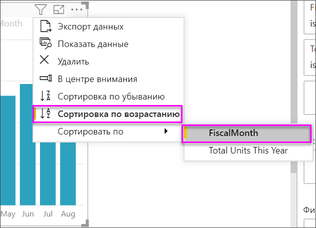

# Создание визуальных элементов ключевого показателя эффективности (КПЭ)

[!INCLUDE [power-bi-visuals-desktop-banner](../includes/power-bi-visuals-desktop-banner.md)]

Ключевое показатель эффективности (КПЭ) — наглядный индикатор, который позволяет оценить достижение определенной измеримой цели. Дополнительные сведения о ключевых показателях эффективности см. в разделе [Ключевые показатели эффективности (КПЭ) в PowerPivot](/previous-versions/sql/sql-server-2012/hh272050(v=sql.110)).

В следующем видео Уилл создает метрические визуализации: шкалы, карты и КПЭ.
   > [!NOTE]
   > В этом видео используется более старая версия Power BI Desktop.
   > 
   > 
<iframe width="560" height="315" src="https://www.youtube.com/embed/xmja6EpqaO0?list=PL1N57mwBHtN0JFoKSR0n-tBkUJHeMP2cP" frameborder="0" allowfullscreen></iframe>

## В каких случаях следует использовать КПЭ

КПЭ отлично подходят для следующих задач:

* контроль хода выполнения; отвечает на вопрос: "Что пройдено и что предстоит сделать?";

* оценка работы, которую предстоит выполнить; отвечает на вопрос: "Насколько я опаздываю или опережаю график?"

## Требования КПЭ

Конструктор применяет визуальный элемент ключевого показателя эффективности на основе определенной меры. Цель ключевого показателя эффективности — помочь вам оценить текущее значение и состояние метрики по отношению к определенной цели. Для использования визуального элемента ключевого показателя эффективности необходима *базовая* мера, которая возвращает значение, *целевая* мера или значение, а также *порог* или *цель*.

Набор данных КПЭ должен содержать значения целей для КПЭ. Если же набор данных не содержит значения цели, можно создать их, добавив лист Excel с целями в модель данных или PBIX-файл.

## Предварительные требования

В этом руководстве используется пример PBIX-файла с примером [Анализ розничной торговли](https://download.microsoft.com/download/9/6/D/96DDC2FF-2568-491D-AAFA-AFDD6F763AE3/Retail%20Analysis%20Sample%20PBIX.pbix).

1. В верхнем левом разделе меню выберите **Файл** > **Открыть**.

1. Найдите свою копию PBIX-файла с примером **Анализ розничной торговли**.

1. Откройте **PBIX-файл с примером "Анализ розничной торговли"** в представлении отчета. 

1. Выберите **+** , чтобы добавить новую страницу. 

## Как создать КПЭ

В этом примере вы создадите ключевой показатель эффективности, который помогает оценить достижения в области целевого показателя продаж.

1. В области **полей** выберите **Продажи > Всего единиц за этот год**.  Это будет наш индикатор.

1. Добавьте **Time > FiscalMonth**  (Время > Финансовый месяц).  Это значение будет представлять тренд.

1. В верхнем правом углу визуального элемента выберите многоточие и убедитесь, что Power BI отсортировал столбцы в порядке возрастания по **FiscalMonth**.

    > [!IMPORTANT]
    > Как только вы преобразуете визуализацию в ключевой показатель эффективности, возможность сортировки станет **недоступной**. Необходимо правильно отсортировать ее сейчас.

    

    После правильной сортировки изображение будет выглядеть следующим образом:

    

1. Преобразуйте визуальный элемент в **ключевой показатель эффективности**, выбрав значок ключевого показателя эффективности в области **Визуализация**.

    

1. Чтобы добавить цель, перетащите элемент **Всего единиц за прошлый год** в поле **Цели**.

    

1. Вы также можете настроить формат КПЭ, щелкнув значок валика, чтобы открыть область форматирования.

    * **Индикатор**: управление единицами отображения индикатора и количеством знаков после запятой.

    * **Ось тренда**: если этот параметр **включен**, визуальный элемент отображает ось тренда в качестве фона для визуального элемента ключевого показателя эффективности.  

    * **Цели**: если этот параметр **включен**, визуальный элемент отображает цель и расстояние от нее в виде процентного значения.

    * **Цветовое выделение синтаксиса > Направление**: люди считают некоторые ключевые показатели эффективности*лучшими* для больших значений, а некоторые — для *малых*. Например, сравните объем прибыли со временем ожидания. Как правило, большая прибыль лучше большого времени ожидания. Выберите **Высокое значение — хорошо** и при необходимости измените параметры цвета.

Ключевой показатель эффективности также доступен в службе Power BI и на мобильном устройстве. Это дает возможность быть всегда подключенным к пульсу вашего бизнеса.

## Рекомендации и устранение неполадок

Если ключевой показатель эффективности выглядит, как приведенный выше, возможно, не требуется сортировать данные по **FiscalMonth**. Ключевые показатели эффективности не имеют параметра сортировки. Вам потребуется начать заново и отсортировать данные по **FiscalMonth** *перед* тем, как преобразовать визуализацию в ключевой показатель эффективности.

## Дальнейшие действия

* [Советы и рекомендации для визуализаций карт Power BI](power-bi-map-tips-and-tricks.md)

* [Типы визуализаций в Power BI](power-bi-visualization-types-for-reports-and-q-and-a.md)

Появились дополнительные вопросы? [Ответы на них см. в сообществе Power BI.](https://community.powerbi.com/)
