# Руководство. Внедрение визуального элемента Power Apps в отчет Power BI

В этом учебнике вы используете визуальный элемент Power Apps для создания приложения, внедряемого в пример отчета Power BI. Это приложение взаимодействует с другими визуальными элементами отчета.

Если у вас нет подписки на Power Apps, перед началом работы [создайте бесплатную учетную запись](https://web.powerapps.com/signup?redirect=marketing&email=).

Из этого руководства вы узнаете, как выполнять следующие задачи:
> [!div class="checklist"]
> * Добавление визуального элемента Power Apps в отчет Power BI
> * Взаимодействие с Power Apps для создания нового приложения, использующего данные из отчета Power BI
> * Просмотр визуального элемента Power Apps и работа с ним в отчете

## Предварительные требования

* Браузер [Google Chrome](https://www.google.com/chrome/browser/) или [Microsoft Edge](https://www.microsoft.com/windows/microsoft-edge)
* [Подписка на Power BI](https://docs.microsoft.com/power-bi/service-self-service-signup-for-power-bi) с установленным [примером "Анализ возможностей"](https://docs.microsoft.com/power-bi/sample-opportunity-analysis#get-the-content-pack-for-this-sample)
* Умение [создавать приложения в Power Apps](https://docs.microsoft.com/powerapps/maker/canvas-apps/data-platform-create-app-scratch) и [изменять отчеты Power BI](https://docs.microsoft.com/power-bi/service-the-report-editor-take-a-tour)

## Создание приложения
При добавлении визуального элемента Power Apps в отчет выполняется запуск Power Apps Studio с активным подключением данных между Power Apps и Power BI.

1. Откройте отчет "Анализ возможностей — пример" и выберите вкладку *Upcoming Opportunities* (Предстоящие возможные сделки). 

2. Переместите и измените размеры некоторых плиток в отчете, чтобы освободить место для нового визуального элемента.

    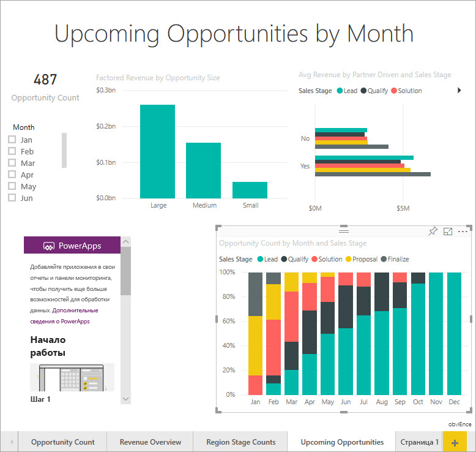

2. Щелкните значок Power Apps в области "Визуализации", после чего измените размер визуального элемента в соответствии с заданной областью.

    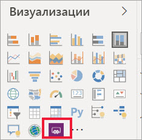

3. В области **Поля** выберите **Name** (Название), **Product Code** (Код продукта) и **Sales Stage** (Этап продаж). 

    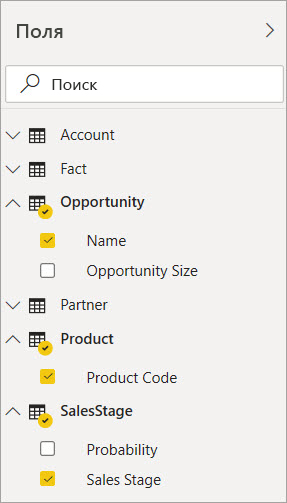

4. На визуальном элементе Power Apps выберите среду Power Apps, в которой нужно создать приложение, а затем нажмите **Создать**.

    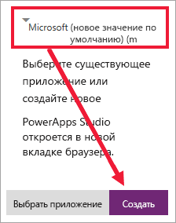

    В Power Apps Studio вы увидите созданное базовое приложение с *коллекцией*, в которой отображается одно из полей, выбранных в Power BI.

    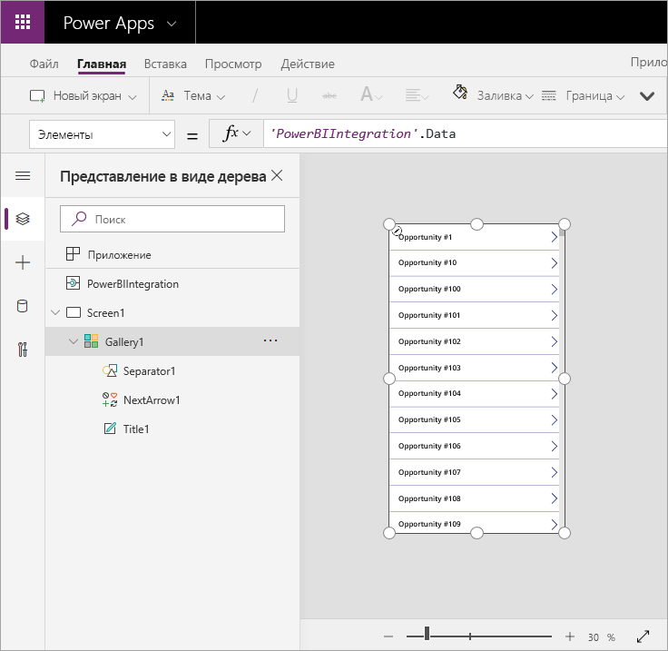

5.  Измените размер коллекции так, чтобы она занимала только половину экрана. 

6. В левой области выберите элемент **Screen1**, а затем задайте для свойства **Fill** окна значение LightBlue (чтобы окно было лучше видно в отчете).

    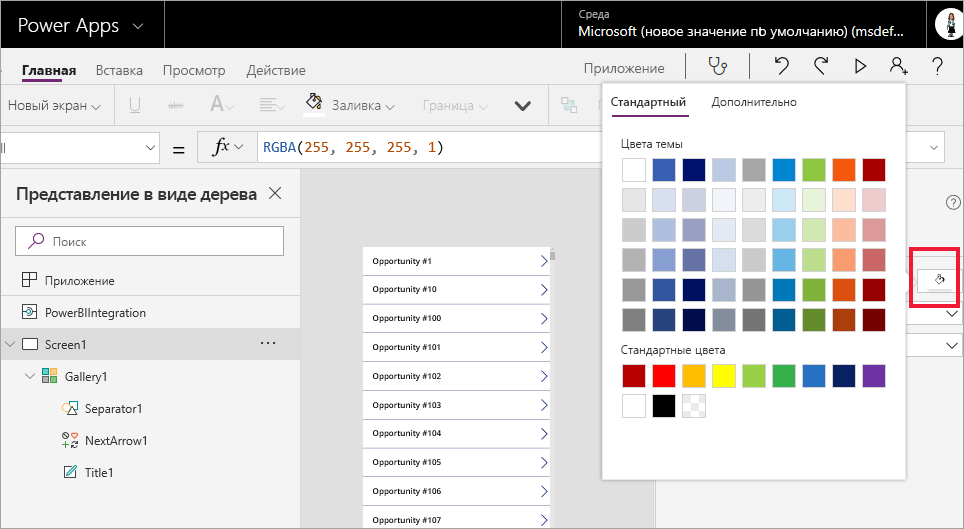

6. Освободите место для элемента управления "метка". 

    

8. Вставьте элемент управления "текстовая подпись" в разделе **Коллекция**.

   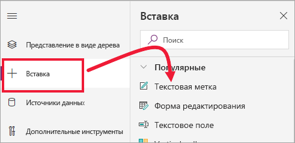

7. Перетащите метку в нижнюю часть визуального элемента. Для свойства **Текст** задайте значение `"Opportunity Count: " & CountRows(Gallery1.AllItems)`. Теперь отображается общее число возможных сделок в наборе данных.

    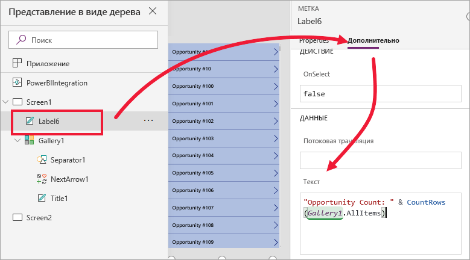

    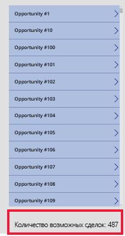

7. Сохраните приложение с именем "Приложения возможных сделок". 

    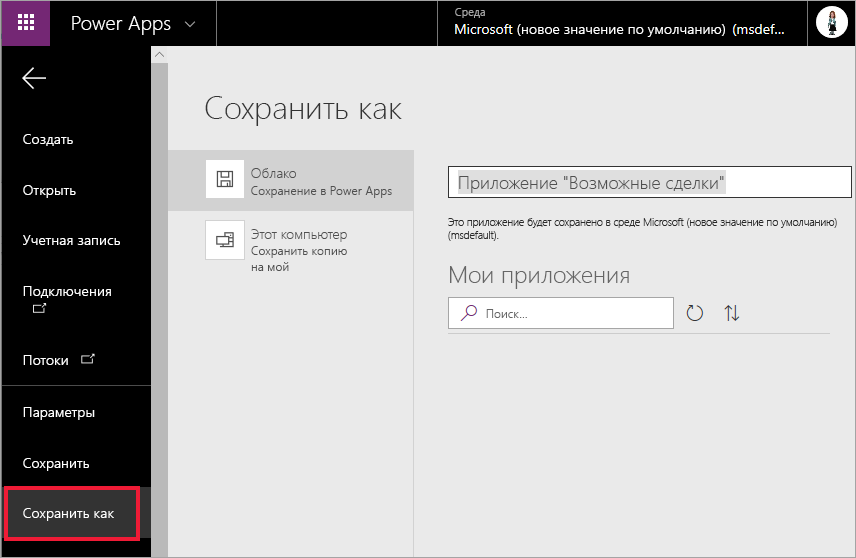

## Просмотр приложения в отчете
Теперь приложение доступно в отчете Power BI. Оно взаимодействует с другими визуальными элементами, так как у них общий источник данных.

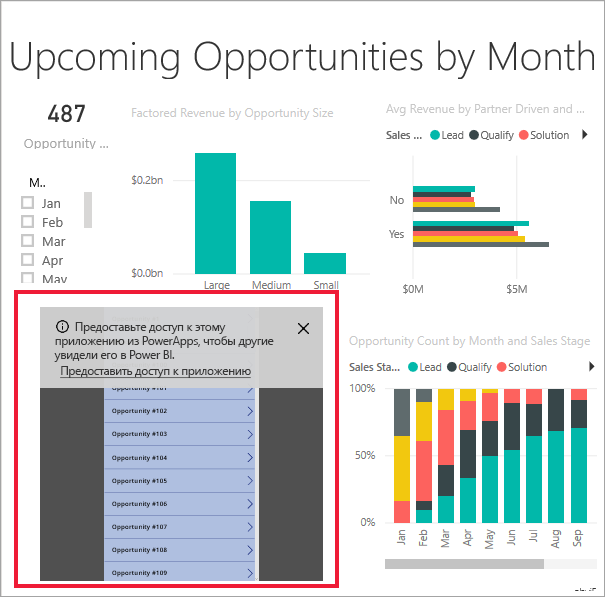

В отчете Power BI выберите на срезе пункт **Jan** (Янв). В результате будет отфильтрован весь отчет, включая данные в приложении.

Обратите внимание на то, что число возможных сделок в приложении совпадает с числом в левом верхнем углу отчета. Вы можете выбирать другие элементы в отчете, и данные в приложении будут обновляться.

## Очистка ресурсов
Если пример "Анализ возможностей" больше не нужен, можно удалить панель мониторинга, отчет и набор данных.

## Дальнейшие действия
["Вопросы и ответы": визуализация](power-bi-visualization-types-for-reports-and-q-and-a.md)