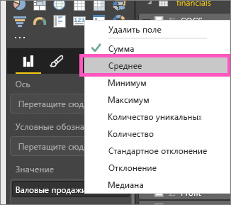
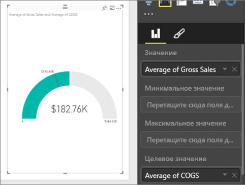
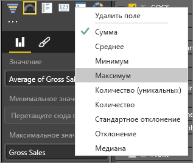
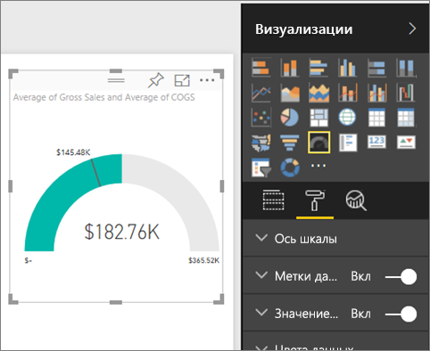
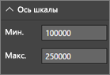

# Диаграммы "Радиальный датчик" в Power BI
Диаграмма "Радиальный датчик" имеет дугу и отображает одно значение, которое отражает ход достижения цели или значение ключевого показателя эффективности.  Цель, или целевое значение, представляется линией. Текущий прогресс в достижении цели представляется областью с заливкой.  Значение, которое представляет текущий прогресс, отображается полужирным шрифтом внутри дуги. Все возможные значения равномерно распределены по дуге, от минимального (крайнее левое значение) до максимального (крайнее правое значение).

В следующем примере мы будем продавцом автомобилей, отслеживающим среднемесячный объем продаж нашей команды. Наша цель — 140. Это значение представляется линией черного цвета.  Минимальное значение среднемесячных продаж — 0, а максимальное — 200.  Область с синей заливкой показывает, что средний объем продаж за этот месяц составляет примерно 120. К счастью, еще есть неделя до достижения нашей цели.

## Когда следует использовать радиальный датчик
Радиальный датчик отлично подходит для:

* отображения прогресса в достижении цели;
* представления процентильного показателя, например ключевого показателя эффективности;
* отображения степени приемлемости показателя;
* отображения информации, которую можно быстро воспринять и понять.

### Предварительные требования
 - Служба Power BI или Power BI Desktop
 - Книга Excel с финансовым примером: [скачать пример напрямую](http://go.microsoft.com/fwlink/?LinkID=521962).

## Создание базового радиального датчика
В этих инструкциях используется служба Power BI. Чтобы их выполнить, войдите в Power BI и откройте файл Excel с примером финансовых данных.  

В следующем видео Уилл создает метрические визуализации: датчики, карты и КПЭ.

<iframe width="560" height="315" src="https://www.youtube.com/embed/xmja6EpqaO0?list=PL1N57mwBHtN0JFoKSR0n-tBkUJHeMP2cP" frameborder="0" allowfullscreen></iframe>

### Шаг 1. Открытие файла Excel с примером финансовых данных
1. [Скачайте файл Excel с примером финансовых данных](../sample-financial-download.md), если вы еще это не сделали. Запомните, куда вы сохранили его.

2. Откройте файл в ***службе Power BI***. Для этого выберите **Получить данные \> Файлы** и перейдите в расположение с сохраненным файлом. Выберите команду **Импортировать**. Финансовый пример будет добавлен на панель навигации по рабочей области в качестве набора данных.

3. В списке содержимого **Набор данных** выберите файл **Financial Sample**, чтобы открыть его в режиме просмотра.

    

### Шаг 2. Создание датчика для отслеживания валовой выручки
1. В списке **Поля** выберите **Gross Sales**(Валовая выручка).
   
   
2. Измените метод агрегирования данных на **Среднее**.
   
   
3. Щелкните значок датчика  для преобразования гистограммы в датчик.
   
   По умолчанию Power BI создает диаграмму датчика, где текущее значение (в данном случае среднее от валовой выручки) считается от средней точки датчика. Поскольку средняя валовая выручка составляет 182,76 тыс. долларов США, начальное значение (минимум) равно нулю, а конечное (максимум) — текущее значение, умноженное на два.
   
   

### Шаг 3. Настройка целевого значения
1. Перетащите показатель **COGS** (себестоимость реализованной продукции) в поле **Целевое значение** .
2. Измените метод агрегирования данных на **Среднее**.
   Power BI добавит линию для представления нашего целевого значения — **145,48 тыс. долларов США**. Обратите внимание, что мы превзошли нашу цель.
   
   
   
   > [!NOTE]
   > Целевое значение можно ввести и вручную.  См. раздел ”Использование параметров форматирования для ручной настройки минимального, максимального и целевого значения” ниже.
   > 
   > 

### Шаг 4. Настройка максимального значения
В шаге 2 Power BI использовал поле "Значение" для автоматической установки минимума (начального значения) и максимума (конечного значения).  Но что делать, если вам требуется задать ваше собственное максимальное значение?  Предположим, что максимально возможное значение требуется задать не как удвоенное текущее значение, а установить его равным наибольшему значению валовой выручки в наборе данных. 

1. Перетащите показатель **Gross Sales** (Валовая выручка) из списка **Поля** в поле **Максимальное значение** .
2. Измените метод агрегирования данных на **Максимум**.
   
   
   
   Датчик будет перерисован с новым конечным значением валовой выручки, 1,21 миллиона долларов США.
   
   

### Шаг 5. Сохранить отчет
1. [Сохраните отчет](../service-report-save.md).
2. [Добавьте диаграмму датчика как плитку на панель мониторинга](../service-dashboard-pin-tile-from-report.md). 

## Использование параметров форматирования для ручной настройки минимального, максимального и целевого значения.
1. Удалите поле **Max of Gross Sales** (Максимальная валовая выручка) из списка **Максимальное значение** .
2. Откройте панель форматирования, щелкнув значок валика.
   
   
3. Разверните **ось датчика** и введите **минимальное** и **максимальное**значения.
   
    
4. Удалите текущее целевое значение, сняв флажок рядом с параметром **COGS**.
   
    
5. Когда поле **целевого значения** появится под **осью датчика**, введите значение.
   
    
6. При желании продолжите форматирование диаграммы датчика.

## Дальнейшие действия

[Датчики в Power BI](power-bi-visualization-kpi.md)

[Типы визуализаций в Power BI](power-bi-visualization-types-for-reports-and-q-and-a.md)
