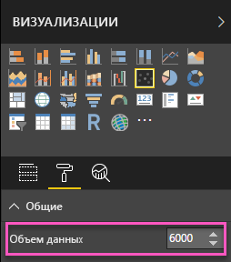
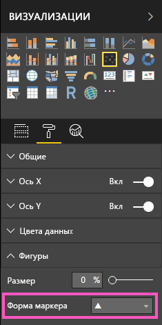
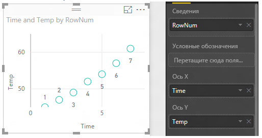
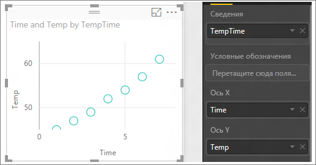

# Точечные и пузырьковые диаграммы в Power BI
Точечная диаграмма всегда включает две оси значений: вдоль горизонтальной оси отображается один набор числовых данных, а вдоль вертикальной — другой. На диаграмме отображаются точки пересечения числовых значений X и Y, объединяя их в отдельные точки данных. Точки данных могут распределяться вдоль горизонтальной оси равномерно или неравномерно в зависимости от данных.

В пузырьковой диаграмме точки данных заменяются пузырьками, *размер* которых определяется еще одним измерением данных.

Точечный график аналогичен пузырьковой или точечной диаграмме за исключением того, что позволяет отображать числовые или категориальные данные вдоль оси X. 

Вы можете задать количество точек данных (не более 10 000).  

## Выбор точечной или пузырьковой диаграммы
### Точечную диаграмму следует использовать:
* для демонстрации отношений между двумя (точечная диаграмма) или тремя (пузырьковая диаграмма) **числовыми** значениями;
* для отображения на диаграмме двух групп чисел в одном пространстве координат XY;
* вместо графика, если вам нужно изменить масштаб горизонтальной оси;    
* для включения горизонтальной оси в логарифмическую шкалу;
* для отображения данных листа, содержащих пары или сгруппированные наборы значений. На точечной диаграмме можно изменять масштабы осей и, таким образом, открывать дополнительную информацию о сгруппированных значениях;
* для отображения повторяющихся комбинаций в больших наборах данных, например в виде линейных или нелинейных тенденций, кластеров и выбросов;
* для сравнения больших количеств точек данных без учета времени.  Чем больше данных вы включите в точечную диаграмму, тем точнее будет сравнение.

### Пузырьковую диаграмму следует использовать:
* если данные имеют три временных ряда, каждый из которых содержит набор значений;
* для представления финансовых данных.  Разный размер пузырьков привлекает внимание к определенным значениям;
* для использования с квадрантами.

### Пузырьковые графики следует применять вместо точечной или пузырьковой диаграммы:
* если вы хотите включить категориальные данные вдоль оси X.

## Создание точечной диаграммы
Просмотрите это видео, в котором Уилл создает точечную диаграмму, а затем выполните следующие действия, чтобы создать ее.

<iframe width="560" height="315" src="https://www.youtube.com/embed/PVcfPoVE3Ys?list=PL1N57mwBHtN0JFoKSR0n-tBkUJHeMP2cP" frameborder="0" allowfullscreen></iframe>

Здесь используется пример "Анализ розничной торговли". Чтобы продолжить работу, [скачайте пример](../sample-datasets.md) для службы Power BI (app.powerbi.com) или Power BI Desktop.   

1. Откройте отчет в режиме редактирования и щелкните желтый значок плюса, чтобы создать пустую страницу отчета.
 
2. На панели Fields (Поля) выберите следующие поля:
   - **Sales** > **Sales Per Sq Ft** (Продажи > Продажи на кв. фут)
   - **Sales** > **Total Sales Variance %** (Продажи > Суммарное отклонение продаж, %)
   - **District** > **District** (Округ > Округ)

     

     Если вы используете службу Power BI, нужно открыть отчет в [режиме правки](../service-interact-with-a-report-in-editing-view.md).

3. Преобразуйте данные в точечную диаграмму. На панели «Визуализации» щелкните значок точечной диаграммы.

   .

4. Перетащите поле **District** (Округ) из раздела **Сведения** в раздел **Условные обозначения**. Мы получили точечную диаграмму, в которой по оси Y показывается **суммарное отклонение продаж в %**, а по оси X — **продажи на кв. фут**. Цвета точек данных указывают регионы.

    

Теперь добавим третье измерение.

## Создание пузырьковой диаграммы

1. Из области **Fields** (Поля) перетащите **Sales** > **This Year Sales** > **Value** (Продажи > Продажи за этот год > Значение) в область **Size** (Размер). Размеры точек данных увеличатся пропорционально соответствующим значениям продаж.
   
   

2. Наведите указатель мыши на пузырек. Размер пузырька отражает значение параметра **Продажи за этот год**.
   
    

3. Чтобы установить число точек данных, отображаемых на пузырьковой диаграмме, откройте раздел **Форматирование** на панели **Визуализации**, разверните карточку **Общие** и установите значение **Объем данных**. В качестве максимального объема данных можно установить любое число вплоть до 10 000. При использовании больших значений рекомендуется предварительно провести тестирование, чтобы обеспечить достаточную производительность. 

     

   Чем больше точек данных, тем дольше будет выполняться загрузка. Если вы решите опубликовать отчет с высокими значениями ограничений, обязательно проверьте его работу через Интернет и на мобильных устройствах. Так вы убедитесь в том, что производительность соответствует ожиданиям пользователей. 

4. Вы можете [форматировать цвета, метки, заголовки, фон и другие параметры визуализации](service-getting-started-with-color-formatting-and-axis-properties.md). Для [улучшения доступности](../desktop-accessibility.md) рассмотрите возможность добавления меток в каждую линию. Благодаря использованию разных форм меток для каждой линии пользователям отчетов легче различать линии (или области). Чтобы выбрать форму метки, разверните карточку **Shapes** (Фигуры) и выберите нужную форму.

      

   Можно также изменить форму маркера: ромб, треугольник или квадрат.

   

## Создание точечного графика
Чтобы создать точечный график, замените числовое поле для оси X категориальным полем.

На панели **Ось X** удалите поле **Sales per sq ft** и замените его полем **District > DM**.
   

## Рекомендации и устранение неполадок

### **Точечная диаграмма содержит только одну точку данных**
Ваша точечная диаграмма содержит только одну точку данных, представляющую сумму всех значений на осях X и Y?  А может быть, эта точка представляет собой сумму всех значений только по горизонтальной или по вертикальной оси?

Добавьте поле в область **Сведения** , чтобы сообщить Power BI, каким образом нужно группировать значения. Поле должно быть уникальным для каждой точки, которую нужно отобразить. Это может быть просто номер строки или поле идентификатора.

Если ваши данные не содержат таких значений, создайте поле, которое объединяет значения X и Y в уникальный атрибут точки:

Для создания нового поля [используйте редактор запросов Power BI Desktop, чтобы добавить столбец индекса](../desktop-add-custom-column.md) в свой набор данных.  Затем добавьте этот столбец в область **Сведения** визуализации.

## Дальнейшие действия

[Точечные диаграммы с высокой плотностью](desktop-high-density-scatter-charts.md)

[Типы визуализаций в Power BI](power-bi-visualization-types-for-reports-and-q-and-a.md)

