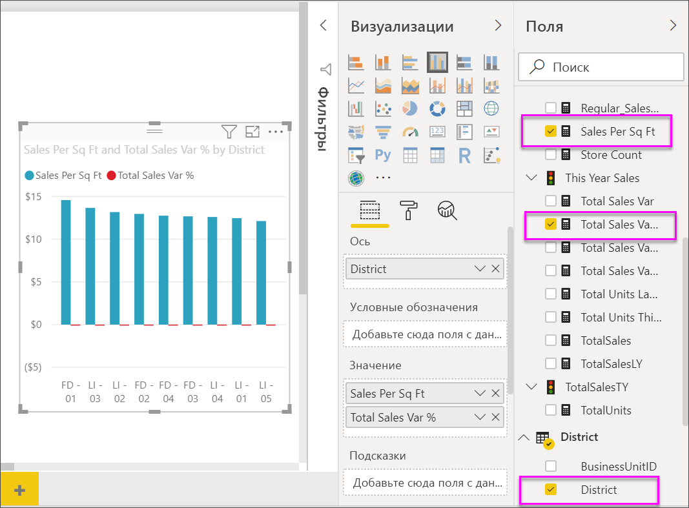
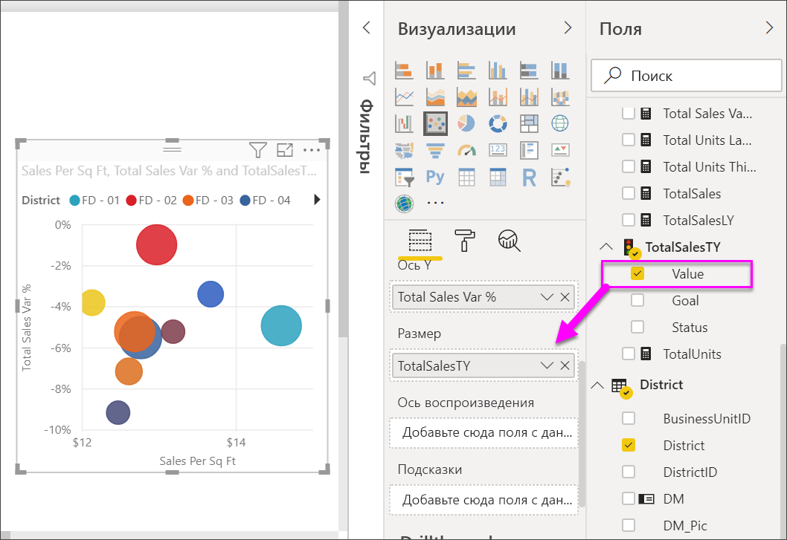
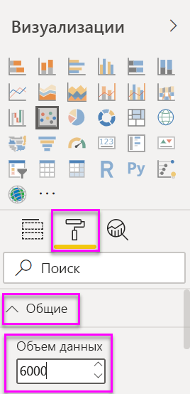
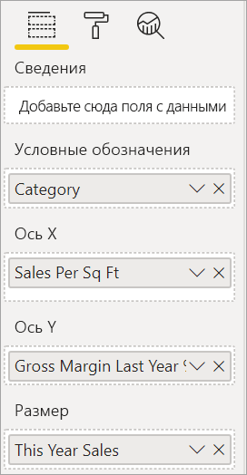
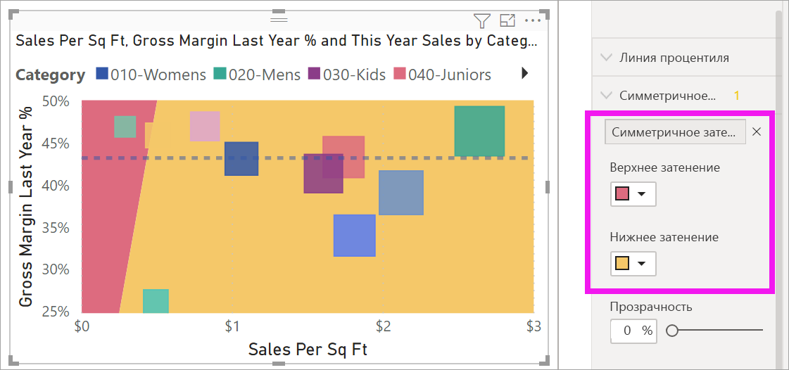
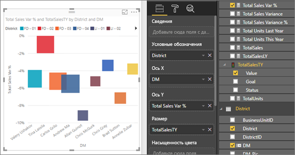
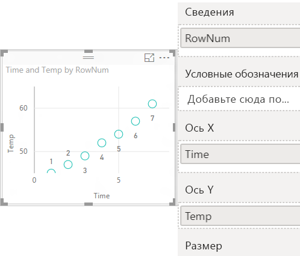
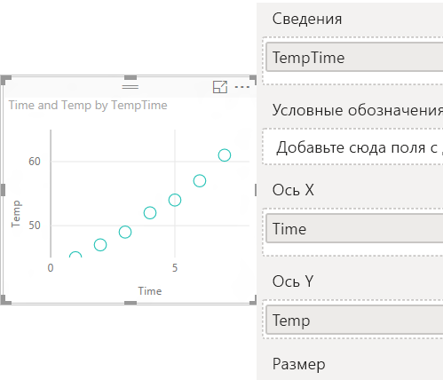

# Точечные и пузырьковые диаграммы в Power BI

[!INCLUDE[consumer-appliesto-nyyn](../includes/consumer-appliesto-nyyn.md)]

[!INCLUDE [power-bi-visuals-desktop-banner](../includes/power-bi-visuals-desktop-banner.md)]

Точечная диаграмма всегда включает две оси значений: вдоль горизонтальной оси отображается один набор числовых данных, а вдоль вертикальной — другой. На диаграмме отображаются точки пересечения числовых значений X и Y, объединяя их в отдельные точки данных. В Power BI эти точки данных могут распределяться вдоль горизонтальной оси равномерно или неравномерно. Это зависит от данных, представленных на графике.

Вы можете задать количество точек данных (не более 10 000).  

## Выбор точечной или пузырьковой диаграммы

### Точечные и пузырьковые диаграммы

Точечная диаграмма показывает связь между двумя числовыми значениями. В пузырьковой диаграмме точки данных заменяются пузырьками, *размер* которых определяется еще одним сторонним измерением данных.

Точечную диаграмму следует использовать:

* для демонстрации связи между двумя числовыми значениями;

* для отображения на диаграмме двух групп чисел в одном пространстве координат X и Y;

* для использования вместо графика, если вам нужно изменить масштаб горизонтальной оси;

* для включения горизонтальной оси в логарифмическую шкалу;

* для отображения данных листа, содержащих пары или сгруппированные наборы значений.

    > [!TIP]
    > На точечной диаграмме можно изменять масштабы осей и, таким образом, открывать дополнительную информацию о сгруппированных значениях;

* для отображения повторяющихся комбинаций в больших наборах данных, например в виде линейных или нелинейных тенденций, кластеров и выбросов;

* для сравнения больших количеств точек данных без учета времени.  Чем больше данных вы включите в точечную диаграмму, тем точнее будет сравнение.

Кроме того, что точечные диаграммы могут быть полезными, пузырьковые диаграммы — отличный выбор:

* если данные имеют три временных ряда, каждый из которых содержит набор значений;

* для представления финансовых данных.  Разный размер пузырьков привлекает внимание к определенным значениям;

* для использования с квадрантами.

### Точечные графики

Точечный график аналогичен пузырьковой или точечной диаграмме, но позволяет вместо этого отображать числовые или категориальные данные вдоль оси X.

Это — отличный выбор, если вы хотите включить категориальные данные вдоль оси X.

## Предварительные требования

В этом руководстве используется пример PBIX-файла с примером [Анализ розничной торговли](https://download.microsoft.com/download/9/6/D/96DDC2FF-2568-491D-AAFA-AFDD6F763AE3/Retail%20Analysis%20Sample%20PBIX.pbix).

1. В верхнем левом разделе меню выберите **Файл** > **Открыть**.
   
2. Найдите свою копию PBIX-файла с примером **Анализ розничной торговли**.

1. Откройте PBIX-файл с примером **Анализ розничной торговли** в представлении отчета .

1. Выбрать  чтобы создать новую страницу.

> [!NOTE]
> Для предоставления общего доступа к отчету Power BI и вам, и коллеге необходимо иметь отдельные лицензии Power BI Pro или сохранить отчет в емкости Премиум.    

## Создание точечной диаграммы

1. Откройте пустую страницу отчета и в области **Поля** выберите следующие поля.

    * **Sales** > **Sales Per Sq Ft** (Продажи > Продажи на кв. фут)

    * **Sales** > **Total Sales Variance %** (Продажи > Суммарное отклонение продаж, %)

    * **District** > **District** (Округ > Округ)

    

1. На панели **Визуализации** щелкните , чтобы преобразовать кластер гистограммы в точечную диаграмму.

   

1. Перетащите поле **District** (Округ) из раздела **Сведения** в раздел **Условные обозначения**.

    В Power BI отобразится точечная диаграмма, в которой по оси Y показывается **суммарное отклонение продаж в %** , а по оси X — **продажи на кв. фут**. Цвета точек данных указывают регионы.

    

Теперь добавим третье измерение.

## Создание пузырьковой диаграммы

1. Из области **Fields** (Поля) перетащите **Sales** > **This Year Sales** > **Value** (Продажи > Продажи за этот год > Значение) в контейнер **Size** (Размер). Размеры точек данных увеличатся пропорционально соответствующим значениям продаж.

   

1. Наведите указатель мыши на пузырек. Размер пузырька отражает значение параметра **Продажи за этот год**.

    

1. Чтобы установить число точек данных, отображаемых в пузырьковой диаграмме, откройте раздел **Format** (Формат) в панели **Visualizations** (Визуализации), разверните **General** (Общие) и установите значение **Data Volume** (Объем данных).

    

    В качестве максимального объема данных можно установить любое число вплоть до 10 000. При использовании больших значений рекомендуется предварительно провести тестирование, чтобы обеспечить достаточную производительность.

    > [!NOTE]
    > Чем больше точек данных, тем больше время загрузки. Если вы решите публиковать отчеты с ограничениями на верхнем уровне шкалы, постарайтесь протестировать свои отчеты как в Интернете, так и на мобильных устройствах. Необходимо убедиться, что представление графика соответствует ожиданиям пользователя.

1. Вы можете форматировать цвета, метки, заголовки, фон и другие параметры визуализации. Для [улучшения доступности](../desktop-accessibility.md) рассмотрите возможность добавления меток в каждую линию. Чтобы выбрать форму метки, разверните карточку **Shapes** (Фигуры), выберите **Marker shape** (Форма метки) и выберите нужную форму.

    

    Можно изменить форму маркера: ромб, треугольник или квадрат. Благодаря использованию разных форм меток для каждой линии пользователям отчетов легче различать линии (или области).

1. Откройте панель "Аналитика"  для добавления дополнительных сведений в визуализацию.  
    - Добавьте линию медианы. Выберите **Линия медианы** > **Добавить**. По умолчанию Power BI добавляет линию медианы для показателя *Продажи на кв. м*. Это не очень удобно, так как мы видим, что имеется 10 точек данных, и понимаем, что медиана будет создана с пятью точками данных на каждой стороне. Вместо этого переключите значение **Мера** на *Общее отклонение продаж, %* .  

        

    - Добавьте симметричное затенение, чтобы показать, какие точки имеют более высокое значение меры по оси x по сравнению с мерой по оси y и наоборот. При включении симметричного затенения на панели "Аналитика" Power BI отображает фон точечной диаграммы в симметричном режиме в зависимости от верхней и нижней границ текущей оси. Это очень быстрый способ определить, какую меру оси учитывает точка данных, особенно если для осей x и y используется разный диапазон.

        а. Измените значение в поле **Общее отклонение продаж, %** на **% валовой прибыли за прошлый год**

        

        б. На панели "Аналитика" добавьте **Симметричное затенение**. Для этого затенения видно, что Hosiery (зеленый пузырь в розовой затененной области) является единственной категорией, которая учитывает валовую прибыль, а не продажи по площади магазина. 

        

    - Продолжайте изучать панель "Аналитика", чтобы получить важные сведения о данных. 

        

## Создание точечного графика

Чтобы создать точечный график, замените числовое поле для **оси X** категориальным полем.

На панели **Ось X** удалите поле **Продажи на кв. фут** и замените его полями **Округ** > **Диспетчер округа**.

## Рекомендации и устранение неполадок

### Точечная диаграмма содержит только одну точку данных

Ваша точечная диаграмма содержит только одну точку данных, представляющую сумму всех значений на осях X и Y?  А может быть, эта точка представляет собой сумму всех значений только по горизонтальной или по вертикальной оси?

Добавьте поле в контейнер **Сведения**, чтобы сообщить Power BI, каким образом нужно группировать значения. Поле должно быть уникальным для каждой точки, которую нужно отобразить. Подойдет просто номер строки или поле идентификатора.

Если ваши данные не содержат таких значений, создайте поле, которое объединяет значения X и Y в уникальный атрибут точки:

Для создания нового поля [используйте редактор запросов Power BI Desktop, чтобы добавить столбец индекса](../desktop-add-custom-column.md) в свой набор данных. Затем добавьте этот столбец в контейнер **Сведения** визуализации.

## Дальнейшие действия

Рекомендуем также ознакомиться со следующими материалами:

* [Выборка с высокой плотностью в точечных диаграммах в Power BI](desktop-high-density-scatter-charts.md)
* [Типы визуализаций в Power BI](power-bi-visualization-types-for-reports-and-q-and-a.md)
* [Советы по сортировке и распространению графиков данных в отчетах Power BI](../guidance/report-tips-sort-distribute-data-plots.md)

Появились дополнительные вопросы? [Ответы на них см. в сообществе Power BI.](https://community.powerbi.com/)
