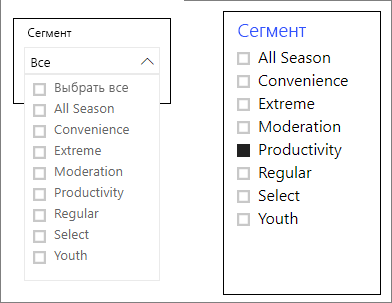
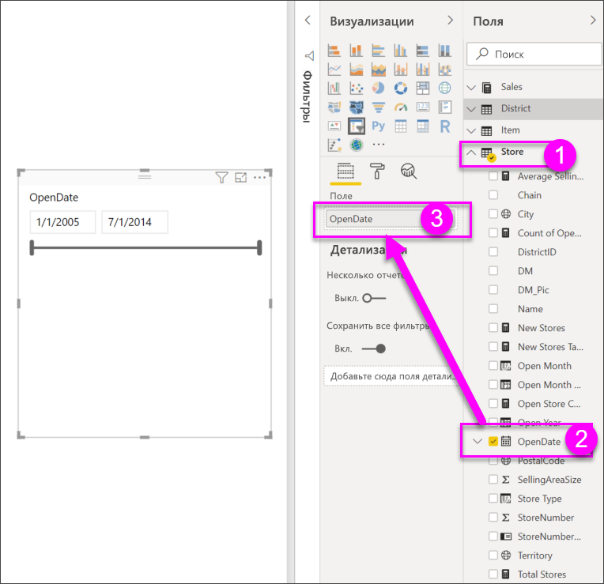
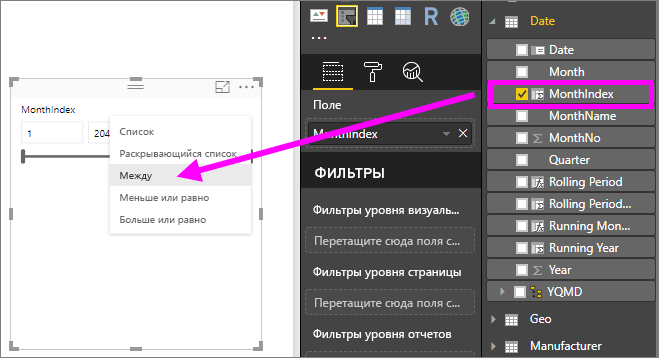
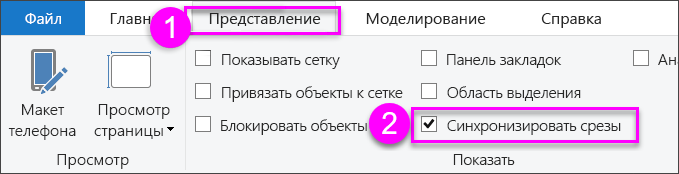
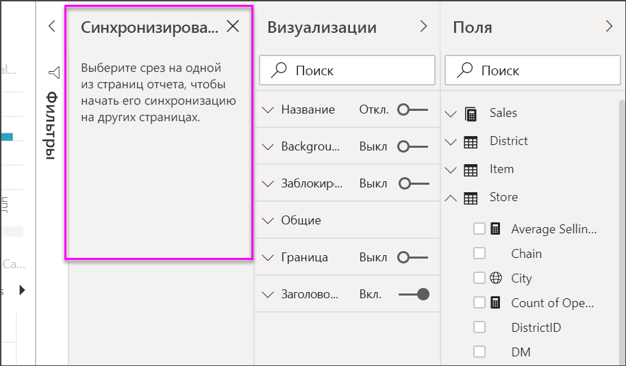
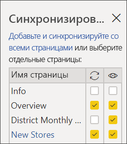

# Срезы в Power BI

[!INCLUDE [power-bi-visuals-desktop-banner](../includes/power-bi-visuals-desktop-banner.md)]

Предположим, вам нужно, чтобы ваши читатели отчетов могли просматривать общие метрики продаж и производительности по отдельному региональному менеджеру и в разные временные рамки. Вы можете создать отдельные отчеты или сравнительные диаграммы. А можно воспользоваться срезами. Срез — это альтернативный вариант фильтрации, который сужает часть набора данных, отображаемую в других визуализациях в отчете. 

В этом руководстве используется бесплатный [пример анализа розничной торговли](../sample-retail-analysis.md), позволяющий ознакомиться с созданием, форматированием и использованием среза списка и диапазона дат. Надеемся, что этот материал о форматировании и использовании срезов вам понравится. 

## Способы применения среза
Срезы отлично подходят для следующих задач:

* отображение часто применяемых и важных фильтров на холсте отчета для упрощения доступа к ним;
* упрощение определения текущего состояния фильтрации без необходимости открывать раскрывающийся список; 
* фильтрация по ненужным и скрытым столбцам в таблицах данных;
* создание более специализированных отчетов путем размещения срезов рядом с важными визуальными элементами.

Среды Power BI не поддерживают следующее.

- Поля ввода
- Детализация

## Создание срезов

**Создание среза для фильтрации данных по региональному менеджеру**

1. Скачайте [PBIX-файл с примером анализа розничной торговли](https://download.microsoft.com/download/9/6/D/96DDC2FF-2568-491D-AAFA-AFDD6F763AE3/Retail%20Analysis%20Sample%20PBIX.pbix).

1. В строке меню Power BI Desktop выберите пункты **Файл** > **Открыть**.
   
1. Перейдите к файлу **Retail Analysis sample PBIX.pbix** и нажмите кнопку **Открыть**.

1. Щелкните значок **Создать отчет** , чтобы открыть файл в представлении отчета.

1. На странице **обзора** с пустым холстом отчета выберите значок **Срез**  в области **Визуализации**, чтобы создать срез. 

1. Выбрав новый срез, выберите на панели **Поля** элемент **District** > **DM** ("Регион" > "Региональный менеджер"), чтобы заполнить срез. 

    Теперь новый срез заполнен списком имен региональных менеджеров и их полей выбора.
    
    
    
1. Измените размер и перетащите элементы и другие элементы на холсте, чтобы освободить место для среза. Обратите внимание, если размер среза слишком мал, элементы среза обрезаются. 

1. Выберите имена в срезе. Этот выбор повлияет на другие визуализации на странице. Снова выделите имена, чтобы отменить выбор, или удерживайте клавишу **CTRL** для выбора нескольких имен. Выбор всех имен имеет тоже эффект, что и отсутствие выбора. 

1. Можно также выбрать **Формат** (значок валика) в области **Визуализации**, чтобы отформатировать срез. 

   Существует слишком много способов, чтобы описать их здесь; вам стоит поэкспериментировать и создать срез, который подходит лично вам. На следующем изображении первый срез использует горизонтальную ориентацию и цветные фоны для элементов. Второй срез использует вертикальную ориентацию и цветной текст для придания более стандартного вида.

   

   >[!TIP]
   >По умолчанию элементы списка срезов располагаются в порядке по возрастанию. Чтобы отсортировать элементы среза по убыванию, щелкните многоточие ( **...** ) в правом верхнем углу среза и в раскрывающемся списке выберите **Сортировать по убыванию**.

**Создание среза для фильтрации данных по диапазону дат**

1. Выберите страницу **обзора** отчета. Если на холсте отчета ничего не выбрано, в области **Поля** выберите **Store** >  **OpenDate**.

    Это действие заполняет поле **Значения** в области **Визуализации**, чтобы создать визуализацию.

1. Выбрав новую визуализацию в отчете, выберите значок **Срез** в области **Визуализации**, чтобы преобразовать новую визуализацию в срез. Этот срез **OpenDate** представляет собой ползунок с заполненным диапазоном дат.
    
    

1. Измените размер среза, а затем перетащите его и другие элементы на холсте, чтобы освободить место для среза. Хотя размер ползунка изменяется с размером среза, если размер среза будет слишком мал, ползунок исчезнет, а поля даты обрежутся. 

1. Выберите разные диапазоны дат с помощью ползунка или выберите поле даты, чтобы ввести дату или открыть календарь для более точного выбора. Обратите внимание, что это влияет на другие визуализации на странице.
    
    >[!NOTE]
    >Числовые типы данных, а также типы данных даты и времени по умолчанию создают срезы в виде ползунка с диапазоном. Начиная с обновления Power BI за февраль 2018 г., ползунки диапазона данных целого числа теперь привязываются к значениям целых чисел и не отображают десятичные знаки. 

1. Чтобы изменить тип среза, выберите срез, наведите курсор на верхнюю правую область среза, закройте появившийся знак стрелки и выберите один из параметров, например **Список** или **Перед**. Обратите внимание на то, как изменится внешний вид и параметры выбора среза. 
 
    

Дополнительные сведения о создании и использовании срезов числового диапазона см. в приведенном ниже видео и статье [Использование среза числового диапазона в Power BI Desktop](../desktop-slicer-numeric-range.md).
   > [!NOTE]
   > В этом видео используется более старая версия Power BI Desktop.
   > 
   > 

<iframe width="560" height="315" src="https://www.youtube.com/embed/zIZPA0UrJyA" frameborder="0" allowfullscreen></iframe> 

## Управление тем, какие визуальные элементы страницы затрагивают срезы
По умолчанию срезы на страницах отчета влияют на остальные визуализации на этой странице, в том числе и друг на друга. Выбор значений в созданных срезах списка и даты повлияет на другие визуализации. Отфильтрованные данные представляют собой пересечение значений, выбранных в обоих срезах. 

Используйте взаимодействия визуальных элементов, чтобы устранить влияние на некоторые визуализации страниц. На странице **обзора** в диаграмме **Total Sales Variance by FiscalMonth and District Manager** (Разница в общем объеме продаж по отчетным месяцам и региональным менеджерам) содержатся общие сравнительные данные о продажах региональных менеджеров за месяц, которые вы хотите просматривать в любое время. Используйте взаимодействия визуальных элементов, чтобы отменить фильтрацию этой диаграммы по параметрам среза. 

1. Перейдите на страницу **обзора** отчета, а затем выберите созданный ранее срез **DM** (Региональный менеджер).

1. В меню Power BI Desktop выберите **Формат** в области **Визуальные средства** и нажмите кнопку **Изменить взаимодействия**.
   
   Над всеми другими визуальными элементами на странице отображаются элементы управления фильтром , у каждого из которых есть параметр **Фильтр** и **Нет**. Изначально параметр **Фильтр** выбран для всех элементов управления.
   
1. Выберите параметр **Нет** в элементе управления фильтра над диаграммой **Total Sales Variance by FiscalMonth and District Manager** (Разница в общем объеме продаж по отчетным месяцам и региональным менеджерам), чтобы отменить фильтрацию по срезу **DM** (Региональный менеджер). 

1. Выберите срез **OpenDate** и параметр **Нет** над диаграммой **Total Sales Variance by FiscalMonth and District Manager** (Разница в общем объеме продаж по отчетным месяцам и региональным менеджерам), чтобы отменить фильтрацию по этому срезу. 

   После выбора диапазонов имен и дат в срезах диаграмма **Total Sales Variance by FiscalMonth and District Manager** (Разница в общем объеме продаж по отчетным месяцам и региональным менеджерам) не изменяется.

Дополнительные сведения об изменении взаимодействий см. в разделе [Изменение способа взаимодействия визуальных элементов в отчете Power BI](../service-reports-visual-interactions.md).

## Синхронизация и использование срезов на других страницах
Начиная с обновления Power BI за февраль 2018 г., можно синхронизировать срез и использовать его на отдельных или всех страницах в отчете. 

В текущем отчете на странице **District Monthly Sales** (Продажи в регионе по месяцам) есть срез **District Manager** (Региональный менеджер), но что делать, если вы также хотели сделать срез на странице **New Stores** (Новые магазины)? Страница **New Stores** (Новые магазины) содержит срез, но он предоставляет только сведения из поля **Store Name** (Название магазина). Используя область **Синхронизация срезов**, вы можете синхронизировать срез **District Manager** (Региональный менеджер) с этими страницами, чтобы изменения параметров среза на любой странице влияли на визуализации на всех трех страницах.

1. В меню **Вид** Power BI Desktop выберите **Синхронизировать срезы**.

    

    Между областями **Фильтры** и **Визуализации** появится область **Синхронизация срезов**.

    

1. На странице **District Monthly Sales** (Продажи в регионе по месяцам) отчета выберите срез **District Manager** (Региональный менеджер). 

    Так как вы уже создали срез **District Manager** (**DM**) (Региональный менеджер) на странице **обзора**, отображается панель **Синхронизация срезов** в следующем виде.
    
    
    
1. В столбце **Синхронизация** области **Синхронизация срезов** выберите страницы **обзора**, **District Monthly Sales** (Продажи в регионе по месяцам) и **New Stores** (Новые магазины). 

    Такой выбор приводит к синхронизации среза **District Monthly Sales** (Продажи в регионе по месяцам) на этих трех страницах. 
    
1. В столбце **Видимые** области **Синхронизация срезов** выберите страницу **New Stores** (Новые магазины). 

    Такой выбор приводит к отображению среза **District Monthly Sales** (Продажи в регионе по месяцам) на этих трех страницах. Теперь панель **Синхронизация срезов** выглядит следующим образом.

    

1. Обратите внимание на синхронизацию среза и его отображение на других страницах. Теперь на странице **District Monthly Sales** (Продажи районов по месяцам) для среза **District Manager** (Региональный менеджер) выбраны те же параметры, что и на странице **обзора**. Срез **District Manager** (Региональный менеджер) на странице **New Stores** (Новые магазины) теперь отображается, а выбранные для него параметры влияют на выбор параметров, отображаемых в срезе **Store Name** (Название магазина). 
    
    >[!TIP]
    >Несмотря на то что срез изначально появляется на синхронизированных страницах в том же размере и положении, что и на исходной странице, вы можете независимо перемещать и форматировать синхронизированные срезы, а также изменять их размер на разных страницах. 

    >[!NOTE]
    >Если вы синхронизируете срез со страницей, но не сделаете его видимым на этой странице, изменение параметров среза, сделанное на других страницах, все еще будет фильтровать данные на этой странице.
 
## Форматирование срезов
В зависимости от типа среза доступны различные параметры форматирования. Используя ориентацию **Horizontal** (По горизонтали), макет **Responsive** (Гибкий) и выделение цветом **элементов**, вы можете создавать кнопки или плитки, а не стандартные элементы списка. Кроме того, вы можете изменять размер элемента среза в соответствии с различными размерами экрана и макетов.  

1. Выбрав на любой странице срез **District Manager** (Региональный менеджер), на панели **Визуализации** щелкните значок **Формат** , чтобы отобразить элементы управления форматированием. 
    
    
    
1. Щелкните стрелки раскрывающегося списка рядом с каждой категорией, чтобы отобразить и изменить параметры. 

### Общие параметры
1. В области **Формат** выберите **Общие**, выберите красный цвет в поле **Цвет контура**, а затем измените значение **Толщина контура** на *2*. 

    Это изменяет цвет и толщину контуров заголовков и элементов, а также подчеркиваний.

1. В разделе **Ориентация** по умолчанию выбрано значение **По вертикали**. Выберите **По горизонтали**, чтобы создать срез с горизонтально расположенными плитками или кнопками и стрелками прокрутки для доступа к элементам, которые не помещаются в срез.
    
    
    
1. Задайте для макета **Responsive** (Гибкий) значение **Включено**, чтобы изменить размер и расположение элементов срезов в соответствии с размерами экрана просмотра и среза. 

    Для срезов списка гибкий макет не позволяет обрезать элементы на маленьких экранах. Он доступен только в горизонтальной ориентации. Для срезов диапазона адаптивное форматирование изменяет стиль среза и обеспечивает более гибкое изменение размера. Оба типа срезов при маленьком размере становятся значками фильтров.
    
    
    
    >[!NOTE]
    >Изменения гибкого макета могут переопределять заданное вами форматирование заголовков и элементов. 
    
1. Вы можете задать положение и размер среза с помощью числовых параметров **X Position** (Позиция по оси X), **Y Position** (Позиция по оси Y), **Width** (Ширина) и **Height** (Высота) либо переместить срез и изменить его размер прямо на холсте. 

    Поэкспериментируйте с различными размерами и расположением элементов и обратите внимание на то, как изменяется адаптивное форматирование. Эти параметры доступны только при выборе горизонтальных ориентаций. 

    

Дополнительные сведения о горизонтальных ориентациях и гибких макетах см. в разделе [Создание адаптивного визуального элемента "Срез" в Power BI](../power-bi-slicer-filter-responsive.md).

### Параметры для элементов управления выбором (только для срезов списка)
1. В разделе **Элементы управления выбором** задайте для параметра **Показать параметр "Выбрать все"** значение **Включено**, чтобы добавить элемент **Select All** в срез. 

    По умолчанию для параметра **Показать параметр "Выбрать все"** задано значение **Отключено**. Если этот параметр включен, при его переключении выполняется или отменяется выбор всех элементов. Когда выбраны все элементы, выбор одного элемента отменяет его выделение, позволяя реализовать фильтр типа *не является*.
    
    
    
1. Выберите для параметра **Единичное выделение** значение **Отключено**, чтобы выбирать несколько элементов без удержания клавиши **CTRL**. 

    По умолчанию для параметра **Единичное выделение** задано значение **Включено**. При выборе элемента он выбирается, а удерживая клавишу **CTRL**, можно выбрать несколько элементов. Повторный выбор элемента отменяет его выделение.

### Параметры заголовка
По умолчанию для параметра **Заголовок** задано значение **Включено**. При этом отображается имя поля данных в верхней части среза. 
- Для работы с этим руководством отформатируйте текст заголовка следующим образом. 
   - **Цвет шрифта**: красный
   - **Размер текста**: **14 пт**
   - **Выравнивание**: **по центру**
   - **Семейство шрифтов**: **Arial Black**

### Параметры элементов (только для срезов списка)
1. Для работы с этим руководством отформатируйте параметры **Элементы** следующим образом.
    - **Цвет шрифта**: черный
    - **Фон**: светло-красный
    - **Размер текста**: **10 пт**
    - **Семейство шрифтов**: **Arial**
 
1. В области **Контур** выберите **Рамка**, чтобы нарисовать вокруг каждого элемента рамку с размером и цветом, заданными в параметрах **Общие**. 
    
    
    
    >[!TIP]
    >- При выборе параметра **Общие** > **Ориентация** > **По горизонтали** невыделенные элементы имеют выбранные цвета текста и фона, а выбранные используют системные значения по умолчанию, обычно это черный фон с белым текстом.
    >- При выборе параметра **Общие** > **Ориентация > По вертикали** элементы всегда используют заданный цвет, а выделенные флажки всегда черные. 

### Входные параметры даты или чисел и ползунка (только для срезов с ползунком диапазона)
- Для срезов списка входные параметры даты или чисел соответствуют параметрам **Элементы**, за исключением отсутствия параметров подчеркивания и контура.
- Параметры **Ползунок** позволяют задать цвет ползунка диапазона или выбрать значение **Отключено**, оставив только числовой ввод.

### Другие параметры форматирования
Другие параметры форматирования по умолчанию имеют значение **Отключено**. Чтобы управлять этими параметрами, задайте для них значение **Включено**. 
- **Фон**: добавляет цвет фона для среза и задает его прозрачность.
- **Заблокировать пропорции**: сохраняет форму среза при изменении его размера.
- **Граница**: добавляет рамку вокруг среза и задает ее цвет. Эта рамка среза задается независимо от параметров **Общие**. 

## Дальнейшие действия
Дополнительные сведения см. в следующих статьях:

- [Типы визуализаций в Power BI](power-bi-visualization-types-for-reports-and-q-and-a.md)

- [Таблицы в Power BI](power-bi-visualization-tables.md)

