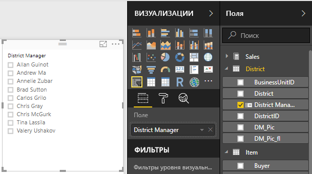
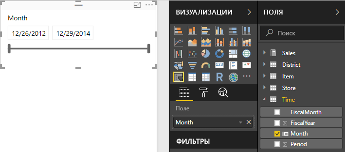
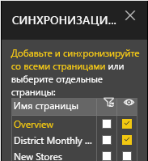
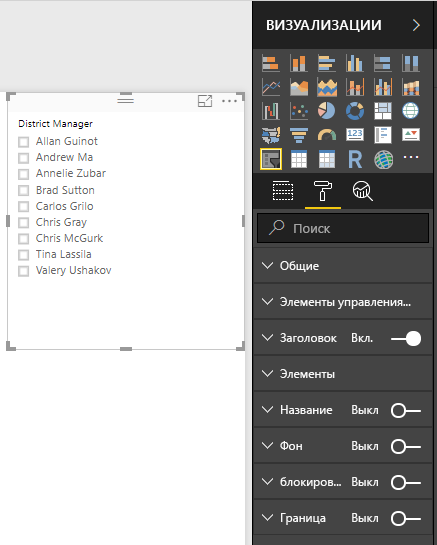
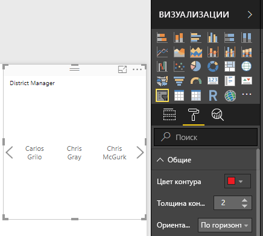
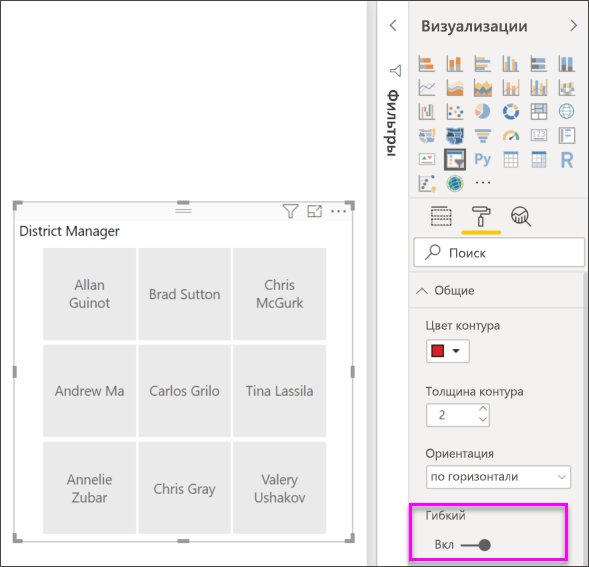
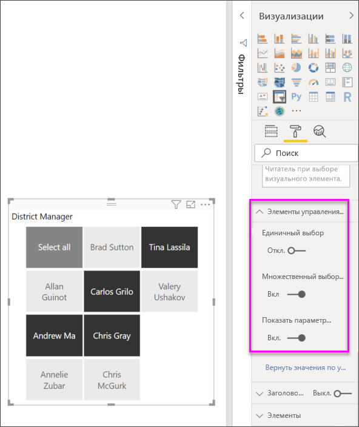
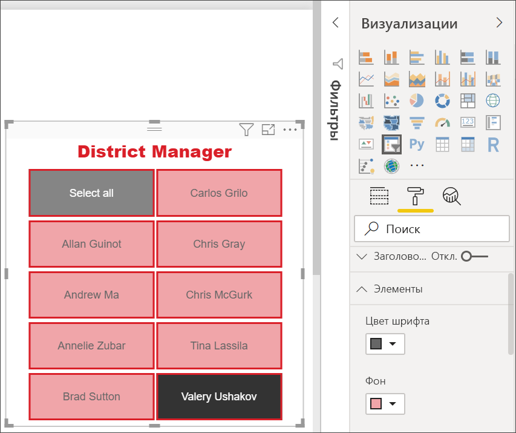

# Срезы в Power BI
Вам необходимо, чтобы ваши читатели отчетов могли просматривать общие показатели продаж и производительности по отдельному региональному менеджеру и в разные временные рамки. Вы можете создать отдельные страницы отчета, сравнительные диаграммы или воспользоваться срезом. Срез — это альтернативный вариант фильтрации, который сужает часть набора данных, отображаемую в других визуализациях в отчете. 

В этом руководстве используется бесплатный [пример анализа розничной торговли](../sample-retail-analysis.md), позволяющий ознакомиться с созданием, форматированием и использованием среза списка и диапазона дат. Надеемся, что этот материал о форматировании и использовании срезов вам понравится. 

## Способы применения среза
Срезы отлично подходят для следующих задач:

* отображение часто применяемых и важных фильтров на холсте отчета для упрощения доступа к ним;
* упрощение определения текущего состояния фильтрации без необходимости открывать раскрывающийся список; 
* фильтрация по ненужным и скрытым столбцам в таблицах данных;
* создание более специализированных отчетов путем размещения срезов рядом с важными визуальными элементами.

Среды Power BI имеют следующие ограничения:

- Срезы не поддерживают поля ввода.
- Срезы нельзя закрепить на панели мониторинга.
- Для срезов не поддерживается детализация.
- Срезы не поддерживают фильтры уровня визуального элемента.

## Создание срезов

Чтобы создать срез, вы можете выбрать значок среза, а затем поле данных для фильтрации (или перетащить его в поле **Поля** в области **Визуализации**), или же сначала выбрать или перетащить поле данных, чтобы создать визуализацию, а затем выбрать значок среза, чтобы преобразовать визуализацию в срез. Различные типы данных создают различные типы срезов с разными параметрами. 

При первом изменении отчета загорается кнопка **Вернуться к значениям по умолчанию**. Таким образом, вы получаете напоминание о том, что внесли изменение в исходные параметры отчета. Если вы закроете отчет, изменение сохранится. Когда вы вернетесь к отчету, настраивать срезы повторно не потребуется.  Однако если необходимо восстановить параметры отчета по умолчанию, заданные автором, в верхней строке меню нажмите кнопку **Вернуться к значениям по умолчанию**.

> [!NOTE]
> Если кнопка **Вернуться к значениям по умолчанию** остается неактивной, это означает, что либо автор отчета отключил эту функцию для отчета, либо отчет содержит пользовательский визуальный элемент. Просто наведите указатель на кнопку, чтобы прочитать подсказку. 

**Создание среза для фильтрации данных по региональному менеджеру**

1. Откройте [пример анализа розничной торговли](../sample-retail-analysis.md) в Power BI Desktop или службе Power BI. (В службе Power BI в верхнем левом углу выберите **Изменить отчет**.)
2. На странице **обзора** с пустым полотном выберите значок **Срез**  в области **Визуализации**, чтобы создать срез. 
3. Выбрав новый срез, нажмите кнопку **District Manager** (Региональный менеджер) в разделе **Округ** на панели **Поля**, чтобы заполнить срез. Новый срез представляет собой список с полями выбора перед именами. 
    
    
    
4. Измените размер среза, а затем перетащите его и другие элементы на холсте, чтобы освободить место для среза. Обратите внимание, если новый размер среза будет слишком мал, элементы среза обрежутся. 
5. Выберите имена в срезе. Этот выбор повлияет на другие визуализации на странице. Чтобы отменить выбор, снова выделите имена, удерживая клавишу **CTRL** (для выбора нескольких имен). Выбор всех имен имеет тоже эффект, что и отсутствие выбора. 

>[!TIP]
>По умолчанию элементы срезов в списке располагаются в буквенно-цифровом порядке по возрастанию. Чтобы отсортировать элементы среза по убыванию, щелкните многоточие (**...**) в правом верхнем углу среза и в раскрывающемся списке выберите **Sort by District Manager** (Сортировать по региональному менеджеру). 

**Создание среза для фильтрации данных по диапазону дат**

1. На пустом холсте откройте список **Время** на панели "Поля" и перетащите поле **Месяц** (или **Дата** в службе Power BI) в поле **Значения** на панели "Визуализации", чтобы создать визуализацию.
2. Выбрав новую визуализацию, выберите значок **Срез**, чтобы преобразовать визуализацию в срез. Этот срез представляет собой ползунок с заполненным диапазоном дат.
    
    
    
4. Измените размер среза, а затем перетащите его и другие элементы на холсте, чтобы освободить место для среза. Обратите внимание на то, что размер ползунка изменяется с размером среза. Если размер среза будет слишком мал, ползунок исчезнет, а поля даты обрежутся. 
4. Выберите разные диапазоны дат с помощью ползунка или же выберите поле даты, чтобы ввести значение или открыть календарь для более точного выбора. Обратите внимание, что это влияет на другие визуализации на странице.
    
    >[!NOTE]
    >Числовые типы данных, а также типы данных даты и времени по умолчанию создают срезы в виде ползунка с диапазоном. Начиная с обновления Power BI за февраль 2018 г., ползунки диапазона данных целого числа теперь привязываются к значениям целых чисел и не отображают десятичные знаки. 

>[!TIP]
>Несмотря на то что поле данных **Месяц** по умолчанию создает тип среза ползунка диапазона **Between** (Между), вы можете изменить его и параметры выбора. Чтобы изменить тип среза, выберите срез, наведите курсор на верхнюю правую область среза, закройте появившийся знак крышки и выберите один из параметров, например **Список** или **Before** (Перед). Обратите внимание на то, как изменится внешний вид и параметры выбора среза. 

Дополнительные сведения о создании и использовании срезов числового диапазона см. в приведенном ниже видео и статье [Использование среза числового диапазона в Power BI Desktop](../desktop-slicer-numeric-range.md).
<iframe width="560" height="315" src="https://www.youtube.com/embed/zIZPA0UrJyA" frameborder="0" allowfullscreen></iframe> 

## Управление тем, какие визуальные элементы страницы затрагивают срезы
По умолчанию срезы на страницах отчета влияют на остальные визуализации на этой странице, в том числе и друг на друга. Выбор значений в созданных срезах списка и даты повлияет на другие визуализации. Отфильтрованные данные представляют собой пересечение значений, выбранных в обоих срезах. 

Вы можете использовать функцию **Взаимодействие визуальных элементов**, чтобы устранить влияние на некоторые визуализации страниц. На странице **обзора** в диаграмме Total Sales Variance by FiscalMonth and District Manager (Разница в общем объеме продаж по отчетным месяцам и региональным менеджерам) содержатся общие сравнительные данные о продажах регионального менеджера за месяц. Эти данные доступны в любое время. Вы можете использовать функцию **Взаимодействие визуальных элементов**, чтобы отменить фильтрацию этой диаграммы по параметрам среза. 

1. Выбрав срез регионального менеджера, сделайте следующее:
    - В Power BI Desktop выберите меню **Формат** в области **Визуальные средства** и нажмите кнопку **Изменить взаимодействия**.
    - В службе Power BI откройте раскрывающееся меню **Взаимодействие визуальных элементов** из строки меню и включите параметр **Изменить взаимодействия**. 
   
   Над всеми другими визуальными элементами на странице появляются элементы управления фильтром . Изначально все значки **фильтров** выбраны.
   
2. Щелкните значок **None** (Ни одного) над диаграммой **Total Sales Variance by FiscalMonth and District Manager** (Разница в общем объеме продаж по отчетным месяцам и региональным менеджерам), чтобы отменить фильтрацию. 
3. Выберите срез **Месяц** и снова щелкните значок **None** (Ни одного) над диаграммой **Total Sales Variance by FiscalMonth and District Manager** (Разница в общем объеме продаж по отчетным месяцам и региональным менеджерам), чтобы отменить фильтрацию. После выбора диапазонов имен и дат в срезах, диаграмма Total Sales Variance by FiscalMonth and District Manager (Разница в общем объеме продаж по отчетным месяцам и региональным менеджерам) не изменяется. 

Дополнительные сведения об изменении взаимодействий см. в разделе [Взаимодействия с визуализациями в отчете Power BI](../service-reports-visual-interactions.md).

## Синхронизация и использование срезов на других страницах
Начиная с обновления Power BI за февраль 2018 г., можно синхронизировать срез и использовать его на отдельных или всех страницах в отчете. 

В текущем отчете на странице **District Monthly Sales** (Продажи районов по месяцам) также есть срез **District Manager** (Региональный менеджер), но он не синхронизирован с тем, который вы создали на странице **обзора** (оба среза могут иметь разные элементы выбора). На странице **New Stores** (Новые магазины) находится только срез **Имя магазина**. Вы можете синхронизировать свой новый срез **District Manager** (Региональный менеджер) с этими страницами, чтобы изменение параметров среза на любой странице влияли на визуализации на всех трех страницах. 

1. В Power BI Desktop в меню **Представление** щелкните **Синхронизировать срезы** (или включите функцию **Синхронизировать область срезов** в службе Power BI). Отобразится панель **Синхронизация срезов**. 
2. На странице **Обзор** выберите срез **District Manager** (Региональный менеджер). Обратите внимание, что страница **District Monthly Sales** (Продажи районов по месяцам) уже выбрана в столбце **Видимый**, так как на этой странице также содержится срез регионального менеджера. Однако в столбце **Синхронизация** страница не выбрана. 
    
    
    
3. Выберите страницы **New Stores** (Новые магазины) и **District Monthly Sales** (Продажи районов по месяцам) в столбце **Синхронизация**, чтобы синхронизировать с ними срез **Обзор**. 
    
3. Выберите в столбце **Видимый** страницу **New Stores** (Новые магазины) и оставьте выбранной страницу **District Monthly Sales** (Продажи районов по месяцам). 
4. Обратите внимание на синхронизацию среза и его отображение на других страницах. Теперь на странице **District Monthly Sales** (Продажи районов по месяцам) для среза **District Manager** (Региональный менеджер) выбраны те же параметры, что и на странице **обзора**. Выбранные параметры для среза **District Manager** (Региональный менеджер) на странице **New Stores** (Новые магазины) влияют на выбор параметров, доступных для среза **Имя магазина**. 
    
    >[!TIP]
    >Несмотря на то что срез изначально появляется на синхронизированных страницах в том же размере и положении, что и на исходной странице, вы можете независимо перемещать и форматировать синхронизированные срезы, а также изменять их размер на разных страницах. 

>[!NOTE]
>Если вы синхронизируете срез со страницей, но не сделаете его видимым на этой странице, изменение параметров среза, сделанное на других страницах, все еще будет фильтровать данные на этой странице.
 
## Форматирование срезов
В зависимости от типа среза доступны различные параметры форматирования. Используя ориентацию **Horizontal** (По горизонтали), макет **Responsive** (Гибкий) и выделение цветом **элементов**, вы можете создавать кнопки или плитки, а не стандартные элементы списка. Кроме того, вы можете изменять размер элемента среза в соответствии с различными размерами экрана и макетов.  

1. Выбрав на любой странице срез **District Manager** (Региональный менеджер), на панели **Визуализации** щелкните значок **формата** , чтобы отобразить элементы управления форматированием. 
    
    
    
2. Щелкните стрелки раскрывающегося списка рядом с каждой категорией, чтобы отобразить и изменить параметры. 

### Общие параметры
1. Выберите красный цвет в поле **Цвет контура** и измените значение **Толщина контура** на "2". Это задает цвет и толщину контуров заголовков и элементов, а также подчеркиваний при их наличии. 
2. В разделе **Ориентация** по умолчанию установлено значение **Vertical** (По вертикали). Выберите **Horizontal** (По горизонтали), чтобы создать срез с горизонтально расположенными плитками или кнопками и стрелками прокрутки для доступа к элементам, которые не помещаются в срез.
    
    
    
3. Включите макет **Responsive** (Гибкий), чтобы изменить размер и расположение элементов срезов в соответствии с размерами экрана просмотра и среза. Для срезов списка гибкий макет доступен только в горизонтальной ориентации. Он не позволяет обрезать элементы на маленьких экранах. Для срезов диапазона адаптивное форматирование изменяет стиль среза и обеспечивает более гибкое изменение размера. Оба типа срезов в очень маленьком размере становятся значками фильтров. 
    
    
    
    >[!NOTE]
    >Изменения гибкого макета могут переопределять заданное вами форматирование заголовков и элементов. 
    
4. Вы можете задать положение и размер среза с помощью числовых параметров **X Position** (Позиция по оси X), **Y Position** (Позиция по оси Y), **Width** (Ширина) и **Height** (Высота) либо переместить срез и изменить его размер прямо на холсте. Поэкспериментируйте с различными размерами и расположением элементов и обратите внимание на то, как изменяется адаптивное форматирование.  

    

Дополнительные сведения о горизонтальном макете и адаптивном форматировании см. в статье [Создание адаптивного визуального элемента "Срез" в Power BI (предварительная версия)](../power-bi-slicer-filter-responsive.md).

### Параметры для элементов управления выбором (только для срезов списка)
1. По умолчанию для параметра **Show Select All** (Показать "Выбрать все") задано значение **Off** (Отключено). Задайте значение **On** (Включено), чтобы добавить в срез элемент **Select All** (Выбрать все), который выбирает все элементы или отменяет их выбор. Когда выбраны все элементы, щелчок или касание одного из них отменяет его выделение, позволяя реализовать фильтр типа "не является". 
    
    
    
2. По умолчанию для параметра **Единичное выделение** задано значение **On** (Включено). При щелчке или касании элемент выбирается, а удерживая клавишу **CTRL**, можно выбирать несколько элементов. Выберите для параметра **Единичное выделение** значение **Off** (Отключено), чтобы разрешить выбор нескольких элементов без удержания клавиши **CTRL**. Повторный щелчок или касание элемента отменяет его выделение. 

### Параметры заголовка
По умолчанию для параметра **Заголовок** задано значение **On** (Включено). Он отображает имя поля данных в верхней части среза. 
1. Отформатируйте текст заголовка, чтобы задать красный **цвет шрифта**, **размер текста** 14 пт и **семейство шрифтов** Arial Black. 
2. В области **Outline** (Контур) выберите **Bottom only** (Только внизу), чтобы создать подчеркивание с размером и цветом, заданными в **Общих** параметрах. 

### Параметры элемента (только для срезов списка)
1. Отформатируйте фон и текст элемента, чтобы задать черный **Цвет шрифта**, светло-красный **Фон**, **Размер текста** 10 пт и **Семейство шрифтов** Arial. 
2. В области **Outline** (Контур) выберите **Рамка**, чтобы нарисовать вокруг каждого элемента рамку с размером и цветом, заданными в **Общих** параметрах. 
    
    
    
    >[!TIP]
    >- При выборе **Ориентация > Horizontal** (По горизонтали) невыделенные элементы имеют выбранные цвета текста и фона, а выбранные используют системные значения по умолчанию, обычно это черный фон с белым текстом.
    >- При выборе **Ориентация > Vertical** (По вертикали) элементы всегда используют заданный цвет, а выделенные поля выбора всегда черные. 

### Входные параметры даты или чисел и ползунка (только для среза с ползунком диапазона)
- Входные параметры даты или чисел соответствуют параметрам **элемента** для срезов списка, за исключением отсутствия подчеркивания и параметра **Outline** (Контур).
- Параметры ползунка позволяют задать цвет ползунка диапазона или выбрать значение **Off** (Отключено), оставив только числовые вводы.

### Другие параметры форматирования
Другие параметры форматирования по умолчанию отключены. При их **включении** происходит следующее: 
- **Заголовок**: добавляет и форматирует заголовок в дополнение к заголовку в верхней части среза и независимо от него. 
- **Фон**: добавляет общий цвет фона для среза и задает его прозрачность.
- **Заблокировать пропорции**: сохраняет форму среза при изменении его размера.
- **Граница**: добавляет рамку в 1 пиксель вокруг среза и задает ее цвет. (Эта рамка среза задается независимо от общих параметров контура.) 

## Дальнейшие действия
[Зарегистрируйтесь для получения бесплатной пробной версии](https://powerbi.microsoft.com/get-started/)

У вас есть идеи по улучшению Power BI? [Отправьте идею](https://ideas.powerbi.com/forums/265200-power-bi-ideas).

Появились дополнительные вопросы? [Ответы на них см. в сообществе Power BI.](http://community.powerbi.com/)

[Часть I. Добавление визуализаций в отчет Power BI (Руководство)](power-bi-report-add-visualizations-i.md)

[Типы визуализаций в Power BI](power-bi-visualization-types-for-reports-and-q-and-a.md)

[Power BI — основные понятия](../service-basic-concepts.md)

