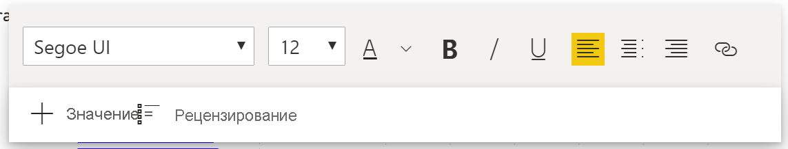
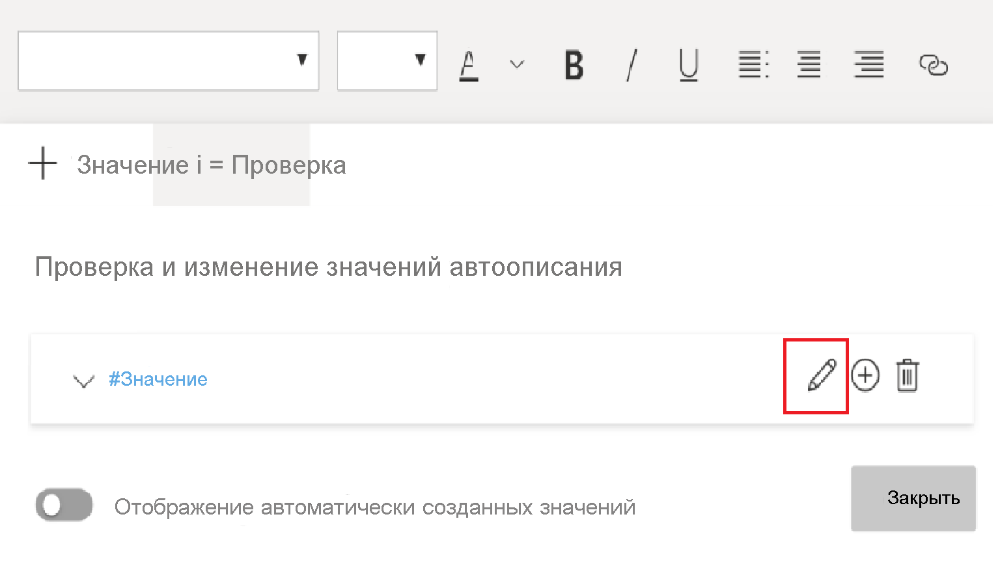

# Создание сводок визуальных элементов с автоописанием (предварительная версия)

[!INCLUDE[consumer-appliesto-nyyn](../includes/consumer-appliesto-nyyn.md)]    

[!INCLUDE [power-bi-visuals-desktop-banner](../includes/power-bi-visuals-desktop-banner.md)]

Визуальные элементы с автоописанием позволяют быстро объединять визуальные элементы и отчеты, предоставляя соответствующие инновационные аналитические сведения, которые можно настроить.

Используйте сводки визуальных элементов с автоописанием в своих отчетах, чтобы указать ключевые моменты, отметить тенденции, изменить язык и отформатировать его в соответствии с определенной аудиторией. Вместо того чтобы вставлять снимок экрана отчета в PowerPoint с ключевыми моментами, теперь можно добавлять визуальные элементы, которые изменяются при каждом обновлении. Ваша аудитория может использовать сводки для анализа данных, быстрого получения ключевых моментов и объяснения данных для других пользователей.

>[!NOTE]
> Так как компонент визуальных элементов с автоописанием доступен в предварительной версии, его необходимо включить, если планируется его использование. В Power BI выберите **Файл** > **Параметры и настройки** > **Параметры** > **Функции на этапе предварительного просмотра** . Затем выберите **Smart narrative visual** (Визуальный элемент с автоописанием).
>
>

Для работы с этим руководством скачайте [пример файла](https://github.com/microsoft/powerbi-desktop-samples/blob/master/Monthly%20Desktop%20Blog%20Samples/2020/2020SU09%20Blog%20Demo%20-%20September.pbix) сценария продаж через Интернет.

## Начало работы 

В области **Визуализации** щелкните значок **Smart narrative** (Визуальный элемент с автоописанием), чтобы автоматически создать сводку.

Отобразится описание, созданное на основе всех визуальных элементов на странице. Например, в примере файла визуальные элементы с автоописанием могут автоматически создавать сводку по визуальным элементам отчета, которые приводят данные о доходах, посещениях веб-сайта и продажах. Power BI автоматически анализирует тенденции, чтобы продемонстрировать, что объем доходов и количество посещений возросли. Служба даже вычисляет рост, который в этом случае составляет 72 процента.
 

 
Чтобы создать визуальный элемент с автоописанием для визуализации, щелкните его правой кнопкой мыши и выберите **Суммирование** . Например, в примере файла попробуйте суммировать данные точечной диаграммы, на которой отображаются различные транзакции. Power BI проанализирует данные и покажет, в каком городе или регионе максимальный доход на транзакцию и максимальное количество транзакций. Визуальный элемент с автоописанием также показывает ожидаемый диапазон значений для этих метрик. Как видите, большинство городов выручают менее 45 долл. США за транзакцию и выполняют менее 10 транзакций.
 
  

 
## Изменение сводки
 
Сводка визуальных элементов с автоописанием предоставляет широкие возможности для настройки. Имеющийся текст можно изменить или дополнить с помощью команд текстового поля. Например, можно сделать шрифт полужирным или изменить цвет текста.
 

  
Чтобы настроить сводку или добавить собственные аналитические сведения, используйте *динамические значения* . Вы можете сопоставлять текст с имеющимися полями и единицами измерения или использовать естественный язык для определения новых единиц для сопоставления с текстом. Например, чтобы добавить сведения о количестве возвращенных элементов в примере файла, добавьте значение. 

По мере ввода имени значения можно выбирать из списка предлагаемых вариантов так же, как и в визуальном элементе "Вопросы и ответы". Таким образом, в визуальном элементе "Вопросы и ответы" помимо вопросов по данным теперь можно создавать собственные вычисления, не используя выражения анализа данных (DAX). 
  

  
Кроме того, динамические значения можно форматировать. Например, в файле примера можно отобразить значения в виде денежной единицы, указать количество десятичных знаков и выбрать разделитель для тысяч. 
   

   
Чтобы отформатировать динамическое значение, выберите значение в сводке, после чего на вкладке **Обзор** отобразятся варианты для редактирования, или нажмите кнопку правки в текстовом поле рядом с изменяемым значением. 
   

   
Кроме того, на вкладке **Обзор** можно просматривать, удалять или повторно использовать ранее определенные значения. Щелкните знак "плюс" (+), чтобы вставить значение в сводку. Вы также можете отобразить автоматически создаваемые значения, включив параметр в нижней части вкладки **Обзор** .

Иногда в визуальных элементах с автоописанием появляется символ скрытой сводки. Он указывает, что текущие данные и фильтры не дают результата для этого значения. Если аналитические сведения недоступны, сводка пуста. Например, в графике примера файла сводка с высоким и низким значением может быть пустой, если график выглядит как прямая линия. Но при других условиях сводка может отображаться. Символы скрытой сводки отображаются только при попытке изменить сводку.

   
## Взаимодействие визуальных элементов
Сводка является динамической. Она автоматически обновляет созданный текст и динамические значения при перекрестной фильтрации. Например, если в кольцевой диаграмме примера файла выбрать значение продаж электроники, то остальная часть отчета будет перекрестно фильтроваться, а сводка будет отображать сведения об электронике.  

В этом случае посещения и доходы имеют различные тенденции, поэтому текст сводки обновляется с учетом этих тенденций. Количество добавленных возвращенных элементов обновляется до 4196 долл. США. Пустые сводки могут обновляться при перекрестной фильтрации.
   

   
Вы также можете выполнить более расширенную фильтрацию. Например, взгляните на визуальный элемент тенденций для нескольких продуктов в примере файла. Если вас интересует только тенденция для определенного квартала, выберите соответствующие точки данных, чтобы обновить сводку для этой тенденции.
   

   
## Ограничения

Компонент визуальных элементов с автоописанием не поддерживает следующие функциональные возможности:
- закрепление на панели мониторинга; 
- использование динамических значений и условного форматирования (например, заголовков с привязкой к данным);
- службы Azure Analysis Services (в том числе локальные);
- КПЭ, карты с несколькими строками, карты, таблицы, матрицы, визуальные элементы R или визуальные элементы Python, пользовательские визуальные элементы; 
- сводки визуальных элементов со столбцами, сгруппированными по другим столбцам и созданными в поле группы данных; 
- перекрестная фильтрация визуального элемента;
- переименование динамических значений или изменение автоматически созданных динамических значений;
- сводки визуальных элементов, содержащих вычисления на лету, например вычисления QnA и процент общего итога. 
   

