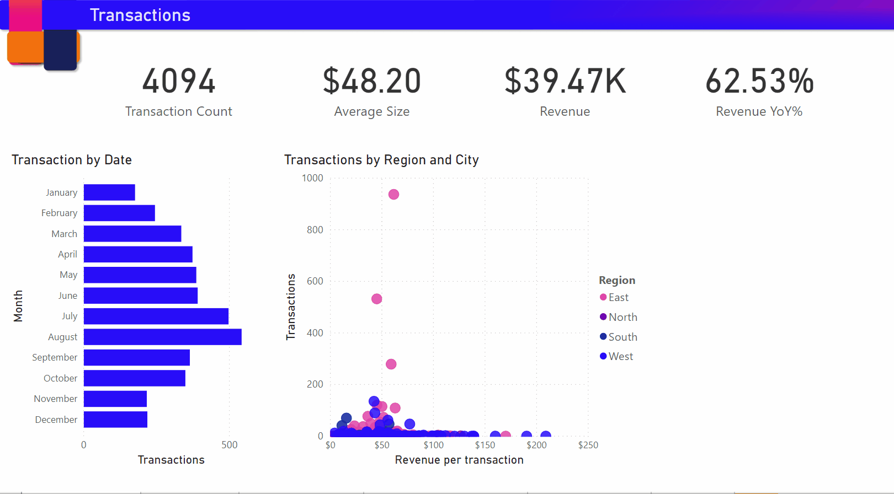

# Создание визуальных элементов с автоописанием (предварительная версия)

[!INCLUDE[consumer-appliesto-nyyn](../includes/consumer-appliesto-nyyn.md)]    

[!INCLUDE [power-bi-visuals-desktop-banner](../includes/power-bi-visuals-desktop-banner.md)]

Визуальные элементы с автоописанием позволяют быстро объединять визуальные элементы и отчеты, предоставляя соответствующие готовые аналитические сведения, которые можно настроить.

Используя эти функции, можно добавить в отчет описания, указать ключевые моменты, отметить тенденции, изменить язык и отформатировать его в соответствии с определенной аудиторией. Вместо того чтобы вставлять снимок экрана отчета в PowerPoint с добавленными ключевыми моментами, теперь можно добавлять в отчет визуальные элементы, которые изменяются при каждом обновлении. Пользователи могут использовать визуальные элементы для понимания данных, быстрого получения ключевых моментов и объяснения данных для других пользователей.

>[!NOTE]
> Так как эта функция находится на этапе предварительной версии, необходимо сначала включить ее. Последовательно выберите "Файл > Параметры и настройки > Параметры > Предварительная версия функции" и убедитесь, что включена функция  **Smart narrative visual**  (Визуальный элемент с автоописанием).

PBIX-файл, используемый для сценария продаж через Интернет, можно найти в [этой документации](https://github.com/microsoft/powerbi-desktop-samples/blob/master/Monthly%20Desktop%20Blog%20Samples/2020/2020SU09%20Blog%20Demo%20-%20September.pbix).

## Приступая к работе 

Щелкните значок визуального элемента с автоописанием в области "Визуализация", чтобы автоматически создать сводку.

 Вы увидите описание, созданное на основе всех визуальных элементов на странице. Например, вы можете щелкнуть значок, чтобы автоматически создать сводку визуальных элементов о доходах, посещениях веб-сайтов и продажах в этом отчете. Обратите внимание, что Power BI автоматически выполняет анализ тенденций, чтобы продемонстрировать, что доход и посещения увеличиваются, и даже вычисляет вид прироста (в этом случае прирост составляет 72 %).
 
 
 
 Вы также можете щелкнуть правой кнопкой нужный визуальный элемент и выбрать пункт **Суммировать**. Это приведет к автоматическому суммированию этой визуализации. Например, щелкнув правой кнопкой мыши сводку на точечной диаграмме, отображающей различные транзакции, Power BI анализирует данные и показывает, какой город или регион имеет наибольшую прибыль на транзакцию и максимальное число транзакций. В нем также показан ожидаемый диапазон значений для этих метрик, чтобы вы могли понять, что в большинстве городов доход на одну транзакцию был ниже 45 долларов США и в них было менее 10 транзакций.
 
  
 
 
 ## Изменение сводки
 
 Сводка — это элемент с широкими возможностями для **настройки**, в котором можно добавить новый или изменить имеющийся текст с помощью тех же элементов управления, которые доступны в обычном текстовом поле. Например, можно сделать шрифт полужирным или изменить цвет текста.
 
  
  
  Вы также можете настроить сводку и добавить собственные аналитические сведения, добавив **динамические значения**. Вы можете сопоставлять текст с имеющимися полями и единицами измерения или использовать естественный язык для определения новых единиц для сопоставления с текстом. Например, если требуется добавить сведения о количестве возвращенных товаров, можно использовать функцию добавления стоимости, как показано в GIF-файле. Мы уже интегрировали интерфейс вопросов и ответов для добавления динамических значений. По мере ввода вы получите предложения в раскрывающемся списке, как в визуальном элементе "Вопросы и ответы", где его можно сохранить как значение.  Таким образом, помимо возможности запрашивать данные в визуальном элементе "Вопросы и ответы", область была развернута для создания собственных вычислений без необходимости выполнения DAX. 
  
   
  
  Динамические значения можно отформатировать, например для отображения валюты, выбора десятичных разрядов, разделителей групп разрядов и т. д. 
   
   
   
   Это можно сделать, щелкнув значение в сводке, чтобы отформатировать его, или нажав кнопку "Изменить", соответствующую значению на вкладке "Обзор" элемента управления текстового поля. 
   
   
   
   Кроме того, на вкладке "Обзор" можно просматривать, удалять или повторно использовать ранее определенные значения.  Если щелкнуть значок "плюс", значение будет вставлено в сводку. Кроме того, переключив параметр в нижней части, можно отобразить автоматически созданные значения.

Иногда будут появляться скрытые сводки с сообщением Current data and filters produce no result for this value (Текущие данные и фильтры не возвращают результат для этого значения). Это связано с тем, что некоторые сводки могут быть пустыми. Например, сводка с высоким и низким значением в графике может быть пустой, если график выглядит как плоская линия, но при других условиях она может быть непустой. Эти символы будут видны только при попытке изменения сводок.

   
   
   ## Взаимодействие визуальных элементов
   Сводка является динамической и автоматически обновляет созданный текст и динамические значения при кросс-фильтрации. Например, если в кольцевой диаграмме выбрать значение продаж электроники, то остальная часть отчета будет перекрестно фильтроваться, а сводная информация будет отображать сведения об электронике.  В этом случае посещения и доходы имеют различные тенденции, поэтому текст обновляется с учетом этого. Количество добавленных вами возвращенных элементов обновляется до 4196 долл. США. Некоторые из пустых сводок также могут обновляться при перекрестной фильтрации.
   
   
   
   Вы также можете выполнить более расширенную фильтрацию. Например, если вы заинтересованы только в пределах определенного квартала в этом визуальном элементе, который отражает тенденции нескольких различных продуктов, можно просто выбрать соответствующие точки данных, чтобы получить обновленную сводку для этого фрагмента.
   
   
   
   ## Ограничения
   - Закрепление на панели мониторинга не поддерживается.
   - Использование динамических значений и условного форматирования (например, заголовков с привязкой к данным) не поддерживается.
   - Службы Azure Analysis Services (в том числе локальные) не поддерживаются.
   - Ключевые показатели эффективности, карточки, многострочные карточки, карты, таблицы, матрицы, визуальные элементы R/Python, настраиваемые визуальные элементы не поддерживают формирование сводных данных. Некоторые из этих визуальных элементов будут добавлены в будущем.
   - Формирование сводных данных не поддерживается для визуальных элементов со столбцами, сгруппированными по другим столбцам и созданными в поле группы данных. 
   - Перекрестная фильтрация из визуальных элементов не поддерживается.
   - Переименование динамических значений или изменение автоматически сформированных динамических значений не поддерживается.
   - Формирование сводных данных о визуальных элементах, таких как арифметические вычисления QnA, процент от общего итога и т. д., не поддерживается.
   

