# Таблицы в отчетах и на панелях мониторинга Power BI
Таблица — это сетка, содержащая связанные данные в логически упорядоченных строках и столбцах. Она также может содержать заголовки и строку с итогами. Таблицы хорошо подходят для количественного сравнения, где можно посмотреть разные значения одной категории. Например, в этой таблице показаны 5 разных мер **категории**.

Создавайте таблицы в отчетах и применяйте перекрестное выделение элементов в таблице, используя другие визуальные элементы на той же странице отчета.  Кроме того, можно перекрестно выделять строки, столбцы и даже отдельные ячейки. Отдельные ячейки и несколько выбранных ячеек можно копировать и вставлять в другие приложения.

## Случаи использования таблицы
Таблицы отлично подходят для следующих задач:

* просмотра и сравнения подробных данных и точных значений (вместо визуального представления);
* отображения данных в табличном формате;
* отображения числовых данных по категориям.   

> [!NOTE]
> Если таблица содержит слишком много значений, преобразуйте ее в матрицу и (или) используйте детализацию. Максимальное число точек данных, отображающихся в таблице, — 3500.

## Предварительные требования
- Служба Power BI или Power BI Desktop
- Анализ розничной торговли — пример

## Создание таблицы
Мы создадим показанную выше таблицу для отображения общей суммы продаж по категории изделия. Для выполнения этой процедуры войдите в службу Power BI и выберите **Получить данные \> Примеры \> Анализ розничной торговли — пример > Подключиться**. Затем выберите **Перейти к панели мониторинга**. Чтобы создать визуализацию, требуются разрешения на изменение для набора данных и отчета. К счастью, все примеры Power BI можно редактировать. Если доступ к отчету вам предоставил другой пользователь, вы не сможете создать в нем визуализации.

1. В области навигации слева выберите **Рабочие области > Моя рабочая область**.    
2. Откройте вкладку "Наборы данных" и прокрутите экран вниз до только что добавленного набора данных "Анализ розничной торговли — пример".  Щелкните значок **Создать отчет**.

    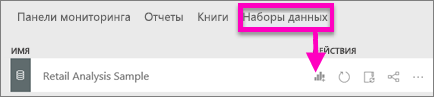
2. В редакторе отчетов последовательно выберите **Элемент** > **Категория**.  Power BI автоматически создает таблицу, в которой перечислены все категории.

    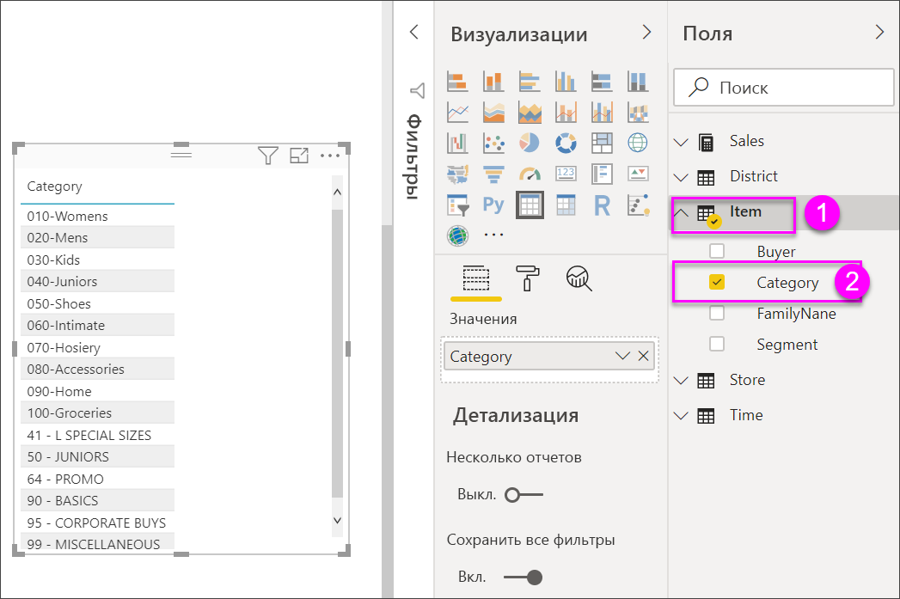
3. Выберите **По продажам > Average Unit Price (Средняя цена за единицу)** и **По продажам > Last Year Sales (Продажи за прошлый год)**, и **По продажам > This Year Sales (Продажи в этом году)** и выберите все 3 параметра (значение, цель, состояние).   
4. В области визуализации найдите **значения** и перетаскивайте их, пока порядок столбцов диаграммы не будет соответствовать первому изображению на этой странице.  Область "Значения" должна выглядеть следующим образом:

    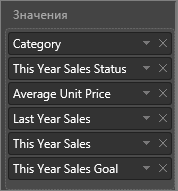
5. Закрепите таблицу на информационной панели, выбрав значок закрепления.  

     

## Форматирование таблицы
Таблицу можно форматировать разными способами. Мы рассмотрим только некоторые из них. Чтобы узнать больше о других параметрах форматирования, откройте панель форматирования (значок с изображением валика ) и изучите эти параметры.

* Попробуйте отформатировать сетку таблицы. Здесь мы добавили синюю вертикальную сетку, пространство для строк и немного увеличили размер контура и текста.

    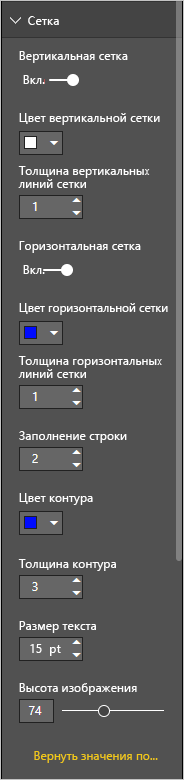

    
* Для заголовков столбцов мы изменили цвет фона, добавили контур и увеличили размер шрифта. 

    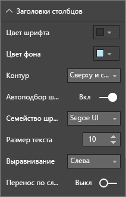

    

* Кроме того, вы можете применять форматирование к отдельным столбцам и заголовкам столбцов. Начните, развернув элемент **Форматирование поля** и выбрав столбец для форматирования в раскрывающемся списке. В зависимости от значения столбца, элемент "Поле форматирования" позволяет вам настраивать отображаемые единицы, цвет шрифта, число десятичных разрядов, фон, выравнивание и многое другое. Изменив параметры, решите, следует ли применять эти же параметры к заголовку и строке итогов.

    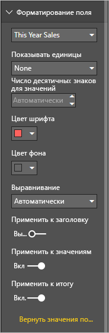

* Вот так выглядит наша окончательная таблица после применения дополнительных параметров форматирования: Так как параметров форматирования очень много, лучше всего начать с со стандартного форматирования. Откройте панель форматирования  и изучите ее. 

    

### Условное форматирование
Один из типов форматирования называется *условным* и применяется к полям в области **Значения** на панели **Визуализации** в Power BI Desktop или в службе Power BI. 

С помощью условного форматирования в таблицах можно задать настраиваемые цвета фона и шрифта ячеек на основе значений ячеек, в том числе градиент цветов. 

1. На панели **Визуализации** Power BI Desktop или Power BI в области **Значения** щелкните стрелку вниз рядом со значением, которое нужно отформатировать (или щелкните поле правой кнопкой мыши). Условное форматирование можно изменять только для полей из области **Значения** в разделе **Поля**.

    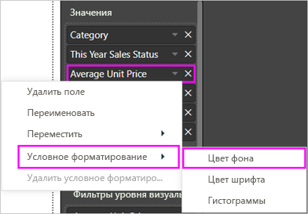
2. Выберите **Цветовые шкалы для фона**. В открывшемся диалоговом окне можно настроить цвета, а также задать *минимальное* и *максимальное* значения. Установив флажок **Расхождение**, дополнительно можно настроить *центральное* значение.

    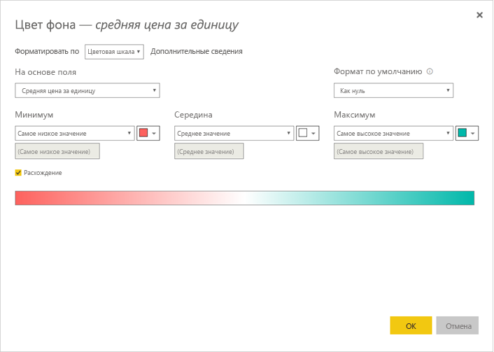

    Применим пользовательское форматирование к нашим значениям в поле "Средняя цена за единицу". Установите флажок **Расхождение**, добавьте несколько цветов и нажмите кнопку **ОК**. 

    
3. Добавьте новое поле в таблицу с положительными и отрицательными значениями.  Последовательно выберите **Продажи > Суммарное отклонение продаж**. 

    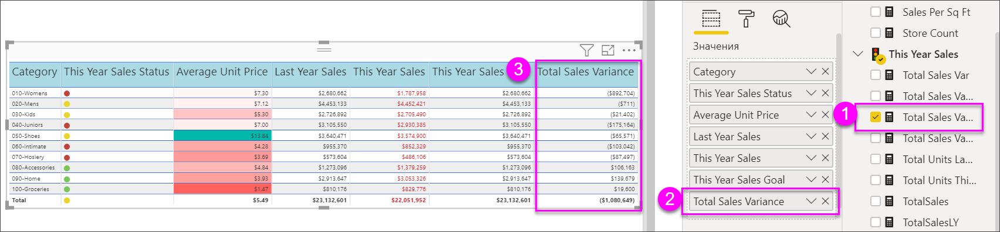
4. Добавьте условное форматирование для гистограмм. Для этого щелкните стрелку вниз рядом с полем **Суммарное отклонение продаж** и выберите **Условное форматирование > Гистограммы**.

    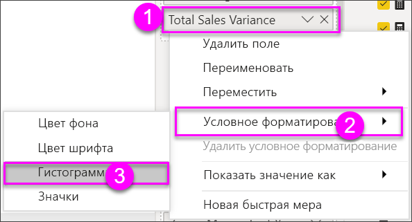
5. В появившемся диалоговом окне задайте цвета для параметров **Столбец с положительными значениями** и **Столбец с отрицательными значениями**, установите флажок **Показывать только столбец** и внесите необходимые изменения.

    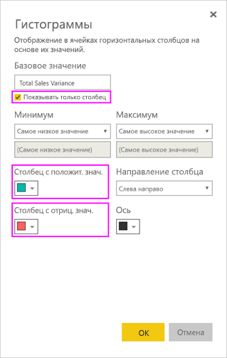

    Если нажать кнопку **ОК**, вместо числовых значений в таблице отобразятся гистограммы, что упростит проверку.

    
6. Чтобы удалить условное форматирование из визуализации, повторно щелкните правой кнопкой мыши поле и выберите пункт **Удалить условное форматирование**.

> [!TIP]
> Условное форматирование также доступно на панели форматирования (значок с изображением валика). Выберите значение для форматирования и **включите** параметры **Цветовая шкала** или **Гистограммы**, чтобы применить параметры по умолчанию, или щелкните **Дополнительные элементы управления**, чтобы настроить параметры.
> 
## Копирование значений из таблиц Power BI для использования в других приложениях

Таблица или матрица могут иметь содержимое, которое вы хотите использовать в других приложениях, например Dynamics CRM, Excel, или даже в других отчетах Power BI. Щелчком правой кнопки мыши в Power BI можно скопировать одну ячейку или набор ячеек в буфер обмена, чтобы вставить их в другое приложение.

* Чтобы скопировать значение из одной ячейки, выделите нужную ячейку, щелкните ее правой кнопкой мыши и выберите **Копировать значение**. Значение ячейки без формата помещается в буфер обмена, откуда его можно вставить в другое приложение.

    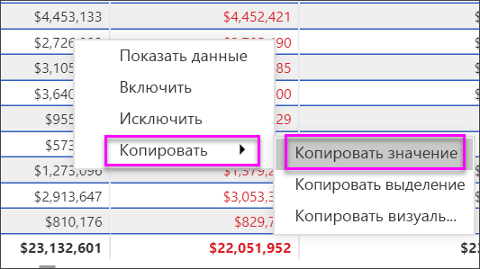

* Чтобы скопировать несколько ячеек сразу, выберите нужный диапазон ячеек или выберите несколько ячеек по очереди, удерживая клавишу CTRL. Такая копия будет содержать заголовки столбцов и строк.

    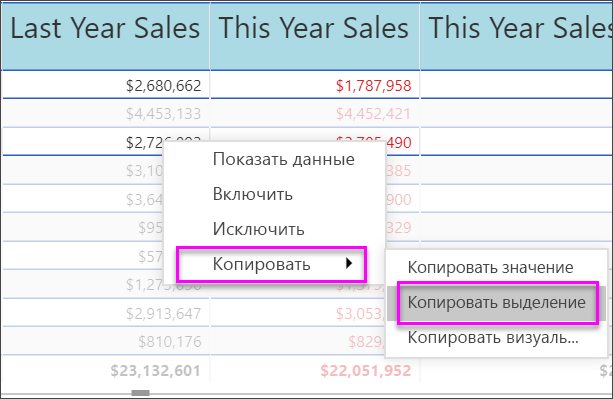

    Такая копия содержит заголовки столбцов и строк.

    

## Изменение ширины столбца в таблице
Иногда Power BI усекает заголовок столбца в отчете и на информационной панели. Чтобы отобразить имя столбца полностью, наведите указателем мыши на место справа от заголовка, чтобы появились двойные стрелки, а затем щелкните и перетащите столбец.

## Рекомендации и устранение неполадок
* При применении форматирования к столбцу для него можно выбрать только один вариант выравнивания: "Автоматически", "По левому краю", "По центру", "По правому краю". Как правило, столбец содержит или только текст, или только числа, но не и то и другое одновременно. Однако если столбец все же содержит и текст, и числа, при выборе варианта **Автоматически** текст выравнивается по левому краю, а числа — по правому. Такая возможность поддерживается для языков с порядком чтения слева направо.   

## Дальнейшие действия

[Древовидные диаграммы в Power BI](power-bi-visualization-treemaps.md)

[Типы визуализаций в Power BI](power-bi-visualization-types-for-reports-and-q-and-a.md)