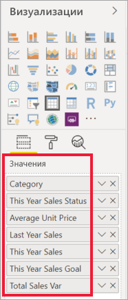
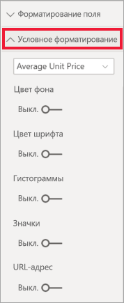
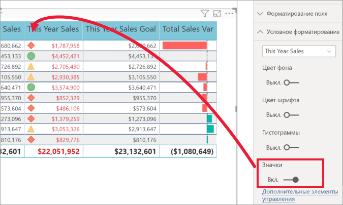

# Таблицы в отчетах и на панелях мониторинга Power BI

[!INCLUDE [power-bi-visuals-desktop-banner](../includes/power-bi-visuals-desktop-banner.md)]

Таблица — это сетка, содержащая связанные данные в логически упорядоченных строках и столбцах. Она также может содержать заголовки и строку с итогами. Таблицы хорошо подходят для количественного сравнения, где можно посмотреть разные значения одной категории. Например, в этой таблице показаны пять разных мер **категории**.

Создавайте таблицы в отчетах и применяйте перекрестное выделение элементов в таблице, используя другие визуальные элементы на той же странице отчета. Можно перекрестно выделять строки, столбцы и даже отдельные ячейки. Отдельные ячейки и несколько выбранных ячеек можно копировать и вставлять в другие приложения.

## Случаи использования таблицы

Таблицы отлично подходят для следующих задач:

* просмотра и сравнения подробных данных и точных значений (вместо визуального представления);

* отображения данных в табличном формате;

* отображения числовых данных по категориям.

## Необходимое условие

В этом руководстве используется пример PBIX-файла с примером [Анализ розничной торговли](https://download.microsoft.com/download/9/6/D/96DDC2FF-2568-491D-AAFA-AFDD6F763AE3/Retail%20Analysis%20Sample%20PBIX.pbix).

1. В верхнем левом разделе меню выберите **Файл** > **Открыть**.
   
2. Найдите свою копию PBIX-файла с примером **Анализ розничной торговли**.

1. Откройте PBIX-файл с примером **Анализ розничной торговли** в представлении отчета .

1. Выбрать  чтобы создать новую страницу.

## Создание таблицы

Мы создадим таблицу, показанную в начале статьи, для отображения общей суммы продаж по категории изделия.

1. На панели **Поля** выберите **Элемент** > **Категория**.

    Power BI автоматически создает таблицу, в которой перечислены все категории.

    

1. Выберите **Продажи > Средняя цена за единицу** и **Продажи> Продажи за прошлый год**

1. Затем выберите **Продажи> Продажи в этом году** и выберите все три варианта: **Значение**, **цель** и **состояние**.

1. В области **визуализации** найдите **значения** и выбирайте их, пока порядок столбцов диаграммы не будет соответствовать первому изображению на этой странице. При необходимости перетащите значения в нужное поле. Область **Значения** будет выглядеть следующим образом:

    

## Форматирование таблицы

Существует много способов форматирования таблицы. Здесь описаны лишь немногие. Чтобы больше узнать обо всех параметрах форматирования, откройте панель **форматирования** (значок с изображением валика ) и ознакомьтесь с ними.

* Попробуйте отформатировать сетку таблицы. Здесь вы добавите синюю вертикальную сетку, пространство для строк и увеличите размер контура и текста.

    

    

* Для заголовков столбцов мы изменим цвет фона, добавим контур и увеличим размер шрифта.

    

    

* Кроме того, вы можете применять форматирование к отдельным столбцам и заголовкам столбцов. Начните, развернув элемент **Форматирование поля** и выбрав столбец для форматирования в раскрывающемся списке. В зависимости от значения столбца, элемент **Поле форматирования** позволяет вам настраивать отображаемые единицы, цвет шрифта, число десятичных разрядов, фон, выравнивание и многое другое. Изменив параметры, решите, следует ли применять эти же параметры к заголовку и строке итогов.

    

    

* Вот так выглядит наша окончательная таблица после применения дополнительных параметров форматирования:

    

### Условное форматирование

*Условное форматирование* — это один из типов форматирования. Power BI может применять условное форматирование к любым полям, добавленным в контейнер **значений** области **Визуализации**.

С помощью условного форматирования в таблицах можно задать значки, URL-адреса, цвета фона и шрифта ячеек на основе значений ячеек, в том числе градиент цветов.

1. В области **Формат** откройте карточку **Условное форматирование**.

    

1. Выберите поле, которое нужно отформатировать, и переведите ползунок **Цвет фона** в положение "Вкл". Power BI применяет градиент в соответствии со значениями в столбце. Чтобы изменить цвета по умолчанию, выберите **Дополнительные элементы управления**.

    Выбрав параметр **Расхождение**, дополнительно можно настроить **центральное** значение.

    

    Применим пользовательское форматирование к нашим значениям в поле "Средняя цена за единицу". Установите флажок **Расхождение**, добавьте несколько цветов и нажмите кнопку **ОК**.

    
1. Добавьте новое поле в таблицу с положительными и отрицательными значениями. Последовательно выберите **Продажи > Суммарное отклонение продаж**.

    

1. Добавьте условное форматирование гистограммы, переведя ползунок **Гистограммы** в положение "Вкл".  

    

1. Чтобы настроить гистограммы, выберите **Дополнительные элементы управления**. В появившемся диалоговом окне задайте цвета для параметров **Столбец с положительными значениями** и **Столбец с отрицательными значениями**, выберите параметр **Показывать только столбец** и внесите необходимые изменения.

    

1. Выберите **ОК**.

    Вместо числовых значений в таблице отобразятся гистограммы, что упростит проверку.

    

1. Добавьте в таблицу визуальные подсказки с помощью *условных значков*.  В карточке **Условное форматирование** выберите в раскрывающемся списке пункт **Продажи за этот год**. Переведите ползунок **Значки** в положение **Вкл**.  Чтобы настроить значки, выберите **Дополнительные элементы управления**.

    

## Копирование значений из таблиц Power BI для использования в других приложениях

Таблица или матрица могут иметь содержимое, которое вы хотите использовать в других приложениях, например Dynamics CRM, Excel, или даже в других отчетах Power BI. Щелчком правой кнопки мыши внутри ячейки в Power BI можно скопировать данные одной ячейки или набора ячеек в буфер обмена, чтобы вставить их в другое приложение.

Чтобы скопировать значение одной ячейки:

1. выберите ячейку, которую нужно скопировать;

1. щелкните правой кнопки мыши внутри ячейки;

1. выберите **Копировать** > **Копировать значение**.

    

    Значение ячейки без формата помещается в буфер обмена, откуда его можно вставить в другое приложение.

Копирование нескольких ячеек.

1. Чтобы выбрать несколько ячеек сразу, выберите нужный диапазон ячеек или используйте клавишу **Ctrl**.

1. Щелкните правой кнопкой мыши внутри одной из выбранных ячеек.

1. Выберите **Копировать** > **Копировать выбранное**.

    

## Изменение ширины столбца в таблице

Иногда Power BI усекает заголовок столбца в отчете и на информационной панели. Чтобы отобразить имя столбца полностью, наведите указателем мыши на место справа от заголовка, чтобы появились двойные стрелки, а затем щелкните и перетащите столбец.

## Рекомендации и устранение неполадок

* При применении форматирования к столбцу для него можно выбрать только один вариант выравнивания: **Автоматически**, **По левому краю**, **По центру**, **По правому краю**. Как правило, столбец содержит или только текст, или только числа, но не и то и другое одновременно. Если столбец все же содержит и текст, и числа, при выборе варианта **Автоматически** текст выравнивается по левому краю, а числа — по правому. Такая возможность поддерживается для языков с порядком чтения слева направо.

* Если текстовые данные в ячейках или заголовках таблицы содержат символы новой строки, эти символы будут игнорироваться, если не включить перенос по словам в карточке панели форматирования, связанной с элементом. 

## Дальнейшие действия

* [Плоские деревья в Power BI](power-bi-visualization-treemaps.md)

* [Типы визуализаций в Power BI](power-bi-visualization-types-for-reports-and-q-and-a.md)
