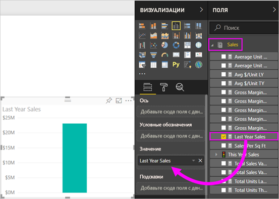
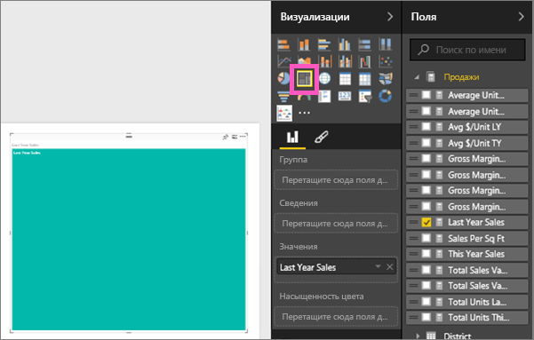

# Древовидные диаграммы в Power BI
Диаграмма дерево отображает иерархические данные в виде набора вложенных прямоугольников.  Каждый уровень иерархии представлен цветным прямоугольником (часто называемом ветвью), который содержит другие прямоугольники (листья).  Пространство внутри каждого прямоугольника выделяется на основе измеряемого значения. Прямоугольники упорядочиваются по размеру: от верхнего левого (самый большой) до нижнего правого (самый маленький).

Например, при анализе продаж будут создаваться прямоугольники верхнего уровня, которые называются *ветви*, для категорий одежды: **Urban** (Городской стиль), **Rural** (Деревенский стиль), **Youth** (Молодежный стиль) и **Mix** (Смешанный стиль).  Прямоугольники категорий будут содержать прямоугольники меньшего размера — *листья*, для производителей одежды в рамках категорий. Размер и заливка этих мелких прямоугольников будут основываться на объемах продаж.  

В ветви **Urban** (городской стиль) продано много одежды `Maximus`, меньше `Natura` и `Fama` и очень мало `Leo`.  Таким образом, ветвь **Urban** древовидной диаграммы будет содержать:
* самый большой прямоугольник для `Maximus` (в верхнем левом углу),
* чуть меньшие прямоугольники для `Natura` и `Fama`,
* много других прямоугольников, представляющих прочие категории, и 
* маленький прямоугольник для `Leo`.  

Итак, мы можем сравнить количество проданных товаров в разных группах, сравнив размер и заливку каждого листового узла: чем больше размер прямоугольника и темнее заливка, тем больше значение.

## Сферы применения диаграмм дерева
Диаграмма дерево отлично подходит:

* для отображения больших объемов иерархических данных;
* когда линейчатая диаграмма не может эффективно обрабатывать большое количество значений;
* для отображения пропорций между каждой частью и целым;
* для отображения шаблонов распределения показателя на каждом уровне категорий в иерархии;
* для отображения атрибутов путем кодирования по размеру и цвету;
* для выделения шаблонов, выпадающих показателей, наиболее важных участников и исключений.

### Предварительные требования
 - Служба Power BI или Power BI Desktop
 - Анализ розничной торговли — пример

## Создание простой диаграммы дерева
Хотите сначала посмотреть демонстрацию создания диаграммы дерева?  Перейдите к отметке 2:10 в этом видео, чтобы посмотреть, как Аманда создает диаграмму дерева.

<iframe width="560" height="315" src="https://www.youtube.com/embed/IkJda4O7oGs" frameborder="0" allowfullscreen></iframe>

Или создайте собственную диаграмму. Здесь используется пример "Анализ розничной торговли". Для выполнения этой процедуры войдите в службу Power BI и выберите **Получить данные \> Примеры \> Пример анализа розничной торговли \> Подключиться \> Перейти к панели мониторинга**. Чтобы создавать визуализации в отчете, требуются разрешения на изменение для набора данных и отчета. К счастью, примеры Power BI можно редактировать. Но нельзя добавлять визуализацию в отчет, которым кто-то поделился с вами.  

1. Выберите плитку Total Stores (Всего магазинов), чтобы открыть отчет "Анализ розничной торговли — пример".    
2. Откройте [режим правки](../service-interact-with-a-report-in-editing-view.md) и выберите **Продажи** > **Продажи за последний год**.   
      
3. Преобразуйте диаграмму в диаграмму дерева.  
      
4. Перетащите поле **Item** > **Category** (Элемент > Категория) в область **Группа**. Power BI создаст диаграмму дерева, в которой размер прямоугольников отражает общий объем продаж, а цвет представляет категорию.  По существу, вы создали иерархию, которая визуально описывает относительный размер общего объема продаж по категориям.  Категория мужской одежды **Men** имеет самый большой объем продаж, а категория трикотажа **Hosiery** — самый маленький.   
      
5. Перетащите поле **Store** > **Chain** (Магазин > Сеть) в область **Сведения**, чтобы завершить создание диаграммы. Теперь можно сравнить продажи за прошлый год по категориям и сетям магазинов.   
   
   
   > [!NOTE]
   > Параметры "Насыщенность цвета" и "Сведения" невозможно использовать одновременно.
   > 
   > 
5. Наведите указатель на заголовок **Chain** (Сеть магазинов), чтобы увидеть подсказку для этой части области **Category**(Категория).  Например, при наведении курсора на **Fashions Direct** в прямоугольнике **090-Home** всплывает подсказка для части Fashion Direct категории Home.  
   
6. [Добавьте диаграмму дерева как плитку на панель мониторинга (закрепите визуальный элемент)](../service-dashboard-tiles.md). 
7. [Сохраните отчет](../service-report-save.md).

## Выделение и перекрестная фильтрация
Сведения об использовании области "Фильтры" см. в разделе [Добавление фильтра в отчет](../power-bi-report-add-filter.md).

Теперь можно выделить категорию или сведения в дереве диаграммы для перекрестного выделения и фильтрации других визуализаций на странице отчета и наоборот. Можно добавить еще несколько визуальных элементов на ту же страницу либо скопировать диаграмму дерева на страницу, на которой уже есть другие элементы.

1. На диаграмме дерева выберите категорию или сеть магазинов в категории.  Это приведет к перекрестному выделению других визуализаций на странице. Например, при выборе категории **050-Shoes**(050-обувь) станет ясно, что продажи за последний год в категории "Обувь" составили 3 640 471 долл., а доля Fashions Direct составила 2 174 185 долл.  
   

2. В круговой диаграмме **Last Year Sales by Chain** (Продажи за прошлый год по сети магазинов) выберите сектор **Fashions Direct**, чтобы перекрестно фильтровать диаграмму в виде дерева.  
       

3. Сведения о том, как настроить параметры перекрестного выделения и фильтрации диаграмм, см. в статье [Visualization interactions in a Power BI report](../service-reports-visual-interactions.md) (Взаимодействия визуализаций в отчете Power BI).

## Дальнейшие действия

[Каскадные диаграммы в Power BI](power-bi-visualization-waterfall-charts.md)

[Типы визуализаций в Power BI](power-bi-visualization-types-for-reports-and-q-and-a.md)