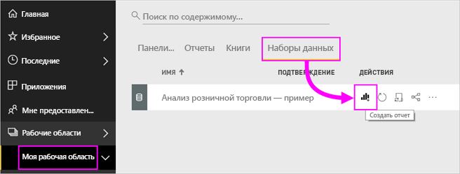

# Древовидные диаграммы в Power BI

Диаграмма дерево отображает иерархические данные в виде набора вложенных прямоугольников. Каждый уровень иерархии представлен цветным прямоугольником (ветвь), содержащим прямоугольники меньшего размера (листья). Power BI задает размер пространства внутри каждого прямоугольника на основе измеренного значения. Прямоугольники упорядочиваются по размеру: от верхнего левого (самый большой) до нижнего правого (самый маленький).

Например, при анализе продаж у вас могут быть ветки верхнего уровня для категорий одежды: **Urban** (Городской стиль), **Rural** (Деревенский стиль), **Youth** (Молодежный стиль) и **Mix** (Смешанный стиль). Power BI разделит прямоугольники вашей категории на листья для производителей одежды в этой категории. Размер и заливка этих мелких прямоугольников будут основываться на объемах продаж.

В ветви **Urban** продано много одежды **VanArsdel**. Меньше было продано одежды**Natura** и **Fama**. И лишь несколько вещей было продано марки **Leo**. Таким образом, ветвь **Urban** на дереве содержит:

* Самый большой прямоугольник с именем **VanArsdel** в левом верхнем углу.

* Меньшие по размеру прямоугольники с именами **Natura** и **Fama**.

* Много других прямоугольников, представляющих прочие категории.

* Мелкий прямоугольник с именем **Leo**.

Итак, мы можем сравнить количество проданных товаров в разных группах, сравнив размер и заливку каждого листового узла: чем больше размер прямоугольника и темнее заливка, тем больше значение.

Хотите сначала посмотреть демонстрацию создания диаграммы дерева? Перейдите к отметке 2:10 в этом видео, чтобы посмотреть, как Аманда создает диаграмму дерева.

<iframe width="560" height="315" src="https://www.youtube.com/embed/IkJda4O7oGs" frameborder="0" allowfullscreen></iframe>

## Сферы применения диаграмм дерева

Диаграмма дерево отлично подходит:

* для отображения больших объемов иерархических данных;

* когда линейчатая диаграмма не может эффективно обрабатывать большое количество значений;

* для отображения пропорций между каждой частью и целым;

* для отображения шаблонов распределения показателя на каждом уровне категорий в иерархии;

* для отображения атрибутов путем кодирования по размеру и цвету;

* для выделения шаблонов, выбросов, наиболее важных участников и исключений.

## Предварительные требования

* Служба Power BI или Power BI Desktop

* Пример отчета "Анализ розничной торговли"

## Получение примера отчета "Анализ розничной торговли"

Здесь используется пример "Анализ розничной торговли". Чтобы создать визуализацию, требуются разрешения на изменение для набора данных и отчета. К счастью, все примеры Power BI можно редактировать. Если кто-то совместно с вами использует отчет, вы не сможете создавать визуализации в отчетах. Чтобы продолжить работу, получите [отчет примера "Анализ розничной торговли"](../sample-datasets.md).

После получения набора данных **примера "Анализ розничной торговли"** вы сможете приступить к работе.

## Создание простой диаграммы дерева

Вы создаете отчет и добавляете простую диаграмму "дерево".

1. В **Моей рабочей области** выберите **Наборы данных** > **Создать отчет**.

    

1. В области **Поля** выберите меру **Продажи** > **Продажи за прошлый год**.

   

1. Выберите значок диаграммы "дерево"  для преобразования диаграммы в диаграмму "дерево".

   

1. Перетащите поле **Item** > **Category** (Элемент > Категория) в область **Группа**.

    Power BI создаст диаграмму дерева, в которой размер прямоугольников отражает общий объем продаж, а цвет представляет категорию. По существу, вы создали иерархию, которая визуально описывает относительный размер общего объема продаж по категориям. Категория мужской одежды **Men** имеет самый большой объем продаж, а категория трикотажа **Hosiery** — самый маленький.

    

1. Перетащите поле **Store** > **Chain** (Магазин > Сеть) в область **Сведения**, чтобы завершить создание диаграммы. Теперь можно сравнить продажи за прошлый год по категориям и сетям магазинов.

   

   > [!NOTE]
   > Параметры "Насыщенность цвета" и "Сведения" невозможно использовать одновременно.

1. Наведите указатель на заголовок **Chain** (Сеть магазинов), чтобы увидеть подсказку для этой части области **Category**(Категория).

    Например, при наведении курсора на **Fashions Direct** в прямоугольнике **090-Home** всплывает подсказка для части Fashion Direct категории Home.

   

1. Добавьте диаграмму "дерево" как [плитку панели мониторинга (закрепите визуальный элемент)](../service-dashboard-tiles.md).

1. Сохраните [отчет](../service-report-save.md).

## Выделение и перекрестная фильтрация

Сведения об использовании области **Фильтры** см. в статье [Добавление фильтра в отчет](../power-bi-report-add-filter.md).

Выделите **Category** (Категория) или **Detail** (Сведения) в диаграмме "дерево" для перекрестной фильтрации и других визуализаций на странице отчета и наоборот. Чтобы продолжить, добавьте несколько визуальных элементов на эту же страницу либо скопируйте диаграмму "дерево" на одну из других страниц этого отчета.

1. На диаграмме "дерево" выберите **Category** (Категория) или **Chain** (Цепочка магазинов) в области **Category** (Категория). Это приведет к перекрестному выделению других визуализаций на странице. Например, при выборе категории **050-Shoes** видно, что продажи за последний год в категории "Обувь" составили **3 640 471 долл. США**, а доля продаж в категории**Fashions Direct** составила **2 174 185 долл. США**.

   

1. В круговой диаграмме **Last Year Sales by Chain** (Продажи за прошлый год по сети магазинов) выберите сектор **Fashions Direct**, чтобы перекрестно фильтровать диаграмму в виде дерева.
   

1. Подробности о настройке перекрестной фильтрации в диаграммах см. в статье [Visualization interactions in a Power BI report](../service-reports-visual-interactions.md) (Взаимодействия визуализаций в отчете Power BI).

## Дальнейшие действия

* [Каскадные диаграммы в Power BI](power-bi-visualization-waterfall-charts.md)

* [Типы визуализаций в Power BI](power-bi-visualization-types-for-reports-and-q-and-a.md)
