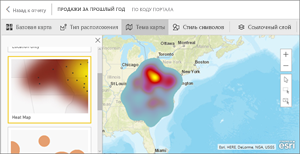
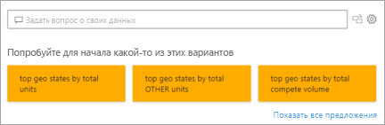
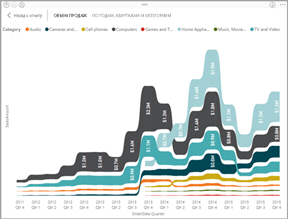
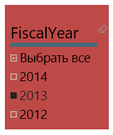
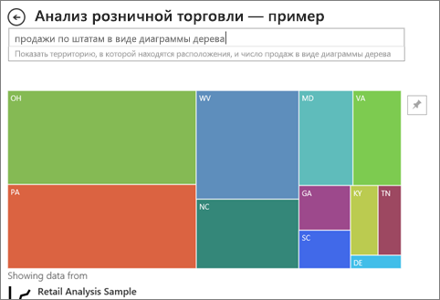

# Типы визуализаций в Power BI
## Визуализации Power BI
Постепенно мы будем добавлять новые визуализации, следите за обновлениями!

Перейдите в [Microsoft AppSource](https://appsource.microsoft.com/marketplace/apps?product=power-bi-visuals), где находится постоянно пополняющийся список [ пользовательских визуальных элементов](../developer/power-bi-custom-visuals.md), которые можно скачать и использовать в своих панелях мониторинга и отчетах. Чувствуете творческий порыв? [Узнайте, как создавать свои собственные визуальные элементы и добавлять их на сайт сообщества](../developer/office-store.md).  

## Список визуализаций, доступных в Power BI
Все эти представления могут быть добавлены в отчеты Power BI, указанные в вопросах и ответах, и закреплены на панелях мониторинга.

### Диаграммы с областями: базовые (многоуровневые) и с накоплением

>[!TIP]
>Базовая диаграмма с областями основана на графике, у которого заполнена область между осью и линией графика.

Дополнительные сведения см. в статье [Простые диаграммы с областями](power-bi-visualization-basic-area-chart.md).

### Линейчатые диаграммы и гистограммы

 

>[!TIP]
>Линейчатые диаграммы лучше всего подходят для рассмотрения определенного значения по разным категориям.

### Карточки: многострочные

### Карточки: с одним числом

Дополнительные сведения см. в статье [Визуализация карточек](power-bi-visualization-card.md).

### Комбинированные диаграммы

>[!TIP]
>Комбинированная диаграмма сочетает в себе гистограмму и график. Выберите *Линейную гистограмму и гистограмму с накоплением* или *Линейную гистограмму и гистограмму с группировкой*.

Дополнительные сведения см. в статье [Комбинированная диаграмма в Power BI](power-bi-visualization-combo-chart.md).

### Кольцевые диаграммы

>[!TIP]
>Кольцевые диаграммы похожи на круговые диаграммы.  Они показывают отношение частей к целому.

Дополнительные сведения см. в статье [Кольцевые диаграммы в Power BI](power-bi-visualization-doughnut-charts.md).

### Воронкообразные диаграммы

>[!TIP]
>Воронкообразные диаграммы помогают визуализировать процесс, состоящий из этапов, в котором элементы последовательно переходят от одного этапа к другому.  Используйте воронкообразные диаграммы, когда между этапами запускается поток операций, например процесса продаж, который начинается с интересов и заканчивается осуществлением покупки.

Дополнительные сведения см. в статье [Воронкообразные диаграммы](power-bi-visualization-funnel-charts.md).

### Индикаторные диаграммы

>[!TIP]
>Отображает текущее состояние в контексте цели.

Дополнительные сведения см. в статье [Диаграммы "Радиальный датчик" в Power BI](power-bi-visualization-radial-gauge-charts.md).

### Диаграмма ключевых факторов влияния

Диаграмма ключевых факторов влияния показывает главных участников влияния на выбранный результат или значение.

Дополнительные сведения см. в статье [Диаграммы ключевых факторов влияния в Power BI](power-bi-visualization-influencers.md).

### Ключевые показатели эффективности

>[!TIP]
>Отображает ход достижения измеримой цели.

Дополнительные сведения см. в статье [Визуальные элементы КПЭ](power-bi-visualization-kpi.md).

### Графики

>[!TIP]
>Подчеркивает общую форму целой последовательности значений, обычно в зависимости от времени.

### Карты: базовые

>[!TIP]
>Используются для сопоставления информации о категориях и количественной информации с пространственными расположениями.

Дополнительные сведения см. в разделе [Советы и рекомендации для визуализаций карт Power BI](power-bi-map-tips-and-tricks.md).

### Карты: карты ArcGIS;

Дополнительные сведения см. в статье[ Карты ArcGIS от ESRI в службе Power BI и Power BI Desktop](power-bi-visualization-arcgis.md).

### Карты: фоновые картограммы

>[!TIP]
>Чем насыщеннее цвет, тем больше значение.

Дополнительные сведения см. в статье [Картограммы (хороплеты) в Power BI](power-bi-visualization-filled-maps-choropleths.md).

### Карты: карты фигур

>[!TIP]
>Сравнение регионов по цвету.

Дополнительные сведения см. в статье [Карты фигур в Power BI Desktop (предварительная версия)](desktop-shape-map.md).

### Матрица

>[!TIP]
>Таблица поддерживает два измерения, но матрица упрощает содержательное отображение данных по нескольким измерениям благодаря поддержке ступенчатого макета. Матрица автоматически агрегирует данные и обеспечивает их детализацию. 

Дополнительные сведения см. в статье [Использование визуального элемента "Матрица" в Power BI Desktop](desktop-matrix-visual.md).

### Круговые диаграммы

>[!TIP]
>Круговые диаграммы показывают отношение частей к целому. 

### "Вопросы и ответы": визуализация

>[!TIP]
>Как и [интерфейс вопросов и ответов на панелях мониторинга](../power-bi-tutorial-q-and-a.md), визуальный элемент вопросов и ответов позволяет задавать вопросы о данных с помощью естественного языка. 

Дополнительные сведения см. в статье [Визуальные элементы вопросов и ответов в Power BI](power-bi-visualization-q-and-a.md).

### Визуальные элементы скриптов R

>[!TIP]
>Такие элементы, часто называются *визуальными элементами R*, могут использоваться для расширенного форматирования и анализа данных, например прогнозирования, с помощью передовых средств аналитики и визуализации языка R. Визуальные элементы R можно создать в Power BI Desktop и опубликовать в службе Power BI.   

Дополнительные сведения см. в статье [Визуальные элементы R в Power BI](service-r-visuals.md).

### Ленточная диаграмма

>[!TIP]
>Ленточные диаграммы показывают, какая категория данных имеет наивысший ранг (самое большое значение). Ленточные диаграммы лучше всего подходят для отображения изменений ранга. Наивысший ранг (значение) за каждый период времени всегда отображается в верхней части диаграммы.

Дополнительные сведения см. в статье [Использование ленточных диаграмм в Power BI](desktop-ribbon-charts.md).

### Точечные и пузырьковые диаграммы

>[!TIP]
>Отображают отношения между 2 (точечные) или 3 (пузырьковые) количественными показателями — существуют или нет, в каком порядке и т. д.

Дополнительные сведения см. в статье [Точечные и пузырьковые диаграммы в Power BI](power-bi-visualization-scatter.md).

### Точечная диаграмма высокой плотности

>[!TIP]
>Слишком большое число точек данных в визуальном элементе может затормозить его работу, поэтому для обеспечения точности визуализации используется сложный алгоритм выборки.

Дополнительные сведения см. в статье [High-density sampling in Power BI scatter charts](desktop-high-density-scatter-charts.md) (Выборка с высокой плотностью на точечных диаграммах в Power BI).

### Срезы

Дополнительные сведения см. в статье [Срезы в Power BI](power-bi-visualization-slicers.md).

### Автономные изображения

Дополнительные сведения см. в статье [Добавление изображения на панель мониторинга](../service-dashboard-add-widget.md).

### Таблицы

>[!TIP]
>Хорошо подходят для количественного сравнения элементов при большом числе категорий.

Дополнительные сведения см. в статье [Работа с таблицами в отчетах и на информационных панелях Power BI (руководство)](power-bi-visualization-tables.md).

### Диаграммы дерева

Дополнительные сведения см. в статье [Древовидные диаграммы в Power BI](power-bi-visualization-treemaps.md).

>[!TIP]
>Это диаграммы из цветных прямоугольников, размер которых соответствует значению.  Они могут иметь иерархическую структуру, в которой прямоугольники вкладываются в основные прямоугольники.

### Каскадные диаграммы

>[!TIP]
>Каскадные диаграммы показывают промежуточный итог по мере сложения или вычитания значений.

Дополнительные сведения см. в статье [Каскадные диаграммы в Power BI](power-bi-visualization-waterfall-charts.md).

## Назначение используемой визуализации для вопросов и ответов
При вводе запросов на естественном языке с помощью вопросов и ответов Power BI можно указать тип визуализации в запросе.  Например:

"***продажи по штатам в виде плоского дерева***"

## Дальнейшие действия
[Визуализации в Power BI](power-bi-report-visualizations.md)    
[THE RIGHT VISUAL REFERENCE FOR POWER BI - MAY 2017](https://www.sqlbi.com/wp-content/uploads/videotrainings/dashboarddesign/visuals-reference-may2017-A3.pdf) (Правильные визуальные объекты для Power BI. Май 2017 г.)