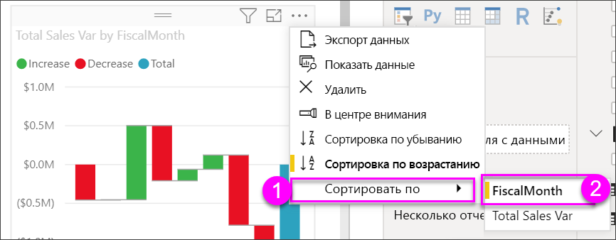

# Каскадные диаграммы в Power BI

[!INCLUDE [power-bi-visuals-desktop-banner](../includes/power-bi-visuals-desktop-banner.md)]

Каскадные диаграммы отражают промежуточные итоги того, как Power BI складывает и вычитает значения. Они полезны для понимания того, как влияет ряд положительных и отрицательных изменений на начальную стоимость (например, чистую прибыль).

Столбцы имеют цветовую маркировку, поэтому можно быстро заметить увеличение и уменьшение. Столбцы начального и конечного значения часто [начинаются на горизонтальной оси](https://support.office.com/article/Create-a-waterfall-chart-in-Office-2016-for-Windows-8de1ece4-ff21-4d37-acd7-546f5527f185#BKMK_Float "начало на горизонтальной оси"), тогда как промежуточные значения представлены плавающими столбцами. Из-за такого стиля каскадные диаграммы также называют мостовыми диаграммами.

   > [!NOTE]
   > В этом видео используется более старая версия Power BI Desktop.
   > 
   > 

<iframe width="560" height="315" src="https://www.youtube.com/embed/qKRZPBnaUXM" frameborder="0" allow="autoplay; encrypted-media" allowfullscreen></iframe>

## Сферы применения каскадной диаграммы

Каскадная диаграмма отлично подходит:

* при наличии изменений для показателя по временным рядам или разным категориям;

* для отслеживания основных изменений, влияющих на общее значение;

* для построения графика годовой прибыли компании путем отображения различных источников дохода и получения общей прибыли (или убытков);

* для демонстрации начального и конечного количества сотрудников компании за год;

* для визуализации поступлений и затрат по месяцам и текущего баланса для вашего счета.

## Необходимое условие

В этом руководстве используется пример PBIX-файла с примером [Анализ розничной торговли](http://download.microsoft.com/download/9/6/D/96DDC2FF-2568-491D-AAFA-AFDD6F763AE3/Retail%20Analysis%20Sample%20PBIX.pbix).

1. В верхнем левом разделе меню выберите **Файл** > **Открыть**.
   
2. Найдите свою копию PBIX-файла с примером **Анализ розничной торговли**.

1. Откройте PBIX-файл с примером **Анализ розничной торговли** в представлении отчета .

1. Выбрать  чтобы создать новую страницу.

## Создание каскадной диаграммы

Вы создаете каскадную диаграмму, отображающую расхождение в объемах продаж (оценочный и фактический объем продаж) по месяцам.

1. В области **Поля** выберите **Продажи**  > **Суммарное отклонение продаж**.

   

1. Выберите значок каскадной диаграммы 

    

1. Выберите **Время** > **Финансовый месяц**, чтобы добавить время в область **Категория**.

    

1. Убедитесь, что Power BI отсортировала каскадную диаграмму в хронологическом порядке. Щелкните **Дополнительные параметры** (...) в правом верхнем углу диаграммы.

    В этом примере будет использоваться **Сортировка по возрастанию**.

    Убедитесь, что слева от параметра **Сортировка по возрастанию** имеется желтый индикатор. Это означает, что выбранный параметр применяется.

    

    Затем нужно нажать кнопку **Сортировка** и выбрать **Финансовый месяц**; как и в предыдущем шаге, желтый индикатор рядом с выбранным параметром указывает, когда он применяется.

    

    Можно также просмотреть значения оси X и увидеть, что они расположены в порядке с **Янв** по **Авг**.

    Подробно изучите данные, чтобы увидеть, что больше всего влияет на изменения по месяцам.

1.  Выберите **Магазин** > **Территория**, чтобы добавить **территорию** в контейнер **Распределение**.

    

    По умолчанию в Power BI добавлены 5 факторов, влияющих на увеличение или уменьшение объема продаж по месяцам. На приведенном ниже рисунке область визуализации расширена для включения дополнительных данных. 

    

    Для вас представляют интерес только два основных влияющих фактора.

1. В области **Формат** выберите **Распределение** и задайте для параметра **максимальное число распределений** значение **2**.

    

    Краткий обзор показывает, что территории штатов Огайо и Пенсильвания больше всего влияют на положительные и отрицательные изменения на каскадной диаграмме.

    

## Дальнейшие действия

* [Изменение способа взаимодействия визуальных элементов в отчете Power BI](../service-reports-visual-interactions.md)

* [Типы визуализаций в Power BI](power-bi-visualization-types-for-reports-and-q-and-a.md)
