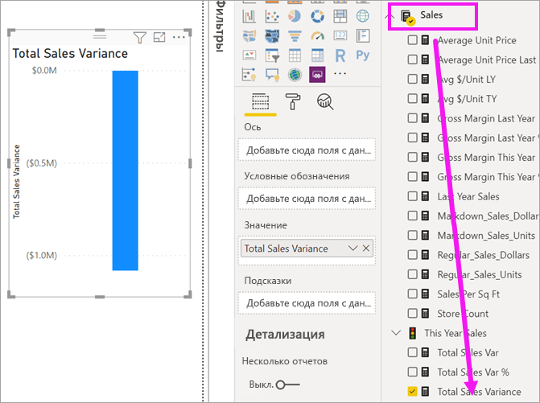
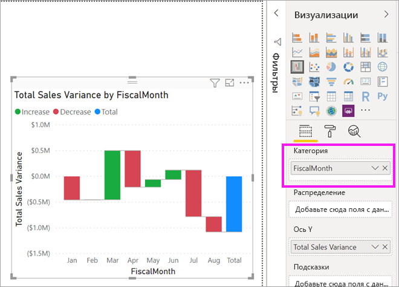
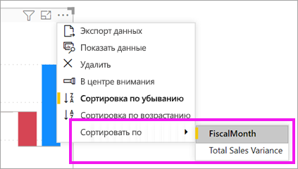
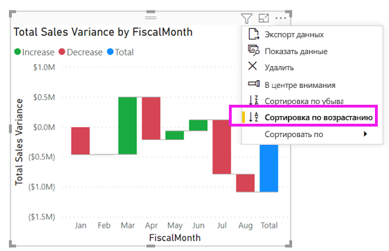
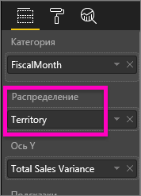
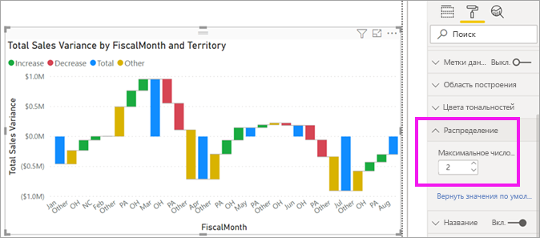

# Каскадные диаграммы в Power BI

[!INCLUDE[consumer-appliesto-nyyn](../includes/consumer-appliesto-nyyn.md)]

[!INCLUDE [power-bi-visuals-desktop-banner](../includes/power-bi-visuals-desktop-banner.md)]

Каскадные диаграммы отражают промежуточные итоги того, как Power BI складывает и вычитает значения. Они полезны для понимания того, как влияет ряд положительных и отрицательных изменений на начальную стоимость (например, чистую прибыль).

Столбцы имеют цветовую маркировку, поэтому можно быстро заметить увеличение и уменьшение. Столбцы начального и конечного значения часто [начинаются на горизонтальной оси](https://support.office.com/article/Create-a-waterfall-chart-in-Office-2016-for-Windows-8de1ece4-ff21-4d37-acd7-546f5527f185#BKMK_Float "начало на горизонтальной оси"), тогда как промежуточные значения представлены плавающими столбцами. Из-за такого стиля каскадные диаграммы также называют мостовыми диаграммами.

## Сферы применения каскадной диаграммы

Каскадная диаграмма отлично подходит:

* при наличии изменений для показателя по временным рядам или разным категориям;

* для отслеживания основных изменений, влияющих на общее значение;

* для построения графика годовой прибыли компании путем отображения различных источников дохода и получения общей прибыли (или убытков);

* для демонстрации начального и конечного количества сотрудников компании за год;

* для визуализации поступлений и затрат по месяцам и текущего баланса для вашего счета.

## Необходимое условие

В этом руководстве используется пример PBIX-файла с примером [Анализ розничной торговли](https://download.microsoft.com/download/9/6/D/96DDC2FF-2568-491D-AAFA-AFDD6F763AE3/Retail%20Analysis%20Sample%20PBIX.pbix).

1. В верхнем левом разделе меню выберите **Файл** > **Открыть**.
   
2. Найдите свою копию PBIX-файла с примером **Анализ розничной торговли**.

1. Откройте PBIX-файл с примером **Анализ розничной торговли** в представлении отчета .

1. Выбрать  чтобы создать новую страницу.

> [!NOTE]
> Для предоставления общего доступа к отчету Power BI и вам, и коллеге необходимо иметь отдельные лицензии Power BI Pro или сохранить отчет в емкости Премиум.    

## Создание каскадной диаграммы

Вы создаете каскадную диаграмму, отображающую расхождение в объемах продаж (оценочный и фактический объем продаж) по месяцам.

### Создание каскадной диаграммы

1. В области **Поля** выберите **Продажи**  > **Суммарное отклонение продаж**.

   

1. Выберите значок каскадной диаграммы 

    

1. Выберите **Время** > **Финансовый месяц**, чтобы добавить время в область **Категория**.

    

### Сортировка каскадной диаграммы

1. Убедитесь в том, что Power BI сортирует каскадную диаграмму в хронологическом порядке по месяцам. Щелкните **Дополнительные параметры** (...) в правом верхнем углу диаграммы.

    Для этого примера выберите **Сортировать по**, а затем выберите **Финансовый месяц**. Желтый индикатор рядом с выбранным параметром указывает, когда он применяется.

    
    
    Чтобы отобразить месяцы в хронологическом порядке, выберите пункт **Сортировка по возрастанию**. Так же как и на предыдущем шаге, убедитесь в том, что слева от параметра **Сортировка по возрастанию** имеется желтый индикатор. Это означает, что выбранный параметр применяется.

    

    

    Обратите внимание, что диаграмма отсортирована по полю "Финансовый месяц" от января до августа.  

### Изучение каскадной диаграммы

Подробно изучите данные, чтобы увидеть, что больше всего влияет на изменения по месяцам.

1.  Выберите **Магазин** > **Территория**, чтобы добавить **территорию** в контейнер **Распределение**.

    

    Power BI использует значение из контейнера **Распределение** для добавления дополнительных данных в визуализацию. Добавляются пять основных факторов, влияющих на увеличение или уменьшение объема продаж в каждом финансовом месяце. Это означает, что, например, в феврале теперь шесть точек данных, а не всего одна.  

    

    Допустим, для вас представляют интерес только два основных фактора влияния.

1. В области **Формат** выберите **Распределение** и задайте для параметра **максимальное число распределений** значение **2**.

    

    Краткий обзор показывает, что территории штатов Огайо и Пенсильвания больше всего влияют на положительные и отрицательные изменения на каскадной диаграмме.

    

## Дальнейшие действия

* [Изменение способа взаимодействия визуальных элементов в отчете Power BI](../create-reports/service-reports-visual-interactions.md)

* [Типы визуализаций в Power BI](power-bi-visualization-types-for-reports-and-q-and-a.md)

