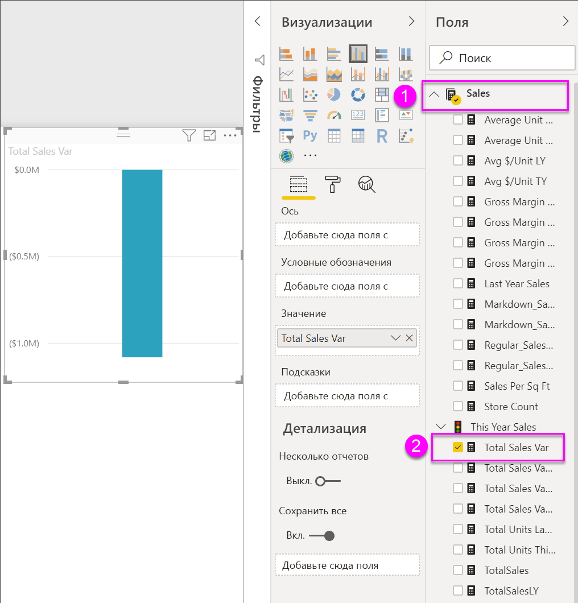
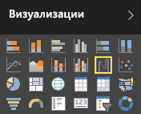
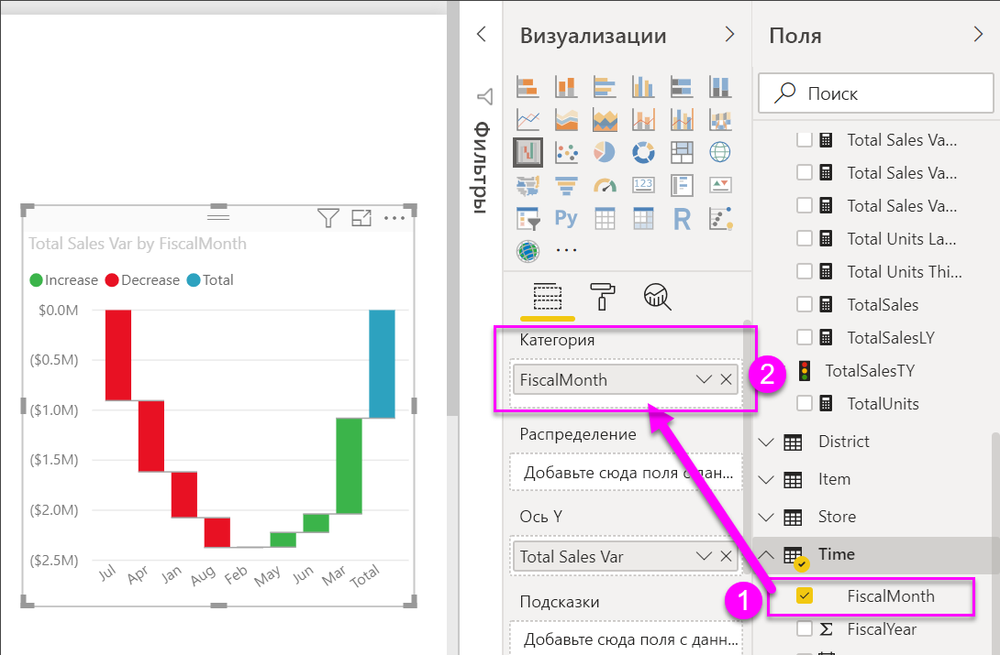
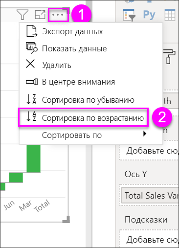
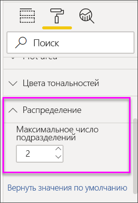

# Каскадные диаграммы в Power BI

Каскадные диаграммы отражают промежуточные итоги того, как Power BI складывает и вычитает значения. Они полезны для понимания того, как влияет ряд положительных и отрицательных изменений на начальную стоимость (например, чистую прибыль).

Столбцы имеют цветовую маркировку, поэтому можно быстро заметить увеличение и уменьшение. Столбцы начального и конечного значения часто [начинаются на горизонтальной оси](https://support.office.com/article/Create-a-waterfall-chart-in-Office-2016-for-Windows-8de1ece4-ff21-4d37-acd7-546f5527f185#BKMK_Float "начинаются на горизонтальной оси"), тогда как промежуточные значения представлены плавающими столбцами. Из-за такого стиля каскадные диаграммы также называют мостовыми диаграммами.

<iframe width="560" height="315" src="https://www.youtube.com/embed/qKRZPBnaUXM" frameborder="0" allow="autoplay; encrypted-media" allowfullscreen></iframe>

## Сферы применения каскадной диаграммы

Каскадная диаграмма отлично подходит:

* при наличии изменений для показателя по временным рядам или разным категориям;

* для отслеживания основных изменений, влияющих на общее значение;

* для построения графика годовой прибыли компании путем отображения различных источников дохода и получения общей прибыли (или убытков);

* для демонстрации начального и конечного количества сотрудников компании за год;

* для визуализации поступлений и затрат по месяцам и текущего баланса для вашего счета.

## Предварительные требования

* Служба Power BI или Power BI Desktop

* Пример отчета "Анализ розничной торговли"

## Получение примера отчета "Анализ розничной торговли"

Здесь используется пример "Анализ розничной торговли". Чтобы создать визуализацию, требуются разрешения на изменение для набора данных и отчета. К счастью, все примеры Power BI можно редактировать. Если кто-то совместно с вами использует отчет, вы не сможете создавать визуализации в отчетах. Чтобы продолжить работу, получите [отчет примера "Анализ розничной торговли"](../sample-datasets.md).

После получения набора данных **примера "Анализ розничной торговли"** вы сможете приступить к работе.

## Создание каскадной диаграммы

Вы создаете каскадную диаграмму, отображающую расхождение в объемах продаж (оценочный и фактический объем продаж) по месяцам.

1. В **Моей рабочей области** выберите **Наборы данных** > **Создать отчет**.

    

1. В области **Поля** выберите **Продажи**  > **Суммарное отклонение продаж**.

   

1. Выберите значок каскадной диаграммы  для преобразования диаграммы в диаграмму "дерево".

    Если **Суммарное отклонение продаж** не попадает в область **Ось Y**, перетащите его туда.

    

1. Выберите **Время** > **Финансовый месяц**, чтобы добавить время в область **Категория**.

    

1. Убедитесь, что Power BI отсортировала каскадную диаграмму в хронологическом порядке. Щелкните значок многоточия в правом верхнем углу диаграммы.

    Убедитесь, что слева от параметров **Сортировка по возрастанию** и **Финансовый месяц** имеется желтый индикатор.

    

    Можно также просмотреть значения оси X и увидеть, что они расположены в порядке с **Янв** по **Авг**.

    Подробно изучите данные, чтобы увидеть, что больше всего влияет на изменения по месяцам.

1. Перетащите **Магазин** > **Территория** в контейнер **Распределение**.

    

    По умолчанию в Power BI добавлены 5 факторов, влияющих на увеличение или уменьшение объема продаж по месяцам.

    

    Для вас представляют интерес только два основных влияющих фактора.

1. В области **Формат** выберите **Распределение** и задайте для параметра **максимальное число распределений** значение **2**.

    

    Краткий обзор показывает, что территории штатов Огайо и Пенсильвания больше всего влияют на положительные и отрицательные изменения на каскадной диаграмме.

    

    Это интересный момент. Возможно, территории штатов Огайо и Пенсильвании оказывают значительное влияние на результат, потому что в них объем продаж гораздо больше, чем на территории других штатов? Вы можете это проверить.

1. Создайте карту для отслеживания продаж по территориям за текущий и прошлый год.

    

    Карта подтверждает вашу теорию. На ней показано, что на территории этих двух штатов наибольшее значение продаж за прошлый (размер пузырьков) и текущий год (заливка пузырьков).

## Выделение и перекрестная фильтрация

Подробности об использовании области **Фильтры** см. в статье [Добавление фильтра в отчет](../power-bi-report-add-filter.md).

Выделив столбец на каскадной диаграмме, можно выполнить перекрестную фильтрацию других визуализаций на странице отчета (и наоборот). При этом столбец **Всего** не запускает выделение и не реагирует на перекрестную фильтрацию.

## Дальнейшие действия

* [Изменение способа взаимодействия визуальных элементов в отчете Power BI](../service-reports-visual-interactions.md)

* [Типы визуализаций в Power BI](power-bi-visualization-types-for-reports-and-q-and-a.md)
