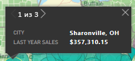
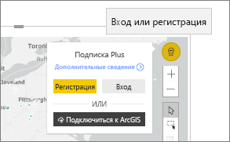

# Взаимодействие с картами ArcGIS в Power BI
Эта статья посвящена использованию карты ArcGIS в Power BI Desktop или службе Power BI для мобильных устройств. Как только разработчик предоставит вам общий доступ к визуальному элементу карты ArcGIS для Power BI, у вас появится множество возможностей взаимодействия с этим элементом.  Дополнительные сведения о создании карты ArcGIS см. в [руководстве по использованию карт ArcGIS компании Esri](../visuals/power-bi-visualization-arcgis.md).

Сочетание карт ArcGIS и Power BI — это больше, чем просто отображение точек на карте. Конструкторы отчетов начинают работу с карты и наносят на нее слои демографических данных. Сочетание таких основанных на расположении слоев данных (например, данных переписи) на карте с пространственным анализом помогает лучше понять данные в визуализациях.

> [!TIP]
> GIS расшифровывается как Geographic Information Systems (географические информационные системы).
> 

Этот визуальный элемент карты ArcGIS для Power BI показывает данные продаж по городам за предыдущий год, беря за основу базовую карту улиц и ссылочный слой среднего дохода на семью. Карта содержит два маркера (красный и желтый участки) и одну зону времени поездки на автомобиле (фиолетовый участок).

> [!TIP]
> Посетите [страницу компании Esri в Power BI](https://www.esri.com/powerbi), на которой есть множество примеров и отзывов. Затем перейдите на страницу компании Esri со сведениями о [начале работы с ArcGIS Maps for Power BI](https://doc.arcgis.com/en/maps-for-powerbi/get-started/about-maps-for-power-bi.htm).
> 
> 

## Согласие пользователя

При первом предоставлении вам общего доступа к карте ArcGIS в Power BI отобразится запрос согласия. Визуальный элемент ArcGIS Maps for Power BI предоставляется компанией Esri (https://www.esri.com), а его использование регулируется условиями и политикой конфиденциальности компании Esri. Пользователи Power BI, желающие использовать визуальный элемент "Карты ArcGIS для Power BI", должны принять условия в диалоговом окне получения согласия.

## Общие сведения о слоях

Визуальный элемент ArcGIS Maps for Power BI может иметь несколько различных типов слоев со сведениями о расположении демографического характера.

### Базовые карты

Каждый визуальный элемент ArcGIS Maps for Power BI начинается с базовой карты. Базовые карты можно представить в виде холста для данных. Базовая карта может быть простым темным или светлым холстом

 

или холстом со сведениями об улицах и транспорте. 

  

Базовая карта применяется к холсту полностью — по мере сдвига и масштабирования карта обновляется. Вы можете увеличить масштаб для просмотра более подробных сведений об улицах и транспорте. Если сдвинуть представление с одного континента на другой, уровень детализации остается прежним. Здесь мы перешли от города Порту к Пекину.

  

### Ссылочные слои

*Конструктор* отчетов может добавить один ссылочный слой. Ссылочные слои размещаются компанией Esri и предоставляют дополнительный уровень демографических сведений о расположении. В приведенном ниже примере имеется ссылочный уровень для плотности населения. Чем темнее цвет, тем выше плотность.

  

### Инфографика

Конструктор *отчетов* может добавить множество слоев инфографики. Инфографика — это небольшие визуальные индикаторы, отображаемые в правой части визуального холста. Инфографика размещается компанией Esri и предоставляет дополнительный уровень демографических сведений о расположении. В приведенном ниже примере применяются три слоя инфографики. Они отображаются не на самой карте, а на карточках. Карточки инфографики обновляются при изменении масштаба, сдвиге и выборе областей на карте.

  

### Закрепления

Маркеры обозначают точные расположения, например город или адрес. Иногда *конструкторы* отчетов используют маркеры с зоной времени поездки на автомобиле. В этом примере показаны магазины в пределах 50 километров от города Шарлотт в штате Северная Каролина.

 

## Работа с визуальным элементом ArcGIS Maps for Power BI
Доступные функции зависят от способа предоставления вам общего доступа к отчету и типа вашей учетной записи Power BI. Если у вас возникнут вопросы, обратитесь к системному администратору. Визуальные элементы ArcGIS Maps for Power BI во многом ведут себя так же, как и другие визуальные элементы в отчете. Вы сможете [просмотреть данные, используемые для создания визуализации](../consumer/end-user-show-data.md), просмотреть карту в [режиме фокусировки и полноэкранном режиме](../consumer/end-user-focus.md), [добавить комментарии](../consumer/end-user-comment.md), [экспериментировать с фильтрами](../consumer/end-user-report-filter.md), настроенными *конструктором отчетов*, и т. п. Визуальные элементы ArcGIS могут осуществлять перекрестную фильтрацию других визуализаций на странице отчета (и наоборот).

Наведите указатель мыши на расположения базовой карты (например, пузырек), чтобы отобразить подсказки. Кроме того, используйте средства выбора визуальных элементов ArcGIS для отображения дополнительных подсказок и выбора отдельных объектов на базовой карте или ссылочном слое.  

### Инструменты выбора

В ArcGIS Maps for Power BI предусмотрено пять режимов выбора. Одновременно можно выбрать не более 250 точек.

#### Инструмент одиночного выбора

 

Выберите точку данных, пузырек, маркер или отдельную точку данных на ссылочном слое. Power BI отобразит подсказку с подробными сведениями о выбранном объекте. Одиночный выбор осуществляет перекрестную фильтрацию других визуальных элементов на странице отчета на основе вашего выбора и обновляет карточки инфографики для выбранной области. 

Здесь мы выбрали точку данных коричневого пузырька на базовой карте. Power BI:
- выделяет выбранный нами объект;
- отображает подсказку для этой точки данных; 
- обновляет карточки инфографики, чтобы отобразить данные только для выбранного объекта;
- осуществляет перекрестное выделение гистограммы.

Если карта содержит ссылочный слой, при выборе расположений отображаются подробные сведения в подсказке. Здесь мы выбрали округ Сенека и видим данные из ссылочного слоя (плотность населения), который *конструктор* отчета добавит на карту. В этом примере наша точка данных включает два разных округа, поэтому наша подсказка содержит две страницы. На каждой странице приведена диаграмма. Выберите полосу на диаграмме, чтобы отобразить дополнительные сведения. 

> [!TIP]
  > Иногда можно уменьшить количество страниц подсказки, увеличив масштаб для выбора нужного расположения.  Иначе при перекрытии расположений в Power BI может одновременно отображаться несколько подсказок. Выберите кнопки со стрелками для перемещения между подсказками
  > 
  > 

#### Инструмент множественного выбора

 

Позволяет начертить прямоугольник на карте и выбрать точки данных, содержащиеся в нем. Несколько прямоугольных областей можно выбрать с помощью клавиши CTRL. Множественный выбор обновляет карточки инфографики для выбранной области и осуществляет перекрестное выделение других визуальных элементов на странице отчета на основе вашего выбора.

 

#### Инструмент ссылочного слоя

 

Позволяет использовать границы или многоугольники в ссылочных слоях для выбора содержащихся в них точек данных. Это можно не заметить сразу, но на ссылочном слое есть желтый контур. В отличие от инструмента одиночного выбора, вы не получаете подсказку. Вместо этого выводятся данные о любых точках данных, находящихся в пределах этого контура. В этом примере наш выбор содержит точку данных для магазина Lindseys в городе Уинстон-Сейлем.

 

#### Инструмент буфера

 

Позволяет выбирать точки данных с помощью слоя буфера. Например, используйте это средство, чтобы выбрать зону времени поездки на автомобиле и продолжить взаимодействие с остальной частью отчета. Зона времени поездки на автомобиле остается активной, а карточки инфографики продолжают отображать сведения о ней, но при выборе других точек данных на карте осуществляется перекрестная фильтрация других визуальных элементов на странице отчета.

 

#### Инструмент поиска сходных элементов

 

Позволяет находить расположения со схожими атрибутами. Начните с выбора одной или нескольких точек интереса или контрольных расположений, определив до пяти измерений, которые нужно использовать при анализе. Затем инструмент поиска сходных элементов находит 10 расположений на карте, которые наиболее похожи на определенные вами контрольные расположения. Затем вы можете использовать карточки инфографики, чтобы подробнее узнать о демографических данных для каждого из результатов, создать области времени поездки на автомобиле, чтобы понять, докуда можно добраться на автомобиле от каждого из этих расположений, или даже использовать инструмент поиска сходных элементов для фильтрации отчета и получения дополнительных ценных сведений. Самое важное, что все вычисления выполняются локально на вашем компьютере, поэтому конфиденциальные данные остаются защищенными.

## Рекомендации и ограничения
Карты ArcGIS для Power BI доступны в следующих службах и приложениях.

|Службы или приложения  |Доступность  |
|---------|---------|
|Power BI Desktop     |     Да    |
|Служба Power BI (app.powerbi.com)     |    Да     |
|Мобильные приложения Power BI     |  Да      |
|Публикация в Интернете через Power BI     |  Нет       |
|Power BI Embedded     |     Нет    |
|Внедрение службы Power BI (PowerBI.com)  | Нет |

## Как карты ArcGIS Maps for Power BI работают вместе?
Решения ArcGIS Maps for Power BI предоставляются компанией Esri (https://www.esri.com). Использование карт ArcGIS Maps for Power BI регулируется [условиями](https://go.microsoft.com/fwlink/?LinkID=8263222) и [политикой конфиденциальности](https://go.microsoft.com/fwlink/?LinkID=826323) компании Esri. Пользователи Power BI, желающие использовать визуальные элементы ArcGIS Maps for Power BI, должны принять условия в диалоговом окне получения согласия (подробности см. в разделе "Согласие пользователя").  Использование ArcGIS Maps for Power BI регулируется политикой конфиденциальности и условиями компании Esri, которые также связаны с диалоговым окном согласия. Перед началом использования ArcGIS Maps for Power BI каждый пользователь должен согласиться с условиями. Как только пользователь согласится с условиями, данные, привязанные к визуальному элементу, отправляются в службы Esri по крайней мере для геокодирования, то есть преобразования сведений о расположении в сведения о широте и долготе, которые могут быть представлены на карте. Следует исходить из того, что любые данные, привязанные к визуализации данных, могут быть переданы в службы Esri. Компания Esri предоставляет такие службы, как обзорные карты, пространственная аналитика, геокодирование и т. д. Визуальные элементы ArcGIS Maps for Power BI взаимодействуют с этими службами, используя соединение SSL, защищенное сертификатом, который предоставляется и поддерживается компанией Esri. Дополнительные сведения о картах ArcGIS Maps for Power BI можно получить на [странице продукта ArcGIS Maps for Power BI](https://www.esri.com/powerbi).

### Power BI Plus

Когда пользователь регистрируется для получения подписки Plus, предоставляемой Esri через ArcGIS Maps for Power BI, он входит в прямое отношение с Esri. Power BI не отправляет в Esri персональные данные пользователя. Пользователь выполняет вход и устанавливает отношение доверия с предоставляемым Esri приложением AAD, используя собственное удостоверение AAD. Таким образом, пользователь предоставляет доступ к своим персональным данным непосредственно компании Esri. После того как пользователь добавит содержимое Plus в визуальный элемент ArcGIS Maps for Power BI, его коллегам, которые хотят просмотреть или изменить этот элемент, также потребуется подписка Plus от Esri. 

Технические вопросы о работе ArcGIS Maps for Power BI компании Esri можно задать на сайте технической поддержки Esri.

## Рекомендации и устранение неполадок

**Карта ArcGIS не отображается**    
В службах или приложениях, для которых карты ArcGIS для Power BI недоступны, визуализация отобразится как пустой визуальный элемент с эмблемой Power BI.

**На карте отображаются не все мои сведения**    
Геокодирование по широте и долготе позволяет отображать на карте до 30 000 точек данных. Геокодирование по другим точкам данных, например по почтовым индексам или адресам, отображает только первые 15 000 точек данных. Геокодирование географических названий или стран не ограничивается 1500 адресами.

**Требуется ли платить за использование карт ArcGIS для Power BI?**

Все пользователи Power BI могут бесплатно использовать карты ArcGIS для Power BI. Это компонент, предоставляемый компанией **Esri**. Его использование регулируется условиями и политикой конфиденциальности, указанными компанией **Esri**, как упоминалось ранее в этой статье. За подписку на ArcGIS **Plus** взимается плата.

**Отображается сообщение о том, что кэш заполнен**

Мы работаем над устранением этой проблемы.  А пока что перейдите по ссылке в сообщении об ошибке для получения инструкций по очистке кэша Power BI.

**Можно ли просматривать карты ArcGIS автономно?**

Нет. Чтобы отобразить карты Power BI, требуется сетевое подключение.

## Дальнейшие действия
Получение справки. Компания **Esri** предоставляет [полную документацию](https://go.microsoft.com/fwlink/?LinkID=828772) по набору функций **карт ArcGIS для Power BI**.

Чтобы узнать последние сведения или сообщить о проблеме, можно задать вопросы и получить ответы в [темах сообщества Power BI, связанных с **картами ArcGIS для Power BI**](https://go.microsoft.com/fwlink/?LinkID=828771).

[Страница продукта "Карты ArcGIS для Power BI"](https://www.esri.com/powerbi)
