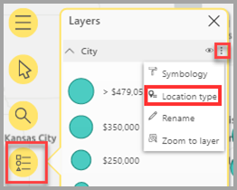
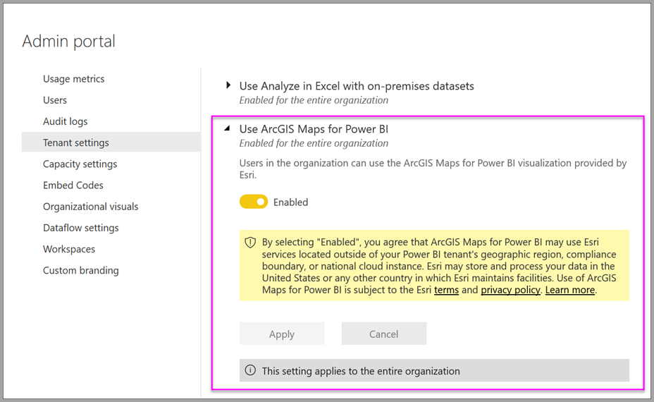

# Создание карт ArcGIS в Power BI

[!INCLUDE[consumer-appliesto-yyyn](../includes/consumer-appliesto-yyyn.md)]    

> [!NOTE]
> Эти визуальные элементы можно создавать и просматривать как в Power BI Desktop, так и в службе Power BI. Шаги и иллюстрации в этой статье относятся к Power BI Desktop.

Этот обзор посвящен созданию карты ArcGIS для Power BI. Пользователь, которому _автор_ предоставил общий доступ к карте ArcGIS Maps for Power BI, может просматривать карту и взаимодействовать с ней, но не может сохранять изменения. Дополнительные сведения о просмотре карты ArcGIS см. в статье о [взаимодействии с картами ArcGIS Maps for Power BI](https://doc.arcgis.com/en/maps-for-powerbi/use/explore-maps.htm).

Сочетание карт ArcGIS и Power BI — это больше, чем просто отображение точек на карте. Прекрасные информативные визуализации для карт можно создать, используя базовые карты, типы расположения, темы, стили символов и ссылочные слои. Сочетание официальных слоев данных на карте с пространственным анализом помогает лучше понять данные в визуализации. На мобильном устройстве нельзя создавать карты ArcGIS Maps for Power BI, но можно просматривать их и взаимодействовать с ними.

> [!NOTE]
> Решение ArcGIS Maps for Power BI сейчас недоступно для Сервера отчетов Power BI.

> [!TIP]
> GIS расшифровывается как Geographic Information Systems (географические информационные системы).

В приведенном ниже примере на темно-сером холсте показана тепловая карта значений региональных продаж на фоне демографического слоя с наложением значений медианного совокупного чистого дохода за 2016 г. Как будет видно далее, ArcGIS Maps for Power BI предлагает возможности сопоставления, демографические данные и еще более привлекательную визуализацию карт, чтобы лучше всего представить данные.

> [!TIP]
> Посетите [**страницу компании Esri в ArcGIS Maps for Power BI**](https://www.esri.com/powerbi), на которой есть множество примеров и отзывов. Кроме того, просмотрите справку по работе с **[ArcGIS Maps for Power BI](https://doc.arcgis.com/en/maps-for-powerbi/get-started/about-maps-for-power-bi.htm) в Интернете**.

## предоставление согласия пользователем.

Решения ArcGIS Maps for Power BI предоставляются компанией Esri ([https://www.esri.com](https://www.esri.com/)). Использование карт ArcGIS Maps for Power BI регулируется [условиями](https://go.microsoft.com/fwlink/?LinkID=826322) и [политикой конфиденциальности](https://go.microsoft.com/fwlink/?LinkID=826323) компании Esri. Пользователи Power BI, желающие использовать визуальный элемент ArcGIS Maps for Power BI, должны принять условия в диалоговом окне получения согласия. Это диалоговое окно появляется только при первом использовании ArcGIS Maps for Power BI.

## Предварительные требования

В этом руководстве используется Power BI Desktop и пример PBIX-файла [Анализ розничной торговли](https://download.microsoft.com/download/9/6/D/96DDC2FF-2568-491D-AAFA-AFDD6F763AE3/Retail%20Analysis%20Sample%20PBIX.pbix). Карты ArcGIS Maps for Power BI также можно создавать с помощью службы Power BI.

1. В левом верхнем разделе строки меню выберите **Файл** > **Открыть отчет**.
2. Найдите на локальном компьютере пример PBIX-файла **Анализ розничной торговли**.
3. Откройте **пример анализа розничной торговли** в представлении отчета. .
4. Выберите пункт  для добавления страницы в отчет.

## Создание визуального элемента ArcGIS Maps for Power BI

Чтобы добавить карту в отчет, выполните следующие действия.

1. Щелкните на панели "Визуализации" значок карт ArcGIS для Power BI.

    

2. Power BI добавляет пустой шаблон на холст отчетов. В этом обзоре мы будем использовать **стандартную** версию, входящую в состав Power BI. Если войти в действующую учетную запись ArGIS с соответствующим лицензированием, у вас будет доступ к дополнительным функциям. Дополнительные сведения см. в справке по работе с [ArcGIS Maps for Power BI в Интернете](https://doc.arcgis.com/en/maps-for-powerbi/get-started/account-types.htm).

    

3. Из панели **Поля** перетащите поле данных в поле **Расположение** или перетащите координаты в соответствующие контейнеры **Широта** и **Долгота**. В этом примере используется **Store > City** (Магазин > Город).

    > [!NOTE]
    > Решение ArcGIS Maps for Power BI автоматически определяет, как лучше всего просматривать выбранные поля — как фигуры или точки на карте. Вы можете изменить значение по умолчанию в параметрах (см. сведения о [форматировании визуализации ArcGIS Maps for Power BI](#format-the-arcgis-maps-for-power-bi-visualization)).

    

4. Из панели **Поля** перетащите меру в контейнер **Размер**, чтобы изменить способ представления данных. В этом примере выберите **Sales > Last Year Sales** (Продажи > Продажи за прошлый год).

    

Вы создали первую карту ArcGIS Maps for Power BI. Теперь давайте настроим и отформатируем ее с помощью базовых карт, типов расположения, тем и других элементов.

## Форматирование визуализации ArcGIS Maps for Power BI

Чтобы получить доступ к функциям форматирования **карт ArcGIS для Power BI**, нужно сделать следующее:

1. На панели "Визуализации" перейдите на вкладку **Формат**, чтобы просмотреть параметры форматирования.

    

    В ArcGIS Maps доступны следующие параметры форматирования.

    * **Слои**. Изменение заголовка списка слоев (ToC), включение или отключение списка слоев, закрепление списка на карте и указание положения привязанного списка. Список слоев включен по умолчанию и доступен в расширенных средствах карт .
    * **Средства карты.** Включение или отключение средств навигации, блокировка области карты в ее текущем положении, определение расположения карточек инфографики на карте. Кнопки "Увеличить" и "Уменьшить" по умолчанию отключены.
    * **Тип расположения.** Указание страны или региона, в котором находятся ваши данные, помогает повысить точность расположения на карте. Если данные находятся в одной стране или регионе, выберите страну или регион из раскрывающегося списка. Если данные являются глобальными, выберите значение "Мир".
    * **Поиск**. Включение или выключение функции поиска, изменение цвета элемента закрепления по умолчанию. Поиск включен по умолчанию и доступен в расширенных средствах карт .

### Изменение карты в ArcGIS Maps for Power BI

После добавления данных в визуализацию карт становятся доступными средства карт.

> [!NOTE]
> В этом учебнике показаны только функции и параметры, доступные в **стандартной** версии ArcGIS Maps for Power BI. Если вы вошли в действующую учетную запись [ArcGIS](https://doc.arcgis.com/en/maps-for-powerbi/get-started/account-types.htm) с соответствующим лицензированием, у вас будет доступ к дополнительным функциям.

Чтобы развернуть средства карты, выполните следующие действия.

1. Нажмите кнопку средств карты, чтобы развернуть их.

    

Средства карты расширяются для отображения доступных компонентов. При выборе каждой функции открывается область задач с подробными параметрами.

> [!TIP]
> Компания Esri предоставляет [полную документацию](https://go.microsoft.com/fwlink/?LinkID=828772) по работе с ArcGIS Maps for Power BI.

#### Изменение базовой карты

Базовая карта предоставляет фоновый или визуальный контекст для данных на карте. Например, базовая карта, отображающая улицы, может предоставить контекст для данных адреса. Используя **стандартную** учетную запись, можно получить доступ к четырем базовым картам: Dark Gray Canvas, Light Gray Canvas, OpenStreetMap и Streets.

Чтобы изменить базовую карту, выполните следующие действия.

1. Нажмите кнопку **Basemap** (Базовая карта) , чтобы отобразить коллекцию.
2. Выберите базовую карту **Dark Gray Canvas** (Темно-серый холст).

    

    Схема обновляется с применением новой базовой карты.

Дополнительные сведения см. на странице [Изменение базовой карты](https://doc.arcgis.com/en/maps-for-powerbi/design/change-the-basemap.htm) в справке ArcGIS Maps for Power BI в Интернете.

#### Отображение слоев карты

В ArcGIS Maps for Power BI вы работаете с географическими данными с помощью слоев. Слои — это логические коллекции географических данных, которые используются для создания карт. Они также являются основой для географического анализа.

Чтобы отобразить список слоев, нажмите кнопку **Слои**  в средствах карт.

В списке "Слои" отображается каждый слой, составляющий карту. У каждого слоя есть собственный набор параметров для настройки и работы с картой. В меню отображаются различные параметры в зависимости от выбранного типа слоя. Например, можно изменить символы и тип расположения для слоя, созданного с помощью данных Power BI, например, слой **Город**, созданный для этого примера, но эти параметры недоступны для ссылочных слоев или слоев времени поездки.

Дополнительные сведения см. на странице [Работа со слоями](https://doc.arcgis.com/en/maps-for-powerbi/design/work-with-layers.htm) в справке ArcGIS Maps for Power BI в Интернете.

#### Указание типа расположения

ArcGIS Maps for Power BI использует собственную технологию для точного геопозиционирования данных на карте и автоматически отображает элементы как точки или границы по умолчанию в зависимости от типа данных. Например, координата широты или долготы отображается как точка на карте, а поле состояния отображается как граница или многоугольник. Указав тип расположения, можно изменить способ его отображения.

Чтобы повысить точность расположения на карте, используйте функцию "Тип расположения". Это можно быстро сделать, выбрав страну или регион в области формата визуализации (разверните категорию "Тип расположения" и выберите соответствующую страну или регион) или перейдя к дополнительным параметрам, используя функцию полных сведений о расположении в области параметров слоя.

Функция полных сведений **о типе расположения** доступна в меню параметров слоя и позволяет выбрать, следует ли представлять данные как точки или границы (многоугольники) в дополнение к указанию страны или региона, в котором находятся данные. Границы обычно определяются как стандартные географические области, такие как страны, провинции, почтовые индексы и т. д. Если выбраны границы и указана страна или регион расположения данных, можно выбрать одну из множества стандартных границ, таких как страны, районы переписи, районы или муниципалитеты. Для каждой страны или региона доступны различные типы расположения.

Чтобы изменить тип расположения данных, выполните следующие действия.

1. В списке "Слои" выберите слой данных, с которым вы хотите работать.
2. Нажмите кнопку **Параметры слоя** и выберите **Тип расположения**.

    

    Примите значения по умолчанию, чтобы отобразить расположения в виде точек на карте, и укажите **One country > United States** (Одна страна > США).

    

Дополнительные сведения см. на странице [Выбор типа местоположения](https://doc.arcgis.com/en/maps-for-powerbi/design/specify-location-type.htm) в справке ArcGIS Maps for Power BI в Интернете.

#### Настройка символов схемы

ArcGIS Maps for Power BI использует значения на панели "Поля" для интеллектуального определения способа отрисовки расположений на карте. Функция **Symbology** (Символы) позволяет изменить стиль по умолчанию, чтобы повысить информативность. Вы можете выбрать другую тему для отображения и настроить символы и цвета, используемые для представления расположений на карте. В зависимости от значений, добавленных в область полей визуального элемента карты, доступны различные темы и стили.

Чтобы изменить символы слоя, выполните следующие действия.

1. В списке "Слои" выберите слой данных, с которым вы хотите работать.

2. Нажмите кнопку **Параметры слоя** и выберите **Symbology** (Символы).

Появится панель символов с развернутой категорией темы карты.

##### Изменение темы карты

В этом примере, так как мы добавили значения в поля **Расположение** и **Размер**, по умолчанию на карте используется тема **Размер**.

Чтобы изменить тему карты, выполните следующие действия.

1. Выберите другие темы карт, чтобы увидеть, как изменится ваша схема.

    

2. Выберите тему **Размер**.

Дополнительные сведения см. на странице [Изменение темы карты](https://doc.arcgis.com/en/maps-for-powerbi/design/change-the-map-theme.htm) в справке ArcGIS Maps for Power BI в Интернете.

##### Прозрачность слоя

Если на карте содержится несколько слоев, может быть полезно визуализировать слои с определенным уровнем прозрачности, чтобы элементы на других слоях оставались видимыми.

Чтобы задать значение прозрачности для слоя, выполните следующие действия.

1. В области **Symbology** (Символы) разверните категорию **Прозрачность**.

2. Введите процентное соотношение в текстовом поле или переместите ползунок влево (менее прозрачно) или вправо (более прозрачно).

##### Стиль символов

С помощью стилей символов можно точно настроить способ представления данных на карте. Стили символов по умолчанию основаны на выбранном типе расположения и теме карты, а доступные параметры стилей различаются в зависимости от того, какие контейнеры полей содержат значения и характер этих значений.

Чтобы изменить стиль символов, выполните следующие действия.

1. В области **Symbology** (Символы) разверните категорию **Symbol style** (Стиль символов).

2. При необходимости измените параметры символов. Выберите форму символа, цвет, прозрачность, а также цвет контура, его толщину и прозрачность. Разверните категорию размера символов, чтобы изменить эти параметры. Различные параметры отображаются в зависимости от характера данных и выбранной темы карты.

    В примере ниже для темы карты установлен параметр **Размер** и задано несколько настроек прозрачности, стиля и размера символов.

    

3. Завершив настройку параметров стилей, закройте панель символов.

### Анализ данных

ArcGIS Maps for Power BI предоставляет несколько средств, позволяющих обнаруживать закономерности в данных и создавать привлекательную визуализацию на карте.

К функциям анализа относятся:

- Выбор расположений на карте.
- Поиск определенного адреса, места или точки интереса.
- Добавление ссылочного слоя для предоставления большего контекста.
- Поиск расположений в пределах указанного радиуса или области времени поездки.
- Добавление карточек, отображающих демографические сведения об области, отображаемой на карте.

#### Выбор расположений

ArcGIS Maps for Power BI предоставляет несколько различных средств выбора, которые помогут выбрать расположения на карте. В зависимости от типа слоя, выбранного в списке слоев, отображаются различные средства.

Чтобы отобразить средства выбора, выполните следующие действия.

1. В средствах карт нажмите кнопку **Selection tools** (Средства выбора) , чтобы развернуть набор инструментов.

    Доступно четыре средства выбора. Различные средства могут отображаться в меню **Selection tools** (Средства выбора) в зависимости от типа слоя, который активен в данный момент. Так как карта в этом примере содержит только слой данных, отображаются только средства **Единичное выделение** и **Box select** (Выделение поля).
    
    | **Инструмент** | **Описание** |
    | --- | --- |
    |  | **Единичное выделение** — это средство, которое можно использовать для выбора отдельных расположений (средство выбора по умолчанию). Нажмите клавишу CTRL и щелкните несколько расположений для выбора. Щелкнув расположения данных на карте, вы выберете их и активируете взаимодействие с другими визуализациями. При щелчке заголовка или расположения на ссылочном слое отображается соответствующая подсказка. |
    |   | **Box select** (Выделение поля). Перетащите селектор прямоугольника, чтобы выбрать несколько расположений или отдельные расположения, щелкнув их. Как и при использовании средства выбора, при щелчке заголовка или расположения на ссылочном слое отображается соответствующая подсказка. Если окно выбора активно, вы не сможете прокрутить карту. |
    |   | **Reference layer select** (Выделение ссылочного слоя) — если на карту был добавлен [ссылочный слой](https://doc.arcgis.com/en/maps-for-powerbi/design/add-a-reference-layer.htm), используйте это средство, чтобы выбрать расположения, щелкнув области на ссылочном слое. Местоположения, находящиеся в пределах ограниченной области на ссылке, выделяются. Местоположения в других областях карты недоступны.Это средство появляется только в том случае, если карта содержит один или несколько ссылочных слоев и этот слой в данный момент активен. |
    |   | **Drive-time select** (Выбор времени поездки). Если на карту вы добавили [область времени поездки](https://doc.arcgis.com/en/maps-for-powerbi/design/find-nearby-locations.htm), используйте средство выбора области для выбора расположений данных в определенной области. |
    
2. Выберите минимум одно расположение на карте. Максимум выбираемых за один раз точек данных: 250.

Дополнительные сведения см. на странице [Выборка местоположений на карте](https://doc.arcgis.com/en/maps-for-powerbi/design/select-features-on-the-map.htm) в справке ArcGIS Maps for Power BI в Интернете.

#### Закрепление расположения

Закрепите конкретный адрес, местоположение или интересующую вас точку на карте. В этом примере вы выполните поиск аэропорта Pittsburgh International.

Чтобы закрепить расположение, выполните следующие действия.

1. В средствах карты нажмите кнопку **Поиск** , чтобы открыть панель поиска.
2. Введите ключевые слова **Pittsburgh International** в поле поиска.

    Ключевые слова могут включать в себя адрес, место или точку интереса. При вводе отображаются аналогичные последние поисковые запросы или предложения на основе аналогичных ключевых слов.

3. В списке результатов выберите **аэропорт Pittsburgh International** и нажмите кнопку **Закрыть**.

    На карте отображается символ, и для расположения автоматически увеличивается масштаб. Закрепления остаются на карте только в течение текущего сеанса. Сохранить закрепленное расположение на карте невозможно. Закрепленное расположение также отображается в виде слоя в списке слоев. Вы можете переименовать слой, показать или скрыть его или удалить его из схемы, как это можно сделать с другими слоями.

4. Чтобы изменить цвет закрепления, разверните категорию **Поиск** в области **Формат** визуального элемента карты и выберите новый цвет.

> [!NOTE]
> Функция **поиска** заменяет функцию закрепления, которая ранее была доступна в ArcGIS Maps for Power BI.

Дополнительные сведения см. на странице [Прикрепление булавок в местоположениях](https://doc.arcgis.com/en/maps-for-powerbi/design/pin-locations.htm) в справке ArcGIS Maps for Power BI в Интернете.

#### Добавление эталонного слоя

Ссылочные слои предоставляют контекст для данных Power BI, которые уже отображаются на карте. Они могут содержать демографические данные, например доходы семьи, возраст или сведения об образовании. Они также могут включать в себя общедоступные слои компонентов, доступные в ArcGIS Online, которые предоставляют дополнительные сведения об областях, окружающих местоположения на карте.

##### Добавление демографических слоев

Стандартная учетная запись ArcGIS Maps for Power BI включает в себя проверенный набор демографических слоев США, с помощью которых можно согласовать данные Power BI с контекстом.

Чтобы добавить демографический слой, выполните следующие действия.

1. В средствах карты нажмите кнопку **Analysis tools** (Средства анализа) , чтобы развернуть набор инструментов.
2. Нажмите кнопку **Ссылочный слой** .

    Откроется панель **Ссылочный слой**, в которой отображается вкладка **Демографические данные** и выбор слоев.

3. Прокрутите коллекцию и нажмите кнопку **Добавить** на эскизе слоя, который необходимо добавить на карту.

    В этом примере найдите слой **2016 USA Average Household Income** и нажмите кнопку **Добавить**.
    
    Схема обновляется для отображения нового слоя.
    
    
    
Демографические ссылочные слои являются интерактивными. Щелкните область, чтобы просмотреть подсказку с дополнительными сведениями. Вы также можете использовать средство **Reference select** (Выбор ссылки), чтобы [выбрать области на карте](https://doc.arcgis.com/en/maps-for-powerbi/design/select-features-on-the-map.htm), попадающие в область на ссылочном слое.

##### Добавление ссылочного слоя из ArcGIS

ArcGIS Maps for Power BI позволяет искать общедоступные слои компонентов в ArcGIS, обеспечивая доступ к тысячам ссылочных слоев, которые предоставляют сведения об областях, окружающих места на уровне данных. При входе в ArcGIS Maps for Power BI с помощью действующей учетной записи ArcGIS можно искать содержимое в организации, в группах организации или в общедоступном содержимом. Так как в этом примере используется стандартная учетная запись, в результатах поиска отображается только общедоступное содержимое.

Чтобы добавить ссылочный слой ArcGIS, выполните следующие действия.

1. На панели ссылок перейдите на вкладку **ArcGIS**.

2. В поле поиска введите **USA Congressional districts** и нажмите клавишу **ВВОД**.

    Коллекция заполняется несколькими возможными результатами.

3. Перейдите на слой USA 116th Congressional Districts и нажмите кнопку "Добавить".

    Схема обновляется для отображения нового слоя.
    
    
    
Ссылочные слои ArcGIS являются интерактивными. Щелкните область, чтобы просмотреть подсказку с дополнительными сведениями. Вы также можете использовать средство **Reference select** (Выбор ссылки), чтобы [выбрать области на карте](https://doc.arcgis.com/en/maps-for-powerbi/design/select-features-on-the-map.htm), попадающие в область на ссылочном слое.

#### Поиск ближайших расположений

Вы можете использовать расположения на карте (включая закрепленное расположение) в качестве отправной точки для поиска и выбора ближайших местоположений на вашей карте. Например, при поиске определенного места можно выбрать расположения на карте, которые находятся в пределах указанного радиуса или периода поездки.

В этом примере используйте Pittsburgh International Airport, который вы зафиксировали ранее в качестве отправной точки для поиска расположений в радиусе 100 километров от аэропорта. Выполните аналогичные действия, чтобы найти расположения в пределе указанного времени поездки.

Чтобы найти расположения на определенном расстоянии от исходной точки, выполните следующие действия.

1. В средствах карты нажмите кнопку **Analysis tools** (Средства анализа) , чтобы развернуть набор инструментов.

2. Нажмите кнопку **Drive-time** (Время поездки) .

    Откроется область **Drive-time** (Время поездки).

3. Щелкните средство выбора, а затем на карте выберите расположение **Pittsburgh International Airport**, зафиксированное ранее.
4. В раскрывающемся меню **Область поиска** выберите **Радиус** и укажите расстояние **100** миль.
5. Нажмите кнопку **ОК**.

    На карте показана окружность вокруг закрепленного расположения аэропорта. Панель Drive-time (Время поездки) разворачивается, чтобы были видны параметры стилей для области поездки.
    
    
    
    Область поездки также отображается в виде слоя в списке слоев. Вы можете переименовать слой, показать, скрыть или удалить его из схемы, как это можно сделать с другими слоями.

6. Если слой времени поездки активен в списке слоев, используйте средство выбора, чтобы щелкнуть область расстояния поездки.

    Выбираются расположения, попадающие в область поиска. Невыбранные расположения на карте выглядят меньше или становятся более прозрачными. Другие визуализации обновляются в соответствии с выбранными расположениями.

Дополнительные сведения см. на странице [Найти ближайшие местоположения](https://doc.arcgis.com/en/maps-for-powerbi/design/find-nearby-locations.htm) в справке ArcGIS Maps for Power BI в Интернете.

#### Добавление карточек инфографики

Как и ссылочные слои, карточки инфографики предоставляют дополнительные сведения об областях на карте. Карточки инфографики размещаются поверх карты и отображают конкретные демографические сведения об области, непосредственно окружающей выбранное расположение, или об общей области, отображаемой в текущей области карты. Дополнительные сведения см. на странице [Добавление карточек инфографики](https://doc.arcgis.com/en/maps-for-powerbi/design/add-infographics.htm) в справке ArcGIS Maps for Power BI в Интернете.

### Получить помощь

Компания Esri предоставляет полную онлайн-документацию по работе с ArcGIS Maps for Power BI.

Чтобы получить доступ к интерактивной справке ArcGIS Maps for Power BI из области визуализации, выполните следующие действия.

1. В средствах карты нажмите кнопку **Параметры** .

2. На панели **Параметры** нажмите кнопку **Справка**.
3. В появившемся окне подтверждения нажмите кнопку **ОК**.

    Онлайн-справка ArcGIS Maps for Power BI откроется в окне браузера.
    
    - Найдите в справке ответы на [часто задаваемые вопросы](https://doc.arcgis.com/en/maps-for-powerbi/get-started/pbi-faq.htm#anchor5) по работе с ArcGIS Maps for Power BI.
    - Чтобы узнать последние сведения или сообщить о проблеме, можно задать вопросы и получить ответы в [темах сообщества Power BI, связанных с **ArcGIS Maps for Power BI**](https://go.microsoft.com/fwlink/?LinkID=828771).
    - Если у вас есть предложения по улучшению, отправьте их в [список идей Power BI](https://ideas.powerbi.com/).
    
### Управление использованием карт ArcGIS Maps for Power BI в организации

Power BI позволяет дизайнерам, администраторам Power BI и администраторам пользователей управлять использованием ArcGIS Maps for Power BI. В следующих разделах описаны действия, которые может выполнять каждая роль.

#### Параметры конструктора

В Power BI Desktop авторы могут отключить ArcGIS Maps for Power BI на вкладке "Безопасность". Последовательно выберите **Файл**  >  **Параметры и настройки**, а затем — **Параметры**  >  **Безопасность**. Если карты ArcGIS отключены, они не загружаются по умолчанию.

#### Параметры администратора

В службе Power BI администраторы могут отключить ArcGIS Maps for Power BI для всех пользователей. Последовательно выберите **Параметры** > **Портал администрирования** > **Параметры клиента**. После этого в Power BI в области "Визуализации" больше не будет отображаться значок ArcGIS Maps for Power BI.

#### Параметры администратора пользователей

Power BI Desktop поддерживает использование **групповой политики**, чтобы отключать карты ArcGIS для Power BI на компьютерах, развернутых в организации.

| **Attribute** | **Значение** |
| --- | --- |
| Клавиши | Программное обеспечение\Политики\Microsoft\Power BI Desktop |
| valueName | EnableArcGISMaps |

Значение 1 (десятичное) позволяет включить карты ArcGIS для Power BI.

Значение 0 (десятичное) позволяет отключить карты ArcGIS Maps for Power BI.

## Рекомендации и ограничения

Карты ArcGIS для Power BI доступны в следующих службах и приложениях.

| Служба или приложение | Доступность |
| --- | --- |
| Power BI Desktop | Да |
| Служба Power BI (powerbi.com) | Да |
| Мобильные приложения Power BI\* | Да |
| Публикация в Интернете через Power BI | Нет |
| Power BI Embedded | Нет |
| Внедрение службы Power BI (powerbi.com) | нет |
| Сервер отчетов Power BI | Нет |

\*В мобильных средах можно просматривать карты, созданные с помощью визуализации ArcGIS Maps for Power BI, входящей в Power BI ([стандартная учетная запись](https://doc.arcgis.com/en/maps-for-powerbi/get-started/account-types.htm)). Карты, содержащие содержимое категории "Премиум" из ArcGIS, не поддерживаются в мобильных средах.

В службах или приложениях, для которых карты ArcGIS для Power BI недоступны, визуализация отобразится как пустой визуальный элемент с эмблемой Power BI.

В следующей таблице сравниваются стандартные функции, доступные всем пользователям Power BI, выполнившим вход в ArcGIS:

|  Стандартные (входят в состав Power BI) |   С учетной записью ArcGIS |
| --- | --- | --- |
| Базовые карты |
| 4 основные базовые карты | Все базовые карты Esri плюс доступ к базовым картам вашей организации, включая пользовательские базовые карты |
| Геокодирование |
| 3500 расположений на карту | 10 000 расположений на карту |
 | 10 000 расположений в месяц | Ежемесячные ограничения отсутствуют |
| Ссылочные слои |
| 10 ссылочных слоев, содержащих демографические данные США | Доступ ко всем веб-картам и слоям ArcGIS из организации |
 | Общедоступные слои компонентов, доступные в ArcGIS | Общедоступные слои компонентов, доступные в ArcGIS |
 | Доступ к ArcGIS Living Atlas для карт и слоев мира (службы функций) |
| Инфографика |
| Проверенная коллекция переменных демографических данных для США (7 категорий) | Полный доступ к обозревателю данных ArcGIS GeoEnrichment, включая демографические переменные для США и мира |
|

## Дальнейшие действия

- [Взаимодействие с картой ArcGIS, к которой вам предоставлен общий доступ](https://doc.arcgis.com/en/maps-for-powerbi/use/explore-maps.htm)
- [Записи блога с объявлением карт ArcGIS для обновлений Power BI](https://www.esri.com/arcgis-blog/?s=#ArcGIS%20Maps%20for%20Power%20BI)
- Остались вопросы? [Попробуйте задать вопрос в сообществе Power BI.](https://community.powerbi.com/)