# Начало работы с областью форматирования

[!INCLUDE[consumer-appliesto-nyyn](../includes/consumer-appliesto-nyyn.md)]    

При наличии разрешений на изменение для отчета доступно множество параметров форматирования. В отчетах Power BI вы можете изменять цвет ряда данных, точек данных и даже фона визуализаций. Можно изменить способ представления осей x и y. Можно также изменить форматирование свойств шрифтов для визуализаций, фигур и заголовков. Power BI предоставляет полный контроль над отображением отчетов.

Для начала работы откройте отчет в Power BI Desktop или службе Power BI. Оба варианта предоставляют почти одинаковые параметры форматирования. При открытии отчета в службе Power BI не забудьте выбрать **Изменить** в строке меню. 

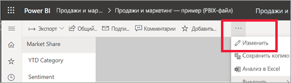

При редактировании отчета и выборе визуализации отображается панель **Визуализации**. Используйте эту панель для изменения визуализаций. Непосредственно под областью **Визуализация** имеется три значка: **Поля** (стопка полос), **Формат** (валик с краской) и **Аналитика** (увеличительное стекло). На приведенном ниже рисунке выбран значок **Поля**, что указывается желтой полосой под значком.

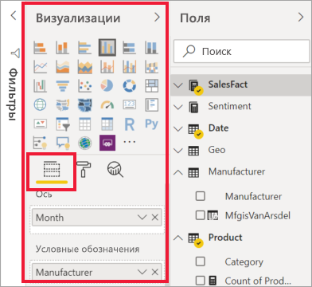

При выборе значка **Формат** в области под значком отображаются настройки, доступные для выбранной визуализации.  

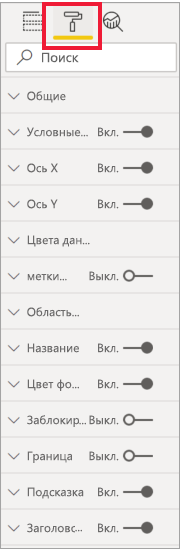

В каждой визуализации вы можете настраивать множество элементов. Доступные параметры зависят от выбранного визуального элемента. Ниже приведены некоторые из этих параметров.

* Условные обозначения
* ось X;
* ось Y;
* цвета данных;
* Метки данных
* Фигуры
* Область построения
* Title
* Историческая справка
* блокировка пропорций;
* Граница
* Подсказки
* Заголовки визуальных элементов
* Фигуры
* Положение    
другое.

> [!NOTE]
>  
> Не все эти элементы отображаются в каждом типе визуализации. На доступные настройки будет влиять выбранная визуализация; например, если выбрана круговая диаграмма, вы не увидите ось X, поскольку круговые диаграммы не имеют оси X.

Также обратите внимание, что, если никакая визуализация не выбрана, вместо значков отображается поле **Фильтры**, позволяющее применять фильтры ко всем визуализациям на странице.

Лучший способ узнать, как использовать параметры форматирования, — попробовать изменить их. Вы в любой момент можете отменить изменения или вернуться к значениям по умолчанию. Существует невероятный объем доступных параметров, а помимо уже существующих постоянно добавляются новые. Все параметры форматирования невозможно описать в одной статье. Но чтобы приступить к работе, давайте рассмотрим несколько из них. 

1. Изменение цветов, используемых в визуальном элементе   
2. Применение стиля    
3. Изменение свойств оси    
4. Добавление меток данных    

## Работа с цветами

Рассмотрим шаги, необходимые для настройки цветов на визуализации.

1. Выберите визуализацию, чтобы сделать ее активной.

2. Откройте вкладку "Форматирование", щелкнув значок валика. На вкладке "Форматирование" отображаются все элементы форматирования, доступные для выбранного визуального элемента.

    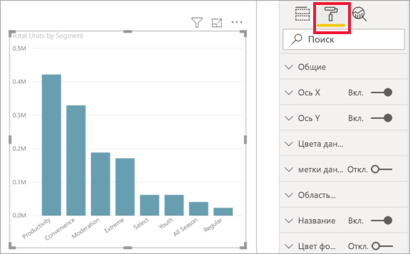

3. Выберите **Цвета данных**, чтобы развернуть доступные настройки.  

    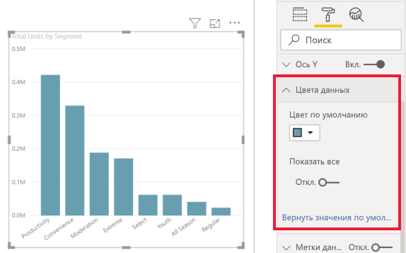

4. Активируйте параметр **Показать все** и выберите другие цвета для столбцов.

    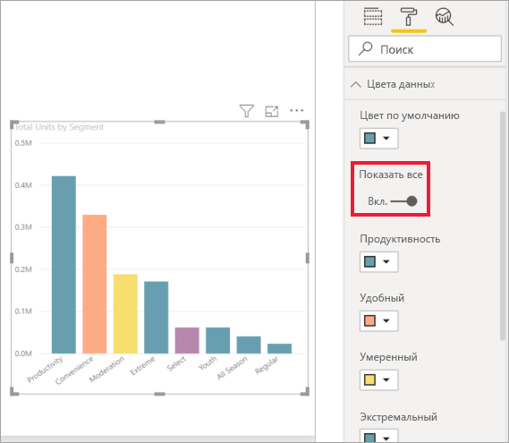

Вот несколько полезных советов по работе с цветами. Номера в следующем списке также показаны на следующем экране, где можно посмотреть или изменить эти полезные элементы.

1. Не нравится цвет? Нет проблем! Просто выберите **Вернуться к значению по умолчанию**, и будут восстановлены значения по умолчанию. 

2. Не нравятся новые цвета? Выберите **Вернуться к значению по умолчанию** в нижней части раздела **Цвета данных**, и цвета восстановятся к стандартным значениям. 

3. Нужен цвет, который не представлен в палитре? Просто выберите **Настраиваемый цвет**, а затем выберите нужный цвет из спектра.  

   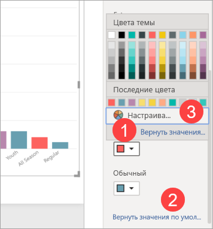

Не в восторге от внесенных изменений? Используйте привычное сочетание клавиш **CTRL+Z** для отмены.

## Применение стиля к таблице
Некоторые визуализации Power BI имеют параметр **Стиль**. Одним щелчком полный набор параметров форматирования применяется ко всей визуализации одновременно. 

1. Выберите таблицу или матрицу, чтобы сделать ее активной.   
1. Откройте вкладку "Форматирование" и выберите раздел **Стиль**.

   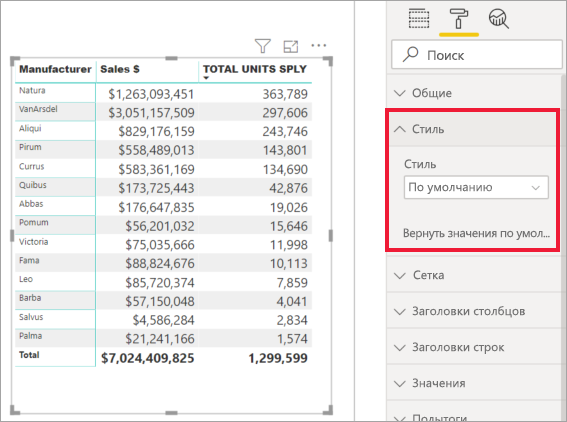

1. В раскрывающемся списке выберите стиль. 

   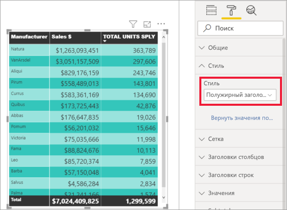

Даже после применения стиля для этой визуализации можно продолжить изменять форматирование, включая цвет.

## Изменение свойств оси

Часто требуется изменить ось X или Y. Как и при работе с цветами, вы можете изменить ось, выбрав значок со стрелкой вниз слева от оси, которую требуется изменить, как показано на следующем рисунке.  
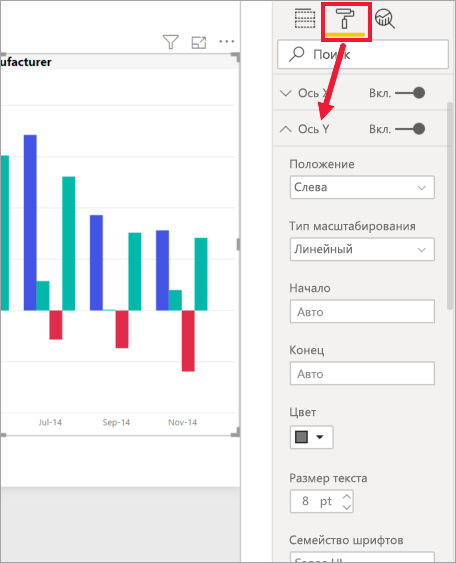

В приведенном ниже примере ось Y отформатирована следующим образом:
- метки перемещены в правую часть визуализации;

- начальное значение изменено на ноль;

- цвета шрифта метки изменены на черный;

- размер шрифта метки увеличен до 12;

- добавлен заголовок оси Y;

    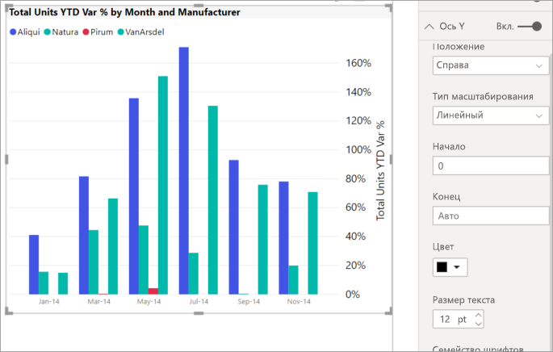

Можно полностью удалить метки оси, используя переключатель рядом с **осью X** или **осью Y**. Вы также можете указать, следует ли включить или отключить заголовок оси, установив соответствующий переключатель рядом с пунктом **Заголовок**.  

## Добавление меток данных    

Последний пример форматирования, прежде чем вы приступите к собственным примерам.  Давайте добавим метки данных к диаграмме с областями. 

Ниже показан рисунок *до*. 

А вот рисунок *после*.

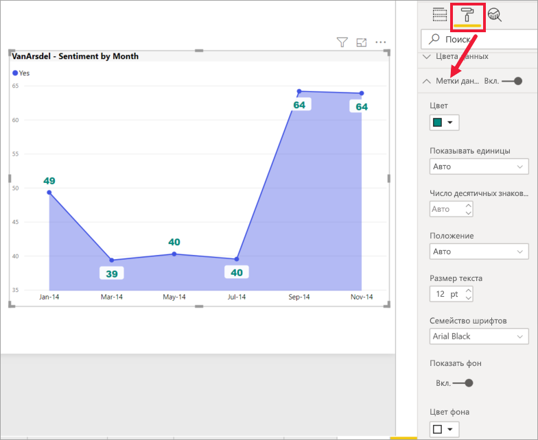

Мы выбрали визуализацию, чтобы сделать ее активной, и открыли вкладку "Форматирование".  Мы выбрали параметр **метки данных** и активировали его. Затем мы увеличили шрифт до 12, изменили семейство шрифтов на Arial Black, включили **Показать фон** и изменили цвет фона на белый с прозрачностью 5 %.

Это лишь некоторые из возможных задач форматирования. Откройте отчет в режиме редактирования и изучите панель форматирования, чтобы научиться создавать привлекательные и информативные визуализации.

## Дальнейшие действия
Дополнительные сведения см. в следующей статье: 

* [Фильтрация и совместное использование отчета Power BI](../collaborate-share/service-share-reports.md).

* [Советы и рекомендации по форматированию цветом в Power BI](service-tips-and-tricks-for-color-formatting.md)  
* [Условное форматирование в таблицах](../create-reports/desktop-conditional-table-formatting.md)

