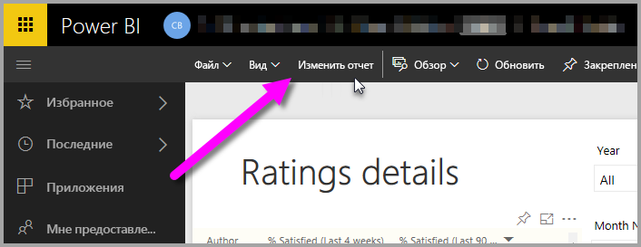
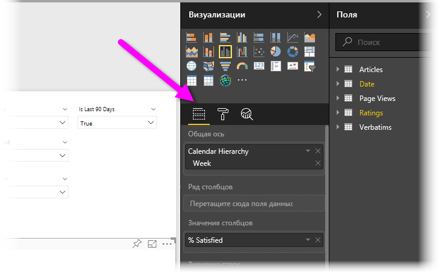
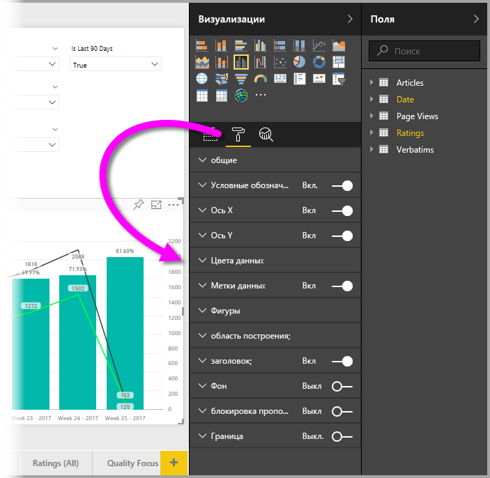
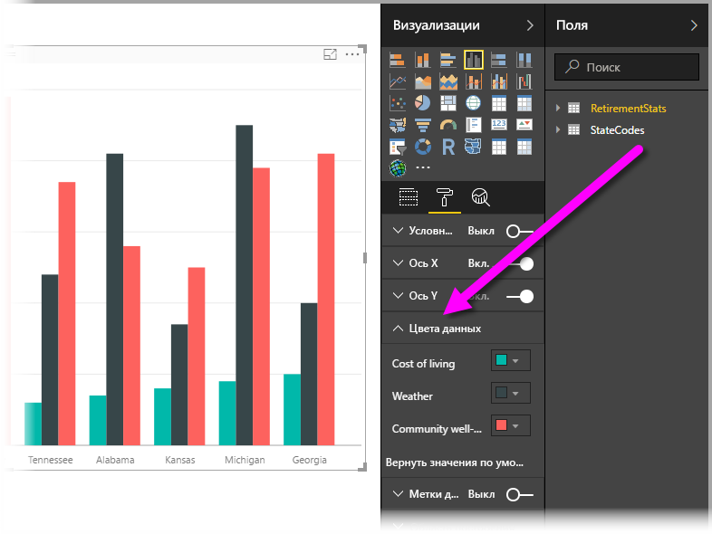
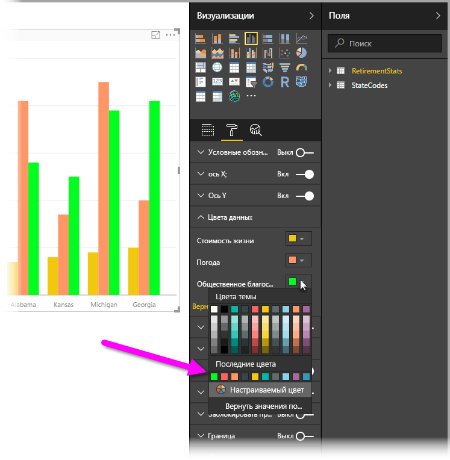
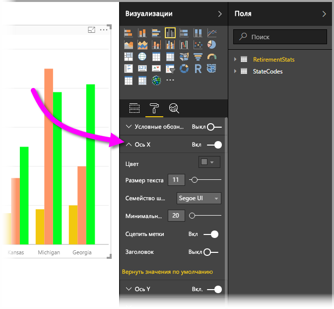

# Начало работы с форматированием цветом и свойствами осей
В **Power BI** вы можете изменять цвет ряда данных, точек данных и даже фона визуализаций. Вы также можете изменять способ представления осей X и Y, что позволяет полностью контролировать внешний вид панелей мониторинга и отчетов.

Чтобы приступить к работе, выберите элемент **Отчет** в области **Моя рабочая область** . Затем в верхней области меню выберите пункт **Изменить отчет**.  

Когда вы изменяете отчет с выбранной визуализацией, появляется область **Визуализации** , в которой можно добавлять или изменять визуализации. Непосредственно под доступными визуализациями имеется три значка: **Поля** (стопка полос), **Формат** (валик) и **Аналитика** (увеличительное стекло). На приведенном ниже рисунке выбран значок **Поля** , что указывается желтой полосой под значком.

При выборе значка **Формат**в области под значком отображаются настройки цветов и осей, доступные для выбранной визуализации.  

В каждой визуализации вы можете настраивать множество элементов:

* Условные обозначения
* ось X;
* ось Y;
* цвета данных;
* Метки данных
* Фигуры
* Область построения
* Название
* Фон
* блокировка пропорций;
* Граница

> [!NOTE]
>  
> Не все эти элементы отображаются в каждом типе визуализации. На доступные настройки будет влиять выбранная визуализация; например, если выбрана круговая диаграмма, вы не увидите ось X, поскольку круговые диаграммы не имеют оси X.

Также обратите внимание, что, если никакая визуализация не выбрана, вместо значков отображается поле **Фильтры**, позволяющее применять фильтры ко всем визуализациям на странице.

Давайте рассмотрим пару примеров: один по работе с цветами, другой по изменению свойств оси. Далее вы должны быть готовы настраивать цвета, оси и метки весь день.

## Работа с цветами

Рассмотрим шаги, необходимые для настройки цветов на диаграмме.

1. Я выбираю на холсте отчета **гистограмму с группировкой** .
2. Далее я выбираю значок **Формат** , чтобы отобразить доступные настройки.
3. Затем я выбираю маленькую стрелку вниз слева от настройки **Цвета данных** . Будет показано, как можно настроить цвета данных в конкретной выбранной мной визуализации.
4. Поле **Цвета данных** развертывается вниз для отображения доступных настроек.  
   

Давайте внесем некоторые изменения. Можно выбрать стрелку вниз рядом с цветом, чтобы изменить каждый доступный ряд данных. Я сделаю данные по **прожиточному уровню** желтыми, данные по **погоде**— оранжевыми, а по **общему благосостоянию** — зелеными. Следующий экран показывает, как я на последнем шаге изменяю **стоимость жизни**.  

Эти изменения показаны на приведенном ниже рисунке. Отлично, теперь это яркая диаграмма. Стоит взять на заметку несколько полезных элементов для работы с цветами. Номера в следующем списке также показаны на следующем экране, где можно посмотреть или изменить эти полезные элементы.

1. Не нравятся цвета? Нет проблем: просто выберите **Вернуться к значению по умолчанию** , и будут восстановлены значения по умолчанию. Это можно сделать для одного цвета или для всей визуализации.
2. Нужен цвет, который не представлен в палитре? Просто выберите **Настраиваемый цвет**, а затем выберите нужный цвет из спектра.  
   

Не в восторге от внесенных изменений? Используйте привычное сочетание клавиш **CTRL+Z** для отмены.

## Изменение свойств оси

Часто требуется изменить ось X или Y. Как и при работе с цветами, вы можете изменить ось, выбрав значок со стрелкой вниз слева от оси, которую требуется изменить, как показано на следующем рисунке.  

Чтобы свернуть параметры **оси X** , просто выберите значок со стрелкой вверх рядом с **осью X**.

Можно полностью удалить метки оси X, используя переключатель рядом с **осью X**. Вы также можете указать, следует ли включить или отключить заголовок оси, установив соответствующий переключатель рядом с пунктом **Заголовок**.  

Вы можете применять в своих панелях мониторинга и отчетах Power BI все виды цветов и множество других настроек.

> [!NOTE]
>  
> Цвета, оси и связанные настройки, доступные при выборе значка **Формат**, также доступны в Power BI Desktop.

## Задание цвета на основе текстовых значений

Начиная с обновления за август 2018 г. в **Power BI Desktop** можно задать цвета по текстовому значению или шестнадцатеричному коду для выбранного элемента отчета. Дополнительные сведения см. в разделе [Условное форматирование в таблицах](../desktop-conditional-table-formatting.md).

## Дальнейшие действия
Дополнительные сведения см. в следующей статье:  

* [Советы и рекомендации по форматированию цветом в Power BI](service-tips-and-tricks-for-color-formatting.md)  
* [Условное форматирование в таблицах](../desktop-conditional-table-formatting.md)

