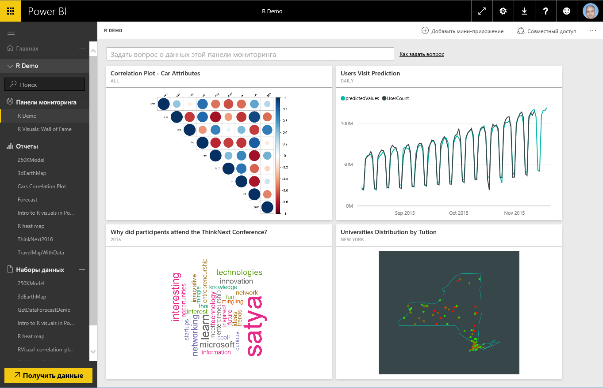
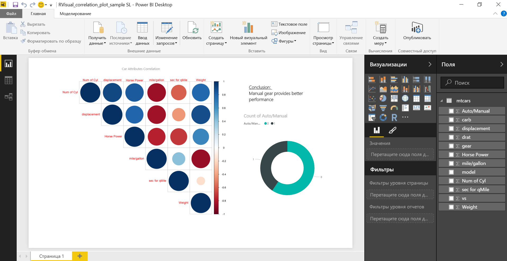
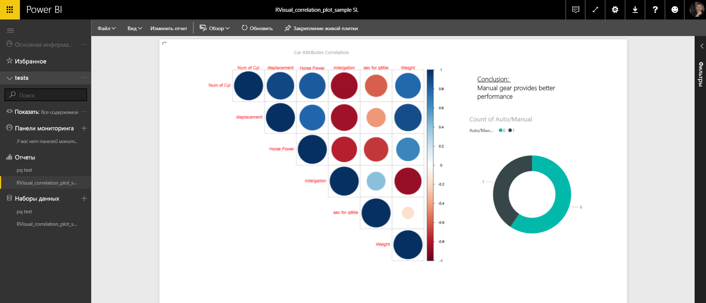
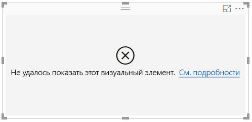
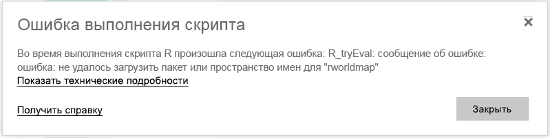

# Создание визуальных элементов R в службе Power BI
В службе Power BI можно просматривать визуальные элементы, созданные с использованием R-скриптов, и взаимодействовать с ними. Такие элементы, часто называемые *визуальными элементами R*, могут использоваться для расширенного форматирования и анализа данных, например прогнозирования, с помощью передовых средств аналитики и визуализации языка R.

> [!NOTE]
> [Язык программирования R](https://www.r-project.org/) — самый популярный язык программирования среди специалистов по статистике, обработке и анализу данных, а также бизнес-аналитиков. В сообществе разработчиков ПО с открытым исходным кодом для языка R доступно более 7 000 дополнительных пакетов, а также есть популярные группы пользователей R. В службе Power BI используется версия языка *Revolution R Open 3.2.2.*
> 
> 

На изображении ниже показана панель мониторинга Power BI с набором визуальных элементов R, используемых для расширенной аналитики.

Визуальные элементы R создаются в [отчетах Power BI Desktop](../desktop-get-the-desktop.md), таких как показанный на приведенном ниже рисунке.

Создав в **Power BI Desktop** отчет с одним визуальным элементом R (или несколькими), вы можете опубликовать его в службе Power BI. Сейчас визуальные элементы R для публикации в службе Power BI можно создавать только в приложении **Power BI Desktop**. Дополнительные сведения о создании элементов R см. в статье [Создание визуальных элементов Power BI с помощью языка R (Power BI Desktop)](../desktop-r-visuals.md).

Обратите внимание на то, что в службе поддерживаются не все пакеты R. Список пакетов, в настоящее время поддерживаемых в службе Power BI, приведен в конце этой статьи.

Вы можете скачать [образец файла Power BI Desktop](http://download.microsoft.com/download/D/9/A/D9A65269-D1FC-49F8-8EC3-1217E3A4390F/RVisual_correlation_plot_sample%20SL.pbix) (PBIX-файла), содержащего несколько визуальных элементов R, чтобы посмотреть, как они работают, и поэкспериментировать.

Визуальные элементы R, создаваемые в приложении **Power BI Desktop** и публикуемые в службе Power BI, в целом работают так же, как и любые другие визуальные элементы: вы можете взаимодействовать с ними, выполнять фильтрацию, создавать срезы и закреплять их на панели мониторинга, а также предоставлять к ним доступ другим пользователям. Дополнительные сведения о предоставлении доступа к панелям мониторинга и визуальным элементам см. в разделе [Совместное использование панели мониторинга с коллегами и другими пользователями](../service-share-dashboards.md). Одно из отличий от других визуальных элементов заключается в том, что на элементах R не отображаются подсказки и их нельзя использовать для фильтрации данных в других визуальных элементах.

Как видно на изображении ниже, визуальные элементы R в службе Power BI — как на панелях мониторинга, так и на отчетах — выглядят и работают в основном так же, как и любые другие визуальные элементы, и пользователям не нужно знать о том, что они созданы на базе R-скриптов.

## Безопасность R-скриптов
Визуальные элементы R создаются на базе R-скриптов, которые могут содержать код, не обеспечивающий достаточный уровень безопасности или конфиденциальности.

Соответствующие риски в основном возникают на этапе создания, когда автор скрипта запускает его на собственном компьютере.

Служба Power BI использует технологию *песочницы* для защиты пользователей и сервисов от угроз для безопасности.

Технология *песочницы* устанавливает ряд ограничений в отношении R-скриптов, запускаемых в службе Power BI. Они связаны, в частности, с доступом в Интернет и к другим ресурсам, которые не нужны для создания визуального элемента R.

## Ошибки в R-скриптах
Если при выполнении R-скрипта возникает ошибка, визуальный элемент R не наносится на холст и появляется сообщение об ошибке. Чтобы просмотреть подробные сведения о ней, выберите **соответствующую команду**в сообщении на холсте, как показано на изображении ниже).

В качестве еще одного примера на приведенном ниже изображении показано сообщение об ошибке, которое появляется, когда R-скрипту не удается запуститься из-за отсутствия пакета R в Azure.

## Лицензирование
Для отображения визуальных элементов R в отчетах, их обновления и фильтрации (в том числе перекрестной) необходима лицензия [Power BI Pro](../service-self-service-signup-for-power-bi.md). Дополнительные сведения о лицензиях Power BI Pro и об их отличиях от бесплатных лицензий см. в статье [Что такое содержимое Power BI Pro?](../service-admin-purchasing-power-bi-pro.md).

Пользователи бесплатной версии Power BI могут работать только с плитками, к которым им предоставлен доступ в рабочих областях Premium. Дополнительные сведения см. в статье [Приобретение Power BI Pro](../service-admin-purchasing-power-bi-pro.md).

В таблице ниже описаны возможности визуальных элементов R с учетом типа лицензии.

|  |Создание визуальных элементов R в приложении Power BI Desktop  | Создание отчетов службы PBI с визуальными элементами R |Просмотр визуальных элементов R в отчетах  | Просмотр плиток R на панелях мониторинга |
|---------|---------|---------|---------|--------|
|**Гость** (Power BI Embedded)     |  Поддерживается|  Не поддерживается      | Поддерживается только в емкости Premium или Azure  | Поддерживается только в емкости Premium или Azure |
|**Неуправляемый клиент** (домен не проверен) | Поддерживается | Не поддерживается |  Не поддерживается |Поддерживается (в сценарии B2B) |
|**Управляемый клиент** с бесплатной лицензией    |  Поддерживается       |  Не поддерживается       |    Поддерживается только в емкости Premium    | Поддерживается |
**Управляемый клиент** с лицензией Pro     |   Поддерживается      | Поддерживается      | Поддерживается    |Поддерживается|

## Известные ограничения
Для визуальных элементов R в службе Power BI действует ряд ограничений.

* Поддерживаются только пакеты R, перечисленные на следующей странице <make this a link to the supported packages page per my excel>. Пользовательские пакеты в настоящее время не поддерживаются.
* Ограничения на размер данных: для нанесения на холст визуальный элемент R может использовать до 150 000 строк. Если выбрано больше строк, используются только первые 150 000 из них; при этом на изображении появляется соответствующее сообщение.
* Ограничение на время вычисления: если время вычисления для визуального элемента R превышает 60 секунд, истекает время ожидания выполнения и возникает ошибка.
* Визуальные элементы R обновляются при обновлении данных, применении фильтрации и выделения. Однако само изображение не является интерактивным и не поддерживает подсказки.
* Визуальные элементы R реагируют на выделение других визуальных элементов, однако выполнять перекрестную фильтрацию, выбирая объекты на визуальном элементе R, нельзя.
* В настоящее время визуальные элементы R не поддерживаются для типа данных *Время*. Используйте тип "Дата и время".
* В настоящее время визуальные элементы R не отображаются при использовании функции **Опубликовать в Интернете**.
* В настоящее время визуальные элементы R не выводятся на печать вместе с панелями мониторинга и отчетами.
* В настоящее время визуальные элементы R не поддерживаются в режиме DirectQuery работы со службами Analysis Services.
* Вам нужно выполнить все дополнительные шаги ниже для правильной работы со шрифтами на китайском, японском и корейском языках в службе Power BI:
  
  * Сначала установите пакет R *showtext* со всеми зависимыми компонентами. Это можно сделать, выполнив следующий скрипт:
    
        *install.packages("showtext")*
  * Затем добавьте следующую строку в начало скрипта R:
    
        powerbi_rEnableShowTextForCJKLanguages =  1

## Обзор пакетов R
Пакеты R — это наборы функций, данных и скомпилированного кода R, которые объединены в четко определенном формате. Устанавливаемые элементы R поставляются со стандартным набором пакетов. Также для скачивания и установки доступны и другие пакеты. Установленные пакеты R следует загрузить в сеанс для использования. Основной источник бесплатных пакетов R — это сеть CRAN, [Comprehensive R Archive Network](https://cran.r-project.org/web/packages/available_packages_by_name.html).

В **Power BI Desktop** можно свободно использовать любой тип пакетов R. Вы можете установить пакеты R для использования в **Power BI Desktop** самостоятельно (например, с помощью [интегрированной среды разработки RStudio](https://www.rstudio.com/)).

Визуальные элементы R в **службе Power BI** **поддерживают пакеты**, которые описываются дальше в [этой статье](../service-r-packages-support.md). Если вы не нашли нужный пакет в списке, можно запросить поддержку пакета. Дополнительные сведения о запросе поддержки см. в статье [Пакеты R в службе Power BI](../service-r-packages-support.md).

### Требования и ограничения для пакетов R
Для пакетов R существуют определенные требования и ограничения.

* Служба Power BI преимущественно поддерживает пакеты R с лицензиями на свободное ПО и ПО с открытым исходным кодом, включая GPL-2, GPL-3, MIT+ и т. д.
* Служба Power BI поддерживает пакеты, опубликованные в CRAN. Служба не поддерживает закрытые или пользовательские пакеты R. Мы рекомендуем пользователям сделать свои закрытые пакеты доступными в CRAN, прежде чем запрашивать доступность пакета в службе Power BI.
* Для **Power BI Desktop** доступны два варианта использования пакетов R.
  
  * Для визуальных элементов R можно установить любой пакет, включая пользовательские пакеты R.
  * Для пользовательских визуальных элементов R поддерживаются только открытые пакеты CRAN для автоматической установки пакетов.
* Из соображений конфиденциальности и безопасности пакеты R, которые передают запросы клиент-сервера в службу через Интернет (например RgoogleMaps), сейчас не поддерживаются. Возможность подключения для таких попыток заблокирована. Дополнительные сведения о списке поддерживаемых и неподдерживаемых пакетов R см. в статье [Пакеты R в службе Power BI](../service-r-packages-support.md).
* При утверждении нового пакета R для включения используется дерево зависимостей. При этом некоторые необходимые для установки службы зависимости не поддерживаются.

### Поддерживаемые пакеты:
Ознакомиться с длинным списком поддерживаемых пакетов R (и коротким списком неподдерживаемых пакетов) можно в следующей статье:

* [Пакеты R в службе Power BI](../service-r-packages-support.md)

