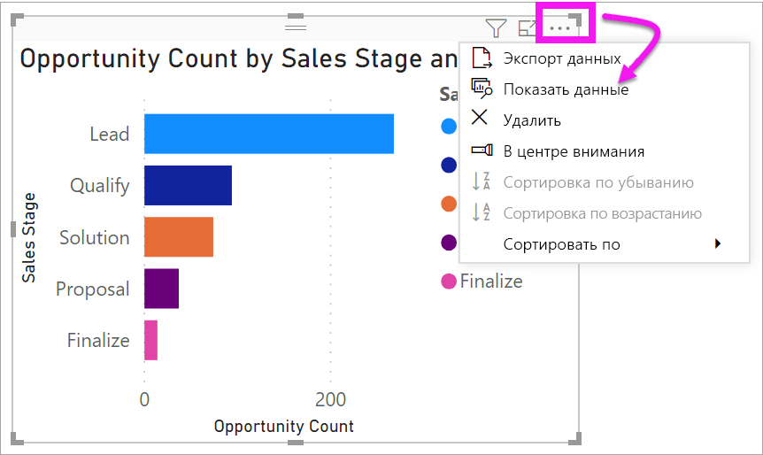
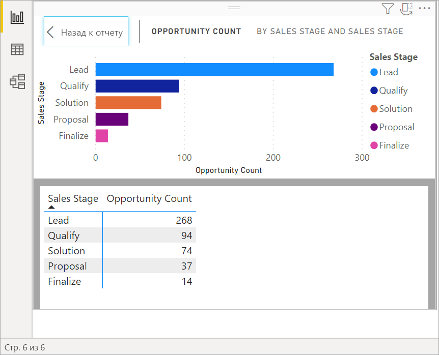
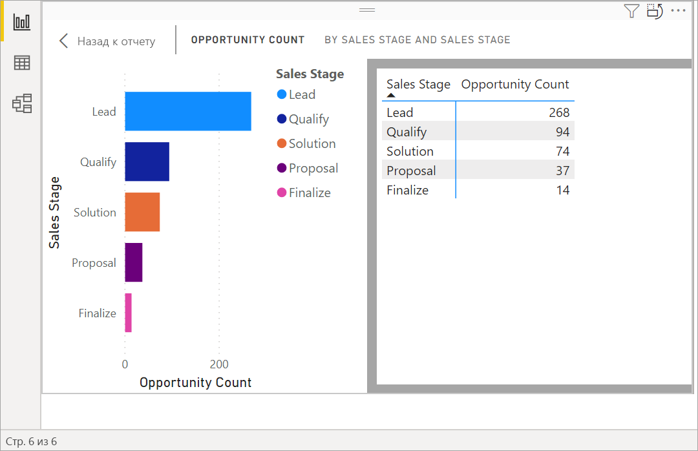
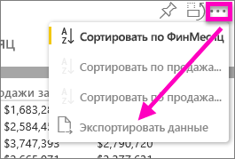
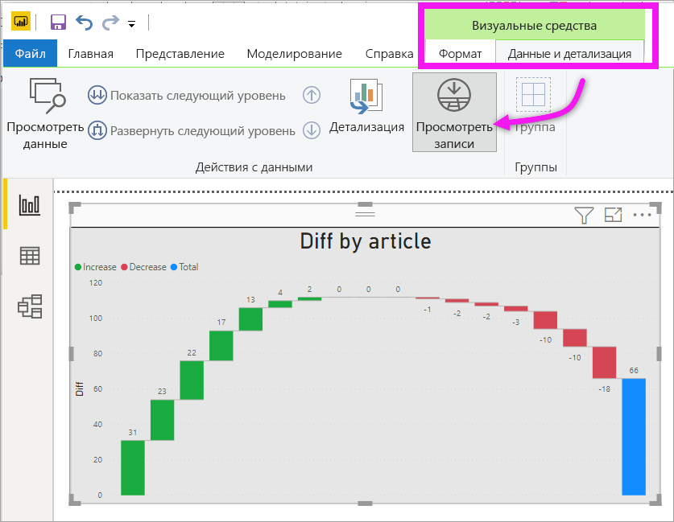
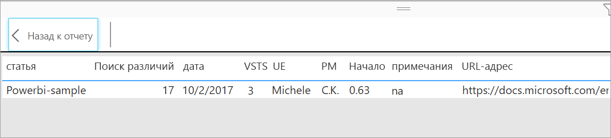

# Отображение базовых данных визуального элемента

## Показ данных
Визуализация Power BI создается на основе данных из наборов данных. Если вы хотите копнуть поглубже, Power BI дает возможность *просмотреть* данные, лежащие в основе визуального элемента. Если выбрать функцию **Показать данные**, Power BI отобразит рядом с визуализацией или под ней связанную информацию.

Данные, используемые для создания визуализации, можно экспортировать в файл XLSX или CSV и просмотреть его в Excel. Дополнительные сведения см. в статье [Экспорт данных из визуализаций Power BI](power-bi-visualization-export-data.md).

> [!NOTE]
> Функции *Показать данные* и *Экспортировать данные* доступны как в службе Power BI, так и в приложении Power BI Desktop. Но в Power BI Desktop есть дополнительный уровень детализации: функция [*Показать записи* отображает фактические строки из набора данных](../desktop-see-data-see-records.md).
> 
> 

## Использование команды *Показать данные* 
1. В Power BI Desktop выберите визуализацию, чтобы сделать ее активной.

2. Щелкните **Дополнительные действия** (…) и выберите **Показать данные**. 
    

3. По умолчанию данные отображаются под визуальным элементом.
   
   

4. Чтобы изменить ориентацию, выберите вертикальную ориентацию  в правом верхнем углу визуализации.
   
   
5. Чтобы экспортировать данные в CSV-файл, щелкните значок многоточия и выберите **Экспортировать данные**.
   
    
   
    Дополнительные сведения об экспорте данных в Excel см. в статье [Экспорт данных из визуализаций Power BI](power-bi-visualization-export-data.md).
6. Чтобы скрыть данные, снимите флажок, выбрав **Проводник** > **Показать данные**.

## Использование кнопки "Просмотреть записи"
Вы можете сконцентрироваться на одной записи данных в визуализации и подробно рассмотреть его данные. 

1. Для использования кнопки **Просмотреть записи** выберите визуализацию, чтобы сделать ее активной. 

2. На ленте в Power BI Desktop выберите вкладку **Визуальные средства** > **Данные и детализация** > **Просмотреть записи**. 

    

3. Выберите точку данных или строку в визуализации. В этом примере мы выбрали четвертый столбец слева. В Power BI отображается запись из набора данных для этой точки данных.

    

4. Выберите **Назад к отчету**, чтобы вернуться на холст отчетов в Power BI Desktop. 

## Рекомендации и устранение неполадок

- Если кнопка **Просмотреть записи** на ленте отключена и выделена серым цветом, это означает, что выбранная визуализация не поддерживает просмотр записей.
- Вы не можете изменить данные в представлении просмотра записей и снова сохранить их в отчете.
- Кнопку "Просмотреть записи" нельзя использовать, если для визуализации применяется вычисляемый показатель.
- Кнопку "Просмотреть записи" нельзя использовать при подключении к динамической многомерной модели.  

## Дальнейшие действия
[Экспорт данных из визуализаций Power BI](power-bi-visualization-export-data.md)    

У вас имеются и другие вопросы? [Ответы на них см. в сообществе Power BI.](https://community.powerbi.com/)

