# Советы и рекомендации по форматированию цветом в Power BI
В Power BI предусмотрено много разных способов настройки панелей мониторинга и отчетов. В этой статье приводятся советы о том, как сделать визуализации в Power BI более привлекательными и интересными и настроить их в соответствии с потребностями.

Предлагаются следующие советы. Есть еще один хороший совет? Отлично! Отправьте его нам, и мы добавим его в этот список.

* Изменение цвета отдельной точки данных
* Выбор цвета диаграммы на основе числового значения
* Выбор цвета точек данных на основе значения поля
* Настройка цветов, используемых в цветовой шкале
* Использование расходящихся цветовых шкал
* Отмена действий в Power BI

Чтобы внести изменения, нужно открыть отчет в режиме редактирования. Откройте отчет и в верхней части меню выберите **Изменить отчет**, как показано на следующем изображении.

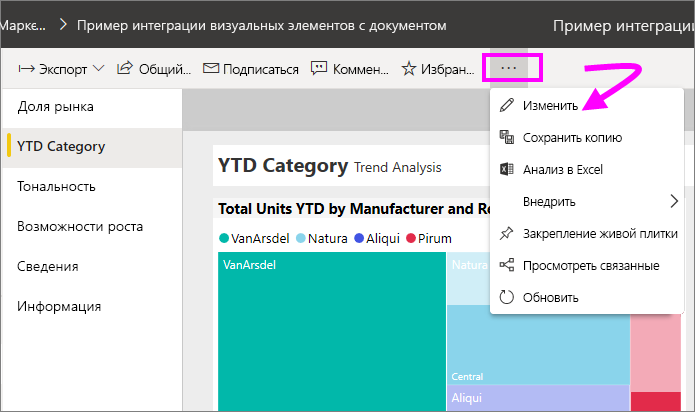

Когда в правой части холста отчета появляются области **Фильтры** и **Визуализации**, можно приступать к настройке. Если панель не отображается, щелкните стрелку в правом верхнем углу, чтобы открыть эту панель.

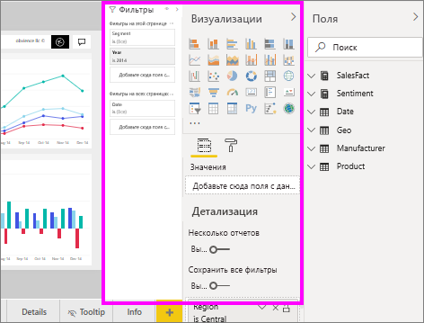

## Изменение цвета отдельной точки данных
Иногда требуется выделить одну точку данных. Возможно, это объемы продаж для запуска нового продукта или повышенные показатели качества после запуска новой программы. С помощью Power BI можно выделить конкретную точку данных, изменив ее цвет.

В следующей визуализации проданные товары ранжируются по сегментам продуктов. 

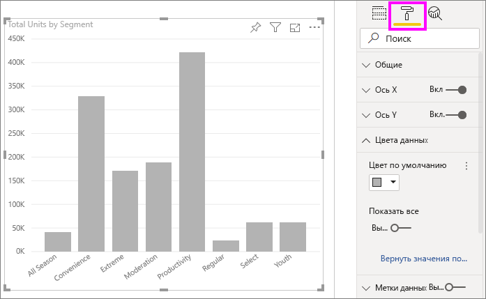

Теперь предположим, что нужно обратиться к сегменту **Convenience**, чтобы с помощью цвета показать, насколько хорошо реализуется товар в этом новом сегменте. Это делается следующим образом.

Разверните раздел **Цвета данных** и для параметра **Показать все** установите ползунок в положение "Включено". Будут выведены цвета для каждого элемента данных в визуализации. При наведении указателя мыши на точки данных включается прокрутка, и вы можете изменить любые точки данных.

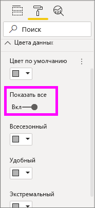

Для точки данных **Convenience** выберите оранжевый цвет. 

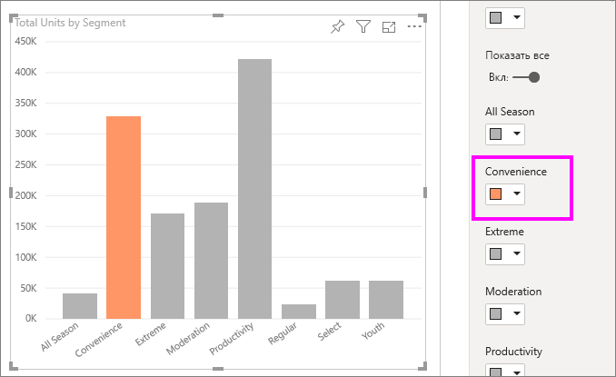

После выбора цвета точка данных **Convenience** приобретает красивый оттенок оранжевого и определенно выделяется среди других.

Даже если вы измените тип визуализации, а затем вернетесь к прежнему выбору, Power BI запомнит выбор и будет отображать пункт **Convenience** оранжевым цветом.

Можно изменить цвет точки данных для одного, нескольких или всех элементов данных в визуализации. Возможно, вы хотите, чтобы в визуализации использовались фирменные цвета компании. 

Применение цветов дает очень широкие возможности. В следующем разделе мы рассмотрим градиентные заливки.

## Выбор цвета диаграммы на основе числового значения
Для диаграмм часто удобно динамическое задание цвета на основе числового значения поля. Таким образом можно показать значение, которое отличается от используемого для размера столбца, или показать два значения на одной диаграмме. С помощью цвета также можно выделить точки выше (или ниже) определенного значения, например выделив области низкой рентабельности.

В следующих разделах демонстрируются разные способы настройки выбора цвета на основе числового значения.

## Выбор цвета точек данных на основе значения
Чтобы изменять цвет на основе значения, откройте панель форматирования и выберите параметр **Условное форматирование**.  

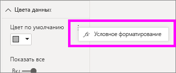

В области "Цвет по умолчанию" используйте раскрывающиеся списки для определения полей, используемых для условного форматирования. В этом примере мы выбрали поле **Sales fact** > **Total Units**, а также указали светло-синий цвет для **наименьшего значения** и темно-синий для **наибольшего значения**. 

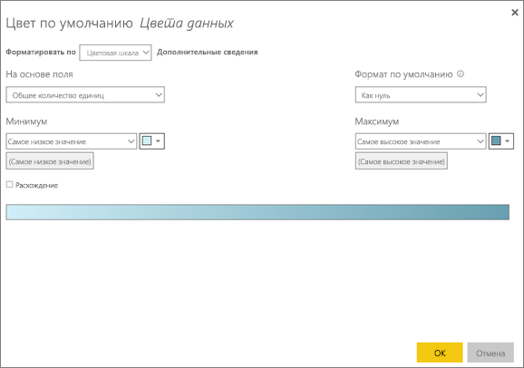

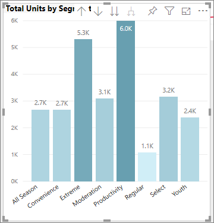

Вы также можете форматировать цвет визуального элемента с помощью поля, которое не является частью этого элемента. На следующем изображении используется **%Market Share SPLY YTD**. 

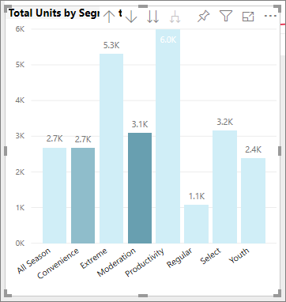

Как показано на изображении, несмотря на то, что мы продали больше товаров в сегментах **Productivity** и **Extreme** (эти столбцы выше остальных), цвет столбца **Moderation** более насыщенный, так как имеет большее значение **%Market Share SPLY YTD**.

## Настройка цветов, используемых в цветовой шкале
Можно также изменить способ сопоставления значений и цветов. На следующем рисунке для **минимального** и **максимального** значений заданы оранжевый и зеленый цвета соответственно.

На первом рисунке обратите внимание, как столбцы в диаграмме отражают градиент в строке: самому высокому значению назначен зеленый цвет, самому низкому — оранжевый, и каждый столбец между ними окрашен оттенками спектра между зеленым и оранжевым.

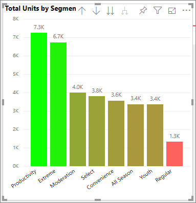

Давайте посмотрим, что произойдет, если мы укажем для полей **Минимум** и **Максимум** числовые значения. Зададим для поля **Минимум** значение 3500, а для поля **Максимум** — 6000.

При выборе таких значений градиент больше не применяется к значениям на диаграмме, которые ниже **минимума** или выше **максимума**. Все столбцы со значением, превышающим **максимальное**, окрашены зеленым, а столбцы со значением ниже **минимального** окрашены красным.

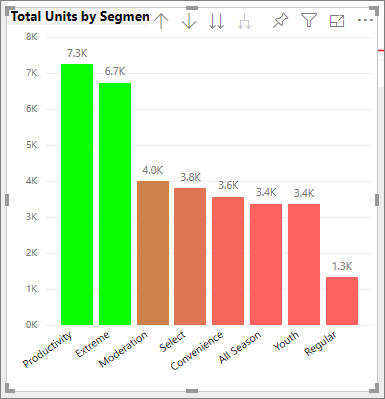

## Использование расходящихся цветовых шкал
Иногда к данным могут применяться естественные расходящиеся шкалы. Например, диапазон температур имеет естественный центр в точке замерзания, а показатели рентабельности — естественную среднюю точку (нуль).

Чтобы использовать расходящиеся цветовые шкалы, выберите значение **Расхождение**. Если режим **Расхождение** включен, появляется дополнительное поле выбора цвета с именем **Центр**, как показано на следующем рисунке.

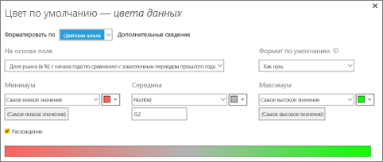

Если включен режим **расхождения** , можно задать цвета для полей **Минимум**, **Максимум** и **Центр** по-отдельности. На следующем рисунке в поле **Центр** задано значение 0,2 для **% Market Share SPLY YTD**, поэтому к столбцам со значениями выше 0,2 применяется градиентная заливка зеленым, а к столбцам со значениями ниже единицы — оттенки красного.

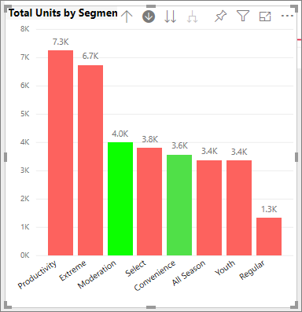

## Отмена действий в Power BI
Как и многие другие службы и программное обеспечение Майкрософт, Power BI обеспечивает простой способ отмены последней команды. Предположим, вы изменили цвет точки данных или ряда точек данных и вам не понравился цвет, когда он появился в визуализации. Вы не помните точно, какой цвет использовался раньше, но уверены, что его нужно вернуть.

Чтобы **отменить** последнее действие (или несколько последних действий), нужно всего лишь:

- нажать клавиши CTRL + Z.

## Отзывы
У вас есть совет, которым вы хотели бы поделиться? Отправьте его нам, и, возможно, мы добавим его в эту статью.

>[!NOTE]
>Цвета, оси и связанные настройки, доступные при выборе значка **Формат**, также доступны в Power BI Desktop.

## Дальнейшие действия
[Начало работы с форматированием цветом и свойствами осей](service-getting-started-with-color-formatting-and-axis-properties.md)

