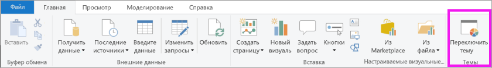
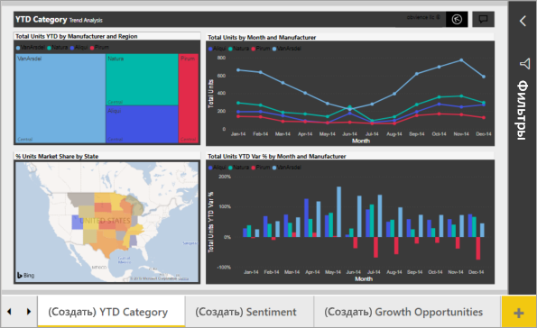
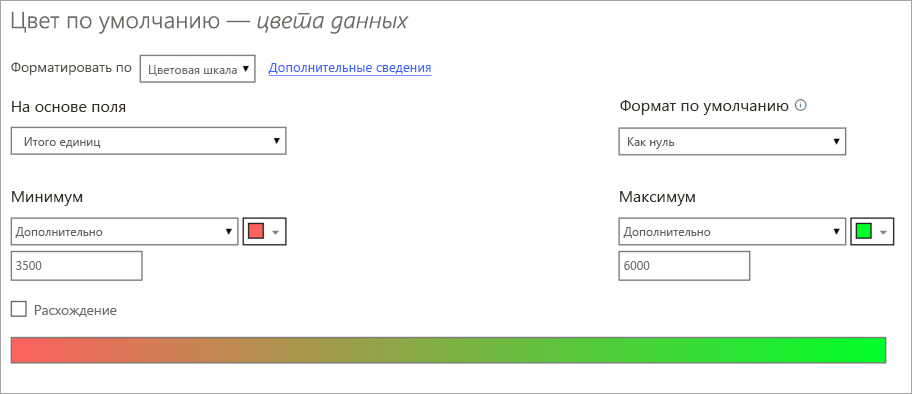
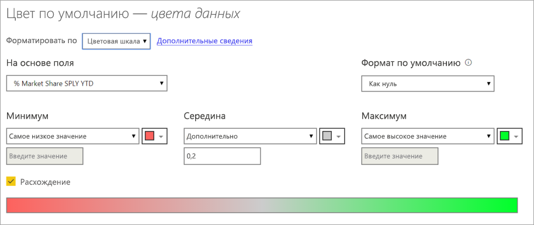
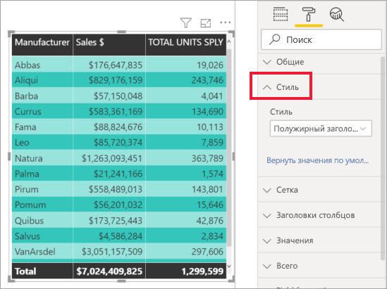
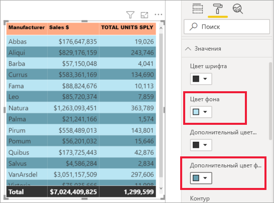
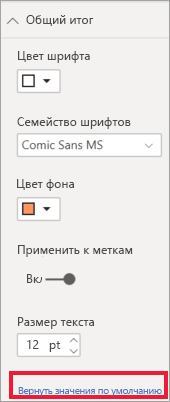

# Советы и рекомендации по форматированию цветом в Power BI
В Power BI предусмотрено много разных способов настройки панелей мониторинга и отчетов. В этой статье приводятся советы о том, как сделать визуализации в Power BI более привлекательными и интересными и настроить их в соответствии с потребностями.

Предлагаются следующие советы. Есть еще один хороший совет? Отлично! Отправьте его нам, и мы добавим его в этот список.

* Применение темы ко всему отчету
* Изменение цвета отдельной точки данных
* Условное форматирование
* Выбор цвета диаграммы на основе числового значения
* Выбор цвета точек данных на основе значения поля
* Настройка цветов, используемых в цветовой шкале
* Использование расходящихся цветовых шкал
* Добавление цвета в строки таблицы
* Отмена действий в Power BI

Для внесения изменений необходимо иметь разрешения на внесение изменений в отчет. В Power BI Desktop откройте отчет в представлении **Отчет**. В службе Power BI это означает открытие отчета и выбор команды **Изменить** в строке меню, как показано на рисунке ниже.

Когда в правой части холста отчета появляются области **Фильтры** и **Визуализации**, можно приступать к настройке. Если области не отображаются, щелкните стрелку в правом верхнем углу, чтобы открыть их.

## Применение темы
С помощью тем отчета можно применить изменения макета ко всему отчету, например использовать корпоративные цвета, изменить наборы значков или применить новое визуальное форматирование по умолчанию. При применении темы отчета для всех визуальных элементов в отчете используются цвета и форматирование из выбранной темы. Дополнительные сведения см. в статье [Использование тем отчета](../desktop-report-themes.md).

В этом примере к отчету "Продажи и маркетинг" применена тема **Инновации**.

## Изменение цвета отдельной точки данных
Иногда требуется выделить одну точку данных. Возможно, это объемы продаж для запуска нового продукта или повышенные показатели качества после запуска новой программы. С помощью Power BI можно выделить конкретную точку данных, изменив ее цвет.

В следующей визуализации проданные товары ранжируются по сегментам продуктов. 

Теперь предположим, что нужно обратиться к сегменту **Convenience**, чтобы с помощью цвета показать, насколько хорошо реализуется товар в этом новом сегменте. Это делается следующим образом.

Разверните карточку **Цвета данных** и установите ползунок **Показать все** в положение "Вкл". Будут выведены цвета для каждого элемента данных в визуализации. Теперь можно изменить любую точку данных.

Для точки данных **Convenience** выберите оранжевый цвет. 

После выбора цвета точка данных **Convenience** приобретает красивый оттенок оранжевого и определенно выделяется среди других.

Даже если вы измените тип визуализации, а затем вернетесь к прежнему выбору, Power BI запомнит выбор и будет отображать пункт **Convenience** оранжевым цветом.

Можно изменить цвет точки данных для одного, нескольких или всех элементов данных в визуализации. Возможно, вы хотите, чтобы в визуализации использовались фирменные цвета компании (желтый, зеленый и синий). 

Применение цветов дает очень широкие возможности. В следующем разделе мы рассмотрим условное форматирование.

## Условное форматирование визуализаций
Для визуализаций часто удобно динамически задавать цвет на основе числового значения поля. Таким образом можно показать значение, которое отличается от используемого для размера столбца, или показать два значения на одной диаграмме. С помощью цвета также можно выделить точки выше (или ниже) определенного значения, например выделив области низкой рентабельности.

В следующих разделах демонстрируются разные способы настройки выбора цвета на основе числового значения.

### Выбор цвета точек данных на основе значения
Для изменения цвета в соответствии со значением выберите визуализацию, чтобы сделать ее активной. Откройте область форматирования, щелкнув значок валика и развернув карточку **Цвета данных**. Наведите указатель мыши на карточку, щелкните три вертикальные точки и выберите пункт **Условное форматирование**.  

В области **Цвет по умолчанию** используйте раскрывающиеся списки для определения полей, используемых для условного форматирования. В этом примере мы выбрали поле **Sales fact** > **Total Units**, а также указали светло-синий цвет для **наименьшего значения** и темно-синий для **наибольшего значения**. 

Вы также можете форматировать цвет визуального элемента с помощью поля, которое не является частью этого элемента. На следующем изображении используется **%Market Share SPLY YTD**. 

Как показано на изображении, несмотря на то что мы продали больше товаров в сегментах **Productivity** и **Extreme** (эти столбцы выше остальных), цвет столбца **Moderation** более насыщенный, так как имеет большее значение **%Market Share SPLY YTD**.

### Настройка цветов, используемых в цветовой шкале
Можно также изменить способ сопоставления значений и цветов. На следующем рисунке для **минимального** и **максимального** значений заданы оранжевый и зеленый цвета соответственно.

На первом рисунке обратите внимание, как столбцы в диаграмме отражают градиент в строке: самому высокому значению назначен зеленый цвет, самому низкому — оранжевый, и каждый столбец между ними окрашен оттенками спектра между зеленым и оранжевым.

Давайте посмотрим, что произойдет, если мы укажем для полей **Минимум** и **Максимум** числовые значения. Выберите пункт **Настраиваемое** в раскрывающихся полях **Минимум** и **Максимум** и установите для поля **Минимум** значение 3500, а для поля **Максимум** — значение 6000.

При выборе таких значений градиент больше не применяется к значениям на диаграмме, которые ниже **минимума** или выше **максимума**. Все столбцы со значением, превышающим **максимальное**, окрашены зеленым, а столбцы со значением ниже **минимального** окрашены красным.

### Использование расходящихся цветовых шкал
Иногда к данным могут применяться естественные расходящиеся шкалы. Например, диапазон температур имеет естественный центр в точке замерзания, а показатели рентабельности — естественную среднюю точку (нуль).

Чтобы использовать расходящиеся цветовые шкалы, установите флажок **Расхождение**. Если режим **Расхождение** включен, появляется дополнительное поле выбора цвета с именем **Центр**, как показано на следующем рисунке.

Если включен режим **расхождения** , можно задать цвета для полей **Минимум**, **Максимум** и **Центр** по-отдельности. На следующем рисунке в поле **Центр** задано значение 0,2 для **% Market Share SPLY YTD**, поэтому к столбцам со значениями выше 0,2 применяется градиентная заливка зеленым, а к столбцам со значениями ниже единицы — оттенки красного.

## Добавление цвета в строки таблицы
Таблицы и матрицы допускают множество вариантов форматирования цвета. 

Один из самых быстрых способов применения цвета к таблице или матрице — открыть вкладку "Форматирование" и выбрать **Стиль**.  На приведенном ниже рисунке выбраны **Полужирный заголовок, броские строки**.

Поэкспериментируйте с другими цветовыми вариантами форматирования. На этом изображении изменился цвет фона в области **Заголовки столбцов** и изменился **Цвет фона** и **Дополнительный цвет фона** для области **Значения** (строки).

## Отмена действий в Power BI
Как и многие другие службы и программное обеспечение Майкрософт, Power BI обеспечивает простой способ отмены последней команды. Предположим, вы изменили цвет точки данных или ряда точек данных и вам не понравился цвет, когда он появился в визуализации. Вы не помните точно, какой цвет использовался раньше, но уверены, что его нужно вернуть.

Чтобы **отменить** последнее действие (или несколько последних действий), нужно всего лишь нажать клавиши CTRL+Z.

Чтобы отменить все изменения, внесенные в карточке "Форматирование", выберите **Вернуть значения по умолчанию**.

## Отзывы
У вас есть совет, которым вы хотели бы поделиться? Отправьте его нам, и, возможно, мы добавим его в эту статью.

## Дальнейшие действия
[Начало работы с форматированием цветом и свойствами осей](service-getting-started-with-color-formatting-and-axis-properties.md)

