# Распространение содержимого Power BI для сторонних гостевых пользователей с помощью Azure Active Directory B2B

**Сводка:** В этом техническом документе описывается, как распространять содержимое для пользователей за пределами Организации, используя интеграцию Azure Active Directory "бизнес-бизнес" (Azure AD B2B).

**Модули записи:** Лукаша Павловски, Каспер де Jonge)

**Технические рецензенты:** Адам Уилсон (, Шенг Лю, Киан Лианг, Сергеем Гундоров, Джейкоб Гримм, Адам Сакстон, Maya Шенхав, Нимрод Шалит, Элизабет Олсон

> [!NOTE]
> Вы можете сохранить или распечатать этот технический документ, выбрав в браузере элемент **Печать** и затем **Сохранить как PDF**.

## Введение

Power BI предоставляет организациям всестороннюю информацию, которая позволяет в организации принимать взвешенные решения на основе данных. Многие из этих организаций обладают прочными и надежными отношениями с партнерами, клиентами и подрядчиками. Этим организациям необходимо предоставлять пользователям сторонних партнеров безопасный доступ к панелям мониторинга и отчетам Power BI.

Power BI интегрируется с [Azure Active Directory "бизнес-бизнес" (Azure AD B2B)](https://docs.microsoft.com/azure/active-directory/b2b/what-is-b2b), чтобы обеспечить безопасное распространение содержимого Power BI для сторонних гостевых пользователей и при этом сохранить контролируемый доступ к внутренним данным.

В этом техническом документе описываются все сведения, которые потребуются для интеграции Power BI с Azure Active Directory B2B. В этой статье рассматриваются наиболее часто встречающиеся ситуации, установка, лицензирование и обеспечение безопасности.

> [!NOTE]
> В этом техническом документе Azure Active Directory называется Azure AD, а Azure Active Directory "бизнес-бизнес" — как Azure AD B2B.

## Сценарии

Компания Contoso — производитель автомобильной техники, который работает со множеством поставщиков компонентов, материалов и услуг, необходимых для выполнения производственных операций. Компания Contoso стремится оптимизировать планы и логистические цепочки поставок и использовать Power BI для мониторинга ключевых показателей производительности. Компания Contoso стремится использовать простой и управляемый способ предоставлять данные аналитики партнерам в цепочке поставок.

Чтобы сторонние пользователи могли использовать Power BI и Azure AD B2B, у компания Contoso есть следующие возможности.

### Несистематический индивидуальный общий доступ

Компания Contoso работает с поставщиком, который создает радиаторы для автомобилей. Часто требуется оптимизировать надежность радиаторов путем использования данных, полученных из автомобилей Contoso. Power BI как средство аналитики Contoso используется для предоставления инженеру поставщика доступа к отчету о надежности радиаторов. Инженер получает сообщение электронной почты со ссылкой, перейдя по которой можно просмотреть отчет.

Как описано выше, этот несистематический доступ является необходимым минимумом для бизнес-пользователей. Ссылка, отправленная стороннему пользователю от Power BI, является приглашением в Azure AD B2B. Когда сторонний пользователь перейдет по ссылке, он получит приглашение присоединиться к организации Contoso Azure AD в качестве гостевого пользователя. Приняв приглашение, он сможет увидеть определенный отчет или панель мониторинга. Администратор Azure Active Directory передает организации разрешение на приглашение сторонних пользователей и выбирает, что эти пользователи смогут делать после принятия приглашение, как описано в разделе "Управление" этого документа. Аналитик компании Contoso может пригласить гостевого пользователя только потому, что администратор Azure AD разрешил это действие, а администратор Power BI разрешил пользователям приглашать гостей, которые смогут просматривать содержимое в параметрах клиента Power BI.

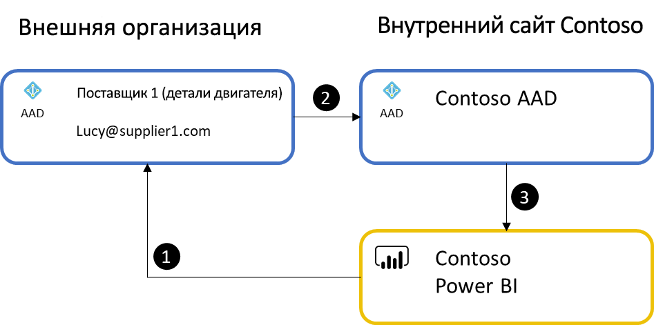

1. Процесс начинается после того, что внутренний пользователь Contoso разрешает общий доступ к панели мониторинга или к отчету стороннему пользователю. Если сторонний пользователь все еще не является гостем Contoso Azure AD, он получит приглашение. На его адрес электронной почты будет отправлено сообщение электронной почты с приглашением Contoso Azure AD.
2. Получатель принимает приглашение от Contoso Azure AD, после чего он добавляется в Contoso Azure AD в качестве гостевого пользователя.
3. Затем получатель перенаправляется на панель мониторинга Power BI, к отчету или приложению, которые доступны пользователю только для чтения.

Процесс рассматривается как несистематический, поскольку бизнес-пользователи Contoso выполняют действия по приглашению в соответствии со своими бизнес-задачами. Каждый элемент, к которому представляется доступ, обеспечивается ссылкой, с помощью которой сторонний пользователь может получить доступ для просмотра содержимого.

После предоставления стороннему пользователю доступа к ресурсам Contoso в Contoso Azure AD для них можно создать теневую учетную запись, благодаря чему потребность в повторном приглашении отпадает.  После первого получения доступа к ресурсам Contoso — например, к панели мониторинга Power BI — они пройдут через процесс предоставления согласия, который активирует приглашение.  Если процесс проверки согласия не завершить, они не смогут получить доступ к содержимому Contoso.  Если при активации приглашения через предоставляемую исходную ссылку возникли трудности, администратор Azure AD может повторно отправить специальную ссылку с приглашением для активации.

### Запланированный индивидуальный общий доступ

Компания Contoso работает с субподрядчиком, чтобы анализировать надежность радиаторов. У субподрядчика есть команда из 10 человек, которым требуется доступ к данным в среде Contoso Power BI. Администратор Contoso Azure AD занимается приглашением всех пользователей и обработкой любых дополнений/изменений в составе сотрудников субподрядчика. Администратор Azure AD создает группу безопасности для всех сотрудников субподрядчика. Сотрудники Contoso, которые используют группу безопасности, могут легко управлять доступом к отчетам, и обеспечить требуемый доступ персонала субподрядчика к отчетам, сводным панелям и приложениям Power BI. Администратор Azure AD также может избежать процесса отправки приглашений, делегировав права на приглашение доверенному сотруднику Contoso или субподрядчику, что позволит обеспечить своевременное управление персоналом.

Некоторые организации требуют дополнительного контроля при добавлении сторонних пользователей — они приглашают много сторонних пользователей или множество сторонних организаций. В этих случаях запланированный общий доступ можно использовать для управления масштабом доступа, как для применения политик организации, так и для передачи прав на приглашение и управление сторонними пользователями доверенным лицам. Azure AD B2B поддерживает прямую отправку запланированных приглашений [ИТ-администратором из портала Azure](https://docs.microsoft.com/azure/active-directory/b2b/add-users-administrator) или с помощью [API диспетчера приглашений](https://docs.microsoft.com/azure/active-directory/b2b/customize-invitation-api), когда приглашение пользователей можно выполнить одним действием. Используя подход запланированных приглашений, организация может контролировать состав тех, кто может приглашать пользователей и реализовывать процессы утверждения. Расширенные возможности Azure AD, например динамические группы, упрощают автоматическое управление членством в группе безопасности.

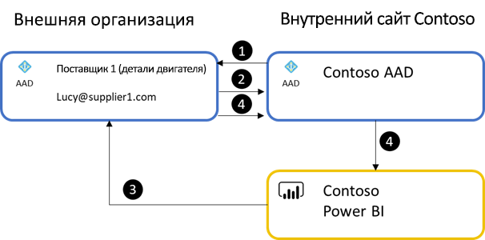

1. Процесс начинается с ИТ-администратора, который вручную приглашает гостевого пользователя, или использует API, предоставленное Azure Active Directory
2. Пользователь принимает приглашение в организацию.
3. После того, как он принял приглашение, пользователь Power BI может предоставлять стороннему пользователю или группе безопасности в которой он находится общий доступ к отчету или панели мониторинга. Как и в случае с обычным общим доступом в Power BI, сторонний пользователь получает сообщение электронной почты со ссылкой на элемент.
4. Когда сторонний пользователь переходит по ссылке, процесс проверки подлинности передается в Contoso Azure AD и используется для получения доступа к содержимому Power BI.

### Несистематический или запланированный общий доступ к приложениям Power BI

Компания Contoso обладает набором отчетов или панелями мониторинга, общий доступ к которым следует предоставить одному или нескольким поставщикам. Чтобы обеспечить всех нужных сторонних пользователей доступом к этому содержимому, оно представлено в виде приложения Power BI. Сторонние пользователи добавляются напрямую в список доступа приложения или с помощью групп безопасности. Затем кто-то из компании Contoso отправляет всем сторонним пользователям URL-адрес приложения, например в сообщении электронной почты. Когда стороннее пользователи перейдут по ссылке, они увидят все содержимое в едином, удобном для навигации интерфейсе.

Чтобы облегчить поставщикам создание портала Power BI, компания Contoso использует приложение Power BI. Единый список доступа используется для контроля за доступом ко всему необходимому содержимому. Это сокращает время на проверку и настройку уровня доступа. Azure AD B2B управляет доступом безопасности с помощью собственного идентификатора поставщика, поэтому пользователю не требуются дополнительные учетные данные. Если в группах безопасности использовать запланированные приглашения, управление доступом к приложению по мере того, как персонал перемещается в проект или из него, упрощается. Членство в группах безопасности можно предоставляется вручную или с помощью [динамических групп](https://docs.microsoft.com/azure/active-directory/b2b/use-dynamic-groups), поэтому все сторонние пользователи поставщиков автоматически добавляются в подходящую группу безопасности.

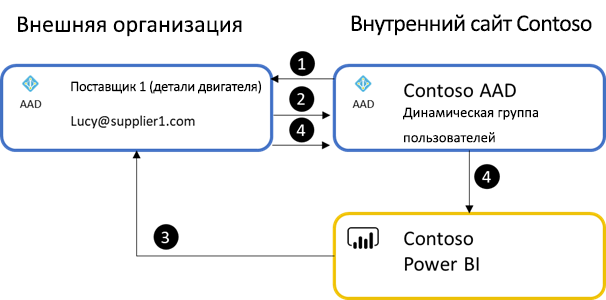

1. Процесс начинается с приглашения пользователя в Azure AD Contoso через портал Azure или PowerShell
2. Пользователя можно добавить в группу пользователей в Azure AD. Можно использовать статические или динамические группы пользователей, но использование динамической группы помогает уменьшить количество ручной работы.
3. Сторонним пользователям предоставляется доступ к приложению Power BI с помощью группы пользователей. URL-адрес приложения необходимо отправить непосредственно стороннему пользователю или поместить на веб-сайте, к которому он имеет доступ. Power BI использует все возможности, чтобы отправить сторонним пользователям сообщение электронной почты со ссылкой на приложение, однако при использовании групп пользователей, в которых можно менять членство, Power BI не сможет выполнить отправку всем сторонним пользователям, управляемым через группы пользователей.
4. Когда сторонний пользователь получает доступ к URL-адресу приложения Power BI, он проходит проверку подлинности в Contoso Azure AD, затем для него устанавливается приложение, где он сможет увидеть содержащиеся отчеты и панели мониторинга.

Приложение также обладает уникальной функцией, которая позволяет его разработчикам выполнять автоматическую установку приложения для пользователя, поэтому приложение будет доступно сразу, как только пользователь входит в систему. Данная функция выполняет автоматическую установку приложения только для сторонних пользователей, которые на момент публикации или обновления являются членами организации Contoso. Таким образом, она лучше всего сочетается с подходом запланированных приглашений и зависит от того, публикуется или обновляется приложение после добавления пользователей в Contoso Azure AD. Сторонние пользователи всегда могут использовать ссылку на приложение для его установки.

### Комментирование и подписка на содержимое в разных организациях

Поскольку компания Contoso продолжает работать со своими субподрядчиками или поставщиками, сторонним инженерам необходимо тесно сотрудничать с аналитиками компании. Power BI предоставляет несколько функций для совместной работы, которые помогают пользователям поддерживать связь в отношении используемого содержимого. Комментирование в панели мониторинга (как и комментирование отчета, которое будет доступно позднее) позволяет пользователям обсуждать увиденные ими точки данных и задавать вопросы создателям отчета.

В настоящее время сторонние гостевые пользователи могут писать комментарии и ознакамливаться с ответами. Тем не менее, в отличие от внутренних пользователей, они не могут быть @mentioned, и не получают уведомлений о появлении комментариев. На момент написания этого материала гостевые пользователи не могут использовать в Power BI функцию подписок. Эти ограничения будут сняты в будущей версии, а гостевой пользователь будет получать сообщение электронной почты при появлении комментариев @mentions или когда подписка, которая содержит ссылку на содержимое в Power BI, будет доставлена на его электронную почту.

### Доступ к содержимому в приложениях Power BI Mobile

В будущей версии пользователи Contoso будут совместно с сторонними приглашенными гостями использовать отчеты или панели мониторинга, в то время, как Power BI будет отправлять гостю сообщение электронной почты. Когда гостевой пользователь на своем мобильном устройстве откроет ссылку на отчет или панель мониторинга, содержимое откроется в собственном приложении Power BI Mobile (если оно было установлено). Затем гостевой пользователь сможет перемещаться между содержимым, разрешать к нему общий доступ из стороннего клиента и перемещаться обратно к собственному содержимому в домашнем клиенте.

> [!NOTE]
> Гостевой пользователь не может открыть приложение Power BI Mobile и немедленно перейти в сторонний клиент, сначала ему необходимо открыть ссылку на элемент в стороннем клиенте. Наиболее распространенные решения описаны в разделе [Distributing links to content in the Parent organization's Power BI](#distributing-links-to-content-in-the-parent-organizations-power-bi) (Распространение ссылок на содержимое в Power BI главной организации) ниже.

### Редактирование контента и управление содержимым Power BI разными организациями

Компания Contoso, ее поставщики и субподрядчики работают в тесном контакте друг с другом. Часто субподрядчику для аналитики требуются дополнительные метрики или данные визуализации, которые необходимо добавить в отчет, общий доступ к которому был предоставлен компанией Contoso. Данные должны находится в клиенте Contoso Power BI, но у сторонних пользователей должна быть возможность изменять данные, создавать содержимое, а также распространять его соответствующим пользователям.

Power BI содержит параметр **External guest users can edit and manage content** (Сторонние гостевые пользователи могут редактировать контент и управлять им). По умолчанию для сторонних пользователей доступны данные о потреблении в режиме только для чтения. Тем не менее, этот новый параметр позволяет администратору Power BI выбирать, какие из сторонних пользователей организации могут изменять одержимое и управлять им. После предоставления разрешения сторонний пользователь может редактировать отчеты, панели мониторинга, публиковать или обновлять приложения, работать в рабочих областях и выполнять подключение к данным, если у него есть разрешение на их изменение.

Дополнительные сведения об этом сценарии приведены далее в документе в разделе "Предоставление сторонним пользователям возможности редактировать содержимое в Power BI".

## Использование Power BI и Azure AD B2B в организационных связях

Когда все пользователи Power BI находятся внутри организации, использование Azure AD B2B не требуется. Тем не менее, одной или нескольким организациям может понадобиться обмениваться данными и сведениями, поэтому поддержка Azure AD B2B делает этот процесс более простым и экономным.

Ниже показаны обычные организационные структуры, которые хорошо подходят для межорганизационного взаимодействия Azure AD B2B в Power BI. Azure AD B2B очень хорошо подходит для многих ситуаций, но в некоторых из них стоит рассмотреть наиболее распространенные альтернативные подходы, описанные в конце этого документа.

### Вариант 1. Прямая совместная работа между организациями

Примером прямого сотрудничества между организациями является отношения Contoso с поставщиком радиаторов. Так как в компании Contoso и у ее поставщика есть несколько пользователей, которым требуется доступ к информации об надежности батареи, идеальным выходом будет использование общего доступа на основе Azure AD B2B. Его легко использовать и администрировать. Также это решение является популярным для консультационных служб, когда консультанту может потребоваться создать содержимое для организации.

Как правило, такого рода общий доступ реализуется на начальных этапах реализации несистематического индивидуального общего доступа. Тем не менее, когда команда расширяется или связи становятся более тесными, запланированный индивидуальный общий доступ становится предпочтительным методом сокращения затрат на управление. Кроме этого, сюда также можно отнести несистематический или запланированный общий доступ к приложениям Power BI, комментирование и подписку на содержимое между организациями, доступ к содержимому из мобильных приложений, а также редактирование содержимого и управление содержимым в Power BI разными организациями. Обратите внимание, если пользователи обеих организаций в своих организациях обладают лицензиями Power BI Pro, они могут их использовать в средах Power BI друг друга. Это удобно при лицензировании, поскольку организации, которая отправляет приглашение, не требуется платить за лицензию Power BI Pro для сторонних пользователей. Подробнее об этом рассказывается далее в разделе "Лицензирование".

### Вариант 2. родительская и ее дочерние подразделения или аффилированные компании

Некоторые организации обладают более сложной структурой. Сюда можно отнести частичные или полные дочерние компании, аффилированные компании или управляемые отношения с поставщиками служб. У таких организаций есть родительская организация, например холдинговая компания, при этом подчиненные организации работают полуавтономно, иногда в соответствии с различными региональными требованиями. Это ведет к тому, что такие организации обладают собственными средами Azure AD и отдельными клиентами Power BI.

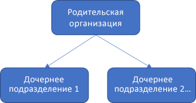

Как правило, в такой структуре родительской организации требуется распространять стандартизированные аналитические сведения среди своих дочерних организаций. Обычно предоставление общего доступа происходит с использованием несистематического или запланированного общего доступа к приложению Power BI, как показано на рисунке ниже, поскольку это позволяет распространять стандартизированное авторизованное содержимое среди широкой аудитории. На практике используется комбинация всех упомянутых в этом документе сценариев.

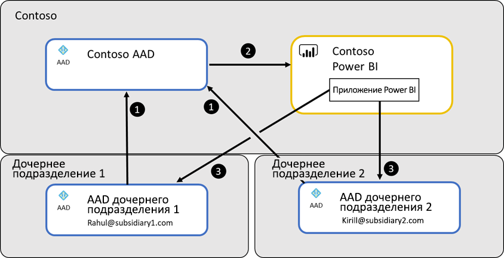

Это вытекает из следующего процесса:

1. Пользователи из каждой дочерней организации приглашаются в Contoso Azure AD.
2. Затем выполняется публикация приложения Power BI, в которой эти пользователи могут получить доступ к запрашиваемым данным.
3. И, наконец, пользователи используют полученную ссылку для просмотра отчета в запущенном приложении.

При такой структуре организации сталкиваются с несколькими важными проблемами.

- Как в Power BI родительской организации распределить ссылки на содержимое
- Как работники дочерних организаций могут получать доступ к источнику данных, который был размещен родительской организацией

#### Распространение ссылок на содержимое в Power BI главной организации

Чтобы распределить ссылки на содержимое, часто используются три подхода. Первым и самым главным является отправка ссылки на приложение нужным пользователям или ее размещение на сайте SharePoint Online, откуда ее можно открыть. Затем пользователи могут добавить ссылку в закладки браузере. Это позволит при необходимости быстрее получать доступ к данным.

Второй подход основывается на редактировании разными организациями и возможностью управления содержимым Power BI Родительская организация позволяет пользователям дочерних организаций получать доступ к Power BI и управлять им с помощью разрешений. Таким образом организуется доступ к Power BI Home, где пользователь из дочерней компании видит полный список содержимого, предоставленного ему в клиенте родительской организации. Затем URL-адрес к среде Power BI родительских организаций будет предоставлен пользователям дочерних организаций.

В последнем подходе приложение Power BI создается для каждой дочерней организации в клиенте Power BI. Приложение Power BI содержит панель мониторинга с [плитками, настроенными с помощью сторонней ссылки](https://docs.microsoft.com/power-bi/service-dashboard-edit-tile#hyperlink). Когда пользователь нажимает плитку, он переходит к соответствующим отчету, панели мониторинга или приложению Power BI в родительской организации. Такой подход обладает дополнительным преимуществом, поскольку приложение можно автоматически установить для всех пользователей в дочерней организации и оно будет доступно при каждом их входе среду Power BI. Дополнительным преимуществом данного подхода является его отличная работа с приложениями Power BI Mobile, которые изначально могут открываться по ссылке. Также его можно использовать совместно со вторым подходом, что упростит переход между средами Power BI.

#### Разрешение доступа к источникам данных, размещенным родительской организацией для сотрудников дочерних организаций

Зачастую аналитики дочерней организации должны использовать данные, предоставленные родительской организацией, для создания собственной аналитики. В таком случае для решения этой задачи обычные облачные источники данных.

В первом подходе с помощью [Azure Analysis Services](https://docs.microsoft.com/azure/analysis-services/analysis-services-overview) создается хранилище данных корпоративного уровня, используемого для аналитиков родительской и дочерних организаций, как показано на рисунке ниже. Contoso может размещать данные и использовать такие возможности, как безопасность на уровне строк чтобы убедиться, что пользователи в каждой из дочерних организаций обладают доступом к своим данным. Аналитики каждой организации могут использовать Power BI Desktop для получения доступа к хранилищу данных и опубликовать полученные аналитические данные в соответствующих клиентах Power BI.

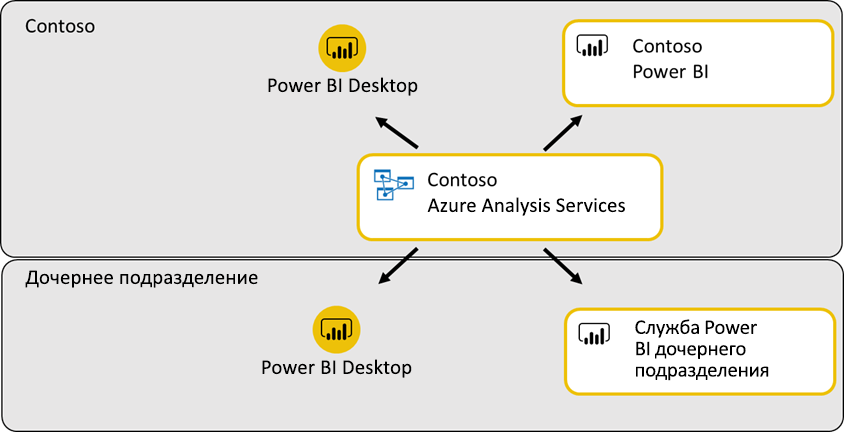

Во втором подходе [база данных SQL Azure](https://azure.microsoft.com/services/sql-database/) используется для создания реляционного хранилища данных, предоставляющего доступ к данным. Этот подход напоминает используемый в Azure Analysis Services, хотя некоторые возможности, например, безопасность на уровне строк в дочерней организациях, могут быть сложны для развертывания и управления.

Также возможны более серьезные подходы, однако те, которые были перечислены, являются наиболее распространенными.

### Вариант 3. Общая среда для всех партнеров

Компания Contoso может начать партнерские отношения с конкурентами для совместного производства автомобилей на общем конвейере. Но распространение автомобилей в различных странах будет проходить под разными торговыми марками. Для организаций этот процесс требует сотрудничества и совместного использования данных, средств искусственного интеллекта и аналитики. Такая структура также распространена в отрасли консультационных услуг, когда команда консультантов может выполнять проектную аналитику для клиента.

Как показывает практика, эти структуры довольно сложны (см. рис. ниже) и для управления ими требуются сотрудники. Чтобы быть эффективной, данная структура должна использовать межорганизационное редактировании и управление содержимым Power BI, поскольку она позволяет организациям повторно использовать лицензии Power BI Pro, приобретенные для соответствующих клиентов Power BI.

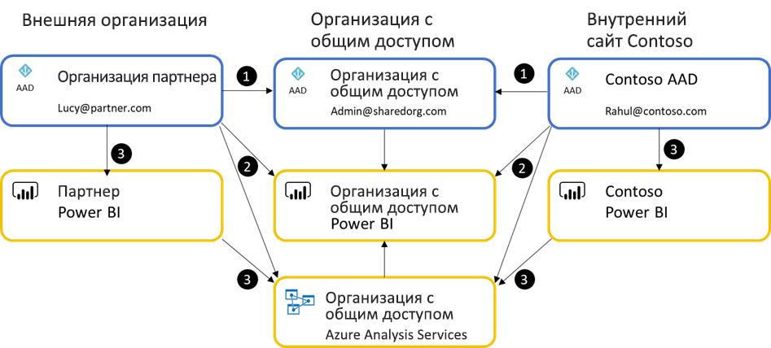

Чтобы создать общий клиент Power BI, необходимо создать Azure Active Directory и приобрести для пользователя в этом Active Directory не менее одной учетной записи Power BI Pro. Этот пользователь приглашает в организацию с общим доступом требуемых пользователей. Обратите внимание, что пользователи Contoso, которые в этом сценарии выполняют операции в Power BI организации с общим доступом, считаются сторонними пользователями.

Этот процесс выглядит следующим образом.

1. Организация с общим доступом устанавливается в качестве Azure Active Directory и в ней создается по крайней мере одна учетная запись пользователя. Этому пользователю следует назначить лицензию Power BI Pro.
2. Затем данный пользователь устанавливает клиент Power BI и приглашает нужных пользователей из Contoso и партнерской организации. Также пользователь устанавливает любые общие ресурсы данных, например, Azure Analysis Services. Пользователи Contoso и родительской организации в качестве гостевых пользователей могут получить доступ к общедоступному Power BI организации. Если им разрешить редактировать содержимое или управлять им в Power BI, сторонние пользователи смогут использовать главную страницу Power BI, рабочие области, загрузку или редактировать содержимое и совместно используемые отчеты. Как правило, все общие активы доступны в организации с общим доступом, где они и хранятся.
3. В зависимости от договора о сотрудничестве сторон, каждая организация может использовать ресурсы общего хранилища данных для разработки частных данных и аналитики. Внутренних клиентов Power BI можно использовать, чтобы распространять данные среди своих внутренних пользователей.

### Случай 4. распространение на сотни или тысячи внешних партнеров

После создания отчета для одного поставщика о надежности радиатора, компания Contoso хочет создать набор стандартизированных отчетов для сотен поставщиков. Это позволит ей убедиться, что все поставщики обладают данными аналитики, которые требуются для внедрения улучшений или исправления производственных дефектов.

Когда организации требуется распространить стандартизованные данные и аналитику среди многих сторонних пользователей/организации, она может использовать сценарий несистематического или запланированного общего доступа к приложениям Power BI для быстрого создания портала бизнес-аналитики при этом не неся никаких дополнительных затрат на разработку. Процесс создания такого портала с помощью приложения Power BI рассматривается в статье Практическое руководство. Создание портала бизнес-аналитики с помощью Power BI + Azure AD B2B — пошаговые инструкции далее в этом документе.

Здесь распространенным вариантом является случай, когда организация пытается поделиться с потребителями своими взглядами, особенно когда они хотят использовать Azure B2C с Power BI. Изначально Power BI не поддерживает Azure B2C. При оценке вариантов в данном случае, далее в этом документе в разделе "Наиболее распространенные альтернативные подходы" следует рассмотреть возможность использования альтернативного варианта 2.

## Пример внедрения. Создание портала бизнес-аналитики с помощью Power BI + Azure AD B2B — пошаговые инструкции

Интеграция Power BI с Azure AD B2B дает компании Contoso эффективный и простой способ представить для гостевых пользователей безопасный доступ к порталу бизнес-аналитики. Для ее настройки компании Contoso понадобится три шага.

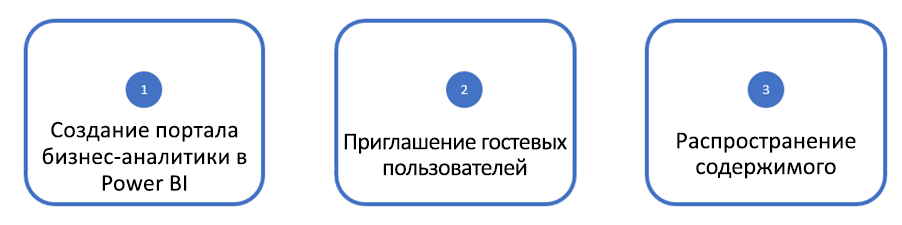

1. Создание портала бизнес-аналитики в Power BI

    Первым заданием компании Contoso является создание в Power BI портала бизнес-аналитики. Портал бизнес-аналитики Contoso состоит из коллекции специализированных информационных панелей и отчетов, которые будут доступны для многих внутренних и сторонних гостевых пользователей. Чтобы выполнить данное действие в Power BI, рекомендуется создать приложение Power BI. Дополнительные сведения о [приложениях в Power BI](https://powerbi.microsoft.com/blog/distribute-to-large-audiences-with-power-bi-apps/).

- Группа бизнес-аналитики компании Contoso создает рабочую область в Power BI

    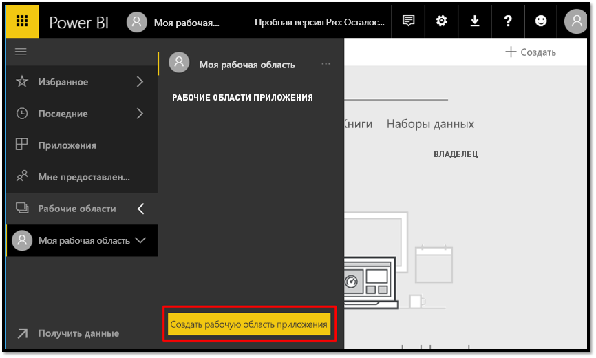
    

- Добавление других авторов в рабочую область

    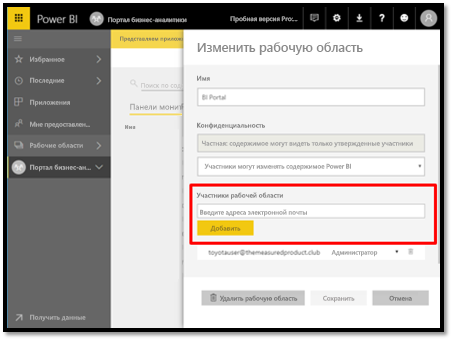

- Содержимое, создаваемое в рабочей области

    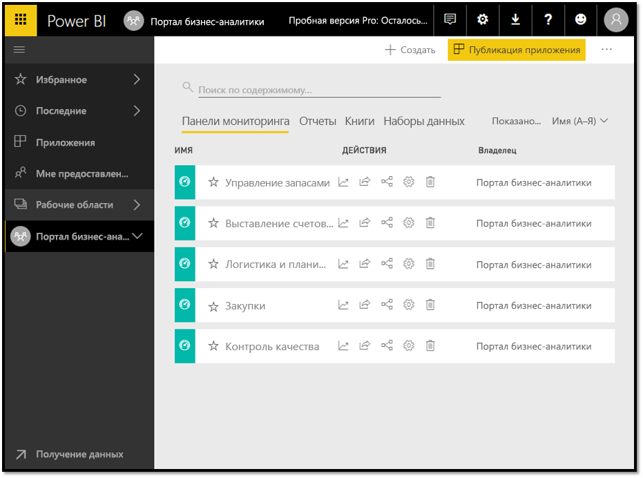

    Теперь, когда содержимое создано в рабочей области, компания Contoso готова пригласить гостевых пользователей в партнерских организациях для использования этого содержимого.

2. Приглашение гостевых пользователей

    Чтобы пригласить гостевых пользователей на портал бизнес-аналитики в Power BI, у компании Contoso есть два пути.

    * Запланированные приглашения
    * Несистематические приглашения

    **Запланированные приглашения**

    Суть этого подхода состоит в том, что Contoso сначала приглашает в Azure AD гостевых пользователей, а затем передает им содержимое Power BI. Contoso может приглашать гостевых пользователей из портала Azure или с помощью PowerShell. Шаги по приглашению гостевых пользователей из портал Azure приведены далее.

    - Администратор Contoso Azure AD переходит на **портал Azure > Azure Active Directory > Пользователи и группы>Все пользователи > Новый гостевой пользователь**

    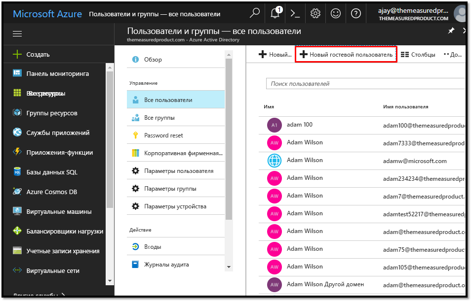

    - Добавление сообщения с приглашением для гостевых пользователей и нажатие вкладки "Пригласить"

    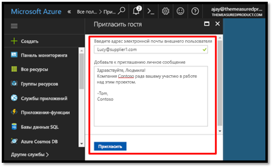

    > [!NOTE]
    > Чтобы пригласить гостевого пользователя на портале Azure, вам потребуется администратор вашего клиента Azure Active Directory.

    Если компании Contoso требуется пригласить несколько гостевых пользователей, это можно сделать с помощью PowerShell. Администратор Contoso Azure AD хранит адреса электронной почты всех гостевых пользователей в CSV-файле. Дополнительные сведения и инструкции приведены в статье [Примеры кода и команд PowerShell для службы совместной работы Azure Active Directory B2B](https://docs.microsoft.com/azure/active-directory/b2b/code-samples).

    После этого гостевой пользователь получит сообщение электронной почты с ссылкой-приглашением.

    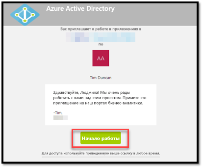

    Когда гостевые пользователи щелкают ссылку, они могут получить доступ к содержимому в клиенте Contoso Azure AD.

    > [!NOTE]
    > Чтобы изменить макет сообщения электронной почты с приглашением, используйте функцию брендинга Azure AD, описанную [ здесь ](https://docs.microsoft.com/azure/active-directory/active-directory-b2b-invitation-email).

    **Несистематические приглашения**

    Что делать, если компания Contoso не знает всех гостевых пользователей, которых следует пригласить заранее? Или что делать, если аналитик компании Contoso, создавшему портал бизнес-аналитики, самостоятельно хочет распространить содержимое на гостевых пользователей? Также с помощью несистематических приглашений мы поддерживаем этот сценарий в Power BI.

    Аналитик может просто добавить внешних пользователей в список доступа приложения при его публикации. Гостевые пользователи получают приглашение, и после его принятия они автоматически перенаправляются на Power BI содержимое.

    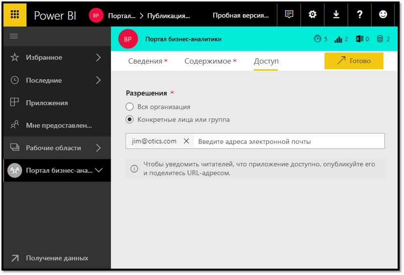

    > [!NOTE]
    > Приглашения стороннего пользователя в организацию требуются только в первый раз.

3. Распространить содержимое

    После того, как команда бизнес-аналитики Contoso создала портал BI и пригласила в него гостевых пользователей, они смогут распространять этот портал среди своих конечных пользователей и предоставить им доступ к приложению и выполнить его публикацию. Power BI автоматически заполняет имена гостевых пользователей, добавленных в клиент Contoso ранее. На этом этапе другим гостевым пользователям также можно добавить несистематические приглашения.

    > [!NOTE]
    > При использовании групп безопасности для управления доступом к приложению сторонним пользователям необходимо использовать подход плановых приглашений и предоставить ссылку на приложение каждому стороннему пользователю, который должен получить к доступ к приложению. В противном случае сторонний пользователь не сможет установить или просмотреть содержимое в приложении.

    Гостевые пользователи получают сообщение электронной почты со ссылкой на приложение.

    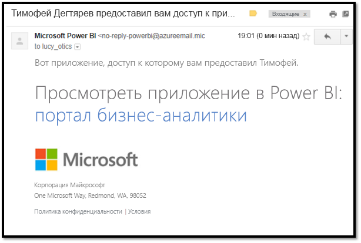

    После нажатия ссылки появится запрос к гостевому пользователю о прохождении проверки подлинности с использованием удостоверения своей организации.

    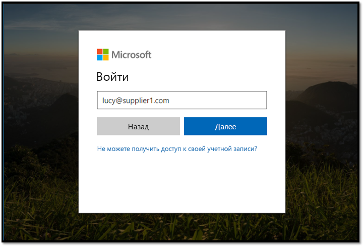

    После успешной проверки подлинности их переправят в приложение Power BI компании Contoso.

    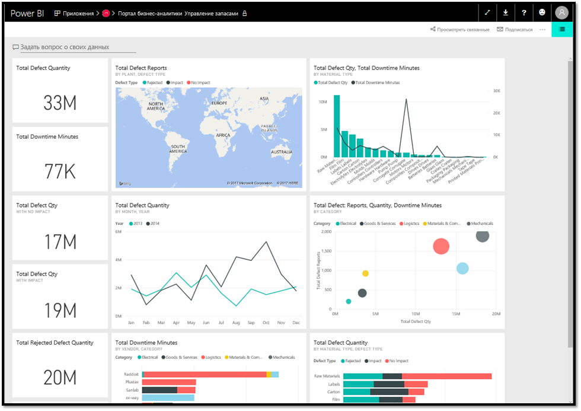

    После этого гостевые пользователи могут щелкнуть ссылку в сообщении электронной почты или добавить в закладки ссылку, что позволит им получить доступ к приложению Contoso. Также компания Contoso может облегчить работу для гостевых пользователей если добавив данную ссылку на любой существующий портал экстрасети, используемый гостевыми пользователями.

4. Следующие шаги

    Использование приложение Power BI и Azure AD B2B в Contoso позволяет без написания кода быстро создать портал бизнес-аналитики для своих поставщиков. Это значительно упрощает распространение стандартизированной аналитики среди всех тех поставщиков, которым она нужна.

    В этом примере показано, как один общий отчет может распространяться среди поставщиков, при этом Power BI обладает даже более широкими возможностями. Чтобы убедится, что каждый партнер видит только свои данные, в отчет и модель данных можно легко добавить безопасность на уровне строк. Этот процесс описывается далее в этом документе, в разделе "Безопасность данных для сторонних партнеров".

    В существующий портал часто приходится встраивать отдельные отчеты и панели мониторинга. Это достигается путем повторного использования многих методов, показанных в примере. В то же время в таких ситуациях проще может быть встроить отчеты или панели мониторинга непосредственно из рабочей области. Процесс приглашения и назначения разрешения безопасности от требуемых пользователей остается прежним.

## Внутри себя: как Люси от Supplier1 может получить доступ к содержимому Power BI из клиента Contoso?

Теперь, когда Contoso может беспрепятственно распространять содержимое Power BI среди приглашенных пользователей в партнерских организациях, следует посмотреть, как это выглядит изнутри.

Когда Contoso приглашает в свой каталог [lucy@supplier1.com](mailto:lucy@supplier1.com), в Azure AD создается связь между клиентом Contoso Azure AD и [Lucy@supplier1.com](mailto:Lucy@supplier1.com). Данная ссылка позволяет Azure AD узнать, может ли клиент Contoso получить доступ к содержимому Lucy@supplier1.com.

Когда Люси пытается получить доступ к приложению Power BI Contoso, Azure AD проверяет, может ли она получить доступ к клиенту Contoso. Затем Azure AD предоставляет маркер для Power BI, который указывает, что Люси проходит проверку подлинности для доступа к содержимому клиента Contoso. Этот маркер используется Power BI для авторизации и обеспечения доступа Люси к приложению Contoso Power BI.

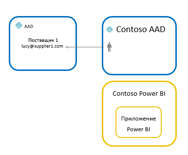

Интеграция Power BI и Azure AD B2B работает со всеми адресами электронной почты для бизнеса. Пользователю может быть предложено создать идентификатор Azure AD, если он у них отсутствует. Подробная схема показана на следующем рисунке.

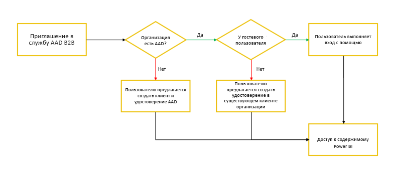

Важно понимать, что учетная запись Azure AD будет использоваться или создана в Azure AD внешней стороны, что позволит Люси использовать собственные имя пользователя и пароль, а их учетные данные автоматически перестанут работать в других клиентах каждый раз, когда Люси оставляет компании, если в организации также используется Azure AD.

## Лицензирование

Чтобы выполнить лицензирование гостевых пользователей основываясь на своих поставщиках и партнерских организаций для доступа к содержимому Power BI, Contoso может выбрать один из трех подходов.

> [!NOTE]
> _Уровень "бесплатный" Azure AD B2B's достаточно для использования Power BI с Azure AD B2B. Для некоторых расширенных функций Azure AD B2B, таких как динамические группы, требуется дополнительное лицензирование. Дополнительные сведения см. в документации по Azure AD B2B:_ [ _https://docs.microsoft.com/azure/active-directory/b2b/licensing-guidance_ ](https://docs.microsoft.com/azure/active-directory/b2b/licensing-guidance)

### Подход 1. Contoso использует Power BI Premium

Если использовать этот подход, то Contoso приобретет емкость Power BI Premium и назначит ей содержимое портала бизнес-аналитики. Это позволит гостевым пользователям партнерских организаций получать доступ к приложению Contoso Power BI без использования лицензии Power BI.

Когда сторонние пользователи пользуются содержимым Power BI Premium, они могут получать доступ только данным потребления, которые доступны только для пользователей Power BI с уровнем"Бесплатный".

В Contoso также можно воспользоваться другими преимуществами Power BI Premium, например, частыми обновлениями, выделением емкости и крупными моделями.

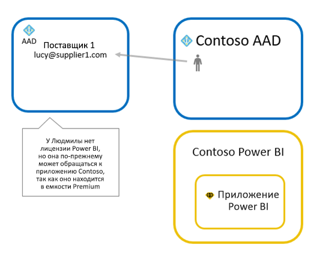

### Подход 2. contoso назначает лицензии Power BI Pro гостевым пользователям

Данный подход подразумевает, что Contoso назначает гостевым пользователям из партнерских организаций лицензии Pro. Это можно сделать из Центра администрирования Microsoft 365 Contoso. Это позволит гостевому пользователю партнерских организаций получить доступ к приложению Contoso Power BI, без приобретения лицензии Power BI. Это удобно при использовании общего доступа со сторонними пользователями, организация которых еще не работает с Power BI.

> [!NOTE]
> Лицензия Contoso Pro применяется только к гостевым пользователям, когда они обращаются к содержимому в клиенте contoso. Использование лицензии Pro обеспечивает доступ к содержимому вне состава Power BI Premium. Однако по умолчанию сторонние пользователи с лицензией Pro ограничены только потреблением. Это можно изменить с помощью подхода, описанного в разделе _Включение внешних пользователей для редактирования и управления содержимым в Power BI_ раздела далее в этом документе.

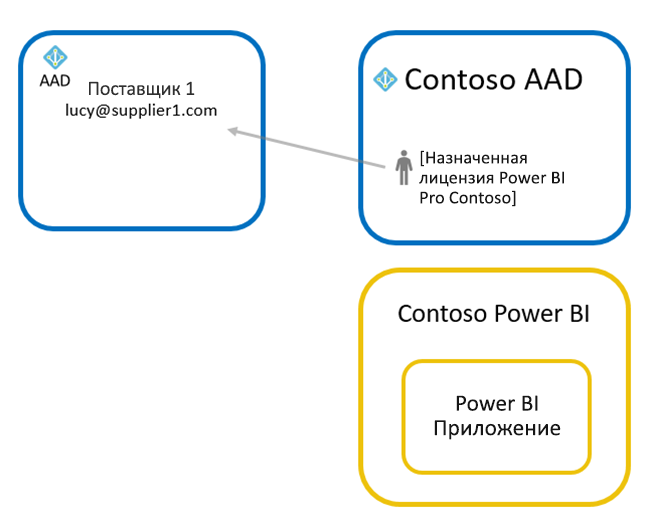

### Подход 3. гостевые пользователи приносят собственную лицензию на Power BI Pro

При использовании данного подхода поставщик 1 назначает Люси лицензию Power BI Pro. После этого они смогут получить доступ к приложению Power BI contoso с помощью этой лицензии. Так _как Люси_ может использовать свою лицензию Pro из собственной организации при доступе к внешней Power BI среде, этот подход иногда называют BYOL. Если Power BI используется в обеих организациях, это обеспечивает выгодное лицензирование для общего аналитического решения и сводит к минимуму накладные расходы при назначении лицензий сторонним пользователям.

> [!NOTE]
> Лицензия Pro, предоставленная поставщику 1, применяется к любому клиенту Power BI, где Люси является гостевым пользователем. Использование лицензии Pro обеспечивает доступ к содержимому вне состава Power BI Premium. Однако по умолчанию сторонние пользователи с лицензией Pro ограничены только потреблением. Это можно изменить с помощью подхода, описанного в разделе _Включение внешних пользователей для редактирования и управления содержимым, в Power BI_ далее в этом документе.

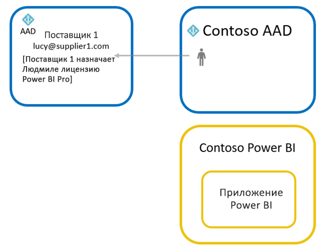

## Безопасность данных для сторонних партнеров

Обычно при работе с несколькими сторонними поставщиками, Contoso необходимо обеспечить для каждого поставщика отображение данных об их собственных продуктах. Это можно легко реализовать в Power BI с помощью пользовательской безопасности и динамической безопасности на уровне строк.

### Пользовательская безопасность

Одной из наиболее мощных функций Power BI является безопасность на уровне строк. Эта функция позволяет Contoso создавать отдельный отчет и набор данных, при этом для каждого пользователя могут применятся разные правила безопасности. Дополнительные сведения см. в статье [Безопасность на уровне строк (RLS) в Power BI](https://powerbi.microsoft.com/documentation/powerbi-admin-rls/).

Интеграция Power BI и Azure AD B2B позволяет компании Contoso назначать правила безопасности на уровне строк для гостевых пользователей, приглашенных в клиент Contoso. Как было показано ранее, Contoso может добавлять гостевых пользователей с помощью плановых или специализированных приглашений. Если в Contoso требуется обеспечить безопасность на уровне строк, рекомендуется использовать запланированные приглашения. Это позволит добавлять гостевых пользователей и назначать им роли безопасности перед тем как включить общий доступ к содержимому. Если вместо этого в Contoso используются несистематические приглашения, то до момента когда гостевые пользователи не смогут увидеть каких-либо данных, может пройти небольшой период времени.

> [!NOTE]
> Задержка при использовании специализированных приглашений в доступе к данным, защищенным RLS, может привести к возникновению запросов в службу поддержки ИТ-группы, поскольку пользователи при открытии ссылки общего доступ в получаемой сообщении электронной почты увидят либо пустые, либо неработающие отчеты/панели мониторинга. Поэтому в этом сценарии рекомендуется использовать плановые приглашения.**

Давайте рассмотрим это на примере.

Как уже упоминалось, Contoso работает с поставщики по всему миру. Компания хочет, чтобы пользователи в организациях-поставщиках получали аналитические сведения из данных, которые относятся только к их территории.  Но в то же время пользователям Contoso доступны данные изо всех регионов. Вместо создания нескольких отчетов в Contoso создается один отчет, в котором фильтрация данных выполняется на основе пользовательских просмотров.

Чтобы убедиться, что Contoso может фильтровать данные подключенных пользователей, на компьютере с Power BI будут созданы две роли. Одна используется для фильтрации все данных SalesTerritory из Европы, а другая — из Северной Америки.

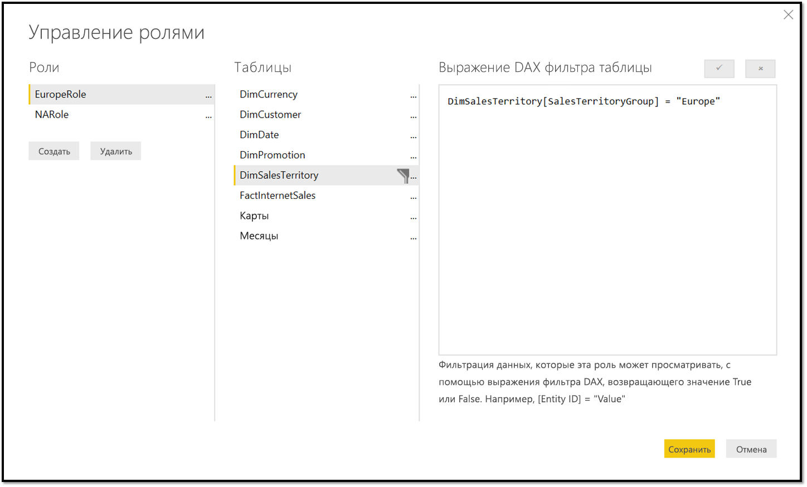

При определении ролей в отчете, им должен быть назначен пользователь. Это позволит ему получить доступ к любым данным. Назначение ролей выполняется в служба Power BI (**Наборы данных > Безопасность**).

Откроется страница, где команда бизнес-аналитики Contoso может увидеть две созданные роли.  Теперь команда бизнес-аналитики может назначить пользователей для ролей.

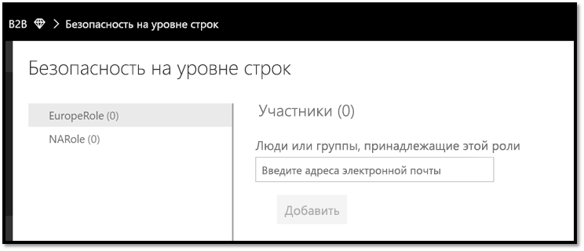

В приведенном примере пользователь с таким адресом электронной почты, как "[adam@themeasuredproduct.com](mailto:adam@themeasuredproduct.com)" будет добавлен компанией Contoso в партнерскую организацию с ролью для Европы.

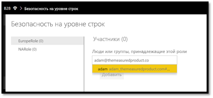

После разрешения, полученного с помощью Azure AD, в окне Contoso появится имя, которое можно добавить.

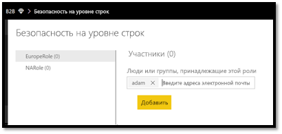

Теперь, когда этот пользователь открывает приложение, к которому предоставлен общий доступ, они видят только отчет с данными из Европы:

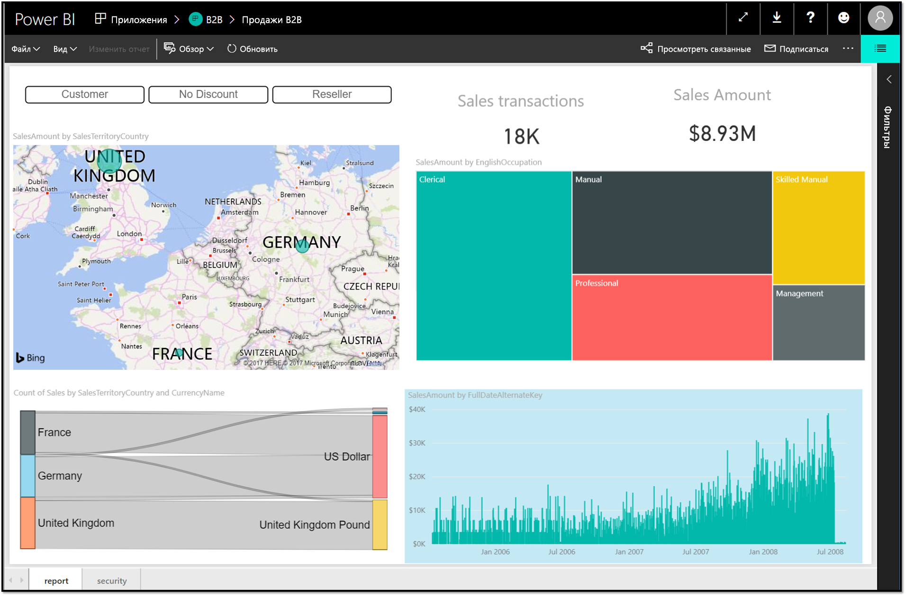

### Динамическая безопасность на уровне строк

Следующей темой является работа динамической безопасности на уровне строк (RLS) с Azure AD B2B.

Вкратце, динамическая безопасность на уровне строк использует фильтрацию данных модели, которая основывается на имени пользователя, который подключается к Power BI. Вместо добавления нескольких ролей для групп пользователей, пользователей следует определить в модели. Детальное описание шаблона здесь не приводится. Каспер де Йонг в статьях [Power BI Desktop Dynamic security cheat sheet](https://www.kasperonbi.com/power-bi-desktop-dynamic-security-cheat-sheet/) (Краткое изложение безопасности в Power BI Desktop Dynamic) и [этом техническом описании](https://msdn.microsoft.com/library/jj127437.aspx) приводит подробное описание всех аспектов безопасностью на уровне строк.

Рассмотрим небольшой пример. Contoso обладает простым отчетом о продажах по группам.

Теперь данный отчет должен быть доступен двум гостевым пользователям и внутреннему пользователю. Внутренний пользователь может видеть все, а гостевые пользователи могут видеть только доступные им группы. Это значит, что фильтрацию следует выполнять только для гостевых пользователей. Для фильтрации данных соответствующим образом Contoso использует шаблон динамических RLS, как описано в техническом документе и в блоге. Это означает, что компания Contoso добавляет имена в сами данные:

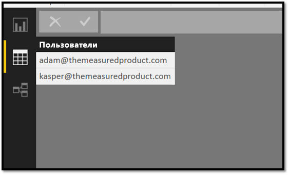

Затем компания Contoso создает модели данных, которые фильтруют данные соответствующим образом с правильными связями:

Чтобы автоматически фильтровать данные на основании того, кто является текущим пользователем, Contoso необходимо создать роль, которая передает, кто из пользователей подключился. Таким образом, Contoso создает две роли — первая, "securityrole", отфильтровывает имя текущего пользователя, подключившегося к Power BI, в таблице пользователей (это работает даже для гостевых пользователей Azure AD B2B).

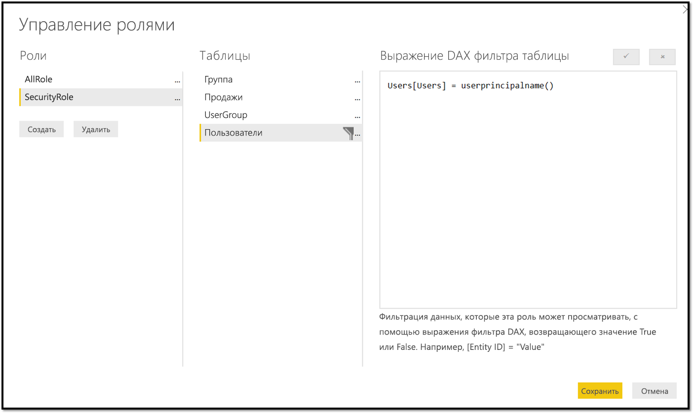

Contoso также создает другую роль, "AllRole", для внутренних пользователей, которые могут видеть все — т. е. эта роль не обладает заранее определенным уровнем безопасности.

После отправки локального файла Power BI в службу Contoso может назначить гостевым пользователям роль "SecurityRole" и внутренним пользователям роль "AllRole".

Теперь, когда гостевой пользователь откроет отчет, он увидит только продажи из группы A:

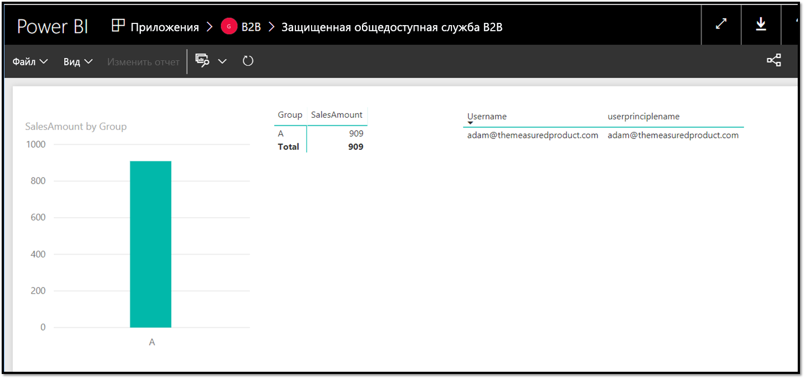

В матрице справа вы увидите результат функций USERNAME() и USERPRINCIPALNAME(), которые возвращают адрес электронной почты гостевых пользователей.

Теперь внутренний пользователь может просматривать все данные:

Как вы видите, динамическая RLS работает с внутренними или гостевыми пользователями.

> [!NOTE]
> Этот сценарий также работает при использовании модели в службах Azure Analysis Services. Обычно служба Analysis Service подключена к тем же Azure AD в качестве Power BI — в этом случае Azure Analysis Services также распознают гостевых пользователей, приглашенных через Azure AD B2B.

## Подключение к локальным источникам данных

Power BI предлагает компании Contoso возможности для использования локальных источников данных, таких как [SQL Server Analysis Services](https://powerbi.microsoft.com/documentation/powerbi-gateway-enterprise-manage-ssas/) или [SQL Server](https://powerbi.microsoft.com/documentation/powerbi-gateway-kerberos-for-sso-pbi-to-on-premises-data/), непосредственно с помощью [локального шлюза данных](https://powerbi.microsoft.com/documentation/powerbi-gateway-onprem/). Есть даже возможность входить в эти источники данных под учетными данными, которые используются только с Power BI.

> [!NOTE]
> При установке шлюза для подключения к вашему клиенту Power BI необходимо использовать пользователя, созданного в вашем клиенте. Внешние пользователи не могут установить шлюз и подключить его к вашему клиенту.

Для сторонних пользователей это может оказаться сложнее, поскольку сторонние пользователи обычно неизвестны локальной AD. Power BI предлагает для этого решение, позволяя администраторам Contoso сопоставлять внешние имена пользователей с внутренними, как описано в разделе [Управление источником данных — службы Analysis Services](https://powerbi.microsoft.com/documentation/powerbi-gateway-enterprise-manage-ssas/). Например, [lucy@supplier1.com](mailto:lucy@supplier1.com) могут сопоставляться с [lucy\_supplier1\_com#EXT@contoso.com](mailto:lucy_supplier1_com).

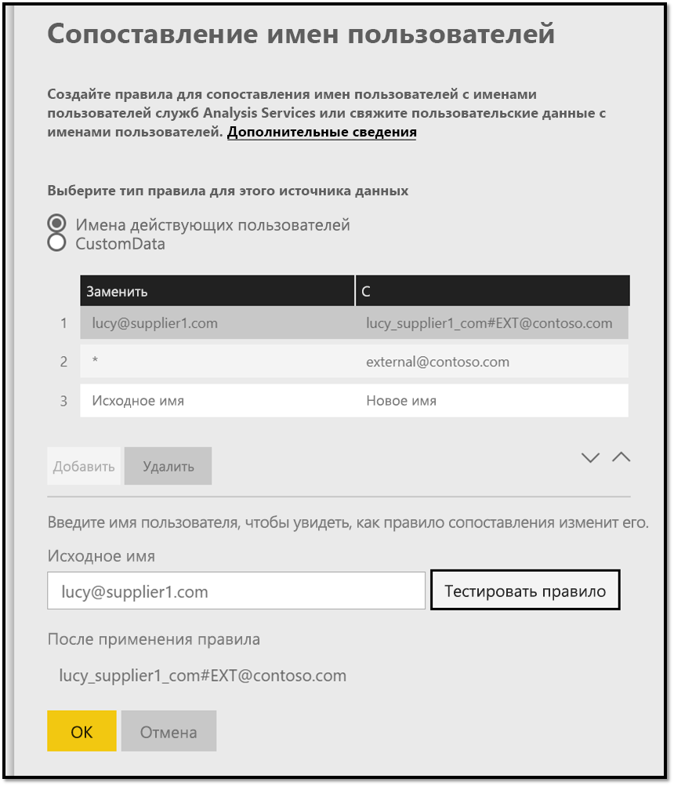

Этот метод подходит, если компания Contoso имеет только небольшое число пользователей или если в Contoso можно сопоставить всех внешних пользователей с одной внутренней учетной записью. Для более сложных сценариев, где каждому пользователю требуются собственные учетные данные, доступен более сложный подход, использующий [настраиваемые атрибуты AD](https://technet.microsoft.com/library/cc961737.aspx) для сопоставления, как описано в разделе [Управление источником данных — службы Analysis Services](https://powerbi.microsoft.com/documentation/powerbi-gateway-enterprise-manage-ssas/). Это позволит администратору Contoso определять сопоставления для каждого пользователя в Azure AD (а также сторонних пользователей B2B).  Эти атрибуты можно задать с помощью объектной модели AD, с помощью сценариев или кода, чтобы в Contoso можно было полностью автоматизировать процесс распространения приглашений или запланировать периодичность сопоставления.

## Предоставление внешним пользователям возможности редактирования и управления содержимым в Power BI

Contoso может разрешить внешним пользователям добавлять содержимое в данные организации, осуществляя, как описано ранее, межорганизационное редактирование содержимого и управляя им в Power BI.

> [!NOTE]
> Чтобы изменять содержимое и управлять им в Power BI в организации, пользователь должен иметь лицензию Power BI Pro в рабочей области "Моя рабочая область". Пользователи могут получать лицензии Pro, как описано в разделе " _Лицензирование_ " этого документа.

Портал администрирования Power BI предоставляет **разрешение внешним гостевым пользователям редактировать содержимое и управлять им в организации** в параметрах клиента. По умолчанию установлено значение disabled (отключено), а это означает, что внешние пользователи по умолчанию ограничены только чтением. Этот параметр действует для пользователей с членством от UserType до Guest в Azure AD. В следующей таблице описываются режимы работы пользователей в зависимости от их членства UserType и настройки параметров.

| **Тип пользователя в Azure AD** | **Разрешить внешним гостевым пользователям изменять параметры содержимого и управлять ими** | **Поведение** |
| --- | --- | --- |
| Гость | Отключено для пользователя (по умолчанию) | Представление только поэлементного потребления. Разрешает доступ только для чтения для отчетов, панелей мониторинга и приложений при просмотре через URL-адрес, отправляемый гостевому пользователю. Приложения Power BI Mobile обеспечивают гостевой доступ только для чтения. |
| Гость | Включено для пользователя | Сторонний пользователь получает доступ ко всем возможностям Power BI, хотя некоторые функции для него недоступны. Стороннему пользователю необходимо войти в Power BI с помощью URL-адреса службы Power BI, содержащего сведения о клиенте. Пользователь получает доступ к начальной странице раздела "Моя рабочая область" и, в зависимости от разрешений, может просматривать и создавать содержимое.    Приложения Power BI Mobile обеспечивают гостевой доступ только для чтения. |

> [!NOTE]
> Внешних пользователей в Azure AD также можно назначить членами UserType. В настоящее время эта функция не поддерживается в Power BI.

На портале администрирования Power BI этот параметр показан на рисунке ниже.

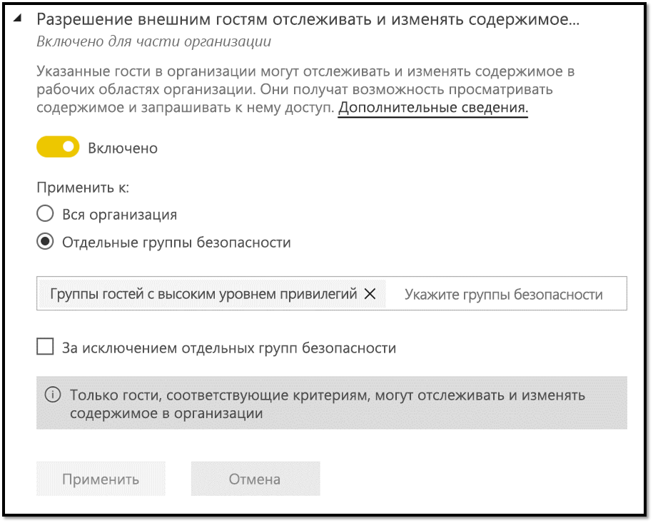

Гостевые пользователи по умолчанию получают доступ только для чтения, который можно изменить, чтобы начать управлять содержимым. Значение по умолчанию отключено, это означает, что все гостевые пользователи обладают доступом только для чтения. Администратор Power BI может включить этот параметр либо для всех гостевых пользователей в организации, либо для групп безопасности, определенных в Azure AD. На следующем рисунке администратор Power BI в Contoso создал группу безопасности в Azure AD для управления сторонними пользователями, которые могут изменять содержимое и управлять им в клиенте Contoso.

Чтобы помочь этим пользователям войти в Power BI, предоставьте им URL-адрес клиента. Чтобы найти URL-адрес клиента, выполните указанные ниже действия.

1. В службе Power BI в верхнем меню выберите справку ( **?** ), а затем **О Power BI**.
2. Найдите значение рядом с полем **URL-адрес клиента**. Это URL-адрес клиента, которым вы можете поделиться с гостевыми пользователями.

    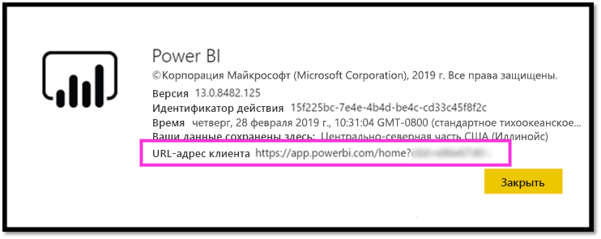

При использовании функции "Разрешение внешним гостям отслеживать и изменять содержимое в организации" указанные гостевые пользователи получают доступ к Power BI вашей организации и могут просматривать любое содержимое, на которое у них есть разрешение. Они могут открывать главную страницу, просматривать рабочие области и вносить в них содержимое, устанавливать приложения при условии включения в список доступа, а также использовать рабочую область "Моя рабочая область". Они могут создавать или администрировать рабочие области, использующие новые возможности взаимодействия.

> [!NOTE]
> При использовании этого параметра не забудьте просмотреть раздел "Управление" этого документа, так как параметры по умолчанию в Azure AD не позволяют гостевым пользователям использовать определенные функции, такие как средства подбора людей, что может привести к ограниченной функциональности.**

Гостевым пользователям, для которых включен параметр "Разрешение внешним гостям отслеживать и изменять содержимое в организации", некоторые возможности недоступны. Чтобы изменять или публиковать отчеты, гостевым пользователям нужно использовать пользовательский веб-интерфейс службы Power BI, включая функцию "Получить данные" для отправки файлов Power BI Desktop. Не поддерживаются следующие возможности:

- Прямая публикация из Power BI Desktop в службу Power BI.
- Гостевые пользователи не могут использовать Power BI Desktop для подключения к наборам данных службы в службе Power BI.
- Классические рабочие области, привязанные к группам Office 365. гостевой пользователь не может создавать или использовать администраторов этих рабочих областей. Он может быть их членом.
- Отправка специализированных приглашений не поддерживается для списков доступа рабочей области.
- Power BI Publisher для Excel не поддерживается для гостевых пользователей.
- Гостевые пользователи не могут установить Power BI Gateway и подключить его к вашей организации.
- Гостевые пользователи не могут устанавливать приложения с публикацией для всей организации.
- Гостевые пользователи не могут использовать, создавать, изменять или устанавливать пакеты содержимого организации.
- Гостевые пользователи не могут использовать анализ в Excel.
- Гостевые пользователи не могут быть @mentioned при комментировании (эта возможность будет добавлена в будущих выпусках)
- Гостевые пользователи не могут использовать подписки (эта возможность будет добавлена в будущих выпусках)
- Гостевые пользователи, использующие эту возможность, должны иметь рабочую или учебную учетную запись. Для гостевых пользователей с личными учетными записями действуют дополнительные ограничения, связанные со входом.

## Управление

### Дополнительные параметры Azure AD, которые влияют на возможности в Power BI, связанные с Azure AD B2B

При использовании общего доступа в Azure AD B2B администратор Azure Active Directory управляет возможностями стороннего пользователя. Управление осуществляется на странице параметров совместной работы в настройках Azure Active Directory для вашего клиента.

Сведения о параметрах можно найти здесь:

[https://docs.microsoft.com/azure/active-directory/b2b/delegate-invitations](https://docs.microsoft.com/azure/active-directory/b2b/delegate-invitations)

> [!NOTE]
> По умолчанию разрешения для гостевых пользователей ограничены значением "Да", поэтому гостевые пользователи в Power BI имеют ограниченные возможности, особенно в отношении совместного использования, когда пользовательский интерфейс средства подбора для этих пользователей не работает. Очень важно совместно с администратором Azure AD задать для него значение "Нет", как показано ниже, чтобы обеспечить пользователям нужные возможности.**

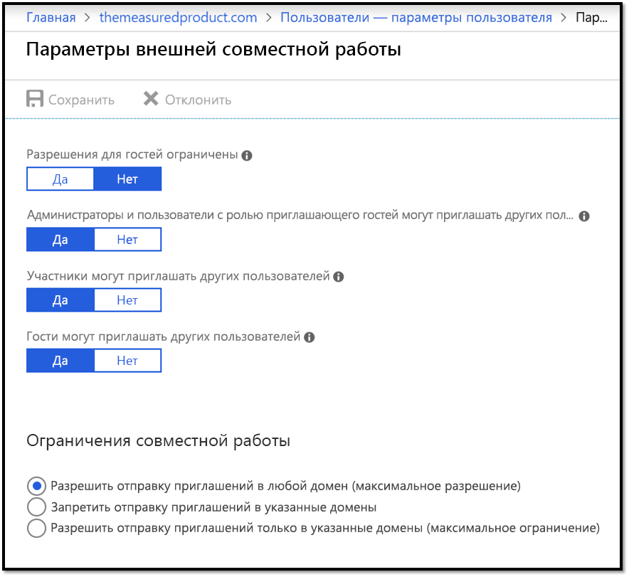

### Управление гостевыми приглашениями

Администраторы Power BI могут управлять сторонним доступом только для Power BI на портале администрирования Power BI. Но администраторы клиента также могут управлять сторонним общим доступом с помощью различных политик Azure AD.  Эти политики позволяют администраторам клиентов делать следующее:

- Отключать возможность приглашения для конечных пользователей.
- Приглашать других пользователей могут только администраторы и пользователи с ролью приглашающего.
- Приглашать могут администраторы, пользователи с ролью приглашающего гостей и участники.
- Приглашать могут все пользователи, в том числе гости.

Дополнительные сведения об этих политиках см. в разделе [Делегирование приглашений для совместной работы в службе Azure Active Directory B2B](https://docs.microsoft.com/azure/active-directory/active-directory-b2b-delegate-invitations).

Все действия сторонних пользователей в Power BI также являются предметом [аудита на нашем портале аудита](https://powerbi.microsoft.com/documentation/powerbi-admin-auditing/).

### Политики условного доступа для гостевых пользователей

Компания Contoso может применять политики условного доступа для гостевых пользователей, которые обращаются к содержимому из клиента Contoso. Подробные инструкции можно найти в статье [Условный доступ для B2B-пользователей](https://docs.microsoft.com/azure/active-directory/active-directory-b2b-mfa-instructions).

## Наиболее распространенные альтернативные подходы

Хотя Azure AD B2B позволяет легко обмениваться данными и отчетами в организациях, существуют несколько обычно используемых подходов, которые в некоторых случаях могут оказаться более эффективными.

### Альтернативный вариант 1. Создание повторяющихся удостоверений для партнеров-пользователей

В этом случае компании Contoso приходилось вручную создавать повторяющиеся удостоверения для каждого пользователя партнера в клиенте Contoso, как показано на следующем рисунке. Затем в Power BI компания Contoso может предоставлять назначенных удостоверениям доступ к соответствующим отчетам, панелям мониторинга или приложениям.

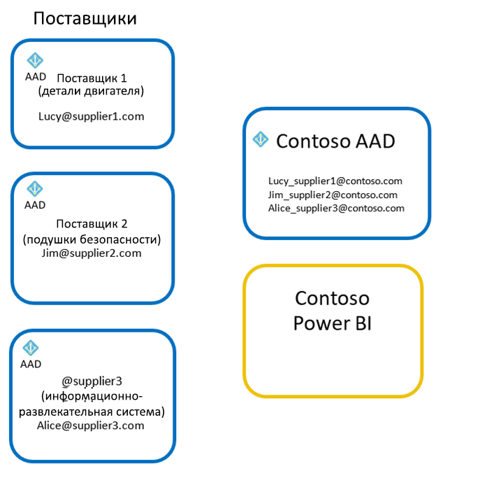

Причины выбрать этот вариант:

- Так как удостоверением пользователя управляет ваша организация, все связанные службы, например сообщения электронной почты, SharePoint, и т.д. также находятся под управлением вашей организации. ИТ-администраторы могут сбрасывать пароли, отключить доступ к учетным записям или аудиту действий в этих служб.
- Пользователи, использующие личные учетные записи для своего бизнеса, часто ограничены в доступе к определенным службам, поэтому им может потребоваться учетная запись организации.
- Некоторые службы работают только над пользователями вашей организации. К примеру, использование Intune для управления содержимым на личных или мобильных устройствах сторонних пользователей с помощью Azure B2B может оказаться невозможным.

Причины не выбрать этот вариант:

- Пользователям из партнерских организаций необходимо использовать два набора учетных данных — один для доступа к содержимому из одной организации, а другой — для доступа к содержимому из Contoso. Для таких гостевых пользователей это хлопотно и может приводить их в замешательство.
- Компании Contoso необходимо приобрести и назначить индивидуальные лицензии этим пользователям. Если пользователю необходимо получать сообщения электронной почты или использовать приложения Office, он должен иметь соответствующие лицензии, включая Power BI Pro, для редактирования и совместного использования содержимого в Power BI.
- Contoso может потребоваться применить более строгие процессы авторизации и политики управления для сторонних пользователей по сравнению с внутренним пользователям. Чтобы добиться этого, Contoso необходимо создавать собственную номенклатуру для сторонних пользователей, а все пользователи Contoso должны быть проинформированы об этой номенклатуре.
- Когда пользователь уходит из организации, он по-прежнему имеет доступ к ресурсам компании Contoso, пока администратор Contoso вручную не удалит его учетную запись
- Администраторам Contoso нужно управлять удостоверением для гостевой ОС, включая создание, сброс пароля и т. д.

### Альтернативный вариант 2. Создание пользовательского Power BI Embedded приложения с помощью пользовательской проверки подлинности

Другим решением для компании Contoso будет создать собственное пользовательское приложение Power BI Embedded, с настраиваемой проверкой подлинности (["Данные принадлежат приложению"](https://docs.microsoft.com/power-bi/developer/embedded/embed-sample-for-customers)). Хотя во многих организациях нет времени или ресурсов для создания пользовательского приложения для распространения содержимого Power BI среди сторонних партнеров, для некоторых организаций этот способом рекомендуется и заслуживает серьезного изучения.

Часто организации имеют существующие партнерские порталы с централизованным доступом ко всем ресурсам организации для партнеров, обеспечивая изоляцию внутренних ресурсов организации и предоставляя упрощенные возможности для партнеров, обеспечивая поддержку многих партнеров и их отдельных пользователей.

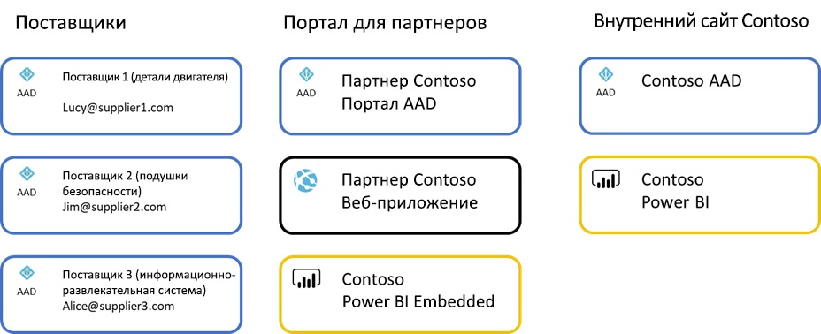

В показанном выше примере пользователи всех поставщиков входят на портал для партнеров компании Contoso, используя AAD в качестве поставщика удостоверений. Для этого можно использовать AAD B2B, Azure B2C, собственные удостоверения или федерацию с любым количеством других поставщиков удостоверений. Пользователь будет входить и получать доступ к сборке портала партнера с помощью веб-приложения Azure или же аналогичной инфраструктуры.

В веб-приложении отчеты Power BI внедряются из развертывания Power BI Embedded. Веб-приложение оптимизирует доступ к отчетам и всем связанным службам через единый интерфейс, помогающий поставщикам взаимодействовать с компанией Contoso. Эта среда портала бы изолирована от внутренних AAD и среды Power BI в Contoso, чтобы поставщикам не удалось получить доступ к этим ресурсам. Как правило, данные будут храниться в отдельном хранилище данных партнера для обеспечения такой же изоляции партнерских данных. Такая изоляция дает преимущества, так как она ограничивает число сторонних пользователей с прямым доступом к данным вашей организации, ограничивая, какие данные могут оказаться доступными для сторонних пользователей и исключая случайную публикацию для сторонних пользователей.

С помощью Power BI Embedded на портале можно использовать удобный формат лицензирования, с помощью маркера приложения или возможности главного пользователя и лицензии Premium, приобретенных в модели Azure, которая упрощает назначение лицензий для конечных пользователей и позволяет увеличивать и уменьшать масштаб в зависимости от прогнозируемых задач. Портал может обеспечить в целом более высококачественную и согласованную работу, поскольку партнеры получают доступ к единому порталу, разработанному с учетом потребностей всех партнеров. Наконец, так как решения на основе Power BI Embedded обычно предназначены для нескольких клиентов, он упрощает изоляцию данных между партнерскими организациями.

Причины выбрать этот вариант:

- Проще управлять, когда количество партнерских организаций растет. Поскольку партнеры добавляются в отдельный каталог, изолированный от внутреннего каталога AAD в Contoso, это упрощает задачи управления и позволяет избежать случайной публикации внутренних данных для сторонних пользователей.
- Типичный портал для партнеров оснащен фирменной символикой, обеспечивая единообразный и удобный способ взаимодействия для всех партнеров в соответствии с потребностями типичных партнеров. Contoso таким образом может предложить в целом более эффективное взаимодействие с партнерам, интегрировав все необходимые службы в один портал.
- Затраты на лицензирование в случае более сложных сценариев, как редактирование содержимого в Power BI Embedded, покрываются лицензией Power BI Premium, приобретенной в Azure, и назначение лицензий Power BI Pro для этих пользователей не требуется.
- В случае нескольких клиентов такое решение, обеспечивает лучшую изоляцию между партнерами.
- На портале для партнеров часто предусмотрены и другие средства для партнеров, помимо отчетов Power BI, панелей мониторинга и приложений.

Причины не выбрать этот вариант:

- Для создания, эксплуатации и обслуживания портала необходимы значительные усилия, делая его значительным вложением в ресурсы и время.
- Время на решение, с момента тщательного планирования и выполнения нескольких рабочих процессов, требуется гораздо больше, чем при использовании общего доступа к B2B.
- При меньшем количестве партнеров усилия, необходимые для этого подхода, скорее всего неоправданны.
- Совместная работа с несистематическим общим доступом — основной сценарий, с которым вы столкнулись в своей организации.
- Отчеты и панели мониторинга отличаются для каждого партнера. Этот вариант реализует возможность управления накладными расходами помимо обычного общего доступа для своих партнеров.

## Вопросы и ответы

**Может ли компания Contoso отправить автоматически активированное приглашение, чтобы пользователь был только "готов к работе"? Или пользователь всегда должен щелкнуть по URL-адресу активации?**

При доступе к содержимому конечный пользователь должен всегда переходить по ссылке для выражения согласия на доступ к содержимому.

Если будет приглашено много гостевых пользователей, мы рекомендуем делегировать этот процесс от основных администраторов Azure AD путем [добавления пользователя в роль приглашающего гостей в организации, которой принадлежит ресурс](https://docs.microsoft.com/azure/active-directory/active-directory-b2b-add-guest-to-role). Пользователь может приглашать других пользователей в партнерской организации, используя пользовательский интерфейс входа, скрипты PowerShell или API. Это снижает нагрузку на администраторов Azure AD для начальной отправки или повторной отправки приглашений пользователям партнерской организации.

**Можно ли в Contoso принудительно активировать многофакторную идентификацию для гостевых пользователей, если ее партнеры не используют многофакторную проверку подлинности?**

Да. Дополнительные сведения см. в разделе [Условный доступ для совместной работы B2B-пользователей](https://docs.microsoft.com/azure/active-directory/active-directory-b2b-mfa-instructions).

**Как работает служба совместной работы B2B-пользователей если приглашенный партнер использует федерацию, чтобы добавить свою собственную локальную проверку подлинности?**

Если у партнера есть клиент Azure AD, включенный в федерацию с локальной инфраструктуры проверки подлинности, локальный единый вход будет выполняться автоматически. Если у партнера нет клиента Azure AD, для новых пользователей может создаваться учетная запись Azure AD.

**Как пригласить гостевых пользователей с учетными записями электронной почты потребителей?**

В Power BI поддерживаются приглашать гостевых пользователей с учетными записями электронной почты потребителей. Сюда входят такие домены как, например, hotmail.com, outlook.com и gmail.com. Тем не менее, эти пользователи могут столкнуться с ограничениями, отличными от ограничений для рабочих или учебных учетных записей.
