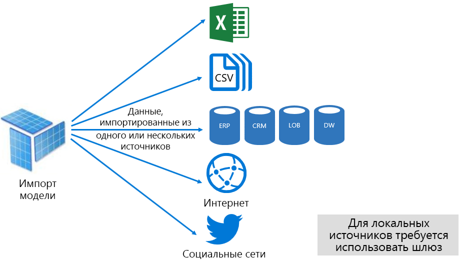
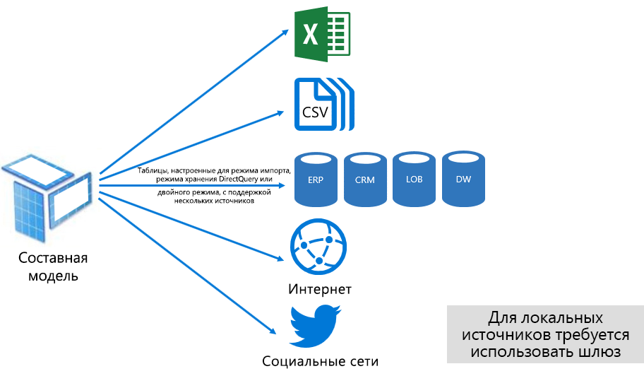
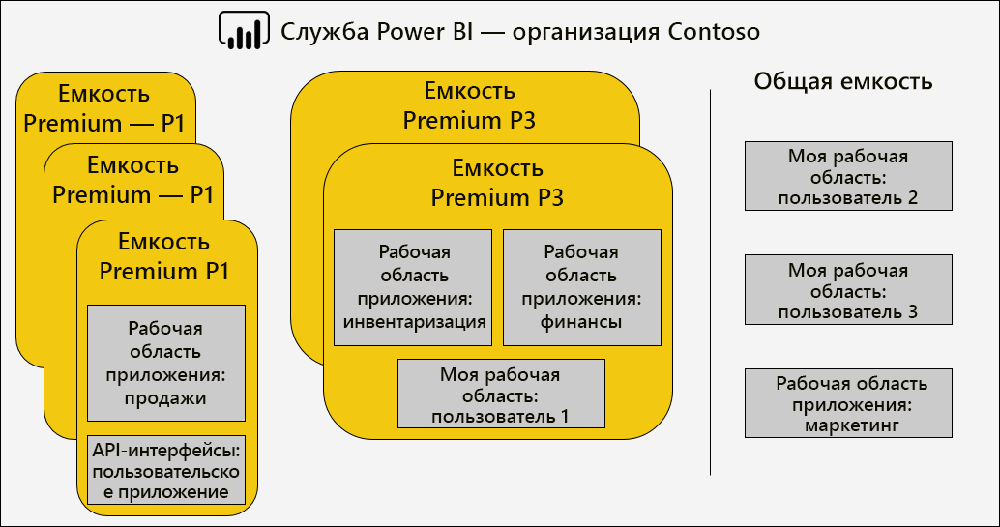
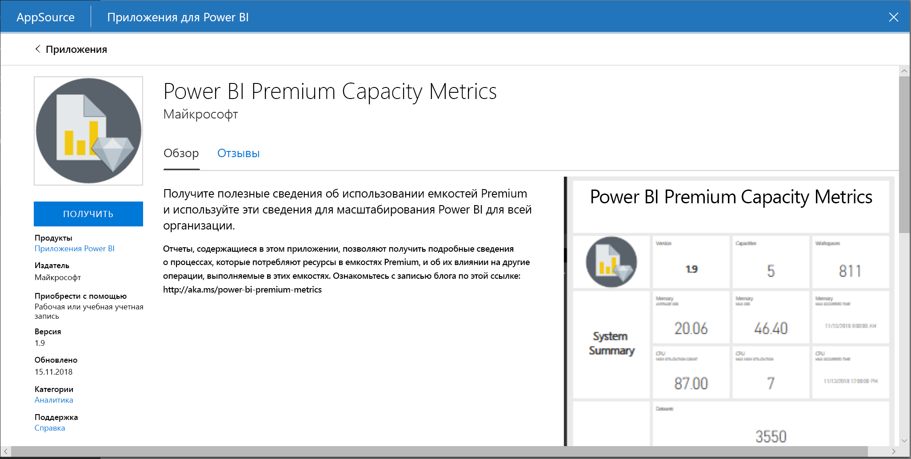
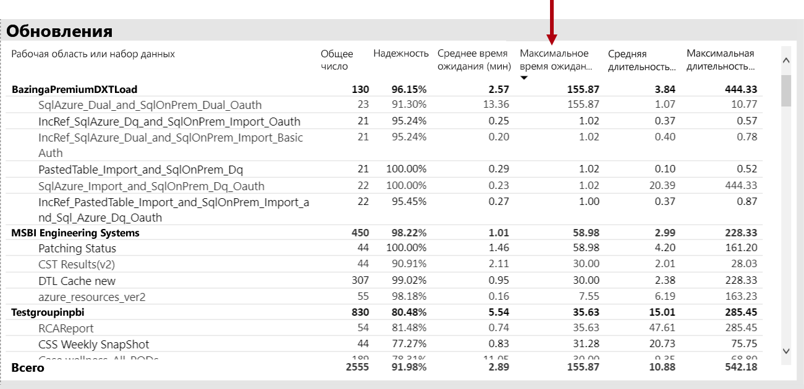
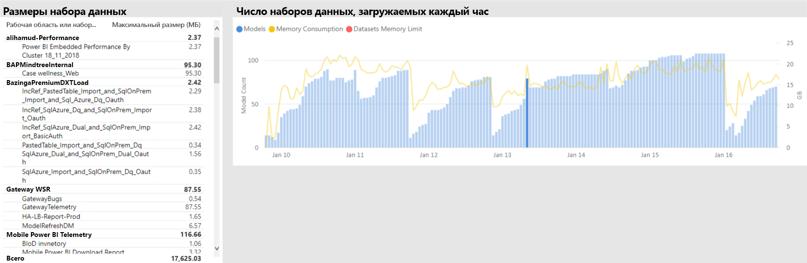
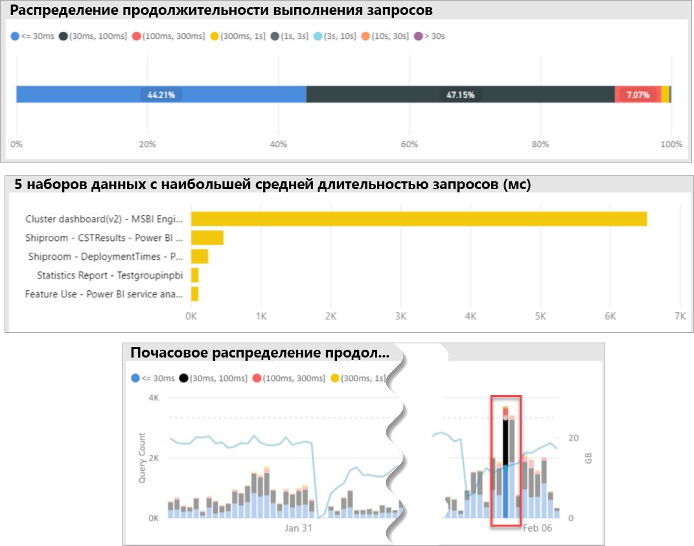
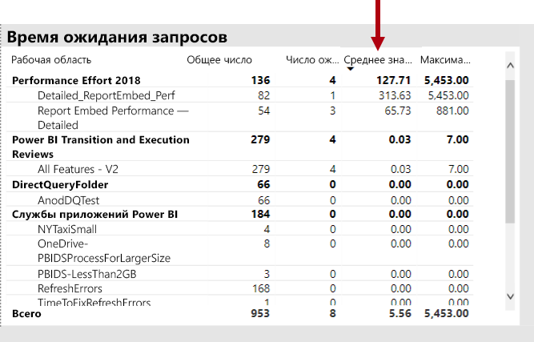
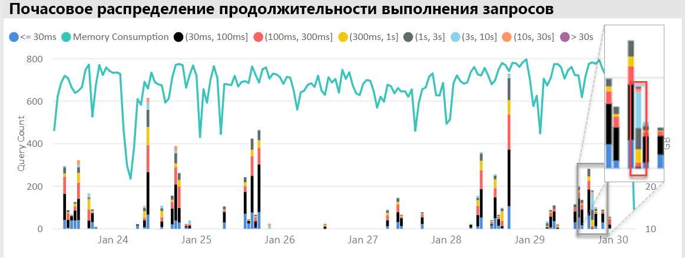
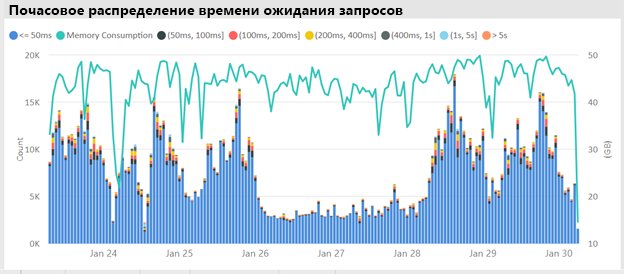

# Развертывание емкостей Power BI Premium и управление ими

**Сводка:** Power BI Premium обеспечивает неизменно высокую производительность, поддержку больших объемов данных и гибкость унифицированной платформы самостоятельной бизнес-аналитики корпоративного уровня, доступной каждому члену вашей организации. Этот технический документ уровня 300 был написан специально для администраторов Power BI, а также для авторов и издателей содержимого. Он содержит сведения о возможностях Power BI Premium, а также о проектировании, развертывании, отслеживании и устранении неполадок масштабируемых решений.

**Автор:** [Питер Майерс (Peter Myers)](https://www.linkedin.com/in/peterjsmyers) (наиболее ценный специалист (MVP) по платформам данных MVP и независимый эксперт в области бизнес-аналитики в Bitwise Solutions).

**Технические рецензенты:** Адам Сакстон (Adam Saxton), Акшай Мирчандани (Akshai Mirchandani), Бхавик Мерчант (Bhavik Merchant), Давид Магар (David Magar), Джош Каплан (Josh Caplan), Майкл Блайз (Michael Blythe), Нимрод Шалит (Nimrod Shalit), Оливье Матра (Olivier Matrat), Свати Гупта (Swati Gupta).

**Область применения:** емкости службы Power BI, Power BI Premium и Azure Power BI Embedded.

> [!NOTE]
> Вы можете сохранить или распечатать этот технический документ, выбрав в браузере элемент **Печать** и затем **Сохранить как PDF**.

## Представляем Power BI

Power BI — это служба бизнес-аналитики, с помощью которой можно получать полезные сведения для быстрого принятия взвешенных решений. С момента выпуска в 2015 году она быстро стала популярной службой, которая используется для предоставления решений компаниям любого уровня — от самых маленьких организаций до крупнейших предприятий.

Она доступна в двух экземплярах: как облачная служба и как локальное решение для создания отчетов, называемое **Сервером отчетов Power BI**. \[[1](#endnote-01)\]

Power BI как облачная служба — это программное обеспечение как услуга (SaaS) \[[2](#endnote-02)\]. Оно представляет собой набор служб и приложений, которые позволяют организациям разрабатывать и развертывать решения для мониторинга своего бизнеса, а также обмениваться и управлять ими.

Предоставление подробного описания службы Power BI не является целью данного технического документа. Основное внимание в нем уделяется сведениям о Power BI Premium. Общие сведения о Power BI см. [в этой полной документации](service-admin-premium-multi-geo.md). Подробные сведения о службе Power BI, в частности о выполнении эффективных корпоративных развертываний, см. в [этом техническом документе](https://aka.ms/pbienterprisedeploy).

В контексте темы этого технического документа в данном разделе представлены и описаны емкости, типы содержимого Power BI, режимы хранения моделей и лицензирование. Понимание этих тем необходимо для успешного развертывания и управления Power BI Premium.

### Производительность

**Емкости** — это основная концепция Power BI, представляющая собой набор ресурсов (хранилище, процессор и память), используемых для размещения и доставки содержимого Power BI. Емкости могут быть общими или выделенными. **Общая емкость** используется всеми пользователями Майкрософт, а **выделенная емкость** предназначена только для одного клиента. Выделенные емкости описаны в разделе [Емкости Premium](#premium-capacities).

В общей емкости рабочие нагрузки выполняются на вычислительных ресурсах, совместно используемых другими пользователями. Так как емкость должна предоставлять общий доступ к ресурсам, для обеспечения "честной игры" установлены определенные ограничения, например максимальный размер модели (1 ГБ) и максимальная частота ежедневного обновления (восемь раз в день).

### Рабочие области

Рабочие области Power BI находятся в пределах емкости и представляют собой контейнеры безопасности, совместной работы и развертывания. У каждого пользователя Power BI есть личная рабочая область, так называемая **Моя рабочая область**. Для обеспечения совместной работы и выполнения развертывания можно создавать дополнительные рабочие области. Они называются **Рабочие области приложения**. По умолчанию рабочие области, включая личные рабочие области, создаются в общей емкости.

### Типы содержимого Power BI

Ознакомление со службой Power BI Premium важно начать с подробного описания архитектуры Power BI, включая основные типы содержимого.

Хранение всего содержимого Power BI и управление им осуществляется в рабочих областях, которые являются для него контейнерами. Каждый пользователь Power BI имеет личную рабочую область, однако в целом рекомендуется создавать рабочие области приложений. Рабочие области приложений обеспечивают совместное владение содержимым и возможность совместной работы над содержимым. Они также предоставляют возможность размещать и распространять содержимое среди широкой аудитории в качестве приложений.

В рабочих областях хранится следующее содержимое Power BI:

- Потоки данных
- Наборы данных
- Книги
- Отчеты
- Панели мониторинга

#### Потоки данных

Потоки данных Power BI помогают организациям унифицировать данные из разнородных источников. Их можно рассматривать как данные, подготовленные и размещенные для использования в моделях, однако их нельзя напрямую применять в качестве источника для создания отчетов. Они используют обширную коллекцию соединителей данных Майкрософт, позволяя принимать данные из локальных и облачных источников данных.

Создавать потоки данных и управлять ими можно лишь в рабочих областях приложений. Эти потоки данных хранятся в качестве сущностей в модели Common Data Model (CDM) в Azure Data Lake Storage 2-го поколения. Как правило, для них запланировано регулярное обновление, обеспечивающее хранение актуальных данных.

Дополнительные сведения см. в документе [Самостоятельная подготовка данных в Power BI (предварительная версия)](service-dataflows-overview.md).

#### Наборы данных

Наборы данных Power BI представляют собой источник данных, подготовленных для создания отчетов и визуализации. Существует множество типов наборов данных, создаваемых путем выполнения следующих задач:

- Подключение к имеющейся модели данных, которая не размещена в емкости Power BI.
- Передача файла Power BI Desktop, содержащего модель.
- Передача книги Excel (содержащей одну или несколько таблиц Excel и (или) модель данных книги) или файла с разделителями-запятыми (CSV).
- Создание набора данных для принудительной, потоковой или гибридной передачи с помощью службы Power BI.

За исключением наборов данных потоковой передачи \[[3](#endnote-03)\], остальные наборы данных представляют собой модель данных, в которой используются технологии моделирования служб Analysis Services.

Обратите внимание, что иногда в документации термины "набор данных" и "модель" являются взаимозаменяемыми. Как правило, в контексте службы Power BI используется термин **набор данных**, а в контексте разработки — **модель**. В рамках этой статьи оба термина имеют одно значение.

##### Внешние модели

Подключение к внешним моделям требует установки [локального шлюза данных](service-gateway-onprem.md) для подключения к службам SQL Server Analysis Services, будь то локальная инфраструктура или инфраструктура как услуга (IaaS), размещенная на виртуальной машине. Службам Azure Analysis Services не требуется наличие шлюза. Этот сценарий можно использовать при наличии инвестиций в имеющиеся модели, обычно являющиеся частью корпоративного хранилища данных (EDW). Он позволяет службе Power BI устанавливать **активное подключение** к службам Analysis Services путем принудительного предоставления прав доступа к данным с помощью удостоверения пользователя отчета Power BI. Для служб SQL Server Analysis Services поддерживаются как многомерные модели (кубы), так и табличные модели. Набор данных активного подключения отправляет запросы ко внешним моделям, как показано на следующем рисунке.

##### Модели, разработанные для Power BI Desktop

Power BI Desktop — это клиентское приложение, предназначенное для разработки с помощью Power BI. Его можно использовать для разработки модели, которая фактически является табличной моделью служб Analysis Services. Разработать модели можно путем импорта данных из потоков данных, которые затем можно интегрировать с другими источниками данных. Несмотря на то что подробные сведения о моделировании не приведены в этом техническом документе, важно знать, что с помощью Power BI Desktop можно разработать три различных типа (или режима) моделей. Эти режимы определяют, импортируются ли данные в модель или же они остаются в источнике данных. К этим типам относятся: режим импорта, режим DirectQuery и составной режим. Полное описание каждого режима см. в разделе [Режимы хранения модели](#model-storage-modes).

Во внешних моделях и моделях, разработанных в Power BI Desktop, можно принудительно применять безопасность на уровне строк (RLS) для предоставления доступа к данным только для определенного пользователя. Например, пользователи, назначенные в группу безопасности "Менеджеры", могут просматривать данные отчета только для тех регионов продаж, которые им назначены. Роли RLS могут быть динамическими или статическими. **Динамические роли** можно отфильтровать по пользователям отчета, тогда как **статические роли** применяют одинаковые фильтры для всех пользователей, которым назначена роль.

##### Модели книги Excel

Создание наборов данных на основе книг Excel или CSV-файлов приведет к автоматическому созданию модели. Таблицы Excel и данные CSV будут импортированы для создания таблиц модели, а модель данных книги Excel будет транспонирована для создания модели Power BI. Во всех случаях данные файла будут импортированы в модель.

Различить наборы данных Power BI, которые представляют модели, можно следующим образом:

- Они размещены либо в службе Power BI, либо в службах Analysis Services.
- Они могут хранить импортированные данные или (и) отправлять сквозные запросы к базовым источникам данных.

Ниже приведены важные факты о наборах данных Power BI, которые представляют модели:

- Для моделей, размещенных в службах SQL Server Analysis Services, требуется шлюз для выполнения запросов к динамическому подключению.
- Модели, размещенные в службе Power BI, которые импортируют данные:
  - должны быть полностью загружены в память, чтобы к ним можно было отправлять запросы;
  - требуют обновления, чтобы поддерживать актуальность данных, и должны использовать шлюзы в случае, если исходные данные недоступны напрямую через Интернет.
- Модели, размещенные в службе Power BI и использующие режим хранения DirectQuery (DQ), требуют подключения к исходным данным. При запросе модели Power BI отправляет запросы к исходным данным для получения текущих данных. Этот режим должен использовать шлюзы в случае, если исходные данные недоступны напрямую через Интернет.
- Модели могут применять правила RLS с помощью фильтров для предоставления доступа к данным только для определенных пользователей.

Для успешного выполнения развертывания и управления Power BI Premium важно иметь представление о расположении моделей, их режиме хранения, каких-либо зависимостях от шлюзов, размере импортируемых данных, а также типе и частоте обновления. Все это может оказать существенное влияние на ресурсы Power BI Premium. Кроме того, к приведенному выше перечню можно добавить саму разработку модели, включая запросы на подготовку данных и вычисления.

Важно также знать, что модели импорта, размещенные в Power BI, могут обновляться в соответствии с расписанием или запускаться по требованию пользователем в службе Power BI.

Разработка оптимизированных моделей описана далее в этом техническом документе в разделе [Оптимизация моделей](#optimizing-models).

#### Книги

Книги Power BI являются одним из типов содержимого Power BI \[[4](#endnote-04)\]. Они представляют собой книги Excel, переданные в службу Power BI. Их не следует путать с переданными книгами Excel, которые создают наборы данных (модели). Тип содержимого книги представляет собой подключение к рабочей книге, которую можно либо передать в службу Power BI, либо оставить в облачном хранилище в OneDrive или SharePoint Online.

Важно понимать, что этот тип содержимого недоступен в качестве источника данных для визуализаций данных Power BI. Вместо этого его можно открыть в качестве книги в службе Power BI с помощью Excel Online. Главное назначение этого типа содержимого — обеспечить доступ к устаревшим отчетам книг Excel из службы Power BI и возможность прикреплять визуализации данных к панелям мониторинга Power BI.

Дополнительные сведения см. в документе [Получение данных из файлов книг Excel](service-excel-workbook-files.md).

#### Отчеты

Существует два типа отчетов: отчеты Power BI и отчеты с разбивкой на страницы.

**Отчеты Power BI** обеспечивают интерактивную визуализацию данных, которая подключается только к одному набору данных. Отчеты часто предназначены для поощрения участия пользователей. Они позволяют им воспользоваться дополнительным набором возможностей, включая фильтрацию, выполнение срезов, кросс-фильтрацию, а также выделение, детализацию, вопросы и ответы на естественных языках, фокусировку, перемещение по страницам, освещение, просмотр закладок и др.

Для работы с этим техническим документом важно понимать, как архитектура Power BI, создание отчетов Power BI и взаимодействие с пользователем могут влиять на ресурсы службы Power BI:

- Для загрузки отчетов, созданных на основе моделей импорта, и работы с ними модель должна быть полностью загружена в память (независимо от места размещения: служба Power BI или внешнее расположение).
- Каждый визуальный элемент отчета отправляет запрос на извлечение данных путем запроса модели.
- Как правило, использование фильтра и среза включает в себя запрос модели. Например, для изменения выбора среза по умолчанию потребуется перезагрузить каждый визуальный элемент на странице \[[5](#endnote-05)\].
- Отчеты Power BI не гарантируют отображение текущих данных. Для перезагрузки страницы отчета и ее визуальных элементов может потребоваться, чтобы пользователь обновил отчет.
- Пользователи могут использовать функцию "Вопросы и ответы на естественном языке", чтобы задавать вопросы, при условии, что структура отчетов Power BI это позволяет, а набор данных представляет собой модель импорта данных, размещенную в Power BI, или набор данных активного подключения, настроенный для включения функции "Вопросы и ответы".

**Отчеты с разбивкой на страницы** позволяют публиковать и преобразовывать для просмотра отчеты служб SQL Server Reporting Services (в формат \*.rdl). Как говорит само название, отчеты с разбивкой на страницы обычно используются, когда необходима печать с фиксированным размером страницы или при наличии переменных списков данных, которые необходимо полностью развернуть. Например, накладная, предназначенная для многостраничного просмотра (без прокрутки в визуальном элементе) и печати.

Наличие двух поддерживаемых типов отчетов позволяет авторам отчетов выбирать тип в зависимости от требований и предполагаемого использования. Как правило, отчеты Power BI идеально подходят для интерактивного взаимодействия, позволяя пользователю получать аналитические сведения из данных и изучать их, тогда как отчеты с разбивкой на страницы больше подходят для создания макетов страниц на основе параметров.

Для обеспечения надежной и эффективной работы пользователя необходимо обеспечить быструю загрузку отчета и обновление данных (при изменении фильтров или параметров), независимо от типа отчета.

#### Панели мониторинга

Панели мониторинга Power BI предназначены для предоставления возможностей мониторинга. Они концептуально отличаются от отчетов Power BI. Панели мониторинга разработаны для отображения значений и визуализации данных на плитках одной панели. Они, как правило, предлагают меньше возможностей для взаимодействия, чем отчеты Power BI. При этом некоторым панелям мониторинга взаимодействие и не требуется. Например, автоматической панели мониторинга, представленной на несенсорном экране в серверном помещении. Еще одно существенное отличие состоит в том, что на панелях мониторинга могут отображаться плитки, предоставляющие исходные данные из нескольких наборов данных, тогда как отчет Power BI может основываться только на одном наборе данных.

Важно понимать, что панель мониторинга предназначена для быстрой загрузки и постоянного отображения самых актуальных данных (известных службе Power BI). Это выполняется путем кэширования результатов запроса плиток для каждой панели мониторинга. Фактически этот процесс должен выполняться для каждого пользователя с доступом к панели мониторинга, созданной на основе моделей, которые обеспечивают динамическую безопасность на уровне строк.

Служба Power BI автоматически обновляет кэши запросов панели мониторинга сразу после обновления моделей импорта, размещенных в Power BI. При использовании моделей активных подключений и DQ владелец набора данных контролирует частоту обновления кэша службой Power BI. Владелец может настроить выполнение обновления каждые 15 минут или один раз в неделю. Обратите внимание, что обновления кэша запросов активных подключений сначала будут запрашивать метаданные модели, чтобы определить, обновлялась ли модель с момента последнего обновления кэша. Если модель не была обновлена, кэш также не будет обновляться. Эта проверка недоступна для моделей DQ, поэтому в их случае обновления кэша будут выполняться независимо от того, изменились ли исходные данные.

Обновления кэша запросов панели мониторинга на основе моделей DQ и активных подключений могут существенно повлиять как на ресурсы службы Power BI, так и на внешние источники данных. Давайте рассмотрим панель мониторинга с 20 плитками, созданную на основе модели Azure Analysis Services, обеспечивающей динамическую безопасность на уровне строк и обновляющейся каждый час. Допустим, эта панель мониторинга доступна для 100 пользователей. Если для набора данных настроено обновление каждый час, это приведет к созданию по меньшей мере 2000 (20 x 100) запросов активных подключений. Этот процесс создаст огромную нагрузку для службы Power BI и внешних источников данных, а также может превысить ограничения, установленные для доступных ресурсов. Сведения о ресурсах и ограничениях емкости см. в разделе [Узлы емкости](#capacity-nodes).

С помощью панели мониторинга пользователи могут выполнять различные операции, для которых потребуются ресурсы службы Power BI. В частности, они могут:

- Инициировать обновление плиток панелей мониторинга, что может привести к обновлению по требованию всех связанных моделей импорта данных, размещенных в Power BI.
- Использовать функцию "Вопросы и ответы на естественном языке", чтобы задавать вопросы (при условии, что разработка панели мониторинга это позволяет, а набор данных представляет собой модель импорта данных, размещенную в Power BI, или набор данных активного подключения, настроенный для включения функции "Вопросы и ответы").
- Использовать функцию "Краткая аналитика", благодаря которой служба Power BI сможет обнаруживать аналитические сведения в базовом наборе данных и отвечать с помощью визуальных элементов, которые отображают и представляют эти сведения (при условии, что плитка создана на основе набора данных, который является моделью импорта данных, размещенной в Power BI).
- Настраивать оповещения на плитках панели мониторинга, требуя, чтобы служба Power BI как можно чаще (желательно ежечасно) сравнивала пороговые значения со значениями плиток и уведомляла пользователей о превышении пороговых значений (при условии, что плитка отображает одно числовое значение и что она создана на основе набора данных, который является моделью импорта данных, размещенной в Power BI).

### Режимы хранения модели

Напоминаем, что Power BI Desktop позволяет разрабатывать модель в трех режимах. Важно знать, что лежит в основании каждого режима хранения модели данных, а также иметь представление об их возможном воздействии на ресурсы службы Power BI. В этом разделе содержатся общие сведения о всех режимах. Более подробные сведения о них приведены в этом же техническом документе в разделе "Оптимизация моделей".

#### Режим импорта

Режим импорта является наиболее распространенным режимом, используемым для разработки моделей. Причиной является чрезвычайно высокий уровень производительности, связанный с запросами в памяти, гибкостью проектирования, доступной для администраторов моделей, и поддержкой определенных возможностей службы Power BI ("Вопросы и ответы", "Краткая аналитика" и т. д.). Когда создается решение Power BI Desktop, этот режим установлен по умолчанию.

Важно знать, что импортированные данные всегда хранятся на диске. Чтобы выполнить запрос к ним или обновить, они должны быть полностью загружены в память. После загрузки в память модели импорта достигают невероятно быстрых результатов запросов. Кроме того, важно понимать, что модель импорта невозможно частично загрузить в память.

После обновления данные сжимаются и оптимизируются, а затем сохраняются на диск с помощью подсистемы хранилища VertiPaq. При загрузке с диска в память может выполняться 10-кратное сжатие, поэтому есть все основания ожидать, что 10 ГБ исходных данных могут сжаться до размера около 1 ГБ. Кроме того, размер хранилища на диске может уменьшиться на 20 %. \[[6](#endnote-06)\]

Достигнуть гибкости проектирования можно тремя способами. Для этого разработчики данных могут сделать следующее:

- Выполнить интеграцию данных путем кэширования их из нескольких источников данных (независимо от типа и формата источника данных).
- Использовать весь набор функций языка Power Query Formula Language (также называемый M) при создании запросов на подготовку данных.
- Использовать весь набор функций выражений анализа данных (DAX) при расширении модели с помощью бизнес-логики, достигаемой благодаря использованию вычисляемых столбцов, вычисляемых таблиц и мер.

Как показано на следующем рисунке, модель импорта может интегрировать данные из ряда поддерживаемых типов источников данных.

Однако хотя с использованием моделей импорта связаны неоспоримые преимущества, существуют также и недостатки:

- В память должна быть загружена вся модель, чтобы служба Power BI могла выполнить запрос к модели. Это может оказать нежелательное влияние на доступные ресурсы по мере роста количества и размера моделей.
- Данные модели обновляются по мере обновления самой модели, поэтому обновлять модели импорта предпочтительней по расписанию.
- В случае полного обновления все данные из всех таблиц будут удалены и заново перезагружены из источника данных. Этот процесс может дорого обходиться с точки зрения времени и ресурсов для службы Power BI и источников данных. Power BI поддерживает добавочное обновление, которое позволяет избежать усечения и перезагрузки целых таблиц. Подробные сведения см. в разделе [Оптимизация моделей, размещенных в службе Power BI](#optimizing-power-bi-hosted-models).

С позиций ресурсов службы Power BI для модели импорта требуются:

- Достаточный объем памяти для загрузки модели при выполнении запроса или обновления.
- Ресурсы для обработки и дополнительные ресурсы памяти для обновления данных.

#### Режим DirectQuery

Модели, разработанные в режиме DirectQuery (DQ), не импортируют данные. Они состоят только из метаданных, которые при запросе отправляют собственные запросы к базовому источнику данных.

Для рассмотрения вопроса о разработке модели DQ есть две основные причины. Первая причина заключается в том, что объемы данных слишком велики (даже при применении методов сокращения данных) для загрузки в модель или обновления. Вторая причина заключается в том, что отчеты и панели мониторинга должны содержать данные в режиме, близком к реальному времени, а этого можно достигнуть в рамках запланированных обновлений (48 раз в день для выделенной емкости).

С использованием моделей DQ связан ряд преимуществ:

- Не применяются ограничения размера модели импорта.
- Модели не требуют обновления.
- При использовании фильтров и срезов отчетов пользователи отчетов могут просматривать последние данные, а также обновлять весь отчет для получения текущих данных.
- Плитки панели мониторинга, созданные на основе моделей DQ, могут автоматически обновляться каждые 15 минут.

Несмотря на все это, с моделями DQ связано множество недостатков и ограничений:

- Модель можно создать лишь на основе одного поддерживаемого источника данных, поэтому любая интеграция данных уже должна быть выполнена в источнике данных. Поддерживаемые источники данных представляют собой реляционные и аналитические системы с поддержкой многих популярных хранилищ данных \[[7](#endnote-07)\].
- Производительность может быть низкой, что негативно влияет на службу Power BI (запросы могут сильно загружать ЦП) и на источник данных (который может быть не оптимизирован для выполнения аналитических запросов).
- Запросы Power Query не должны быть слишком сложными. Кроме того, они не могут ограничиваться выражениями и функциями языка M, которые можно транспонировать в машинные запросы, опознаваемые источником данных.
- Функции DAX ограничены теми функциями, которые можно транспонировать в машинные запросы, опознаваемые источником данных. Вычисляемые таблицы или встроенные возможности логики операций со временем не поддерживаются.
- По умолчанию запросы модели, требующие извлечения более миллиона строк, не выполняются.
- Отчеты и панели мониторинга с несколькими визуальными элементами могут отображать противоречивые результаты, особенно если источник данных энергозависимый.
- Не поддерживаются функции "Вопросы и ответы" и "Краткая аналитика".

С позиций ресурса службы Power BI для моделей DQ требуются:

- Минимальный объем памяти для загрузки модели (только метаданные) при запросе.
- Иногда значительные ресурсы процессора для генерации и обработки запросов, отправляемых в источник данных.

Дополнительные сведения см. в документе [Использование DirectQuery в Power BI Desktop](desktop-use-directquery.md).

#### Составной режим

Модели, разработанные в составном режиме, позволяют настроить режим хранения для отдельных таблиц моделей. Таким образом, этот режим поддерживает сочетание таблиц импорта и DQ. Кроме того, он поддерживает вычисляемые таблицы (определенные с DAX) и несколько источников данных DQ.

Для хранения таблицы можно выбрать следующие режимы: режим импорта, режим DirectQuery или двойной режим. Настройка двойного режима хранения для таблицы подразумевает использование режима импорта и режима DirectQuery. Таким образом служба Power BI может определять наиболее эффективный режим в зависимости от конкретного запроса.

Задание составных моделей — предоставлять лучшие возможности режима импорта и режима DirectQuery. При соответствующей настройке они могут сочетать высокую производительность запросов моделей в памяти с возможностью извлечения данных из источников данных в режиме реального времени.

Администраторы моделей данных, разрабатывающие составные модели, могут настраивать таблицы измерений в режиме импорта или двойном режиме и таблицы фактов в режиме DirectQuery. Для примера рассмотрим модель с таблицей измерений "Продукт" в двойном режиме и таблицей фактов "Продажи" в режиме DirectQuery. Таблицу "Продукт" можно эффективно и быстро запросить из памяти, чтобы отобразить срез отчета. Затем в режиме DirectQuery можно запросить таблицу "Продажи" присоединенную к соответствующей таблице "Продукт". Последний запрос позволяет создать один эффективный машинный запрос для объединения таблиц "Продукт" и "Продажи", а также выполнения фильтрации по значениям среза.

В целом, преимущества и недостатки, связанные с каждым режимом модели, применимы и к режиму хранения таблиц в составных моделях.

Дополнительные сведения см. в документе [Использование составных моделей в Power BI Desktop](desktop-composite-models.md).

### Лицензирование

Для службы Power BI доступны три вида лицензии:

- Power BI (бесплатная версия)
- Power BI Pro
- Power BI Premium

Лицензия **Power BI Free** позволяет пользователю выполнять вход в службу Power BI и работать в своей личной рабочей области, публикуя модели и отчеты. Обратите внимание, что с помощью этой лицензии невозможно предоставлять общий доступ к содержимому Power BI. Эта лицензия является бесплатной.

Лицензия **Power BI Pro** позволяет пользователям создавать содержимое Power BI и совместно работать над ним в рабочих областях приложений, а также распространять это содержимое и предоставлять к нему общий доступ. Пользователи также могут настроить обновление для своих наборов данных, чтобы автоматически поддерживать актуальность данных, в том числе из локальных источников данных. Кроме того, они могут выполнять аудит и контролировать доступ к данным и их использование. Эта лицензия необходима для получения общедоступного содержимого от других пользователей (кроме тех, для которых выделены ресурсы в системе Power BI Premium).

Лицензия **Power BI Premium** — это лицензия уровня клиента. Подробные сведения о ней см. в разделе [Представляем Power BI Premium](#introducing-power-bi-premium).

Дополнительные сведения о лицензировании Power BI см. на [странице цен](https://powerbi.microsoft.com/pricing/).

## Представляем Power BI Premium

Power BI Premium предоставляет унифицированную платформу самостоятельной бизнес-аналитики корпоративного уровня с масштабированием, надежной производительностью и предсказуемыми затратами. Все это в первую очередь достигается путем предоставления выделенных ресурсов для запуска службы Power BI для вашей организации.

Кроме того, Power BI Premium предоставляет множество корпоративных функций:

- Экономичное распространение содержимого, позволяющее предоставлять доступ к содержимому Power BI неограниченному числу пользователей с лицензией Power BI Free, включая внешних пользователей.
- Поддержка больших размеров наборов данных \[[8](#endnote-08)\].
- Более высокая частота обновления потоков и наборов данных (до 48 раз в день).
- Добавочное обновление потоков и наборов данных.
- Сущности, связанные с потоком данных, и параллельное выполнение преобразований.
- Отчеты с разбивкой на страницы
- Сервер отчетов Power BI для локальной работы с отчетами.
- Возможность внедрять содержимое в приложения от имени пользователей приложения (PaaS).

Многие из этих функций можно использовать для предоставления эффективных и масштабируемых корпоративных решений. Дополнительные сведения см. в разделе [Оптимизация емкостей Premium](#optimizing-premium-capacities).

### Подписки и лицензирование

Power BI Premium — это подписка Office 365 уровня клиента, доступная в двух семействах номеров единиц хранения (SKU):

- Номера SKU **EM** (EM1-EM3), которые используются для внедрения содержимого. Они требуют годового обязательства и оплачиваются ежемесячно.
- Номера SKU **P** (P1-P3), которые используются для внедрения содержимого и предоставления корпоративных функций. Они требуют ежемесячного или годового обязательства, оплачиваются ежемесячно и содержат лицензию на локальную установку Сервера отчетов Power BI.

Альтернативный подход заключается в приобретении подписки Azure Power BI Embedded, которая содержит одно семейство номеров SKU: Номера SKU**A** (A1-A6), которые предназначены только для внедрения содержимого и тестирования производительности.

Все номера SKU предоставляют виртуальные ядра для создания емкостей \[[9](#endnote-09)\], но номера SKU EM имеют ограничения для внедрения меньшего масштаба. Несмотря на то что основное внимание в этом техническом документе уделяется SKU P, многие сведения также относятся и к SKU A.

В отличие от SKU подписки Premium, SKU Azure не требуют временного обязательства и оплачиваются ежечасно. Они обеспечивают полную эластичность, позволяя выполнять операции масштабирования, приостановки, возобновления и удаления.

Описание Azure Power BI Embedded в значительной степени выходит за рамки этого технического документа, однако в разделе "Подходы к тестированию" приведен как практический, так и экономичный вариант тестирования и измерения рабочих нагрузок.

Дополнительные сведения о номерах SKU Azure см. в [документации по Azure Power BI Embedded](/azure/power-bi-embedded/).

Подписки Power BI Premium приобретаются администраторами в Центре администрирования Microsoft 365. В частности, только глобальные администраторы Office 365 или администраторы выставления счетов могут приобретать номера SKU.

После приобретения клиент получает соответствующее количество виртуальных ядер для назначения емкостям. Этот процесс называется **объединением виртуальных ядер в пул**. Например, при приобретении SKU P3 клиент получает 32 виртуальных ядра.

Дополнительные сведения см. в документе [о приобретении Power BI Premium](service-admin-premium-purchase.md).

### Емкости Premium

В отличие от общей емкости, где рабочие нагрузки выполняются на вычислительных ресурсах, совместно используемых с другими клиентами, **выделенная емкость** предназначена для монопольного использования организацией. Она изолирована выделенными вычислительными ресурсами, которые обеспечивают надежную и стабильную производительность для размещенного содержимого.

Основное внимание в этом техническом документе уделяется **емкостям Premium**, а это означает, что приведенные здесь сведения применимы к номерам SKU EM или P.

#### Узлы емкости

Как указано в разделе "Подписки и лицензирование", существует два семейства номеров SKU Power BI Premium: EM и P. Все номера SKU Power BI Premium доступны в качестве узлов емкости, каждый из которых представляет собой определенный объем ресурсов процессора, памяти и хранилища. Помимо ресурсов каждый номер SKU содержит операционные ограничения на количество подключений DirectQuery (DQ) и активных подключений в секунду и количество параллельных обновлений моделей.

Обработка выполняется с помощью заданного количества виртуальных ядер, разделенных поровну между сервером и интерфейсом.

**Серверные виртуальные ядра** отвечают за выполнение основных операций Power BI: обработку запросов, управление кэшем, выполнение служб R, обновление моделей, обработку запросов на естественном языке ("Вопросы и ответы"), а также отрисовку отчетов и изображений на стороне сервера. Серверным виртуальным ядрам назначается фиксированный объем памяти, который в основном используется для размещения моделей, также называемых активными наборами данных.

**Интерфейсные виртуальные ядра** отвечают за управление веб-службами, панелями мониторинга и отчетами, управление правами доступа, планирование, интерфейсы API, передачу и скачивание, а также за взаимодействие с пользователем.

Для объема хранилища установлено значение 100 ТБ на узел емкости.

Ресурсы и ограничения каждого номера SKU Premium (и номера SKU A эквивалентного размера) описаны в следующей таблице.

| Узлы емкости | Число виртуальных ядер | Серверные виртуальные ядра | ОЗУ (ГБ) | Интерфейсные виртуальные ядра | DQ / активные подключения (в секунду) | Параллелизм обновления модели |
| --- | --- | --- | --- | --- | --- | --- |
| EM1/A1 | 1 | 0,5 | 2.5 | 0,5 | 3,75 % | 1 |
| EM2/A2 | 2 | 1 | 5 | 1 | 7,5 % | 2 |
| EM3/A3 | 4 | 2 | 10 | 2 | 15 | 3 |
| P1/A4 | 8 | 4 | 25 | 4 | 30 | 6 |
| P2/A5 | 16 | 8 | 80 | 8 | 60 | 12 |
| P3/A6 | 32 | 16 | 100 | 16 | 120 | 24 |
| | | | | | | |

#### Рабочие нагрузки емкости

Рабочие нагрузки емкости — это службы, предоставляемые пользователям. По умолчанию емкости Premium и Azure поддерживают только рабочие нагрузки набора данных, связанные с выполнением запросов Power BI, которые нельзя отменить.

Дополнительные рабочие нагрузки можно включить для отчетов с разбивкой на страницы, потоков данных и ИИ. Каждая дополнительная рабочая нагрузка требует настройки максимального объема памяти (процент от общего объема доступной памяти), который может использоваться рабочей нагрузкой.

#### Принцип функционирования емкостей

Служба Power BI всегда стремится максимально эффективно использовать ресурсы емкости в рамках пределов, установленных для емкости.

Операции с использованием емкости классифицируются как интерактивные или фоновые. К интерактивным операциям относятся отрисовка отчетов и реагирование на взаимодействие с пользователем (фильтрация, "Вопросы и ответы" и т. д.). Как правило, выполнение запросов к модели импорта требует значительных ресурсов памяти, тогда как запросы моделей активных подключений и DQ сильно загружают ЦП. К фоновым операциям относится обновление потока данных и модели импорта, а также кэширование запросов панели мониторинга.

Важно понимать, что интерактивные операции всегда имеют приоритетное значение по сравнению с фоновыми, обеспечивая таким образом лучшее взаимодействие с пользователем. Если ресурсов недостаточно, фоновые операции добавляются в очередь для обработки после освобождения ресурсов. Служба Power BI может остановить выполнение фоновых операций, таких как обновление набора данных и функции ИИ, и добавить их в очередь.

Модели импорта должны быть полностью загружены в память, чтобы к ним можно было отправлять запросы или выполнять их обновление. Служба Power BI управляет потреблением памяти с помощью сложных алгоритмов, чтобы обеспечить максимальное использование доступной памяти. Кроме того, служба может обеспечить чрезмерную загрузку емкости. Несмотря на возможность хранения большого количества моделей импорта (до 100 ТБ на емкость Premium), если их объединенное хранилище дисков превышает поддерживаемую память (и дополнительный объем памяти, требуемый для запросов и обновлений), одновременно загрузить все модели в память будет невозможно.

Поэтому модели импорта загружаются в память и удаляются из нее в зависимости от использования. Загрузка выполняется после запроса модели импорта (интерактивная операция), которая еще не находится в памяти, или при обновлении этой модели (фоновая операция).

Удаление модели из памяти называется **вытеснением**. Длительность выполнения этой операции службой Power BI зависит от размера моделей. При наличии достаточного объема памяти в емкости модели просто загружаются в память. \[[10](#endnote-10)\] Однако, когда для загрузки модели памяти недостаточно, службе Power BI сначала потребуется освободить память. Она освобождает память, обнаруживая и удаляя неактивные модели, выполнив поиск моделей, которые не использовались в течение последних трех минут \[[11](#endnote-11)\]. Если неактивные модели отсутствуют, служба Power BI пытается удалить модели, загруженные для фоновых операций. Этот процесс может включать удаление фоновых рабочих нагрузок, таких как рабочая нагрузка ИИ. В крайнем случае после 30 секунд неудачных попыток удаления \[[11](#endnote-11)\] происходит сбой выполнения интерактивной операции. В этом случае пользователь отчета получает уведомление о сбое с предложением повторить попытку в ближайшее время.

Важно подчеркнуть, что удаление из набора данных является обычным и ожидаемым поведением. Служба пытается максимизировать потребление памяти путем загрузки и выгрузки моделей, общий размер которых может превышать объем доступной памяти. Такое поведение настроено намеренно. Оно является полностью прозрачным для пользователей. Высокие показатели вытеснения не обязательно означают, что для емкости выделено недостаточное количество ресурсов. Тем не менее эта ситуация может стать проблемой, если в результате высоких показателей вытеснения возникают сбои в выполнении запросов или обновления.

Для обновления моделей импорта всегда требуется большой объем памяти, так как они должны быть загружены в память, а для обработки требуется дополнительный объем памяти. Для полного обновления может потребоваться примерно вдвое больше памяти. Это позволяет отправлять запросы к модели даже во время обработки (запросы будут отправляться к имеющейся модели, пока не завершится обновление, и данные новой модели станут доступными). Обратите внимание, что добавочное обновление потребует меньший объем памяти. Кроме того, оно выполняется быстрее, что может существенно снизить нагрузку на ресурсы емкости. Обновления также могут сильно загружать ЦП, особенно это касается моделей со сложными преобразованиями Power Query или сложными вычисляемыми таблицами и столбцами либо такими, которые созданы на основе больших таблиц.

Обновления, как и запросы, требуют загрузки модели в память. Если памяти недостаточно, служба Power BI попытается удалить неактивные модели, а если это невозможно (так как все модели активны), задание обновления будет добавлено в очередь. Обновления обычно сильно загружают ЦП, даже больше, чем запросы. По этой причине существуют ограничения емкости на количество одновременных обновлений, которое в 1,5 раза превышает количество серверных виртуальных ядер, округленное в большую сторону. Если одновременных обновлений слишком много, запланированное обновление будет добавлено в очередь. В таких ситуациях обновление занимает больше времени. Обратите внимание, что при выполнении обновления по требованию (инициируемые запросом пользователя или вызовом API) будет предпринято три попытки \[[11](#endnote-11)\], а затем, если ресурсов будет по-прежнему недостаточно, операция завершится сбоем.

## Управление Power BI Premium

Управление Power BI Premium включает в себя приобретение подписок, создание и мониторинг емкостей Premium, а также управление ими.

### Создание емкостей и управление ими

На странице **Параметры емкости** на **портале администрирования Power BI** отображается количество приобретенных и доступных виртуальных ядер (т. е. еще не назначенных для емкости), а также список емкостей Premium. На этой странице глобальные администраторы Office 365 или администраторы Power BI могут создавать емкости Premium из доступных виртуальных ядер или изменять имеющиеся емкости Premium.

При создании емкости Premium администратор должен определить следующее:

- имя емкости (уникально в пределах клиента);
- администраторов емкости;
- Размер емкости
- регион для расположения данных \[[12](#endnote-12)\].

Необходимо назначить по меньшей мере одного администратора емкости. Пользователи, которым назначены права администратора емкости, могут делать следующее:

- назначать рабочие области для емкости;
- управлять разрешениями пользователей, добавляя дополнительных администраторов емкости или пользователей с назначенными разрешениями (чтобы они могли назначать рабочие области для емкости);
- управлять рабочими нагрузками, настраивая максимальное использование памяти для отчетов с разбивкой на страницы и рабочих нагрузок потоков данных;
- перезапускать емкость, чтобы отменить выполнение всех операций в случае перегрузки системы \[[13](#endnote-13)\].

Администраторы емкости не могут получить доступ к содержимому рабочей области (если им явно не назначены разрешения рабочей области). Кроме того, у них нет доступа ко всем административным областям Power BI (если только они не назначены явно), таким как метрики использования, журналы аудита или параметры клиента. Но что еще более важно, администраторы емкости не имеют разрешений на создание других емкостей или масштабирование имеющихся. Кроме того, администраторы назначаются для каждой емкости, поэтому они могут просматривать и контролировать только те емкости, которым они назначены.

Размер емкости необходимо выбирать из доступного списка вариантов SKU, который ограничен количеством доступных виртуальных ядер в пуле. Вы можете создать несколько емкостей в пуле, который можно получить из одного или нескольких приобретенных номеров SKU. Например, для создания трех емкостей можно использовать SKU P3 (32 виртуальных ядра): один P2 (16 виртуальных ядра) и два P1 (в каждом из них по 8 виртуальных ядер). Повышение производительности и масштабирования может быть достигнуто за счет создания емкостей меньшего размера. Эта тема раскрыта в разделе [Оптимизация емкостей Premium](#optimizing-premium-capacities). На следующем рисунке показан пример конфигурации для фиктивной организации Contoso. Он состоит из пяти емкостей Premium (3 P1 и 2 P3), каждая из которых содержит рабочие области приложения и несколько рабочих областей в общей емкости.

Емкость Premium может быть назначена региону, отличному от домашнего региона клиента Power BI, что обеспечивает администрирование центров обработки данных (в определенных географических регионах), в которых находится содержимое Power BI. \[[12](#endnote-12)\]

Администраторы службы Power BI и глобальные администраторы Office 365 могут изменять емкости Premium. В частности, они могут:

- Изменять размер емкости, масштабируя ресурсы. Однако невозможно перейти на использование SKU EM вместо SKU P или наоборот.
- Добавлять или удалять администраторов емкости.
- Добавлять или удалять пользователей с назначенными разрешениями.
- Добавлять или удалять дополнительные рабочие нагрузки.
- Изменять регионы.

Для назначения рабочей области для определенной емкости Premium требуются разрешения на назначение. Разрешения могут быть предоставлены всей организации, конкретным пользователям или группам.

По умолчанию емкости Premium поддерживают рабочие нагрузки, связанные с выполнением запросов Power BI. Кроме того, они поддерживает три дополнительные рабочие нагрузки: **отчеты с разбивкой на страницы**, **потоки данных**, а также **ИИ**. Каждая рабочая нагрузка требует настройки максимального объема памяти (процент от общего объема доступной памяти), который может использоваться рабочей нагрузкой. Важно понимать, что увеличение максимальных выделений памяти может повлиять на количество размещаемых активных моделей и на пропускную способность обновлений.

Память выделяется динамически для потоков данных, но статически для отчетов с разбивкой на страницы. Причиной статического выделения максимального объема памяти является запуск отчетов с разбивкой на страницы в защищенном ограниченном пространстве емкости. Будьте внимательны при настройке памяти отчетов с разбивкой на страницы, так при этом уменьшается объем памяти, доступной для загрузки моделей.

|                     | EM3                      | P1                       | P2                      | P3                       |
|---------------------|--------------------------|--------------------------|-------------------------|--------------------------|
| Отчеты с разбивкой на страницы | Н/Д | По умолчанию 20 %; не менее 10 % | По умолчанию 20 %; не менее 5 % | По умолчанию 20 %; не менее 2,5 % |
| Потоки данных | По умолчанию 20 %; не менее 8 %  | По умолчанию 20 %; не менее 4 %  | По умолчанию 20 %; не менее 2 % | По умолчанию 20 %; не менее 1 %  |
| ИИ | Н/Д | По умолчанию 20 %; не менее 20 %  | По умолчанию 20 %; не менее 10 % | По умолчанию 20 %; не менее 5 %  |
| | | | | |

Удаление емкости Premium возможно. Оно не приведет к удалению ее рабочих областей и содержимого. Вместо этого все назначенные рабочие области будут перемещены в общую емкость. При создании емкости Premium в другом регионе рабочая область перемещается в общую емкость домашнего региона.

### Назначение рабочих областей для емкостей

Назначать рабочие области для емкости Premium можно на **портале** **администрирования Power BI Admin** или на панели **Рабочая область** (для рабочих областей приложений).

Администраторы емкости, а также глобальные администраторы Office 365 или администраторы служб Power BI могут выполнять массовое назначение рабочих областей на **портале** **администрирования Power BI**. Массовое назначение может применяться к следующим рабочим областям:

- **Рабочие области по пользователям**. Все рабочие области, принадлежащие этим пользователям, включая личные рабочие области, назначаются для емкости Premium. Этот процесс включает в себя переназначение рабочих областей, если они уже назначены для другой емкости Premium. Кроме того, пользователям также назначаются разрешения на назначение рабочей области.

- **Определенные рабочие области**
- **Рабочие области всей организации**. Все рабочие области, в том числе личные рабочие области, назначены для емкости Premium. Кроме того, всем нынешним и будущим пользователям назначены разрешения на назначение рабочих областей. \[[14](#endnote-14)\]

Рабочую область можно добавить в емкость Premium с помощью панели **Рабочая область**, если пользователь одновременно обладает правами администратора рабочей области и разрешениями на назначение.

Администраторы рабочей области могут удалить рабочую область из емкости, переместив ее в общую емкость, без разрешения на назначение. При удалении рабочих областей из выделенных емкостей рабочие области перемещаются в общую емкость. Обратите внимание, что удаление рабочей области из емкости Premium может иметь негативные последствия, например, общедоступное содержимое станет недоступным для пользователей с лицензией Power BI Free или произойдет приостановка запланированного обновления в результате превышения резервов, поддерживаемых общедоступными емкостями.

Определить рабочую область, назначенную емкости Premium, в службе Power BI достаточно легко — возле ее имени расположен значок ромба.

### Мониторинг емкостей

Мониторинг емкостей Premium предоставляет администраторам сведения о выполнении емкостей. Емкости можно отслеживать на **портале** **администрирования Power BI** или с помощью приложения **Power BI Premium Capacity Metrics** (Power BI).

#### Портал администрирования Power BI

**Портал** **администрирования Power BI** позволяет отслеживать четыре плитки сводки, которые содержат сведения о нагрузках на ресурсы емкости. К плиткам сводки относятся следующие:

- **ЦП**. Количество случаев, когда загрузка ЦП превысила 80 %.
- **Пробуксовка памяти**. Количество случаев превышения 80 %, отражающее нехватку памяти на серверных виртуальных ядрах. В частности, это количество удалений набора данных из памяти по причине нехватки памяти и потребности в более активных наборах данных.
- **Использование памяти**. Среднее использование памяти (в ГБ).
- **Прямой запрос**. Количество раз выполнения запросов DQ и активных подключений (в секунду), превышающее 80 % предела.

Значения плитки рассчитываются по часовому временному окну, указывая сколько часов за последние семь дней показатели соответствовали пороговому значению метрики. Важно понимать, что превышение порога не обязательно является критичным, но и может свидетельствовать о снижении производительности.

Щелкнув плитку сводки, можно перейти к отчету, чтобы просмотреть метрику в виде графика за последние семь дней. Данные, содержащиеся в графике, представляют собой сводку почасовых результатов, которые дают общее представление о происходившем в определенный час.

Возможности мониторинга на **портале администрирования Power BI** являются базовыми. Они предназначены для получения сведений об основных метриках системы. Для более подробного мониторинга рекомендуется использовать приложение **Power BI Premium Capacity Metrics**.

#### Приложение Power BI Premium Capacity Metrics

Приложение **Power BI Premium Capacity Metrics** представляет собой приложение Power BI, доступное для администраторов емкости. Его установка аналогична установке любого другого приложения Power BI \[[15](#endnote-15)\]. Оно содержит панель мониторинга и отчеты.

При открытии приложения загружается панель мониторинга с большим количеством плиток, содержащих общее представление всех емкостей, администратором которых является пользователь. Макет панели мониторинга состоит из следующих основных разделов.

- **Общие сведения**: версия приложения, количество емкостей и рабочих областей.
- **Сведения о системе**: метрики памяти и ЦП.
- **Сведения о наборе данных**: количество наборов данных, DQ / активных подключений, метрики обновления и запроса.
- **Сведения о потоке данных**: количество потоков данных и метрики набора данных.
- **Сведения об отчете с разбивкой на страницы**: метрики обновления и представления.
- **Сведения об ИИ**: количество операций и метрики набора данных.

Доступ к базовому отчету (из которого были закреплены плитки панели мониторинга) можно получить, щелкнув любую плитку на панели мониторинга. В этом отчете содержится более подробное описание каждого раздела панели мониторинга. Кроме того, в нем поддерживается интерактивная фильтрация. Фильтрацию можно выполнить путем настройки срезов по диапазону дат, емкости, рабочей области и рабочей нагрузке (отчет, набор данных, поток данных) и выбора элементов в визуальных элементах отчета для перекрестной фильтрации страницы отчета. Перекрестная фильтрация — это мощный инструмент, позволяющий сузить круг до определенных периодов времени, емкостей, рабочих областей, наборов данных и т. д. Данный вид фильтрации может быть очень полезен при выполнении анализа первопричин.

Отчет состоит из следующих страниц:

- **Наборы данных**. Содержит подробные метрики работоспособности набора данных. Переключатель позволяет выбрать разные перспективы: "Сведения", "Обновления", "Длительность запросов", "Ожидания запросов" и "Наборы данных".
- **Отчеты с разбивкой на страницы**. Содержит подробные метрики работоспособности отчета с разбивкой на страницы.
- **Потоки данных**. Содержит подробные метрики работоспособности потока данных.
- **ИИ**. Содержит подробные метрики работоспособности рабочей нагрузки ИИ.
- **Система**. Содержит общие метрики емкости, включая память и загрузку ЦП.
- **Отображаемые имена и идентификаторы**. Содержит отображаемые имена, идентификаторы и сведения о владельцах емкостей, рабочих областей и рабочих нагрузок.

Страницы отчетов содержат различные перспективы, которые можно отобразить нажатием кнопок. Визуальные элементы отчета позволяют отслеживать метрики с течением времени, сравнивая их с использованием системных ресурсов.

В этом техническом документе не содержится описание каждой страницы и перспективы. Вместо этого в нем перечислены метрики, доступные в отчете, а также их назначение. В отчете представлено множество страниц и визуальных элементов на основе следующих метрик. Сначала расположены метрики ресурсов, как показано в следующих таблицах.

##### Сущности (пользователь которых является администратором емкости)

| Метрика | Описание |
| --- | --- |
| Производительность | Количество емкостей |
| Рабочие области | Количество рабочих областей в ваших емкостях, которые отправляют метрики за последние семь дней |
| Наборы данных | Количество наборов данных во всех рабочих областях в емкостях |
| Потоки данных | Количество потоков данных во всех рабочих областях в емкостях |
| Отчеты с разбивкой на страницы | Количество отчетов с разбивкой на страницы во всех рабочих областях в емкостях |
| |

##### Память

| Метрика | Описание |
| --- | --- |
| Средняя занятая память | Среднее использование памяти за последние семь дней (в ГБ) |
| Средняя занятая память по рабочим нагрузкам: наборам данных, потокам данных, отчетах с разбивкой на страницы | Среднее использование памяти за последние семь дней (в ГБ) в рабочих нагрузках: наборах данных, потоках данных, отчетах с разбивкой на страницы |
| Максимальная загрузка | Максимальное использование памяти (в ГБ) за последние семь дней в разбивке по сегментам длительностью три минуты с интервалом в 1 час |
| |

##### ЦП

| Метрика | Описание |
| --- | --- |
| Количество случаев высокой загрузки | Количество случаев, когда загрузка ЦП на 80 % превышала пороговое значение, за последние семь дней в разбивке по сегментам длительностью 3 минуты с интервалом в 1 час |
| |

##### Подключения DQ и активные подключения

| Метрика | Описание |
| --- | --- |
| Количество случаев высокой загрузки | Количество случаев, когда использование ресурсов при подключениях DQ или активных подключениях превышало 80 % порогового значения, за последние семь дней в разбивке по сегментам длительностью 3 минуты с интервалом в 1 час |
| |

В следующих таблицах приведены метрики, связанные с рабочей нагрузкой.

##### Обновление набора данных

| Метрика | Описание |
| --- | --- |
| Обновления | Количество обновлений за последние семь дней |
| Успешные обновления | Количество успешных обновлений за последние семь дней |
| Неудачные обновления | Количество обновлений, завершившихся сбоем, за последние семь дней |
| Средняя продолжительность обновления | Средняя продолжительность обновления в минутах за последние семь дней |
| Максимальная продолжительность обновления | Максимальная продолжительность обновления в минутах |
| Среднее время ожидания | Среднее время ожидания обновления (задержка между запланированным временем и временем начала) в минутах \[[16](#endnote-16)\] |
| Максимальное время ожидания | Максимальное время ожидания (задержка между запланированным временем и временем начала) в минутах |
| Надежность обновления | Процент обновлений, выполненных за последние семь дней |
| |

##### Запросы к наборам данных

| Метрика | Описание |
| --- | --- |
| Запросы | Количество выполненных запросов за последние семь дней |
| Успешные запросы | Количество успешных запросов, выполненных за последние семь дней |
| Неудачные запросы | Количество запросов, завершившихся сбоем, за последние семь дней |
| Средняя продолжительность запроса | Средняя продолжительность запроса (в мс) за последние семь дней, которая может использоваться для определения часового распределения запросов вместе с потреблением памяти, разбитая на сегменты длительностью 1 час |
| Максимальная продолжительность запроса | Максимальная продолжительность запроса (в мс) за последние семь дней |
| Количество ожиданий запросов | Количество запросов со временем ожидания за последние 7 дней |
| Среднее время ожидания запроса | Среднее время ожидания запроса (в мс) за последние семь дней, которое может использоваться для определения часового распределения времени ожидания запроса вместе с потреблением памяти, разбитое на сегменты длительностью 1 час |
| Максимальное время ожидания запросов | Максимальное время ожидания запроса (в мс) за последние семь дней |
| |

##### Загрузка набора данных

| Метрика | Описание |
| --- | --- |
| Средний размер набора данных | Средний размер (в МБ) наборов данных в памяти \[[17](#endnote-17)\] |
| Активные наборы данных, загруженные в память | Количество наборов данных, загруженных в память в час |
| Вытеснения наборов данных | Количество наборов данных, удаленных из-за нехватки памяти |
| Вытеснение наборов данных и использование памяти | Количество наборов данных, удаленных из памяти в час |
| Активная память | Активная память представляет общий объем памяти, который невозможно очистить, так как он используется в настоящий момент Разница между активной и общей памятью представляет собой сумму памяти, потребляемой наборами данных, которые находятся в памяти, но которая не использовались в течение последних 3 минут |
| |

##### Потоки данных

| Метрика | Описание |
| --- | --- |
| Обновления | Количество обновлений потока данных за последние семь дней |
| Средняя продолжительность обновления | Средняя продолжительность обновления потока данных в минутах за последние семь дней |
| Максимальная продолжительность обновления | Максимальная продолжительность обновления потока данных в минутах за последние семь дней |
| Среднее время ожидания обновления | Среднее время ожидания обновления потока данных (задержка между запланированным временем и временем начала) в минутах |
| Максимальное время ожидания обновления | Максимальное время ожидания обновления потока данных (задержка между запланированным временем и временем начала) в минутах |
| Надежность обновления | Процент обновлений потока данных, выполненных за последние семь дней |
| |

##### Отчеты с разбивкой на страницы

| Метрика | Описание |
| --- | --- |
| Представления | Количество представлений отчета |
| Число строк | Количество строк данных в отчете |
| Среднее получение | Средняя продолжительность получения данных (в мс) за последние семь дней |
| Средняя обработка | Средняя продолжительность обработки (в мс) за последние семь дней |
| Средняя отрисовка | Средняя продолжительность отрисовки (в мс) за последние семь дней |
| Средняя продолжительность | Общее среднее время выполнения всех фаз просмотра отчета (в мс) за последние семь дней |
| |

##### ИИ

| Метрика | Описание |
| --- | --- |
|    Вызовы    |    Количество вызовов функций ИИ, отсортированных по типам функций, за последние семь дней    |
|    Среднее число строк    |    Среднее количество строк для каждого вызова за последние семь дней    |
|    Средний размер входных данных    |    Средний размер входных данных в байтах за последние семь дней    |
|    Средний размер выходных данных    |    Средний размер выходных данных в байтах за последние семь дней    |
|    Средняя продолжительность    |    Средняя продолжительность вызовов API (в мс) за последние семь дней    |
|    Среднее время ожидания    |    Среднее время ожидания (в мс) для вызова ИИ за последние семь дней    |
|    Успешно или неудачно    |    Количество успешных и неудачных операций за последние семь дней    |
|         |         |

Вероятнее всего, приложение будет часто выполнять обновления версий. Актуальные сведения см. в документе [Мониторинг емкостей Premium в приложении](service-admin-premium-monitor-capacity.md).

#### Интерпретация метрик

Отслеживайте метрики, чтобы получить базовое понимание использования ресурсов и рабочей нагрузки. Если производительность становится низкой, важно понять, какие показатели нужно отслеживать, и какие выводы можно сделать.

В идеале запросы должны завершаться в течение одной секунды, чтобы обеспечивать быструю работу для пользователей отчетов и более высокую пропускную способность. Обычно это менее важно при выполнении фоновых процессов, включая обновления, которые занимают больше времени.

Как правило, наличие медленно выполняющихся отчетов может указывать на перегрузку емкости. Сбой загрузки отчетов свидетельствует о перегрузке емкости. В любой ситуации первопричину можно объяснить несколькими факторами, например:

- **Неудачные запросы** определенно указывают на нехватку памяти, потому модель не может быть загружена в память. Служба Power BI будет пытаться загрузить модель на протяжении 30 секунд до сбоя.

- **Чрезмерное время ожидания запроса** может быть вызвано следующими причинами:
  - Потребность в том, чтобы служба Power BI сначала удаляла неактивные модели, а затем загружала запрашиваемую модель (напомним, что более высокие скорости вытеснения набора данных не являются признаком перегрузки емкости, если только они не сопровождаются длительным временем ожидания запроса, которое указывает на пробуксовку памяти).
  - Время загрузки модели (особенно ожидание загрузки в память большой модели).
  - Длительные запросы.
  - Наличие большого количества подключений DQ или активных подключений (превышение пределов емкости).
  - Перегрузка ЦП.
  - Сложные схемы отчетов с чрезмерным количеством визуальных элементов на странице (напомним, что каждый визуальный элемент является запросом).
- **Длительное выполнение запроса** может указывать на то, что схемы моделей не оптимизированы, особенно когда в емкости несколько наборов данных находятся в активном состоянии и только один набор данных создает длительные запросы. Это свидетельствует о том, что емкость достаточно обеспечена ресурсами и что рассматриваемый набор данных является неоптимальным или просто медленным. При выполнении длительных запросов могут возникать проблемы, так как они могут блокировать доступ к ресурсам, необходимым для других процессов.
- **Длительное время ожидания обновления или вызова ИИ** указывает на нехватку памяти, возникшей вследствие того, что многие активные модели потребляют память или проблемное обновление блокирует другие обновления (превышая пределы параллельного обновления).

Подробные сведения об использовании метрик см. в разделе [Оптимизация емкостей Premium](#optimizing-premium-capacities), приведенном ниже.

## Оптимизация емкостей Premium

Первым подходом к решению проблем с производительностью емкости Premium является оптимизация или настройка уже развернутых решений для восстановления приемлемого времени отклика. Основной причиной является избежание приобретения дополнительных емкостей Premium в том случае, если это не может быть оправдано.

В случае, когда требуется дополнительная емкость Premium, можно сделать следующее (эти два варианта будут описаны позже в этом разделе):

- увеличить масштаб емкости Premium;
- добавить новую емкость Premium.

И наконец, в завершение этого раздела рассмотрим подходы к тестированию и изменение размера емкости Premium.

### Общие рекомендации

Существует несколько общих рекомендаций, которые помогут вам оптимизировать потребление и производительность. К ним относятся:

- Использование рабочих областей приложения вместо личных рабочих областей.
- Разделение критических задач для бизнеса и самостоятельной бизнес-аналитики (SSBI) на разные емкости.

  

- Предоставление общего доступа к содержимому лишь пользователям Power BI Pro может устранить необходимость хранить это содержимое в выделенной емкости.
- Потребление выделенных емкостей для достижения определенного времени обновления или при необходимости использования определенных функций, например, больших наборов данных или отчетов с разбивкой на страницы.

### Ответы на распространенные вопросы

Оптимизация развертываний Power BI Premium — сложная тема, требующая наличия знаний о требованиях к рабочей нагрузке, а также о доступных ресурсах и их эффективном использовании.

В этом разделе содержатся ответы на семь распространенных вопросов вместе с описанием и объяснением возможных проблем, а также сведения о способах их выявления и устранения.

#### Почему емкость медленная? Как решить эту проблему?

Существует множество причин замедления работы емкости Premium. Для ответа на это вопрос нам необходимы дополнительные сведения, которые помогут понять, что подразумевается под "медленная". Отчеты загружаются медленно? Или во время их загрузки происходят сбои? При использовании отчетов медленно загружаются или обновляются их визуальные элементы? Обновления занимают больше времени, чем раньше или чем ожидалось?

Поняв причину проблемы, вы можете начать поиск ее решения. Ответы на следующие шесть вопросов помогут вам решить более конкретные проблемы.

#### Какое содержимое использует мою емкость?

Вы можете использовать приложение **Power BI Premium Capacity Metrics** для фильтрации по емкости и просмотра метрик производительности для содержимого рабочей области. Вы можете просматривать метрики производительности и использования ресурсов по часам за последние семь дней для всего содержимого, хранящегося в емкости Premium. Часто это является первым шагом, который необходимо предпринять при устранении общей проблемы с производительностью емкости Premium.

К ключевым метрикам для мониторинга относится:

- Количество случаев высокой и средней загрузки ЦП.
- Количество случаев высокой и средней загрузки памяти, а также использование памяти для определенных наборов данных, потоков данных и отчетов с разбивкой на страницы.
- Активные наборы данных, загруженные в память.
- Средняя и максимальная длительность запроса.
- Среднее время ожидания запроса.
- Среднее время обновления набора данных и потока данных.
- Среднее время вызова ИИ и время ожидания.

Кроме того, в приложении Power BI Premium Capacity Metrics активная память отображает общий объем памяти, выделенный для отчета, который невозможно очистить, так как он используется в течение последних трех минут. Резкое увеличение времени ожидания обновления может быть связано с большим и (или) активным набором данных.

На диаграмме Top 5 by Average Duration (5 элементов с наибольшей средней продолжительностью выполнения запросов) выделено пять основных наборов данных, отчетов с разбивкой на страницы, потоков данных и вызовов ИИ, использующих ресурсы емкости. Содержимое в списке пяти элементов — кандидаты на изучение и возможную оптимизацию.

#### Почему отчеты выполняются медленно?

В следующих таблицах описаны возможные проблемы и способы их выявления и устранения.

##### Нехватка ресурсов в емкости

| Возможные объяснения | Способы определения | Способы устранения |
| --- | --- | --- |
| Высокий процент общей активной памяти (модель невозможно удалить, так как она используется в течение последних трех минут)   Несколько случаев резкого увеличения времени ожидания запроса   Несколько случаев резкого увеличения времени ожидания обновления | Отследите метрики памяти \[[18](#endnote-18)\] и количество удалений \[[19](#endnote-19)\]. | Уменьшите размер модели или перейдите на использование режима DirectQuery (см. подраздел [Оптимизация моделей](#optimizing-models) в этом разделе).   Увеличьте масштаб емкости.   Назначьте содержимое другой емкости. |

##### Неэффективная разработка отчетов

| Возможные объяснения | Способы определения | Способы устранения |
| --- | --- | --- |
| Страницы отчета содержат множество визуальных элементов (интерактивная фильтрация может инициировать как минимум один запрос для каждого визуального элемента)   Визуальные элементы извлекают больше данных, чем необходимо | Просмотрите схемы отчетов.   Опросите пользователей отчетов, чтобы узнать о том, как они используют отчеты.   Отследите метрики запросов к набору данных \[[20](#endnote-20)\]. | Измените отчеты, уменьшив количество визуальных элементов на странице. |

##### Медленная работа набора данных (особенно если ранее отчеты выполнялись с нормальной скоростью)

| Возможные объяснения | Способы определения | Способы устранения |
| --- | --- | --- |
| Увеличивающиеся объемы импорта данных   Сложная или неэффективная логика вычислений, включая роли RLS   Модель оптимизирована частично   Задержка шлюза (DQ / активные подключения)   Длительное время ответа на запрос источника DQ | Просмотрите схемы моделей.   Отследите счетчики производительности шлюза. | Ознакомьтесь с подразделом [Оптимизация моделей](#optimizing-models) в этом разделе. |

##### Высокий коэффициент параллельного использования отчетов

| Возможные объяснения | Способы определения | Способы устранения |
| --- | --- | --- |
| Длительное время ожидания запросов   Перегрузка ЦП   Превышены ограничение числа подключений DQ или активных подключений. | Отследите метрики загрузки ЦП \[[21](#endnote-21)\], времени ожидания запроса и использования подключений DQ и активных подключений \[[22](#endnote-22)\], а также длительности запроса, если колебания могут указывать на проблемы с параллелизмом. | Увеличьте масштаб емкости или назначьте содержимое другой емкости.   Измените отчеты, уменьшив количество визуальных элементов на странице. |

#### Почему отчеты не загружаются?

Сбой загрузки отчетов является наихудшим сценарием и верным признаком того, что емкость перегружена и ей не хватает памяти. Такое происходит, когда все загруженные модели активны, и поэтому их невозможно удалить, а любые операции обновления были приостановлены или отложены. Служба Power BI попытается загрузить набор данных на протяжении 30 секунд, а пользователь получит уведомление о сбое с предложением повторить попытку в ближайшее время.

В настоящее время метрики для отслеживания сбоя загрузки отчетов отсутствуют. Вы можете определить потенциал этой проблемы, отслеживая системную память, в частности, максимальное потребление и время такого потребления. Высокий уровень вытеснения наборов данных и среднее время длительного обновления набора данных могут указывать на возникновение этой проблемы.

Если подобная проблема случается очень редко, нет необходимости уделять ей первоочередное внимание. Пользователи отчетов получают уведомление о том, что служба занята и что они должны повторить попытку в ближайшее время. Если подобная проблема случается слишком часто, ее можно решить, увеличив масштаб емкости Premium или назначив содержимое другой емкости.

Администраторы емкости (и администраторы службы Power BI) могут отслеживать метрику **неудачных запросов**, чтобы определить время возникновения проблемы. Кроме того, они могут перезапускать емкость, чтобы отменить выполнение всех операций в случае перегрузки системы.

#### Почему обновления не запускаются по расписанию?

Запланированное время запуска обновления не гарантируется. Напомним, что служба Power BI всегда будет отдавать приоритет интерактивным операциям, а не фоновым. Обновление — это фоновая операция, которая может выполняться при соблюдении двух условий:

- наличие достаточного объема памяти;
- количество поддерживаемых одновременных обновлений для емкости Premium не превышено.

В противном случае обновление ставится в очередь до тех пор, пока эти условия не будут выполнены.

Напомним, что для выполнения полного обновления требуется как минимум двойной объем текущей памяти набора данных. Если памяти недостаточно, выполнение обновления не начнется до тех пор, пока вытеснение модели не освободит память. Это приведет к задержке, которая будет длиться до тех пор, пока один или несколько наборов данных станут неактивными, после чего их можно будет удалить.

Напомним, что поддерживаемое количество максимальных одновременных обновлений в 1,5 раза превышает количество серверных виртуальных ядер, округленное в большую сторону.

Запланированное обновление не будет выполнено, если оно не сможет запуститься до выполнения следующего запланированного обновления. Прежде чем произойдет сбой, будет предпринято три попытки выполнить обновление по требованию, запускаемое вручную из пользовательского интерфейса.

Администраторы емкости (и администраторы службы Power BI) могут отслеживать метрику **среднего времени ожидания обновления (в минутах)**, чтобы определить среднюю задержку между запланированным временем и временем начала операции.

Хотя это не является приоритетной административной задачей, влияющей на своевременное обновление данных, убедитесь в наличии достаточного объема памяти. Для этого может потребоваться изоляция наборов данных в емкости с достаточным количеством ресурсов. Кроме того, возможно, что администраторы могут координировать свои действия с владельцами наборов данных, чтобы помочь откорректировать или сократить запланированное время обновления данных, минимизировав конфликты. Обратите внимание, что администратор не может просматривать очередь обновления или извлекать расписания наборов данных.

#### Почему обновления выполняются медленно?

Обновление может быть медленным или восприниматься как медленное (как указано в предыдущем вопросе).

Если обновление на самом деле выполняется медленно, это может быть обусловлено рядом следующих причин:

- Нехватка ресурсов ЦП (обновление может сильно загружать ЦП).
- Недостаточный объем памяти, который приводит к приостановке обновления (что требует возобновления обновления после выполнения соответствующих условий).
- Причины, не связанные с емкостью, в том числе скорость отклика системы источника данных, задержка в сети, недопустимые разрешения или пропускная способность шлюза.
- Объем данных является хорошей причиной для настройки добавочного обновления, описанного ниже.

Администраторы емкости (и администраторы службы Power BI) могут отслеживать метрику **средней длительности обновления (в минутах)**, чтобы определить тест производительности для сравнения по времени, и метрики **среднего времени ожидания обновления (в минутах)**, чтобы определить среднюю задержку между запланированным временем и временем начала операции.

Добавочное обновление может значительно сократить длительность обновления данных, особенно для больших таблиц моделей. С добавочным обновлением связаны четыре преимущества:

- **Обновления выполняются быстрее**. Только подмножество таблицы нуждается в загрузке, сокращающей загрузку ЦП и памяти, а уровень параллелизма может быть выше при обновлении нескольких секций.
- **Обновления выполняются только при необходимости**. Политики добавочного обновления можно настроить на загрузку только после изменения данных.
- **Обновление производится более надежно**. Кратковременные подключения к энергозависимым источникам данных менее подвержены отключению.
- **Модели остаются усеченными**. Политики добавочного обновления можно настроить таким образом, чтобы они автоматически удаляли историю, выходящую за пределы скользящего окна времени.

Дополнительные сведения см. в документе [Добавочное обновление в Power BI Premium](service-premium-incremental-refresh.md).

#### Почему обновления данных не завершаются?

Если обновление данных запускается, но не завершается, это может быть обусловлено рядом следующих причин:

- Недостаточно памяти, даже если в емкости Premium есть только одна модель, т. е. ее размер очень большой.
- Причины, не связанные с емкостью, в том числе отключение системы источника данных, задержка в сети, недопустимые разрешения или шлюзы.

Администраторы емкости (и администраторы службы Power BI) могут отслеживать метрику **ошибок обновления по причине нехватки памяти**, чтобы определить время возникновения проблемы.

#### Почему происходит сбой вызовов ИИ?

Сбой вызовов ИИ может происходить вследствие нескольких причин. Минимальный объем памяти, необходимый для запуска рабочей нагрузки ИИ, составляет 5 ГБ, но его может не хватать для некоторых входных наборов данных. Например, для автоматизированного обучения модели машинного обучения требуется объем памяти, как минимум вдвое (а иногда и в несколько раз) превышающий размер входного набора данных. Кроме того, вызов ИИ прерывается, если для его завершения требуется более двух часов. Для вызовов автоматизированного обучения модели машинного обучения, которые не завершаются в течение двух часов, возвращается лучшая модель, обнаруженная в течение этих двух часов.  Вызовы ИИ также могут прерываться интерактивными запросами, которые являются приоритетными.

Администраторы должны отслеживать время ожидания ИИ на предмет наличия других приоритетных запросов. Кроме того, они могут обеспечить наличие достаточного объема памяти для рабочей нагрузки ИИ относительно размеров входных данных. Для этого может потребоваться удаление рабочих нагрузок ИИ из емкостей, содержащих достаточное количество ресурсов. Кроме того, администраторы могут координировать свои действия с владельцами потоков данных, чтобы помочь им откорректировать или сократить время обновления потока данных, минимизировав конфликты. Обратите внимание, что администратор не может просматривать очередь вызовов AI.

### Оптимизация моделей

Оптимальная разработка модели позволяет предоставить эффективное и масштабируемое решение. Тем не менее, обсуждение этой темы выходит за рамки данного технического документа. Вместо этого в данном разделе описаны основные области, на которые стоит обратить внимание при оптимизации моделей.

#### Оптимизация моделей, размещенных в службе Power BI

Оптимизация моделей, размещенных в емкости Premium, может выполняться на уровне источников данных и на уровне модели.

Рассмотрим возможности оптимизации для модели импорта:

На уровне источника данных:

- Реляционные источники данных можно оптимизировать для обеспечения максимально быстрого обновления. Для этого предварительно интегрируйте данные, примените соответствующие индексы, определите секции таблицы, которые соответствуют периодам добавочного обновления, и выполните материализацию вычислений (вместо вычисляемых таблиц и столбцов модели) или же добавьте логику вычислений в представления.
- Нереляционные источники данных можно предварительно интегрировать с реляционными хранилищами.
- Убедитесь, что шлюзы содержат достаточное количество ресурсов, предпочтительно на выделенных компьютерах с достаточной пропускной способностью и в непосредственной близости от источников данных.

На уровне модели:

- Схемы запросов Power Query могут минимизировать или удалить сложные преобразования, в первую очередь те, которые объединяют различные источники данных (для хранилищ данных это процесс выполняется на этапе извлечения, преобразования и загрузки). Убедитесь, что установлены соответствующие уровни конфиденциальности источника данных. Таким образом можно будет устранить необходимость загрузки полных результатов службой Power BI для получения комбинированного результата по запросам.
- Структура модели определяет данные для загрузки и напрямую влияет на размер модели. Ее можно разработать таким образом, чтобы избежать загрузки ненужных данных путем удаления столбцов и строк (особенно исторических данных) или загрузки сводных данных (за счет загрузки подробных данных). Достигнуть значительного уменьшения размера можно за счет удаления столбцов с большим количеством элементов (особенно текстовых столбцов), которые не очень эффективно сохраняются или сжимаются.
- Производительность запросов модели можно улучшить за счет настройки однонаправленных отношений, если нет веских причин для настройки двунаправленной фильтрации. Кроме того, рассмотрите возможность использования функции CROSSFILTER вместо двунаправленной фильтрации.
- Таблицы агрегирования могут обеспечить быстрые ответы на запросы за счет загрузки предварительно суммированных данных, однако это увеличит размер модели и приведет к увеличению времени обновления. Как правило, таблицы агрегирования должны быть зарезервированы для очень больших моделей или составных моделей.
- Вычисляемые таблицы и столбцы увеличивают размер модели и время обновления. Как правило, меньший размер хранилища и более быстрое время обновления обеспечивается при материализации или вычислении данных в источнике данных. Если это невозможно, использование настраиваемых столбцов Power Query может улучшить сжатие хранилища.
- Вам может представиться возможность настроить выражения DAX для мер и правил RLS, к примеру переписав логику, чтобы избежать ресурсоемких формул.
- Добавочное обновление может значительно сократить время обновления и уменьшить загрузку памяти и ЦП. Кроме того, добавочное обновление можно настроить для удаления исторических данных, сохраняя размеры модели усеченными.
- При наличии различных и противоречивых шаблонов запросов вы можете изменить модель, разделив ее на две модели. Например, некоторые отчеты представляют статистические выражения высокого уровня по всей истории и могут выдерживать задержку длительностью 24 часа. Другие отчеты фокусируются на актуальных данных и требуют доступ к отдельным транзакциям. Вместо того чтобы разрабатывать одну модель для удовлетворения требований всех отчетов, создайте две модели, оптимизированные для каждого требования.

Рассмотрим возможности оптимизации для модели DirectQuery. Так как модель отправляет запросы на выполнение запросов к базовому источнику данных, оптимизация источника данных имеет решающее значение для быстрого выполнения запросов модели.

 

На уровне источника данных:

- Источник данных можно оптимизировать для обеспечения максимально быстрого выполнения запроса. Для этого предварительно интегрируйте данные (что невозможно на уровне модели), примените соответствующие индексы, определите секции таблицы, выполните материализацию вычислений (с индексированными представлениями) и минимизацию объема вычислений. Оптимальность работы обеспечивается, когда сквозные запросы требуют только фильтрации и установки внутренних соединений между индексированными таблицами или представлениями.
- Убедитесь, что шлюзы содержат достаточное количество ресурсов, предпочтительно на выделенных компьютерах с достаточной пропускной способностью и в непосредственной близости от источника данных.

На уровне модели:

- В схемах запросов Power Query предпочтительно не применять преобразований. В противном случае попытайтесь сократить преобразования до абсолютного минимума.
- Производительность запросов модели можно улучшить за счет настройки однонаправленных отношений, если нет веских причин для настройки двунаправленной фильтрации. Кроме того, связи модели должны быть настроены так, чтобы предполагать целостность данных (в соответствующих случаях) и способствовать созданию запросов источника данных с использованием более эффективных внутренних соединений (вместо внешних).
- Старайтесь не создавать настраиваемые столбцы запросов Power Query или вычисляемый столбец модели. Вместо этого при возможности выполняйте их материализацию в источнике данных.
- Вам может представиться возможность настроить выражения DAX для мер и правил RLS, к примеру переписав логику, чтобы избежать ресурсоемких формул.

Рассмотрим возможности оптимизации для составной модели. Напомним, что составная модель допускает сочетание таблиц импорта и DirectQuery.

- Как правило, особенности оптимизации модели импорта и модели DirectQuery применяются к таблицам составных моделей, использующим эти же режимы хранения.
- Обеспечить сбалансированную разработку можно путем настройки таблиц измерений (представляющих собой бизнес-сущности) в качестве двойного режима хранения и таблиц фактов (часто больших таблиц, представляющих собой рабочие факты) в качестве режима хранения DirectQuery. Режим двойного хранения объединяет режим импорта и режим DirectQuery, позволяя службе Power BI определять наиболее эффективный режим хранения при создании машинного запроса для сквозной передачи.
- Убедитесь, что шлюзы содержат достаточное количество ресурсов, предпочтительно на выделенных компьютерах с достаточной пропускной способностью и в непосредственной близости от источников данных.
- Таблицы агрегирования, для которых настроен режим импорта, могут значительно повысить производительность запросов при суммировании таблиц фактов в режиме хранения DirectQuery. При этом таблицы агрегирования увеличат размер модели и время обновления. Часто это является приемлемым компромиссом для более быстрых запросов.

#### Оптимизация внешних моделей

Многие возможности оптимизации, описанные в разделе [Оптимизация моделей, размещенных в службе Power BI](#optimizing-power-bi-hosted-models), применимы также к моделям, разработанным с помощью служб Azure Analysis Services и SQL Server Analysis Services. Очевидными исключениями являются некоторые функции, которые в настоящее время не поддерживаются, а также составные модели и таблицы агрегирования.

Рассматривая внешние наборы данных, необходимо уделить дополнительное внимание размещению базы данных по отношению к службе Power BI. Для служб Azure Analysis Services это означает создание ресурса Azure в регионе клиента Power BI (домашнем регионе). Для служб SQL Server Analysis Services (для IaaS) это означает размещение виртуальной машины в одном регионе, а для локальных служб — обеспечение эффективной настройки шлюза.

Кроме того, интересно отметить, что базы данных Azure Analysis Services и табличные базы данных SQL Server Analysis Services требуют, чтобы их модели были полностью загружены в память и чтобы они всегда оставались там для поддержки выполнения запросов. Как и в случае службы Power BI, для выполнения обновления необходим достаточный объем памяти, если модель должна оставаться подключенной во время обновления. В отличие от службы Power BI, в рамках решения Power BI Premium не существует концепции, согласно которой модели автоматически устаревают в памяти и вне ее в зависимости от использования. Таким образом, Power BI Premium предлагает более эффективный подход для максимизации запросов к моделям с меньшей загрузкой памяти.

### Планирование ресурсов

Размер емкости Premium определяет объем доступной памяти и ресурсы процессора, а также пределы, устанавливаемые для емкости. Количество емкостей Premium также принимается во внимание, так как создание нескольких емкостей Premium может изолировать рабочие нагрузки друг от друга. Обратите внимание, что объем хранилища составляет 100 ТБ на узел емкости, и этого, вероятно, будет более чем достаточно для любой рабочей нагрузки.

Определение размера и количества емкостей Premium может быть сложной задачей, особенно для начальных емкостей. При определении размера емкости в первую очередь нужно разобраться со средней рабочей нагрузкой, представляющей ожидаемое ежедневное использование. Важно понимать, что не все рабочие нагрузки одинаковы. Например, с одной стороны, ситуацию со 100 пользователями, одновременно получающими доступ к одной странице отчета, содержащей один визуальный элемент, легко реализовать. Но с другой стороны, в ситуации со 100 пользователями, одновременно получающими доступ к 100 различным отчетам, каждый из которых содержит 100 визуальных элементов на странице отчета, к ресурсам емкости будут предъявлены совершенно другие требования.

Поэтому администраторам емкости необходимо учитывать множество факторов, специфичных для вашей среды, содержимого и ожидаемого использования. Основная задача — максимизировать потребление емкости, обеспечивая согласованное время запросов, приемлемое время ожидания и частоту вытеснения. К упомянутым выше факторам относятся:

- **Размер модели и характеристики данных**. Импортируемые модели должны быть полностью загружены в память, чтобы их можно было запрашивать или обновлять. Наборам данных активных подключений и DQ может потребоваться значительная загруженность процессора, а также, возможно, значительный объем памяти для оценки сложных мер или правил RLS. Объем памяти и размер процессора, а также пропускная способность запросов активных подключений и DQ ограничены размером емкости.
- **Одновременно активные модели**. Одновременный запрос различных моделей импорта обеспечит лучшую скорость отклика и повысит производительность, если модели останутся в памяти. Для размещения всех моделей с большим количеством запросов необходим достаточный объем памяти. Кроме того, для их обновления потребуется дополнительная память.
- **Обновление модели импорта**. Тип обновления (полное или добавочное), длительность и сложность запросов Power Query, а также логика вычисляемых таблиц и столбцов могут влиять на память, в частности на загрузку процессора. Одновременные обновления ограничены размером емкости (в 1,5 раза больше количества серверных виртуальных ядер, округленного в большую сторону).
- **Одновременные запросы**. Большое количество одновременных запросов может привести к отсутствию ответа на отчеты, если число подключений процессора либо активных подключений или подключений DQ превысит предел емкости. В первую очередь это касается страниц отчетов, которые содержат большое количество визуальных элементов.
- **Потоки данных, отчеты с разбивкой на страницы и функции ИИ**. Вы можете настроить емкость для поддержки потоков данных, отчетов с разбивкой на страницы и функций ИИ. Для каждого из них потребуется настраиваемый максимальный процент памяти емкости. Память выделяется динамически для потоков данных, но статически для отчетов с разбивкой на страницы и рабочей нагрузки ИИ.

В дополнение к этим факторам администраторы емкости могут рассмотреть возможность создания нескольких емкостей. Большое количество емкостей позволяет изолировать рабочие нагрузки. Их можно настроить для обеспечения гарантированных ресурсов приоритетным рабочим нагрузкам. Например, можно создать две емкости, чтобы отделить критически важные для бизнеса рабочие нагрузки от рабочих нагрузок самостоятельной бизнес-аналитики. Критически важную для бизнеса емкость можно использовать для изоляции больших корпоративных моделей, обеспечивая их гарантированными ресурсами. При этом доступ для создания предоставляется только ИТ-отделу. Емкость самостоятельной бизнес-аналитики можно использовать для размещения возрастающего количества небольших моделей с доступом, предоставляемым бизнес-аналитикам. Время от времени емкость самостоятельной бизнес-аналитики может испытывать допустимые задержки в выполнении запросов или обновлений.

Со временем администраторы емкости смогут балансировать рабочие области между емкостями, перемещая содержимое между рабочими областями или рабочие области между емкостями, а также увеличивая или уменьшая масштаб емкости. Как правило, для размещения более крупных моделей необходимо увеличить масштаб, а для большего параллелизма — расширить службу.

Напомним, что при приобретении лицензии для клиента предоставляются виртуальные ядра. Приобретение подписки **P3** позволит создать от одной до четырех емкостей Premium, то есть 1 в P3, 2 в P2 или 4 в P1. Кроме того, перед преобразованием емкости P2 в емкость P3 можно разделить виртуальные ядра для создания двух емкостей P1.

### Подходы к тестированию

После определения размера емкости можно выполнить тестирование путем создания контролируемой среды. Практическим и экономичным вариантом является создание емкости Azure (SKU A) с учетом того, что размер емкости P1 соответствует размеру емкости A4, а размер емкостей P2 и P3 соответствуют размеру емкостей A5 и A6. Емкости Azure можно создавать достаточно быстро. Они оплачиваются на почасовой основе. Таким образом, после завершения тестирования их можно легко удалить, чтобы остановить накопление издержек.

Содержимое теста можно добавить в рабочие области, созданные в емкости Azure, а затем отдельные пользователи могут запускать отчеты для создания реалистичной и репрезентативной рабочей нагрузки запросов. В случае использования моделей импорта необходимо выполнить обновление каждой модели. Затем с помощью инструментов мониторинга можно просмотреть все метрики, чтобы получить сведения о потреблении ресурсов.

Важно, чтобы тесты повторялись. Тесты должны выполняться несколько раз, и каждый раз они должны иметь примерно одинаковый результат. Среднее значение по этим результатам можно использовать для экстраполяции и оценки рабочей нагрузки в реальных рабочих условиях.

Чтобы создать нагрузочный тест, разработайте приложение нагрузочного тестирования для имитации реалистичной рабочей нагрузки. Создание такого приложения и нагрузочного теста в этом техническом документе не описано. Дополнительные сведения, включая пример кода, см. [в этом вебинаре](https://blogs.msdn.microsoft.com/charles_sterling/2018/04/04/webinar-load-testing-power-bi-applications-with-visual-studio-load-test/).

## Изучение сценариев, имитирующих реальные условия

В этом разделе представлено несколько сценариев, имитирующих реальные условия, чтобы описать распространенные проблемы, а также способы их выявления и устранения.

- [Постоянное обновление наборов данных](#keeping-datasets-up-to-date).
- [Выявление медленно реагирующих наборов данных](#identifying-slow-responding-datasets).
- [Определение причин для медленной реакции наборов данных](#identifying-causes-for-sporadically-slow-responding-datasets).
- [Определение наличия достаточного объема памяти](#determining-whether-there-is-enough-memory).
- [Определение наличия достаточного объема ЦП](#determining-whether-there-is-enough-cpu).

Описание необходимых шагов, а также примеры диаграмм и таблиц взяты из приложения **Power BI Premium Capacity Metrics**, к которому администратор Power BI получит доступ.

### Постоянное обновление наборов данных

Изучение этого сценария началось, когда пользователи стали жаловаться, что данные отчета иногда оказываются устаревшими.

В приложении администратор использует визуальный элемент **Обновления**, сортируя наборы данных по статистике **Максимальное время ожидания** в порядке убывания. Таким образом он может выявлять наборы данных с самым длительным временем ожидания, сгруппированные по имени рабочей области.

Кроме того, в визуальном элементе **Почасовые показатели среднего времени ожидания обновления** видно, что время ожидания обновления постоянно достигает максимума примерно в 16:00 каждый день.

Эти результаты обусловлены рядом возможных причин:

- Одновременно выполняется слишком большое количество попыток обновления, превышающее пределы, установленные узлом емкости (шесть одновременных обновлений на P1 с выделением памяти по умолчанию).

- Размер обновляемых наборов данных слишком большой, потому они не помещаются в доступную память (для полного обновления требуется как минимум двукратный объем памяти).
- Неэффективная логика Power Query может привести к максимальной загрузке памяти при обновлении набора данных. Перегрузка емкости иногда достигает физического предела, что приводит к сбою обновления и потенциально может повлиять на другие операции просмотра отчетов в емкости.
- Часто запрашиваемые наборы данных, которые должны оставаться в памяти, могут повлиять на обновление других наборов данных по причине ограниченного объема доступной памяти.

Помогая в решении данной проблемы, администратор Power BI может искать:

- Недостаточный объем доступной памяти во время обновления данных, если объем доступной памяти менее чем в 2 раза превышает размер обновляемого набора данных.
- Наборы данных, которые не обновлялись и не были загружены в память до обновления, но начали отображать интерактивный трафик в периоды интенсивного обновления. Чтобы определить, какие наборы данных были загружены в память в определенный момент времени, администратор Power BI может просмотреть область наборов данных на вкладке **Наборы данных** в приложении и выполнить перекрестную фильтрацию по определенному времени, щелкнув одну из полос в визуальном элементе **Число наборов данных, загружаемых каждый час**. Локальный пик (изображенный на приведенном ниже рисунке) указывает час, на протяжении которого в память было загружено несколько наборов данных. Такая загрузка может задержать запуск запланированных обновлений.
- Увеличение числа вытеснений наборов данных для запланированного запуска обновления данных указывает на значительную нехватку памяти, вызванную слишком большим количеством различных интерактивных отчетов, созданных до выполнения обновления. Визуальный элемент **Почасовые исключения наборов данных и использование памяти** может четко указывать на пики вытеснений.

На следующем рисунке показан локальный пик загруженных наборов данных, который предполагает выполнение интерактивных запросов с отложенным запуском обновлений. При выборе периода времени в визуальном элементе **Число наборов данных, загружаемых каждый час** будет выполняться перекрестная фильтрация визуального элемента **Размеры наборов данных**.

Администратор Power BI может попытаться решить эту проблему, проверив наличие достаточного объема памяти для запуска обновления данных. Для этого он выполняет следующие действия:

- Обращается к владельцам наборов данных и просит их изменить расписания обновления данных и увеличить между ними промежутки.
- Снижает нагрузку на запросы к набору данных путем удаления ненужных панелей мониторинга или плиток на панели мониторинга, особенно тех, которые обеспечивают безопасность на уровне строк.
- Ускоряет обновление данных за счет оптимизации логики Power Query, моделирования вычисляемых столбцов или таблиц, уменьшения размеров наборов данных или настройки больших наборов данных для выполнения добавочного обновления данных.

### Выявление медленно реагирующих наборов данных

Изучение этого сценария началось, когда пользователи стали жаловаться, что некоторые отчеты долго открываются, а иногда зависают.

В приложении администратор Power BI может использовать визуальный элемент **Длительность запросов**, чтобы определить наборы данных с наихудшими результатами, отсортировав наборы данных по убыванию **средней длительности**. В этих визуальных элементах также отображается количество запросов к набору данных, поэтому вы можете узнать, как часто они запрашиваются.

Администратор Power BI может использовать визуальный элемент **Распределение продолжительности выполнения запросов**, который показывает общее распределение производительности отдельных запросов (<= 30 мс, 0–100 мс и т. д.) за отфильтрованный период времени. Как правило, большинство пользователей считает нормальным откликом для запросов длительность в одну секунду или меньше. Производительность запросов, которые занимают больше времени, как правило, считается неудовлетворительной.

Визуальный элемент **Почасовое распределение продолжительности выполнения запросов** позволяет администратору Power BI определять одночасовые периоды, когда производительность емкости могла восприниматься как низкая. Чем больше сегментов столбца, представляющих длительность запроса более одной секунды, тем выше риск низкой производительности.

Визуальный элемент является интерактивным, и когда выбран сегмент панели, в соответствующем визуальном элементе таблицы **Продолжительность запроса** на странице отчета выполняется перекрестная фильтрация для отображения наборов данных, которые он представляет. Такая перекрестная фильтрация позволяет администратору Power BI легко определить, какие наборы данных медленно реагируют.

На следующем рисунке показан визуальный элемент, отфильтрованный по **почасовому распределению продолжительности выполнения запросов** с акцентом на наборы данных с наихудшими показателями производительности в одночасовых сегментах. 

После того как набор данных с низкой производительностью за конкретный 1-часовой промежуток времени будет определен, администратор Power BI сможет выяснить, чем вызвана низкая производительность: перегруженной емкостью или плохо спроектированным набором данных или отчетом. Для этого они могут использовать визуальный элемент **Время ожидания запросов**, отсортировав наборы данных по убыванию среднего времени ожидания запроса. Если большой процент запросов находится в режиме ожидания, самой вероятной причиной является высокая загрузка набора данных. Если среднее время ожидания запроса является существенным (> 100 мс), возможно, стоит просмотреть набор данных и отчет, чтобы узнать, можно ли выполнить оптимизацию. Например, уменьшить количество визуальных элементов на заданных страницах отчета или оптимизировать выражения DAX.

Существует несколько возможных причин для увеличения времени ожидания создания запроса в наборах данных:

- Неоптимальная разработка модели, выражений мер или даже отчетов могут способствовать длительному выполнению запросов, которые приводят к высокому уровню загрузки ЦП. Поэтому новые запросы помещаются в очередь, ожидая, пока потоки ЦП не станут доступными, и могут создавать эффект колонны (например, пробка), который обычно наблюдается в час пик. Страница **Ожидания запросов** будет основным ресурсом для определения наличия высокого значения среднего времени ожидания запроса в наборах данных.
- Большое количество пользователей емкости (от сотен до тысяч), одновременно использующих один и тот же отчет или набор данных. Даже хорошо спроектированные наборы данных могут иметь низкие показатели производительности за пределами порога параллелизма. На это обычно указывает один набор данных, отображающий значительно большее значение для количества запросов, чем другие наборы данных (т.е. 300 000 запросов для одного набора данных по сравнению с <30 000 запросов для всех других наборов данных). В какой-то момент запрос будет ожидать освобождения набора данных. Это будет отображено в визуальном элементе **Продолжительность запросов**.
- Большое количество запрошенных одновременно разрозненных наборов данных приводит к пробуксовке памяти, так как наборы данных часто циклически загружались в память и удалялись из нее. Это приводит к снижению производительности при загрузке набора данных в память. Чтобы выяснить, так ли это, администратор Power BI использует визуальный элемент **Почасовые исключения наборов данных и использование памяти**, который может указывать на то, что большое количество наборов данных, загруженных в память, постоянно вытесняется.

### Определение причин для медленной реакции наборов данных

Изучение этого сценария началось, когда пользователи сообщили, что визуальные элементы в отчетах в некоторых случаях реагируют медленно или могут вообще перестать отвечать, но в других случаях они давали достаточно быстрый отклик.

В приложении в разделе **Длительность запросов** можно выполнить поиск проблемных наборов данных следующим образом:

- В визуальном элементе **Длительность запросов** администратор выполнил фильтрацию по набору данных (начиная с первых запрошенных наборов данных) и изучил перекрестно отфильтрованные столбцы в визуальном элементе **почасового распределения времени ожидания запросов**.
- Когда в одной одночасовой гистограмме отображаются существенные изменения в соотношении между всеми группами продолжительности запросов к другим одночасовым гистограммам для этого набора данных (то есть соотношение между цветами резко меняется), это означает, что в производительности данного набора данных произошли разовые изменения.
- Одночасовые гистограммы, отображающие нерегулярную долю запросов с низкими показателями производительности, указывают временной интервал, на протяжении которого данный набор данных попал под влияние "шумных соседей", вызванное действиями других наборов данных.

На приведенном ниже рисунке показаны изменения, происшедшие за один час 30 января, когда произошел существенный спад в производительности набора данных, о чем свидетельствует размер сегмента продолжительности выполнения (3,10 с). При выборе этой часовой шкалы отображаются все наборы данных, загруженные в память за это время, в том числе проблемные наборы данных, оказывающие влияние "шумного соседа".

После выявления проблемного промежутка времени (т. е. 30 января, указанное на приведенном выше изображении) администратор Power BI может удалить все фильтры набора данных, а затем выполнить фильтрацию только по этому промежутку времени, чтобы определить, какие наборы данных активно запрашивались в течение этого времени. Проблемный набор, оказывающий влияние "шумного соседа", как правило, представляет собой либо набор данных с самым большим количеством запросов, либо набор данных с самой длительной средней продолжительностью запроса.

Решением этой проблемы может быть распределение проблемных наборов данных по разным рабочим областям в разных емкостях Premium или в общедоступной емкости при наличии необходимого размера набора данных и шаблонов обновления данных, а также соблюдении требований к потреблению.

Обратное также может быть верным. Администратор Power BI может определить случаи, когда производительность запросов к набору данных резко улучшается, а затем приступить к поиску причины. Если на этом этапе отсутствуют определенные сведения, это может указывать на причину проблемы.

### Определение наличия достаточного объема памяти

Чтобы проверить, достаточно ли в емкости памяти для выполнения рабочих нагрузок, администратор Power BI может использовать визуальный элемент **Использование памяти (%)** на вкладке **Наборы данных** в приложении. **Вся** (общий объем) память представляет собой память, занятую наборами данных, загруженными в память, независимо от того, активно ли они запрашиваются или обрабатываются. **Активная** память представляет собой память, занятую наборами данных, которые активно обрабатываются.

В работоспособной емкости визуальный элемент будет выглядеть следующим образом, отображая промежуток между всей памятью (общим объемом) и активной памятью:

В емкости, испытывающей нехватку памяти, один и тот же визуальный элемент будет ясно отображать схождение активной памяти и общей памяти, а это означает, что в данный момент загрузка дополнительных наборов данных в память невозможна. В этом случае администратор Power BI может щелкнуть **Перезапуск емкости** (в разделе **Расширенные параметры** в области параметров емкости портала администрирования). Перезапуск емкости приводит к удалению всех наборов данных из памяти, позволяя им перезагружаться в память по мере необходимости (путем выполнения запросов или обновления данных).

### Определение наличия достаточного объема ЦП

Как правило, средняя загрузка процессора емкости не должна превышать 80 %. Превышение этого значения означает, что емкость приближается к перегрузке ЦП.

Последствия перегрузки ЦП выражаются в увеличении длительности выполнения операций из-за большого числа переключений контекста ЦП в емкости при попытке обработать все операции. В емкости Premium с большим количеством одновременных запросов на этот процесс указывает длительное время ожидания запросов. Следствием длительного времени ожидания запросов является медленный отклик. Администратор Power BI может легко определить, насколько сильно загружен ЦП, просмотрев сведения, представленные в визуальном элементе **Почасовое распределение времени ожидания запросов**. Количество случаев периодического резкого увеличения времени ожидания запросов указывает на потенциальную перегрузку ЦП.

Иногда подобная картина может встречаться при выполнении фоновых операций, если они способствуют перегрузке ЦП. Администратор Power BI может искать периодический пик значений времени обновления для определенного набора данных, который может указывать на перегрузку ЦП в данный момент времени (возможно, из-за других текущих обновлений набора данных и (или) выполнения интерактивных запросов). В этом случае в представлении **Система** в приложении может отображаться (необязательно), что загрузка процессора составляет 100 %. В представлении **Система** отображаются среднечасовые средние значения, но ЦП может насыщаться в течение нескольких минут интенсивного выполнения операций, что проявляется как пик в значениях времени ожидания.

Существуют и другие причины перегрузки ЦП. В то время как количество ожидающих запросов важно, время ожидания запроса никогда не вызывает заметного снижения производительности. Некоторые наборы данных (с более длительным средним временем поступления запроса, указывающим на сложность или размер) более подвержены эффектам перегрузки ЦП, чем другие. Чтобы легко идентифицировать эти наборы данных, администратор Power BI может обратить внимание на изменения в цветовом составе гистограмм в визуальном элементе **почасового распределения времени ожидания**. После определения гистограммы выбросов администраторы могут искать наборы данных с ожидающим в течение всего этого времени запросом, а также сравнить среднее время ожидания запроса со средней продолжительностью запроса. Если эти две метрики имеют одинаковую величину, а рабочая нагрузка запроса для набора данных нетривиальна, вероятнее всего, на набор данных влияет недостаточная загрузка ЦП.

Это влияние может быть особенно очевидным при использовании набора данных в коротких интервалах высокочастотных запросов несколькими пользователями (то есть во время сеанса обучения), что приводит к перегрузке ЦП во время каждого интервала. В этом случае может наблюдаться увеличение времени ожидания запроса для этого набора данных, а также влияние на другие наборы данных в емкости (эффект "шумного соседа").

В некоторых случаях администраторы Power BI могут потребовать, чтобы владельцы наборов данных создали менее энергозависимую рабочую нагрузку для запросов, создав вместо отчета панель мониторинга (которая периодически запрашивает любое обновление набора данных для кэшированных плиток). Это может помочь предотвратить пики в случае, когда панель мониторинга загружается. Это решение может оказаться невозможным при наличии некоторых бизнес-требований, однако оно может быть эффективным способом избежания перегрузки ЦП без изменения набора данных.

## Заключение

Power BI Premium обеспечивает неизменно высокую производительность, поддержку больших объемов данных и гибкость унифицированной платформы самостоятельной бизнес-аналитики корпоративного уровня, доступной каждому члену вашей организации. Этот технический документ уровня 300 был написан специально для администраторов Power BI, а также для авторов и издателей содержимого. Он содержит сведения о возможностях Power BI Premium, а также о проектировании, развертывании, отслеживании и устранении неполадок масштабируемых решений.

Для развертывания емкостей Power BI Premium и управления ими администраторы и разработчики моделей должны иметь представление о функционировании емкостей, управлении ими и мониторинге, а также об оптимизации моделей. Благодаря этому они смогут должным образом реагировать на проблемы с производительностью и узкие места, которые возникают как следствие проблем.

## Примечания

\[1\] В этом техническом документе содержатся сведения о решении Power BI Premium, которое поддерживается лишь облачной службой Power BI, поэтому Сервер отчетов Power BI выходит за рамки данного документа. В этой статье лишь указывается, что лицензия для установки Сервера отчетов Power BI входит в состав некоторых номеров SKU Power BI Premium.

\[2\] Служба Power BI, используемая в качестве облачной службы при внедрении содержимого от имени пользователей приложений, является платформой как услугой (PaaS). Подобный тип внедрения можно реализовать с помощью двух разных продуктов, одним из которых является Power BI Premium.

\[3\] Наборы данных принудительной отправки, потоковой передачи и гибридные наборы данных не хранятся в емкостях Premium и, следовательно, не учитываются при развертывании, мониторинге емкостей Premium и управлении ими.

\[4\] Книги Excel как тип содержимого Power BI не хранятся в емкостях Premium, и поэтому они не учитываются при развертывании, мониторинге емкостей Premium или управлении ими.

\[5\] Визуальные элементы можно настроить таким образом, чтобы они пропускали работу со срезами. Дополнительные сведения см. в документе [Изменение способа взаимодействия визуальных элементов в отчете Power BI](service-reports-visual-interactions.md).

\[6\] Разницу в размере можно определить, сравнив размер файла Power BI Desktop с объемом памяти диспетчера задач, используемым для файла.

\[7\] Поддержка источников данных Майкрософт включает в себя SQL Server, Azure Data Bricks, Azure HDInsight Spark (бета-версия), Базу данных SQL Microsoft Azure и Хранилище данных SQL Azure. Сведения о дополнительных источниках см. в документе [Источники данных, поддерживаемые DirectQuery в Power BI](desktop-directquery-data-sources.md).

\[8\] Power BI Premium поддерживает передачу файла Power BI Desktop (PBIX) с размером до 10 ГБ. После передачи размер набора данных может увеличиться до 12 ГБ в результате обновления. Максимальный размер передачи зависит от номера SKU. Дополнительные сведения см. в [этом документе](service-premium-large-datasets.md).

\[9\] Номера SKU, содержащие менее четырех виртуальных ядер, не выполняются в выделенной инфраструктуре. К ним относятся SKU EM1, EM2, A1 и A2.

\[10\] В редких случаях модели могут выгружаться из памяти из-за служебных операций.

\[11\] Эти сроки можно изменить в любое время.

\[12\] Это называется поддержкой нескольких регионов (в настоящее время доступна только предварительная версия). Как правило, основной причиной для развертывания в нескольких регионах является обеспечение соответствия требованиям корпорации или правительства, а не производительность и масштабируемость. Загрузка отчетов и панелей мониторинга по-прежнему сопряжена с запросами метаданных из домашнего региона. Дополнительные сведения см. в документе [Поддержка нескольких регионов для Power BI Premium](service-admin-premium-multi-geo.md).

\[13\] Пользователи могут перегружать Power BI заданиями, создавая излишне сложные запросы, циклические ссылки, что приводит к проблемам с производительностью.

\[14\] Не рекомендуется назначать рабочие области всей организации. Предпочтительнее использовать более целенаправленный подход. Как правило, не рекомендуется также использовать личные рабочие области для рабочего содержимого.

\[15\] Вы можете отслеживать номера SKU в приложении или на портале Azure, но не на портале администрирования Power BI. При мониторинге номеров SKU A обновление отчета не будет выполнено, если приложение не было добавлено в роль читателя ресурса. Дополнительные сведения см. в документе [Мониторинг емкостей Premium в приложении](service-admin-premium-monitor-capacity.md).

\[16\] Обновления могут переходить в режим ожидания, если для их запуска не хватает объема ЦП или памяти.

\[17\] Размер набора данных в памяти может превышать размер на диске на 20 %.

\[18\] Среднее использование памяти (ГБ) и самое высокое потребление памяти (ГБ).

\[19\] Вытеснения наборов данных.

\[20\] Запросы к набору данных, среднее время выполнения запросов к набору данных (мс), количество ожиданий набора данных и среднее время ожидания набора данных (мс).

\[21\] Количество случаев высокой загрузки ЦП и время максимальной загрузки ЦП (за последние семь дней).

\[22\] Количество случаев высокой загрузки подключений DQ и активных подключений и время максимальной загрузки подключений DQ и активных подключений (за последние семь дней).